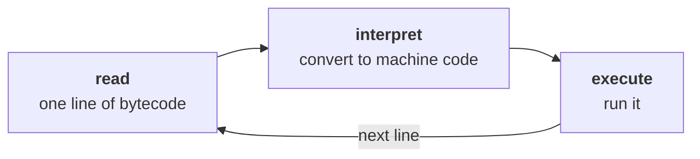
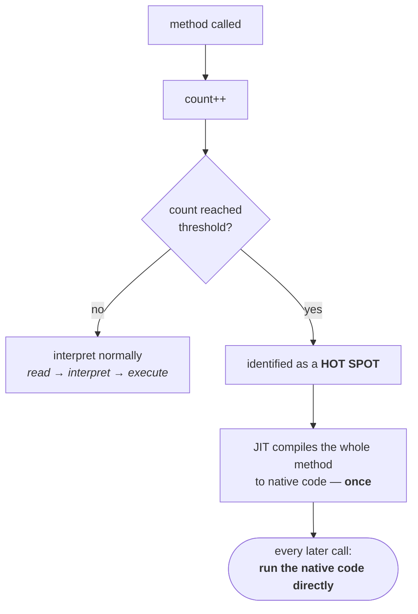
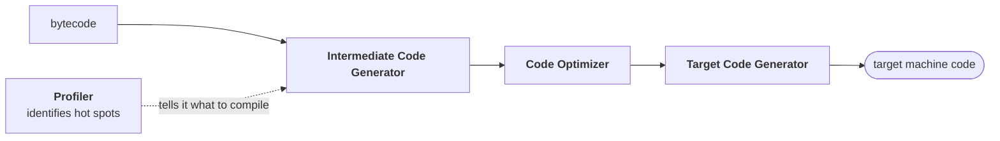
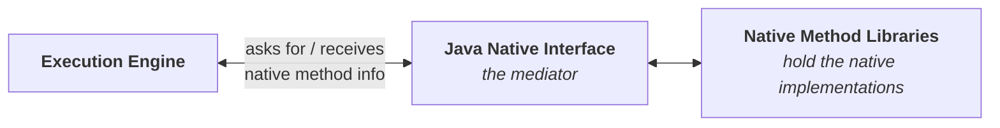

Two modules down. The class loader subsystem brought the class in; the memory areas gave it somewhere to live. The third module is the one that actually runs it.

> Execution engine is the **central component of the JVM**. It is responsible to **execute Java class files**.
>
> **Execution engine mainly contains 2 components:**
> 1. **Interpreter**
> 2. **JIT compiler**

---

# Interpreter

The distinction from your academics: **a compiler compiles the whole program at once; an interpreter works line by line.**

> The interpreter is responsible to read the bytecode and **interpret (convert) it into machine code** (native code), and execute that machine code **line by line**.

Three activities, repeated for every line:



Read, interpret, execute. Read, interpret, execute. All the way down the program.

## The problem

Take a method with 100 lines in it, called more than once:

```java
m1();     // 100 lines: read, interpret, execute × 100
//  …
m1();     // the same 100 lines: read, interpret, execute × 100 AGAIN
//  …
m1();     // and again
```

The first call does the work you would expect. The second call does **exactly the same work over again** — the same hundred lines re-read, re-converted to machine code, and re-executed. Nothing was kept.

> The problem with the interpreter is that it **interprets every time**, even the same method invoked multiple times, which **reduces performance** of the system.

The obvious objection is the right one: why not convert it into machine code only once?

This is what the **JIT compiler** exists to fix.

---

# JIT compiler

> The main purpose of the JIT compiler is to **improve performance**.

The mechanism is a counter per method.

> Internally the JIT compiler maintains a **separate count for every method**.

> Whenever the JVM comes across any method call, first that method will be **interpreted normally** by the interpreter, and the JIT compiler **increments the corresponding count variable**. This process is continued for every method.

> Once any method's count reaches the **threshold value**, the JIT compiler identifies that the method is a repeatedly used method — a **HOT SPOT**.

> Immediately the JIT compiler **compiles that method and generates the corresponding native code**. Next time the JVM comes across that method call, the JVM **directly uses the native code** and executes it instead of interpreting once again — so the performance of the system is improved.

Walk one method through it:

| Call | What happens | Count |
|---|---|---|
| 1st `m1()` | interpreted normally — read, interpret, execute | 1 |
| 2nd `m1()` | interpreted normally **again** | 2 |
| 3rd `m1()` | interpreted normally again | 3 → **threshold reached** |
| — | JIT compiles the whole of `m1` to native code, once | |
| 4th `m1()` onwards | **native code used directly**, no interpretation | |



> The threshold count value **varies from JVM to JVM**.

> [!warning] Coder Army — **where that native code lives: the code cache, not the method area** A common way to put this is that JIT-compiled code is stored in the method area, alongside the bytecode it came from. On HotSpot it is not. Compiled methods go into a separate native-memory region called the **code cache**, sized with **`-XX:ReservedCodeCacheSize`**.
>
> Worth knowing because it fails in a way of its own: if the code cache fills up, the JIT **stops compiling entirely** and the JVM quietly drops back to interpreting. Nothing crashes and no exception is thrown — the application simply gets slower and stays slower, with only a `CodeCache is full. Compiler has been disabled.` line in the log to explain it.

## Two conclusions that get asked directly

> 1. The JVM interprets the total program line by line **at least once**.
> 2. JIT compilation is applicable **only for repeatedly invoked methods**, but not for every method.

Both follow from the counter. A method has to be **called** before its count can rise, and it has to be **interpreted** on those early calls, because compilation has not happened yet. So nothing skips the interpreter entirely, and a method called once is never compiled at all.

> [!important] **This is why Java is both a compiled and an interpreted language**, which sounds like a contradiction until you count the stages. `javac` compiles source to **bytecode** — that is compilation. The interpreter converts bytecode to machine code line by line — that is interpretation. And the JIT compiler converts hot methods to native code — compilation again, at runtime. Three stages, two of them compilation, and the answer to is Java compiled or interpreted? is **both**.

## Recompiling for better code

> Some advanced JIT compilers will **re-compile the generated native code** if the count reaches the threshold value a second time, so that **more optimized machine code** will be generated.

A method that is merely hot gets compiled. A method that stays hot gets compiled **again**, harder — the second pass is worth spending more time on, because the evidence that this code matters is now stronger.

## Who spots the hot methods

> **Profiler**, which is part of the JIT compiler, is responsible to identify **HOT SPOTS**.

> [!info] **This is where the name HotSpot JVM comes from.** The standard JVM you are running is called HotSpot precisely because this is its defining trick: watch the program, find the hot spots, compile those. Worth making explicit, because HotSpot appears in every stack trace and error message you will ever read.

## Inside the JIT compiler



The three stages are the standard compiler pipeline — the same shape as any compiler course: an intermediate representation, an optimisation pass over it, then target code generation.

> [!info] **The execution engine holds more than these two.** The **garbage collector** lives in the same area.

---

# Java Native Interface

While executing, a program sometimes needs code that is not written in Java at all.

`hashCode()` is the example. It is not implemented in Java — its implementation sits in a **native method library**, outside the JVM. The execution engine cannot read those libraries directly, so something has to sit between them:



> JNI acts as a **mediator** between Java method calls and the corresponding native libraries.

> That is, JNI is responsible to **provide information about native libraries** to the JVM.

> The native method library holds **native libraries information**.

So the flow is: execution engine → JNI → native method library, and the information comes back the same way.

> [!info] **This closes a loop from the very first note.** The basic architecture diagram had JNI hanging off the side of the execution engine, and it was described then as a supporting piece rather than a fourth module. This is why: it does no execution of its own. It exists so that the execution engine can reach code the JVM did not compile.

---

# Tiered compilation — how it really runs

The model above — interpret first, count invocations, compile the hot ones — is exactly how HotSpot works. The one simplification is the counting: there is not a **single** threshold or a **single** compiler, but a ladder of both.

> [!important] **There are two JIT compilers, and a hot method is typically compiled twice.** HotSpot runs **tiered compilation**, on by default (verified: `TieredCompilation = true` on JDK 25). Instead of one threshold, there is a ladder:
>
> | Tier | What runs it | Purpose |
> |---|---|---|
> | 0 | interpreter | start here always |
> | 1–3 | **C1** — the client compiler | compiles quickly, and **collects profiling data** |
> | 4 | **C2** — the server compiler | compiles slowly, produces the fastest code |
>
> Measured thresholds on JDK 25:
>
> ```
> Tier3InvocationThreshold = 200        → promote to C1
> Tier4InvocationThreshold = 5000       → promote to C2
> CompileThreshold         = 10000      (the old single-threshold value, non-tiered only)
> ```
>
> And it is directly observable. Running a hot method 200,000 times with `-XX:+PrintCompilation`:
>
> ```
> 13    8       3       Hot::m1 (24 bytes)
> 13    9       4       Hot::m1 (24 bytes)
> 13    8       3       Hot::m1 (24 bytes)   made not entrant: not used
> ```
>
> The same method compiled at **level 3** (C1), then at **level 4** (C2), and then the level-3 version thrown away — **made not entrant** — because the better version had replaced it.
>
> That third line is recompile the hot method for more optimised code happening in front of you. It is not an exotic feature — it is the default path for anything that stays hot.

> [!warning] **The three calls threshold in the walkthrough above is illustrative, not real.** It is a fine number for a whiteboard. The real figures are in the hundreds to thousands, as measured above, and they vary — between JVMs, between tiers, and with the flags in use. Never quote a specific number as **the** threshold.

> [!info] **The interpreter is not merely a slow fallback.** It also does the profiling that makes good compilation possible — recording which branches are taken, which types actually show up at a call site. C2 uses that to make optimisations a static compiler could never justify, such as inlining a virtual call because only one implementation has ever been seen. That is why interpret first, then compile beats compile everything up front, and it is a large part of why a long-running JVM can match or beat statically compiled code.

---

That is the execution engine: interpret everything at least once, count what gets called, compile the hot spots, and reach out through JNI when the code needed is not Java at all.

Three modules, all covered. What remains is putting them into one picture.
