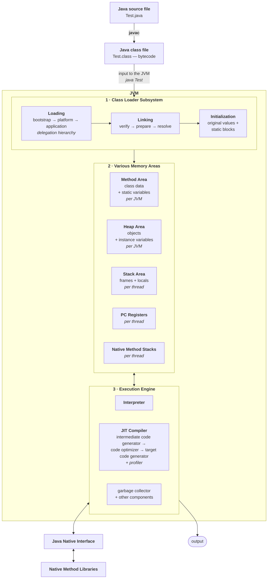
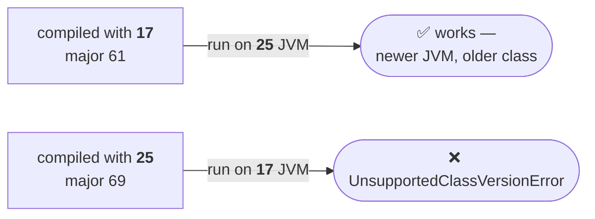

Three modules have been covered separately. This note puts them into one picture — the diagram to draw when an interviewer says *"explain JVM architecture"* — and then opens the `.class` file itself to see what the class loader has actually been reading.

---

# The complete architecture

Start before the JVM, with the file you wrote.



> [!important] **This is the answer to "explain JVM architecture", and it is worth being able to draw from memory.** Once you have drawn it there is very little else that can be asked — every follow-up question is a zoom into one box.

## Walking it end to end

Read the diagram as one story:

1. **`Test.java`** → **`javac`** → **`Test.class`**, which is bytecode. Everything so far is outside the JVM.
2. That `.class` file is the **input to the class loader subsystem**.
3. **Loading** — one of the three loaders finds and reads it, following the delegation hierarchy: bootstrap first, then platform, then application. Highest priority to bootstrap.
4. **Verification** — the bytecode verifier checks the file is properly formatted and came from a valid compiler. Failure gives `VerifyError`. *This is why you can run a downloaded `.class` file on any machine without a warning.*
5. **Preparation** — static variables get memory and **default** values only.
6. **Resolution** — symbolic references are replaced with direct references from the method area.
7. **Initialization** — static variables get their **original** values and static blocks execute. Class loading is now complete.
8. The loaded data sits in the **five memory areas** — method area and heap **per JVM**, stack, PC register and native method stack **per thread**.
9. The **execution engine** reads from those areas and runs the program: the interpreter line by line, the JIT compiler taking over for hot methods.
10. When native code is needed, **JNI** mediates to the native method libraries.

## The summary table that answers most follow-ups

| Question | Answer |
|---|---|
| Activities of the class loader subsystem | loading, linking, initialization |
| Phases of linking | verify, prepare, resolve |
| Types of class loaders | bootstrap, platform, application |
| Class path priority | bootstrap → platform → application |
| Memory areas | method, heap, stack, PC registers, native method stacks |
| Per JVM | method area, heap area |
| Per thread | stack area, PC register, native method stack |
| Thread safe? | method area **no**, heap **no**, stack **yes** |
| Static / instance / local variables | method area / heap area / stack area |
| Execution engine components | interpreter, JIT compiler (+ garbage collector, others) |
| Most important areas for a programmer | method area, heap area, stack area — **heap above all** |

> [!info] **Why the heap is singled out.** Java is an object-oriented language, so almost everything you talk about is objects — and every object is on the heap. The last two areas (PC registers, native method stacks) are *dummy with respect to the programmer*: real, but never something you act on.

> [!info] **The execution engine is described as the CPU of the JVM.** The comparison is apt — the class loader brings work in, the memory areas hold it, and the execution engine is the part that actually does anything.

---

# Class file structure

The class loader has been reading `.class` files for this entire chapter. This is what is inside one.

```java
class File {
    Magic_Number;
    Minor_Version;
    Major_Version;
    Constant_Pool_Count;
    Constant_Pool[];
    Access_Flags;
    this_class;
    super_class;
    interface_count;
    interface[];
    fields_count;
    fields[];
    methods_count;
    methods[];
    attributes_count;
    attributes[];
}
```

Read down the list and it is the same information the loading phase stores in the method area — the fully qualified name (`this_class`), the immediate parent (`super_class`), the interfaces, the fields, the methods, the constant pool. **This is where those seven items come from.**

| Item | What it holds |
|---|---|
| `Magic_Number` | predefined value identifying the file as a Java class file |
| `Minor_Version` / `Major_Version` | which compiler version produced it |
| `Constant_Pool_Count` | number of constants in the constant table |
| `Constant_Pool[]` | information about those constants |
| `Access_Flags` | modifiers declared for this class or interface |
| `this_class` | name of the class or interface this file defines |
| `super_class` | name of the super class |
| `interface_count` / `interface[]` | how many interfaces are implemented, and which |
| `fields_count` / `fields[]` | how many fields, and their names |
| `methods_count` / `methods[]` | how many methods, and their names |
| `attributes_count` / `attributes[]` | how many attributes, and their information |

The two at the top get detailed treatment, because both produce errors you will actually see.

---

## Magic number

> **The first 4 bytes of a class file is the magic number. This is a predefined value used by the JVM to identify a Java class file — whether the `.class` file was generated by a valid compiler or not.**
>
> **This value should be `0xCAFEBABE`.**

Every `.class` file in existence begins with those four bytes. Verified on JDK 25 by dumping the first eight bytes of a freshly compiled class:

```
00000000: cafe babe 0000 0045
          ^^^^^^^^^ ^^^^ ^^^^
          magic     minor major
```

`cafe babe`, then the minor version `0000`, then the major version `0045` — which is 69 in decimal, and comes up again below.

> [!info] **A `.class` file is not readable, and that is the point.** Open one in an editor and you get garbage. The one thing you *could* pick out is the string literals — the text from your `System.out.println` survives in the constant pool. Everything else is binary the JVM reads and you do not.

### What happens when it is wrong

> **Note: whenever we are executing a Java class, if the JVM is unable to find a valid magic number, then we get a runtime exception saying `ClassFormatError: incompatible magic value`.**

Demonstrated by patching the first four bytes of a working class to `0xDEADBABE` and running it on JDK 25:

```
Error: LinkageError occurred while loading main class Magic
        java.lang.ClassFormatError: Incompatible magic value 3735927486 in class file Magic
```

`3735927486` is `0xDEADBABE` in decimal. The JVM read four bytes, they were not `0xCAFEBABE`, and it refused before executing a single instruction.

> [!important] **This is the very first thing the verifier checks, and it closes the loop with the verification phase.** The "is this file generated by a valid compiler?" question from linking has a concrete first step: read four bytes and compare. Note too that the JVM's own message calls it a **LinkageError** — exactly as the linking note said, `ClassFormatError` is a child of `LinkageError`.

---

## Minor version and major version

> **Minor and major versions represent the class file version. The JVM will use these versions to identify which version of compiler generated the current `.class` file.**

Written as **M.m** — capital **M** for **major**, small **m** for **minor**.

The arithmetic is simple: **major version = Java version + 44.**

| Java | major | | Java | major |
|---|---|---|---|---|
| 5 | 49 | | 11 | 55 |
| 6 | 50 | | 17 | 61 |
| 7 | 51 | | 21 | 65 |
| 8 | 52 | | **25** | **69** |

Confirmed by the `0045` in the hex dump above — `0x45` is 69, and 69 − 44 = 25.

### The compatibility rule

> **Higher version JVMs can always run lower version class files. But lower version JVMs cannot run class files generated by a higher version compiler.**
>
> **Whenever we try to execute a higher version compiler generated class file with a lower version JVM, we get a runtime exception saying `java.lang.UnsupportedClassVersionError`.**



> [!important] **Backwards, not forwards.** A JVM knows every class file format that existed before it and none that came after. This is the single most common deployment failure in Java — build on a newer JDK than the one in production and you get this error, with the major version number telling you exactly which JDK produced the file.

### Both directions, measured on JDK 25

**Older class on a newer JVM — fine.** Compiling with `--release 8` produces a Java 8 class file, and JDK 25 runs it without complaint:

```
compiled normally      : minor 0, major 69
compiled --release 8   : minor 0, major 52      ← and still runs
```

**Newer class on an older JVM — refused.** Simulated by patching the major version of a compiled class from 69 to **73**, so it claims to have been built by a JDK that does not exist yet, then running it on JDK 25:

```
Error: LinkageError occurred while loading main class Future
        java.lang.UnsupportedClassVersionError: Future has been compiled by a more recent
        version of the Java Runtime (class file version 73.0), this version of the Java
        Runtime only recognizes class file versions up to 69.0
```

> [!info] **The message names both numbers, which is what makes it easy to diagnose.** *"class file version 73.0"* is what produced the file; *"recognizes up to 69.0"* is what is trying to run it. Subtract 44 from each and you have both JDK versions — 29 built it, 25 is running it. Meet this error in the wild and that subtraction tells you immediately which build machine and which runtime are mismatched.

> [!info] **`--release N` is how you target an older JVM deliberately.** Compiling with `--release 8` on a JDK 25 produced major version 52 — a class file a Java 8 JVM will accept. This is the supported way to build for an older runtime: it checks the **API** you call as well as the bytecode version, so you cannot accidentally use a method that does not exist on the target. Reach for `--release`, not `-source`/`-target`.

---

That completes the JVM architecture chapter: what a virtual machine is, the three modules, how a class is loaded, linked and initialized, who loads it, the five memory areas, how it is executed — and finally what the file being loaded actually contains.
