Multithreading is the most valuable topic in Core Java for the interview room, and it is a different kind of topic from the one before it. **Collections is purely a discussion of an API** — classes, methods, sample examples, and only one corner (`Comparable` vs `Comparator`) where you actually have to think. Multithreading is not an API concept. It is a **language-level** concept, and every area of it asks you to reason rather than recall.

So the introduction is worth the time before any code appears.

---

# Multitasking, and its two kinds

## Multitasking

> Executing several tasks simultaneously is the concept of **multitasking**.

That is the whole definition, and it is worth writing down in exactly those words. Everything in this chapter is a variation on it.

### The example you already live in

Forget computers for a moment. **A student sitting in a classroom is the cleanest example of multitasking there is**, because they are visibly doing several unrelated things at once.

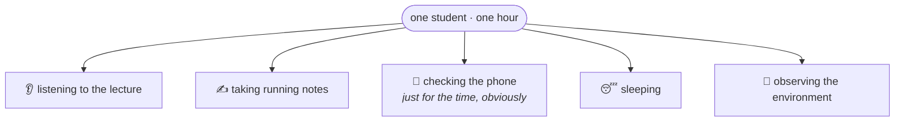

The point of the example is not the list. It is that **the combination is arbitrary**. One student listens and takes notes. Another listens and checks the phone. A third takes notes and sleeps — which sounds impossible until you have taught a class. Any subset of those activities can be running at the same time in the same person.

That is multitasking: several tasks, progressing together, in one place.

### Two flavours of it

Everything that follows hangs off one split. Multitasking comes in exactly two kinds, and the difference between them is **what counts as a `task`**.

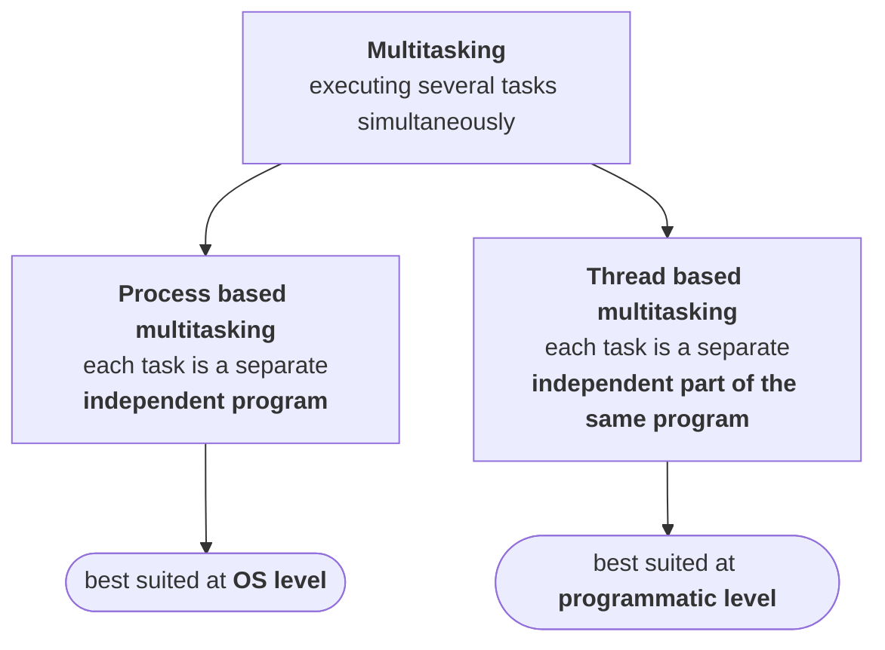

Read the two boxes side by side and notice that only four words change: **independent program** becomes **independent part of the same program**. That is the entire distinction, and interviewers ask for it constantly.

> [!important] **Same definition, different granularity.** Both are several tasks at once. Process based multitasking runs several **programs**. Thread based multitasking runs several **parts of one program**. Nothing else separates them at the level that matters to you as a programmer.

The rest of this note defines each one properly, because the pair of definitions — and the difference between them — is standard interview material.

---

## Process based multitasking

Stated the way you would write it in an exam:

> Executing several tasks simultaneously, where each task is a **separate independent process**, is called **process based multitasking**.

The load-bearing word is **independent**. Not unrelated in theme — independent in the sense that task 2 does not need task 1 to have finished, or even to exist.

### The example

Look at what your machine is doing right now while you type a Java program.

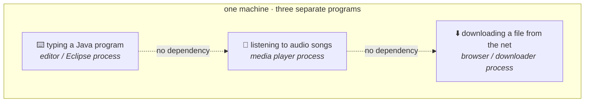

Three tasks, running together, and no arrow of dependency between any pair of them. The editor does not care whether the song is playing. The download does not wait for you to finish a line of code. Each is a **separate process** with its own program behind it.

Hence: process based multitasking.

> [!info] This is not an artificial classroom setup. Walk past a bay of four desks in any software company and three of them are running exactly this combination — editor open, headphones in, something downloading in the background.

### Where it lives: the OS, not your program

Here is the part that decides whether the concept is any use to you.

> Process based multitasking is best suitable **at OS level**.

Picture the conversation that makes this concrete. A client comes to you with a requirement:

> Can you build this for me?
> Yes — in Java.
> Tell me something good about Java.
> Java provides support for multitasking.
> Meaning what, in plain words?
> While your program runs in the foreground, you can listen to MP3 songs and download a file in the background.

And at that point the client, entirely reasonably, throws you out of the room.

> [!important] **Ask who owns the benefit.** Listening to songs while an application runs is not a feature of **your application** — it is a feature of the **operating system**, which is willing to schedule three processes at once. You wrote none of it, you control none of it, and you cannot bill for it.
>
> Process based multitasking is real and useful. It is just not something a programmer **implements**. It is something the OS **provides**.

So the concept is worth knowing and worth being able to define — it is where the split comes from, and it is a standard question — but it is not the concept you will be programming with.

For a benefit that lives inside your program, you need the other kind.

---

## Thread based multitasking

### Start with the problem

You have one program. Ten thousand lines of code. Nothing exotic — it just runs.

The JVM works through it top to bottom: line 1, then line 2, then line 3, and so on to the end. Say the whole thing takes **10 hours** to complete.

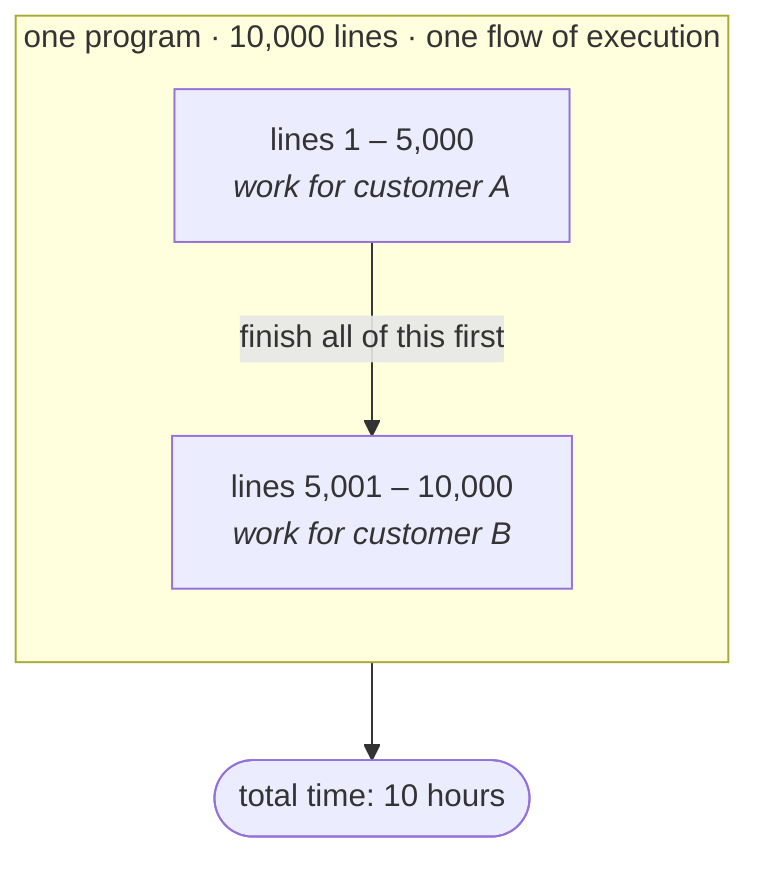

Now you sit down and actually read the code, and you notice something:

**The first 5,000 lines and the second 5,000 lines have nothing to do with each other.** The first half processes customer A. The second half processes customer B. The second half does not read anything the first half wrote, and does not wait on anything the first half does.

So ask the obvious question: **why is the second half waiting?**

It is waiting for one reason only — because that is the order the lines happen to sit in the file. Not because the logic requires it.

### Split the flow

If the two halves are independent, run them as two flows instead of one.

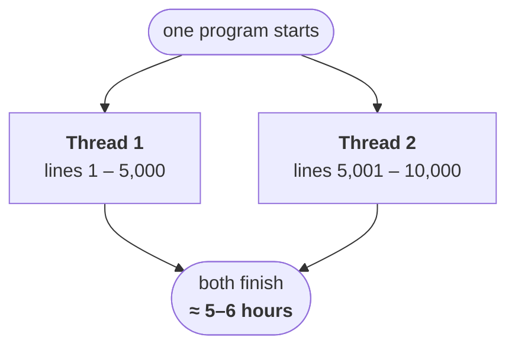

Same program. Same 10,000 lines. Same machine. The work now finishes in roughly **5 to 6 hours** instead of 10, because two independent halves stopped queueing behind each other.

That is thread based multitasking, and here is the definition:

> Executing several tasks simultaneously, where each task is a **separate independent part of the same program**, is called **thread based multitasking**. And each independent part is called a thread.

> [!question]- The two halves are equal, so why isn't 10 hours cleanly halved?
> Because splitting work is not free, and because nothing in a real program is perfectly independent. The two threads still share one CPU, one heap, one disk. They take turns being scheduled, they compete for memory bandwidth, and there is setup work at the start and joining-up at the end that did not exist in the single-flow version.
>
> Keep this instinct for the whole chapter: **more threads buys you less than the arithmetic promises.** Doubling the threads never quite halves the time, and past a point it stops helping at all.

---

## Telling the two apart

This is the single check that separates the flavours, and it is worth doing out loud every time: **count the programs.**

| | Process based | Thread based |
|---|---|---|
| How many **programs** are running? | three (editor, player, downloader) | **one** |
| How many **independent parts** are running? | one per program | **two or more inside that one program** |
| A `task` is… | a separate independent **process** | a separate independent **part of the same program** |
| Best suited at | **OS level** | **programmatic level** |

> [!important] **A thread is not a program. A thread is an independent path of execution inside one program.** When someone asks how many threads does this program have, they are asking how many separate flows are moving through the code at once — not how many things are installed on your machine.

### The differences your OS course cares about

Difference between process based and thread based multitasking is also a standard question in the operating systems paper, and there the answer goes further than the definition. Two points come up every time:

| | Processes | Threads |
|---|---|---|
| **Context switching** | expensive and difficult | cheap and easy by comparison |
| **Address space** | every process gets its **own** address space | all threads of a program **share one** address space |

> [!info] **Those two facts are the same fact.** Threads share an address space, so switching between them does not mean tearing down and rebuilding a memory mapping — which is exactly why the switch is cheap.
>
> And the sharing is not free either. It is the reason two threads can step on each other's data, which is the entire reason **synchronization** exists later in this chapter. Cheap switching and shared state are two sides of one coin.

At a programmatic level, though, none of that changes what you write. Being a programmer, you work with the definition:

> Each task a separate independent **process** → process based.
> Each task a separate independent **part of the same program** → thread based.

Beyond that, no difference you need to act on.

---

## Why do any of this — the actual objective

Whether it is process based or thread based, multitasking exists for one reason.

> The main objective of multitasking is to **reduce the response time** of the system and to **improve performance**.

The mechanism behind that sentence is worth making concrete: **you do not want your processor sitting idle.**

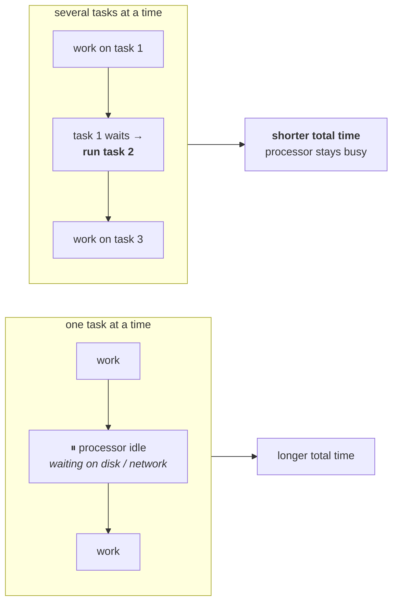

Doing one thing at a time means that every pause in that one thing is a pause in **everything**. Doing several means the processor always has something else to get on with — so the same total work finishes in less wall-clock time, and the system responds faster.

That is the payoff, and it is the same payoff at both levels. Where it actually gets used is next.

---

# Where multithreading is used

The definitions are done. The question that makes them stick is: **where would you actually reach for this?**

The best way in is not a program. It is a cinema screen.

---

## The 70 mm screen

Picture a wide theatre screen in the middle of a song sequence. Count what is happening on it:

- the hero is dancing
- three other actors are dancing alongside him
- an aeroplane is crossing the sky
- a flock of birds is flying across the frame
- it has started to rain

Five kinds of activity, all in one shot. Now impose one rule — **only one activity may happen at a time** — and watch what the film becomes.

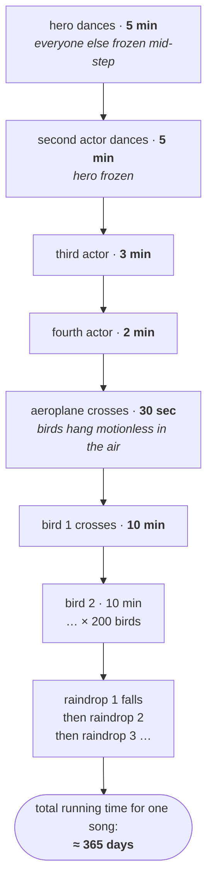

While the hero dances, everyone else stands like a statue. The birds stop dead in mid-air. The aeroplane hangs there waiting its turn. Then, five minutes later, the next actor gets the screen and **the hero** freezes.

Two hundred birds at ten minutes each. Every raindrop queued behind the one before it. The song alone would run for the better part of a year, and the audience would tear the screen down long before the second bird made it across.

Now lift the rule. Everyone dances at once, the birds fly while the plane crosses, the rain falls through all of it — and the whole sequence takes **five minutes**.

> [!important] **Each of those activities is a thread.** Every dancer is a thread. The aeroplane is a thread. Every single bird is a thread, and so is every raindrop. Nothing about the **content** changed between the two versions — only whether the activities were allowed to run simultaneously. That difference is the difference between a five-minute song and a year-long one.

This is why animation and graphics work is the standard first example. The output **is** many independent things happening at once, so the code has to be many independent things happening at once.

---

## The application areas

Stated as a list, the way it is usually asked:

> **The main important application areas of multithreading are:**
> 1. **to develop multimedia graphics**
> 2. **to develop animations**
> 3. **to develop video games**
> 4. **to develop web servers and application servers**

| Area | The independent things running at once |
|---|---|
| Multimedia graphics | every element being drawn or moved in the frame |
| Animations | every object with its own motion — the dancer, the bird, the raindrop |
| Video games | each character, each projectile, physics, input, rendering, network |
| Web / application servers | **each incoming request** |

The first three are the same idea in different costumes. The fourth is the one you are most likely to be paid for, so it gets its own section.

---

## Servers: a thread per request

Here is the situation. You have a web server or an application server running. Requests start arriving — first request, second request, thousands more behind them.

Ask the question that the cinema example trained you to ask: **are these handled one at a time, or all at once?**

Take Gmail. Crores of users, all hitting it at once. If requests were served strictly one after another, your turn would come up sometime after your lifetime ended.

So they cannot be sequential. What happens instead:

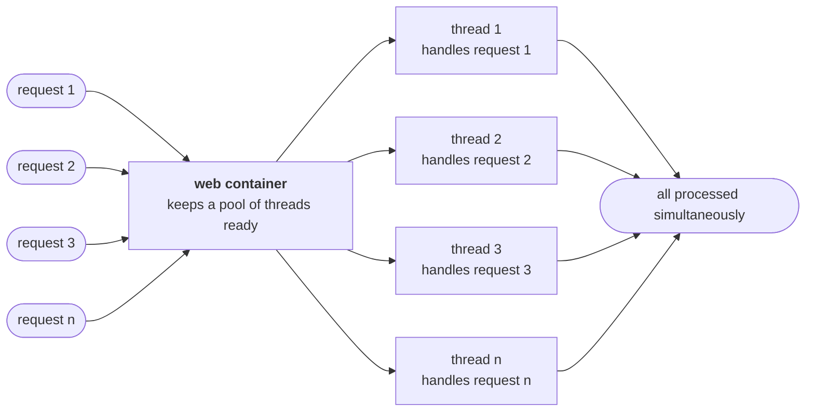

**Every server maintains multiple threads internally.** When a request arrives, the container hands it to a thread from that pool — request 1 to thread 1, request 2 to thread 2, and so on. Those threads run simultaneously, so the requests are served simultaneously.

That is not a feature bolted on top of the server. It **is** the server. Underneath every web server and application server you have ever deployed to, the concept doing the work is multithreading.

> [!info] **The pool is finite, and its size is a number you can look up.** Tomcat ships with a bounded worker pool — the lecture quotes 60; a current Tomcat defaults to `maxThreads=200`. Either way the shape of the fact is what matters: the server can serve **that many** requests concurrently, and request number 201 waits for a thread to free up.
>
> This is worth carrying forward. How many threads is a **tuning decision** with a real ceiling behind it, not an infinite resource — which is exactly the problem the executor framework exists to manage, later in this chapter.

---

# A real case study, and Java's support

Cinema screens and Gmail are good for intuition. This one is a real freelance job, and it is the clearest demonstration of the whole idea, because the same program got made faster twice — first by a lot, then by a lot more.

---

## The requirement

A client posts a job on a freelancing site. The requirement is small enough to state in one line:

> Given a few keywords — say `SCJP` and `SCWCD` — scan **every file on the system** and print the name of every file that contains them.

Files live across `C:`, `D:`, `E:`, `F:`, in every folder, and there are lakhs of them. The client had already written the program. The problem was not correctness.

**It took 48 to 50 hours to finish.**

---

## Why it was slow

Reading their code showed the shape immediately. One flow of execution, walking everything in order:

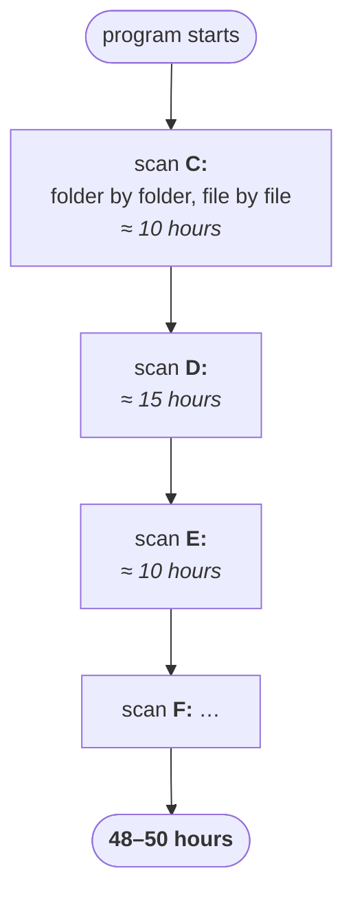

Finish `C:` entirely. Then start `D:`. Then `E:`. Every drive queued behind the one before it.

Now apply the question from the thread based multitasking note: **why is `D:` waiting?**

Searching `C:` and searching `D:` have nothing to do with each other. `D:` is not reading a result from `C:`. It waits purely because of the order the code was written in.

---

## First fix: a thread per drive

Three independent jobs, so run them as three flows.

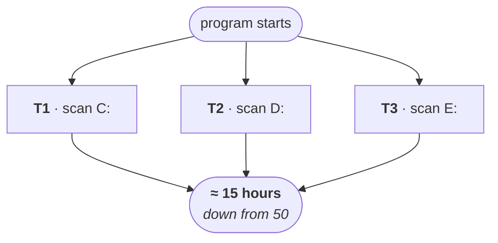

Fifty hours became about fifteen. Same machine, same logic, same files — the only change was that the independent jobs stopped queueing.

The client was delighted, and then immediately asked the follow-up every client asks: fifteen hours is still too heavy. Can it go lower?

---

## Second fix: a thread per folder

Drive level was too coarse. There were only three or four drives, so there could only ever be three or four flows — and one of them (the biggest drive) set the floor for the whole run.

So push the split down a level: **if it is a folder, give it its own thread.**

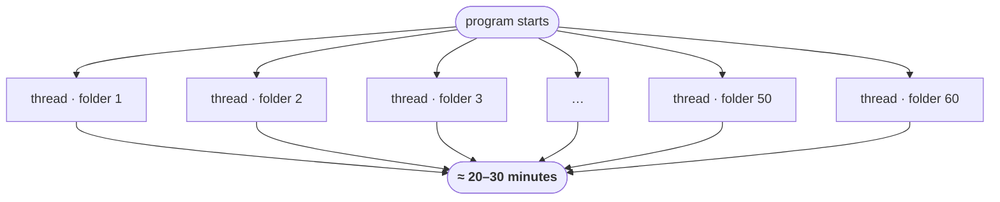

Instead of three threads, this produced fifty or sixty of them, each searching one folder. The search finished in **20 to 30 minutes**.

| Version | How the work was split | Time |
|---|---|---|
| Original | one flow, everything sequential | **48–50 hours** |
| Thread per drive | 3 flows | **≈ 15 hours** |
| Thread per folder | ~50–60 flows | **≈ 20–30 minutes** |

---

## What to take from it

The rule the case study is really teaching:

> Wherever **independent jobs** exist in your application, identify them, and **give each one its own thread**.

Everything else follows. Multiple threads run multiple jobs at once, total time falls, and performance improves — without changing a line of the logic that does the actual work.

The manpower version of the same arithmetic, which is how it usually gets explained:

| People on the job | Time |
|---|---|
| 1 | 10 hours |
| 2 | 5–6 hours |
| 3 | 3–4 hours |
| 10 | 1–2 hours |

> [!important] **Notice that the returns are already bending.** Ten people do not finish a ten-hour job in one hour — they finish it in one or two, and if you kept adding people the number would stop moving. The same is true of threads. The jump from 3 to 60 threads here bought a huge win because the work was **I/O bound on independent folders**; sixty threads all fighting over one CPU-bound calculation would not have.

> [!info] **And spawning a thread per folder by hand is not what you would write today.** A folder tree with ten thousand directories would create ten thousand threads, and each one costs real memory and real scheduling. The modern shape of this exact program is a fixed **thread pool** that you hand ten thousand **tasks** to — which is what the executor framework at the end of this chapter is for. The insight (find the independent jobs) is unchanged; only the machinery for running them has improved.

---

## Java's built-in support

One last point before the mechanics start, because it explains why this chapter is shorter than it would be in another language.

> When compared with older languages, developing multithreaded applications in Java is very easy, because Java provides **in-built support for multithreading** with a rich API.

The split is roughly:

| Who does the work | Share |
|---|---|
| Java API | **90%** |
| You | **10%** |

Take the most basic operation in the whole topic — starting a thread. What do you write?

```java
t.start();
```

That is your entire contribution. Registering the thread with the thread scheduler, all the low-level bookkeeping underneath it, and finally invoking `run()` — none of that is yours to implement. It already exists behind that one method call.

> [!important] **You are responsible for defining the job. The API is responsible for running it.** Your 10% is the code inside `run()` — what this thread should actually do. The other 90% is machinery you invoke rather than write. This is exactly the trade you make everywhere in Java, but it is starker here than anywhere else, because the machinery you are skipping is genuinely difficult.

The rich API in question:

| Type | What it is |
|---|---|
| `Thread` | the class representing a thread |
| `Runnable` | the interface representing a job that a thread can run |
| `ThreadGroup` | a group of threads managed together |
| `ThreadLocal` | per-thread storage |
| … | and more, all in `java.lang` |

That is the introduction complete: what multitasking is, the two kinds, what a thread is, why you would want one, and where they get used.

Next comes the first real mechanic, and the question that opens most interviews on this topic: **in how many ways can you define a thread?**
