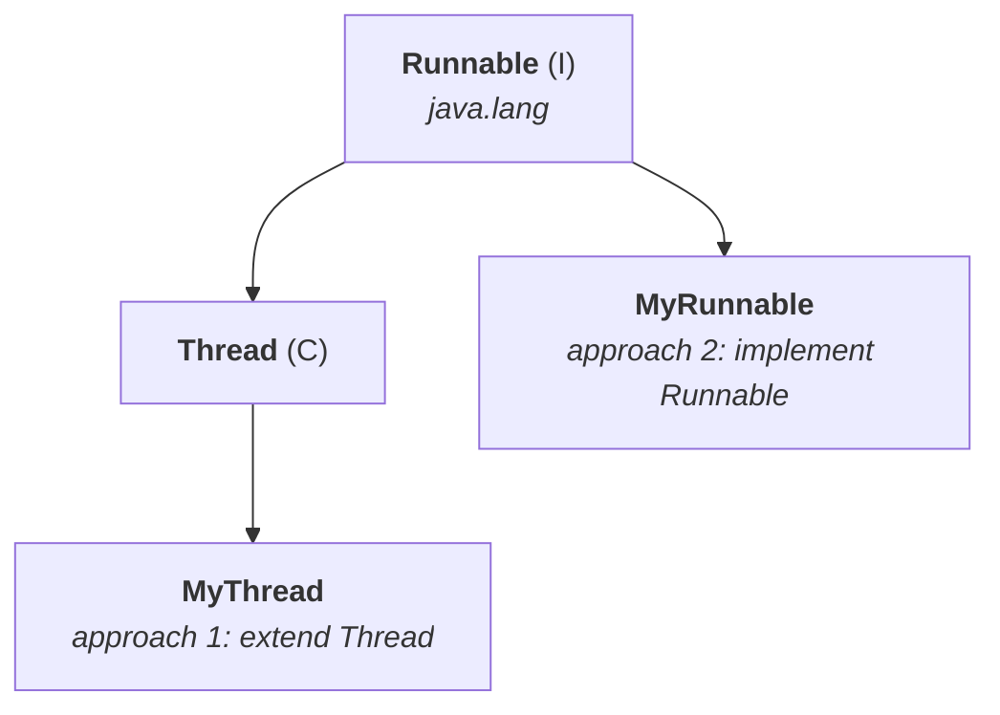

# Defining a thread by implementing `Runnable`

Note `02` did the first way — extend `Thread`. This is the second, and the one you should reach for.

## Where `Runnable` sits



> **`Thread` already implements `Runnable`.** So approach 1 gets you a `Runnable` too — just with the whole of `Thread` attached. Approach 2 implements `Runnable` **directly**.

| | |
|---|---|
| **Package** | **`java.lang`** |
| **Methods** | **one** — `public void run()` |

Confirmed on JDK 25: package `java.lang`, exactly **1** declared method, `run`.

---

# The code

```java
class MyRunnable implements Runnable {
    public void run() {
        for (int i = 0; i < 10; i++)
            System.out.println("child thread");
    }
}

class ThreadDemo {
    public static void main(String[] args) {
        MyRunnable r = new MyRunnable();       // 1
        Thread t = new Thread(r);              // 2
        t.start();                             // 3

        for (int i = 0; i < 10; i++)
            System.out.println("main thread");
    }
}
```

| | | |
|---|---|---|
| `class MyRunnable implements Runnable` | | **defining** the thread |
| the body of `run()` | | the **job** of the thread |
| **1** | `new MyRunnable()` | the job object |
| **2** | `new Thread(r)` | the thread that will run it |
| **3** | `t.start()` | **now there are two threads** |

> [!important] **Why line 2 is necessary, and it is the crux of this approach.** `MyRunnable` has a job but **no way to start itself** — `Runnable` declares only `run()`, and neither `MyRunnable` nor `Runnable` has a `start()` method.
>
> One car is ready, but someone is required to start this car. **`Thread` is what has the start capability**, so you hand your job to a `Thread` and ask the `Thread` to begin.
>
> **Only one word changes from approach 1** — `extends Thread` becomes `implements Runnable` — but that word is why you now need two objects instead of one.

## What `new Thread(r)` actually does

`t.start()` creates a thread, and that thread calls `run()`. **But which `run()`?**

- `t` is of type `Thread`, so `Thread`'s `start()` runs, and `Thread`'s `start()` calls `Thread`'s `run()`.
- **`Thread.run()` has an empty implementation** — there is no inheritance link between `MyRunnable` and `Thread`.

**So you pass `r` to the constructor.** That object is stored as the **target runnable**, and `Thread.run()` executes **it** instead:

```java
public void run() {
    Runnable task = holder.task;      // ← the target you passed in
    if (task != null) {
        …
        runWith(bindings, task);
    }
}
```

> [!info] **This is the JDK 25 source note `02` quoted in advance**, saying to hold on to it. `Thread.run()` only **behaves** as empty when no target was supplied. **Passing a `Runnable` is what makes it non-empty**, and that is the entire mechanism of approach 2.

---

# With and without the target — the six cases

The case study that makes the mechanism precise.

```java
MyRunnable r = new MyRunnable();
Thread t1 = new Thread();        // no target
Thread t2 = new Thread(r);       // with target
```

| Case | Call | New thread? | Which `run()` runs |
|---|---|---|---|
| **1** | `t1.start()` | ✅ **yes** | `Thread`'s — **empty**, so no output |
| **2** | `t1.run()` | ❌ no | `Thread`'s — empty, like a normal method call |
| **3** | `t2.start()` | ✅ **yes** | **`MyRunnable`'s** — the correct way |
| **4** | `t2.run()` | ❌ no | `MyRunnable`'s, **on the main thread** |
| **5** | `r.start()` | — | ❌ **compile-time error** |
| **6** | `r.run()` | ❌ no | `MyRunnable`'s, a plain method call |

Measured on JDK 25:

```
case 1: t1.start()   -> produced no output
case 2: t1.run()     -> produced no output
case 3: t2.start()   -> run() executed by: Thread-1
case 4: t2.run()     -> run() executed by: main
case 6: r.run()      -> run() executed by: main
```

**Case 3 is the only one that does what you meant.** It is also the only line where `getName()` reports something other than `main` — which is the proof that a second thread exists at all.

## Case 5, measured

```
error: cannot find symbol
  symbol:   method start()
  location: variable r of type MyRunnable
```

> **Start capability is not there with `r`.** If `r` had the start capability, what is the need of creating a thread object? — the absence of `start()` on `Runnable` is exactly why `Thread` has to be involved.

> [!important] **Two independent questions decide every row**, and separating them makes the table derivable rather than memorable:
>
> 1. **`start()` or `run()`?** — `start()` creates a thread; `run()` is an ordinary method call on the current thread.
> 2. **Was a target passed?** — with a target, `Thread.run()` delegates to it; without one, it does nothing.

---

# The hybrid approach

> **Durga's approach to define a thread** (not recommended to use).

You can **define** with approach 1 and **start** with approach 2:

```java
class MyThread extends Thread {
    public void run() { System.out.println("child thread"); }
}

MyThread t = new MyThread();
Thread t1 = new Thread(t);       // a MyThread passed AS the Runnable target
t1.start();
```

Measured on JDK 25:

```
child thread, running on: Thread-1
main thread
```

**It works.** Why: `MyThread` extends `Thread`, and `Thread` implements `Runnable` — so a `MyThread` **is a `Runnable`** and is a legal constructor argument. Confirmed: `t instanceof Runnable` → `true`.

> [!info] **The reason to know it is the exam, not the codebase.** Even in the SCJP exam, if you see this type of question, don't feel it is something invalid — it is valid only. It creates two `Thread` objects to run one job, which is why it is not recommended.

---

# Which approach is best?

**Implementing `Runnable`**, for two reasons.

## 1 — You keep your one inheritance slot

`extends Thread` uses up the single superclass Java allows. If your class already needs to extend something else, approach 1 is simply unavailable. **`implements Runnable` leaves `extends` free.**

## 2 — The job and the worker are separate things

Approach 1 makes your class **be** a thread. Approach 2 makes your class **describe a job** that any thread can run.

> [!important] **The second reason is the one that matters in modern code**, and note `02` already pointed at it. A `Runnable` can be handed to an **executor**, submitted to a **thread pool**, or scheduled — because it is just a job. **A subclass of `Thread` can only ever be one thread, run once.** Everything in the enhancements chapter is built on `Runnable`, not on subclassing.
>
> It is also why `extends Thread` locks you out of **virtual threads**: `Thread.ofVirtual()` takes a `Runnable`, and a subclass of `Thread` is a platform thread by construction.

## And `Runnable` is a lambda

Confirmed on JDK 25: `Runnable` carries **`@FunctionalInterface`**. So the whole ceremony collapses:

```java
Thread t = new Thread(() -> System.out.println("child thread"));
t.start();
```

**No class, no override, no separate file.** When comparing the two approaches, weigh this in — it is the `Runnable` side that got dramatically lighter.

---

# `Thread` constructors

The ones worth knowing:

```java
Thread()
Thread(Runnable r)
Thread(String name)
Thread(Runnable r, String name)
Thread(ThreadGroup g, Runnable r)
Thread(ThreadGroup g, String name)
Thread(ThreadGroup g, Runnable r, String name)
Thread(ThreadGroup g, Runnable r, String name, long stackSize)
```

Confirmed on JDK 25: **9** public constructors. `ThreadGroup` is covered in the enhancements chapter.

---

# What this part established

| | |
|---|---|
| `Runnable` lives in | **`java.lang`**, **one** method — `run()` |
| `Thread` itself | **implements `Runnable`** |
| Approach 2 | `implements Runnable`, then hand the object to a **`Thread`** |
| Why two objects | `Runnable` has **no `start()`** — only `Thread` can start a thread |
| The object you pass | is the **target runnable** |
| `Thread.run()` | delegates to the target; **empty** when there is none |
| `t1.start()` (no target) | new thread, **no output** |
| `t2.start()` (target) | new thread, **your `run()`** — the correct case |
| `t2.run()` | **no** new thread — runs on `main` |
| `r.start()` | ❌ **compile error** — `cannot find symbol: method start()` |
| The two questions | **`start` vs `run`** · **target or no target** |
| The hybrid approach | define by extending, start by passing — **valid**, not recommended |
| Why it works | a `MyThread` **is a `Runnable`** |
| **Best approach** | **implement `Runnable`** |
| Reason 1 | keeps your **inheritance slot** free |
| Reason 2 | separates **the job** from **the worker** — required for pools and virtual threads |
| `Runnable` is | a **functional interface** — usable as a lambda |
| `Thread` constructors | **9** on JDK 25 |
