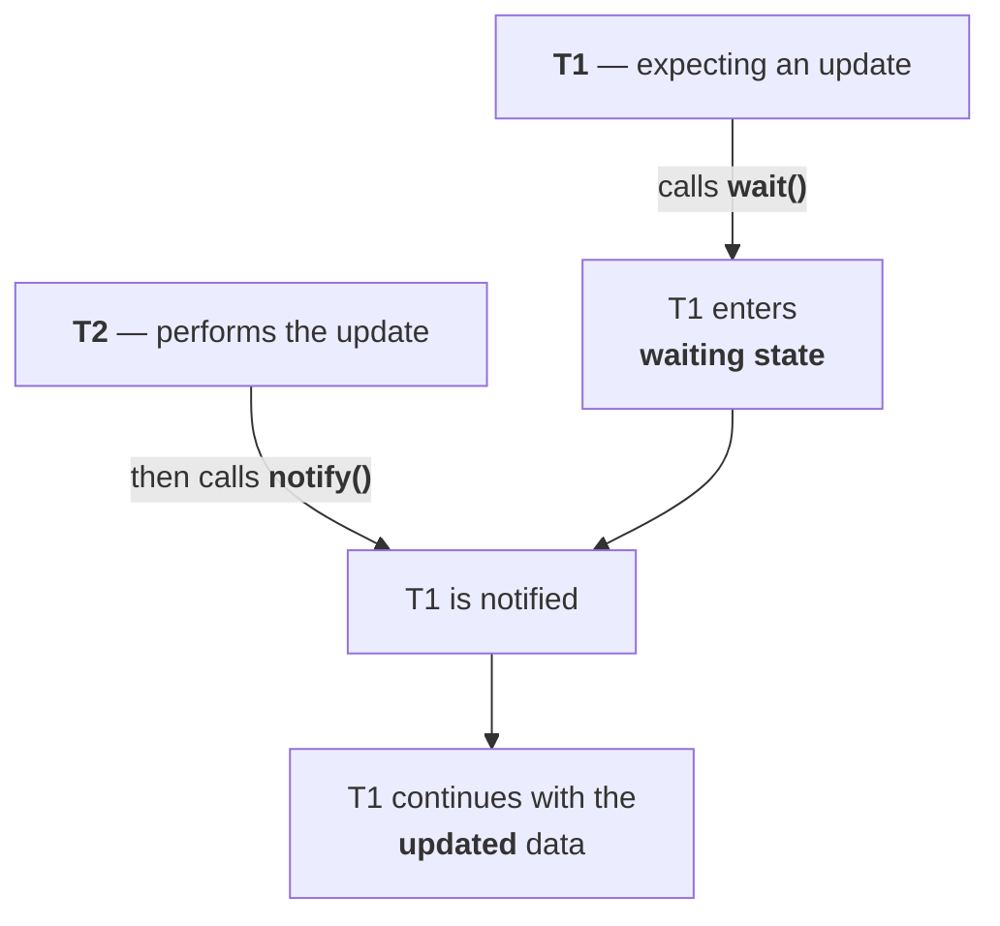

# Inter-thread communication

> This is the topic where you have to think. It is not traditional like 'in how many ways can you define a thread'. Most people don't have full confidence in this area.

**The question:** how do two threads communicate with each other?

---

# Why polling is the wrong answer

> [!question]- **The letter he waited all night for.** His analogy for the problem — and the payoff at the end is the point.
>
> At 6 p.m. he gets a phone call: I've sent you a letter by post. You'll get it tomorrow morning. He asks what's in it. Why worry — you'll see it tomorrow. She hangs up.
>
> **His mind is now entirely on that letter.** He walks to the post box at his gate and checks. Nothing — obviously, it is 6 p.m.
>
> He goes to bed at 8. Wakes at **8:15** and checks. Nothing. Sleeps, wakes at **8:45** — checks. **9:30** — checks. **10:45**, **12:15 a.m.**, **2:30 a.m.** — every half hour, all night, walking to the post box.
>
> **Next afternoon at 1:45 p.m., the letter is there.** He takes it to his room, closes the door, checks whether it is perfumed (proposal letters usually are — it is not), and opens it:
>
> > Today I'm leaving for my native place. Until I come back, don't make any phone call or message.
>
> **That is the entire content.** Something that could have been said on the phone call itself.
>
> **The waste is the point, not the letter.** From 6 p.m. to 1:45 p.m. he checked the post box perhaps twenty times, and nineteen of those were pure waste. If the thread has to do this, unnecessary system time is wasted.

**Polling — checking again and again — is what you must not do.**

## The fix

> [!question]- **The sticker on the post box.** The same situation solved in two interactions.
>
> The next time he gets that call, he does something different: he goes to the post box **once** and sticks a note on it — I am eagerly waiting for a letter. If anyone updates this box, please let me know.
>
> Then he goes to sleep. **He does not get up at 8:15, or 9:30, or 2:30 a.m.** If the box is updated, the postman will tell him.
>
> Next afternoon at 1:45, the postman arrives, sees the sticker, delivers the letter, and **gives the notification**. He wakes, collects the letter, and continues.
>
> | | Trips to the post box |
> |---|---|
> | Polling | **~20**, all night |
> | Notification | **2** — place the sticker, collect the letter |

**Map it onto threads:**

| Story | Threads |
|---|---|
| Durga, waiting for the letter | **T1** — the thread expecting an update |
| The postman, delivering it | **T2** — the thread performing the update |
| The post box | the **object** they communicate through |
| The sticker | **`wait()`** |
| The notification | **`notify()`** |

---

# The three methods

> **Two threads can communicate with each other by using `wait()`, `notify()` and `notifyAll()`.**

> **The thread which is expecting the update is responsible to call `wait()`** — and immediately enters the waiting state.
>
> **The thread which performs the update is responsible to call `notify()`** after performing it — so the waiting thread gets the notification and continues its execution with those updated items.



---

# Why they live in `Object`, not `Thread`

> **`wait()`, `notify()` and `notifyAll()` are present in the `Object` class, but not in the `Thread` class.**

Confirmed on JDK 25 — all three are declared in `Object`, none in `Thread`.

**And the interview question is why.** He says at least twenty students have asked it.

> [!important] **The wrong answer first:** because if they are in `Object` they're automatically available to `Thread` too. **That cannot be the reason** — by that logic every method would be defined in `Object`.

## The real reason

**Start from a general rule about method calls:**

```java
s.m1();
```

For this to compile, **the class of `s` must contain `m1()`.** If `s` is a `Student`, `Student` needs `m1()`. If it is a `String`, `String` needs it.

**Now apply it to the thread methods:**

| Method | Called on | So it must be declared in |
|---|---|---|
| `start()` | **only a `Thread` object** | **`Thread`** |
| `join()` | **only a `Thread` object** | **`Thread`** |
| **`wait()`** | **any Java object** — the post box, a stack, a queue, a `Student` | **`Object`** |

> **A thread can call `wait()` on ANY Java object.** In the story it was the post box; the next example uses a stack. **Since the method must be callable on any object, it has to be declared in `Object`.**

> [!important] **That is the whole argument, and it is a genuinely good one.** **Where** a method is declared is determined by **what you call it on**. `start()` belongs to `Thread` because you only ever start a thread. `wait()` belongs to `Object` because you wait on **whatever object holds the data you are waiting for** — and that can be anything.

---

# You must be inside a synchronized area

> **We can call `wait()`, `notify()` and `notifyAll()` only from a synchronized area — otherwise we will get `IllegalMonitorStateException`.**

Measured on JDK 25:

```java
new Object().wait();      -> java.lang.IllegalMonitorStateException
new Object().notify();    -> java.lang.IllegalMonitorStateException
```

> [!warning] **It is a runtime exception, not a compile error.** The code compiles perfectly; it throws the moment it runs. **`IllegalMonitorStateException` always means the same thing** — you called `wait`/`notify` on an object whose lock you do not hold.
>
> **Why the rule exists:** `wait()` releases a lock, and you cannot release what you never acquired.

---

# What `wait()` does to the lock

> **If a thread calls `wait()` on any object, it immediately releases the lock of that particular object and enters the waiting state.**

**Two words in that sentence are load-bearing:**

| Word | Means |
|---|---|
| **immediately** | the release happens at once, not when the method ends |
| **that particular object** | **only that one lock** — not every lock the thread holds |

**A thread can hold several locks at once.** If it holds ten and calls `wait()` on one object, it releases **one** lock and keeps the other nine.

## Measured

A thread takes **two** locks, then calls `wait()` on the inner one:

```java
synchronized (lockA) {
    synchronized (lockB) {
        lockB.wait(1500);
    }
}
```

Measured on JDK 25:

```
T1 holds BOTH locks, now calls lockB.wait()
T2 GOT lockB  <- released by wait()
T1 woke up, has both locks again
T3 got lockA  <- only after T1 finished
```

> [!important] **T2 got in and T3 did not — that is the rule proved in one run.** `wait()` released `lockB`, so T2 could enter. **`lockA` was never released**, so T3 had to wait for T1 to leave the outer block entirely.
>
> And notice T1 **reacquires** the lock before continuing — `wait()` does not hand it back for good.

> [!warning] **`sleep()` does NOT release any lock, and this is the classic exam contrast.** A sleeping thread keeps everything it holds; a waiting thread gives up the one lock it waited on. **If you use `sleep()` where you meant `wait()`, nobody else can get in and the notification can never arrive** — which is a deadlock you wrote yourself.

---

# What this part established

| | |
|---|---|
| The problem | **polling** — checking again and again, wasting system time |
| The story | ~20 trips to the post box vs **2** |
| The mechanism | **`wait()` · `notify()` · `notifyAll()`** |
| Calls `wait()` | the thread **expecting** the update |
| Calls `notify()` | the thread **performing** the update, **after** performing it |
| Declared in | **`Object`**, not `Thread` |
| Why | a thread can call `wait()` on **any object**, so it must be on `Object` |
| Why `start()` is on `Thread` | you can only start a **thread** |
| Where you may call them | **only inside a synchronized area** |
| Otherwise | **`IllegalMonitorStateException`** — runtime, not compile time |
| `wait()` releases | the lock **of that object**, **immediately** |
| It does not release | **any other lock** the thread holds |
| After being notified | the thread **reacquires** the lock before continuing |
| **`sleep()`** | releases **no** lock — the contrast that gets examined |
