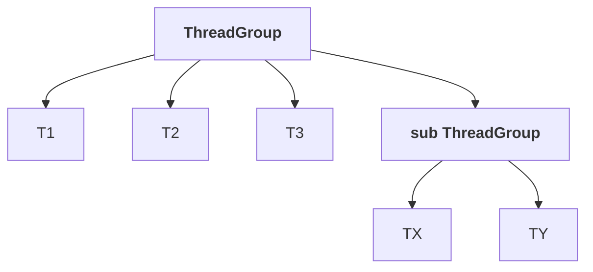

# Multithreading enhancements

The advanced block begins — thread groups, `ThreadLocal`, the `java.util.concurrent` package, alternatives to `synchronized`, and the executor framework.

> Take a bit of special care to understand these things. This is not that much easy like traditional multithreading.

---

# `ThreadGroup`

> **Based on functionality, we can group threads into a single unit, which is nothing but a thread group.**

**A thread group contains a group of threads**, and in addition to threads, **a thread group can also contain sub thread groups.**



## Why bother

> **The main advantage of maintaining threads in the form of a thread group is that we can perform common operations very easily.**

> [!info] **The messenger contact-groups analogy.** In a chat application you can keep contacts in groups — friends, relatives. **To wish all your friends on Friendship Day, you right-click the group and send once**, and everyone in it receives the message.
>
> Without groups, you would have to work out who is a friend and message each one individually.

**The thread equivalents:** suspend all consumer threads, stop all producer threads, set max priority for all printing threads, set min priority for all header threads.

---

# Every thread belongs to a group

> **Every thread in Java belongs to some thread group.** There is no such thing as a thread without one.

## Three things called `main`

```java
System.out.println(Thread.currentThread().getName());
System.out.println(Thread.currentThread().getThreadGroup().getName());
System.out.println(Thread.currentThread().getThreadGroup().getParent().getName());
```

Measured on JDK 25:

```
current thread    = main
its thread group  = main
its parent group  = system
```

> [!important] **Don't get confused — there are three separate `main` characters.**
>
> | | |
> |---|---|
> | the **`main` method** | where execution starts |
> | the **`main` thread** | the thread that executes it |
> | the **`main` thread group** | the group that thread belongs to |
>
> **The `main` method is called by the `main` thread, which belongs to the `main` thread group.**

## And the root is `system`

> **Every thread group is a child group of `system`, directly or indirectly.**

Measured on JDK 25 — `system`'s own parent is **`null`**, confirming it is the root.

> [!info] **The same shape as `Object` for classes.** `Object` is the root of every class hierarchy; **`system` is the root of every thread-group hierarchy** — and both roots have no parent.

---

# Creating a group

```java
ThreadGroup g = new ThreadGroup("Printing Threads");
Thread t1 = new Thread(g, runnable, "t1");
Thread t2 = new Thread(g, runnable, "t2");
```

Measured on JDK 25:

```
group name          = Printing Threads
parent of new group = main
activeCount()       = 2
```

**A new group's parent is the current thread's group** — `main`, since `main` created it.

## Useful methods

| Method | |
|---|---|
| `String getName()` | the group's name |
| `ThreadGroup getParent()` | its parent group |
| `int activeCount()` | how many **live threads** are in it |
| `int activeGroupCount()` | how many **live sub-groups** |
| `void list()` | print the group and its threads to the console |
| `int getMaxPriority()` | the group's priority ceiling |
| `void setMaxPriority(int p)` | set that ceiling |
| `void interrupt()` | interrupt **every thread** in the group |

**`list()` measured on JDK 25:**

```
java.lang.ThreadGroup[name=Printing Threads,maxpri=3]
    Thread[#25,t1,5,Printing Threads]
    Thread[#26,t2,5,Printing Threads]
```

---

# The priority ceiling

**The most useful thing a thread group actually does**, and it is worth understanding because it is not what people expect.

```java
g.setMaxPriority(3);
Thread t3 = new Thread(g, runnable, "t3");
t3.setPriority(10);
```

Measured on JDK 25:

```
after setMaxPriority(3)      = 3
new thread asked for 10, got = 3   <- capped by the group
```

> [!important] **`setMaxPriority` is a ceiling, not an assignment.** `t3.setPriority(10)` did not fail and did not throw — the value was **silently reduced to 3**, the group's maximum.
>
> **Two consequences worth knowing:**
> - It only affects **threads added afterwards** — existing threads keep their priority.
> - A thread can never exceed its group's ceiling, so this is the one genuinely enforced group-wide operation.
>
> Given note `04` showed priorities barely influence scheduling anyway, **this is more useful as a guard than as a performance tool.**

---

# The state of `ThreadGroup` today

Measured on JDK 25, the deprecated members:

```
setDaemon()     since=16 forRemoval=true
isDaemon()      since=16 forRemoval=true
isDestroyed()   since=16 forRemoval=true
destroy()       since=16 forRemoval=true
checkAccess()   since=17 forRemoval=true
```

**And `suspend()`, `resume()` and `stop()` on `ThreadGroup` are gone entirely** — removed alongside the `Thread` versions in note `14`.

> [!warning] **`ThreadGroup` is effectively a legacy API — do not design around it.** Most of the common operations that motivated it are exactly the ones that were removed: you cannot suspend, resume or stop a group any more. **What remains is naming, counting, the priority ceiling, and `interrupt()`.**
>
> **What replaced it:** an **`ExecutorService`** (part 18) manages a set of threads properly — you can shut it down, await termination, and submit work to it. For grouping and diagnostics, thread names and thread dumps do the job.
>
> **It is still asked about**, and it still explains the `main` / `system` hierarchy you see in every thread dump — which is reason enough to know it.

---

# What this part established

| | |
|---|---|
| A thread group | groups threads **by functionality** into one unit |
| It can contain | threads **and sub thread groups** |
| The advantage | perform **common operations easily** |
| Every thread | belongs to **some** thread group |
| The three `mains` | the **method**, the **thread**, the **thread group** |
| `main`'s parent group | **`system`** |
| `system`'s parent | **`null`** — it is the root |
| Analogy | `system` is to groups what **`Object`** is to classes |
| A new group's parent | the **creating thread's** group |
| Key methods | `getName` · `getParent` · `activeCount` · `list` · `setMaxPriority` · `interrupt` |
| `setMaxPriority` | a **ceiling** — higher requests are **silently reduced** |
| It applies to | threads added **afterwards** |
| Deprecated for removal | `destroy` · `isDestroyed` · `setDaemon` · `isDaemon` · `checkAccess` |
| Already removed | `suspend` · `resume` · `stop` |
| Use instead | an **`ExecutorService`** |
