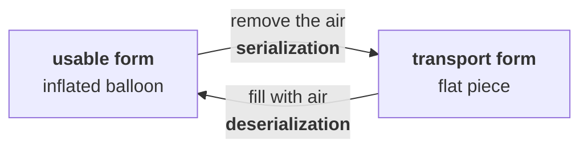
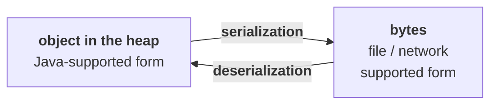
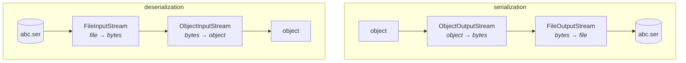

# What serialization actually is

> The most valuable concept, especially for the interview room — and where the majority of people are not having a clear picture. There is some gap in their knowledge.

**Almost everyone can give the surface definition.** The process of saving the state of an object to a file. That answer is accepted, and it is not wrong — but it is not what serialization **is**, and the gap between the two is exactly what gets probed.

---

# The balloon

His analogy, and it carries the whole concept.

> [!info] **The balloon sent to Bangalore.**
> He has a kid studying in Bangalore. One day the kid calls: Dad, can you please send a big balloon for me? Ravi has a balloon and he's not allowing me to play with it — and the balloon should be bigger than what Ravi has.
>
> If the kid is asking something, every parent is very much eager to provide that, because at kid level the attachment is more. But this rule is applicable only at kid level — once we grow, our parents are not going to [heed] our requests.
>
> So he goes to a shop. **Do you have balloons?** Yes. **Can you please give the biggest balloon you have?** — and he points out his own wording: my words are reflecting attachment with my kid. I didn't ask the price. A man goes inside, comes back after ten minutes with an enormous balloon. ₹1,500–2,000. He pays.
>
> **Then his problem starts.** He is happy looking at it — but he now has to get this thing to Bangalore. He walks down the road carrying it just like a robo.
>
> He reaches a **DTDC courier office**. The man inside comes out before he even gets to the door. Sir, what do you require? — Can you please send this balloon to Bangalore?
>
> The courier man looks him **top to bottom**: **Not possible to send a balloon to Bangalore.**
>
> As per courier rules we should not send money, we should not send gold, we should not send illegal things. This is not money, it is not gold, it is not illegal — why can't you send it?
>
> **The courier man's two reasons:**
> - Usually we send items by flight. If I want to send your balloon in the flight, how much space is it going to accommodate?
> - If there is any small needle press, automatically this balloon will be damaged.
>
> **It is not in transport-supported form. That's why, sorry sir, we can't send it.**
>
> So he climbs down from ordering to asking: At least can you please guide me how I can send this? I paid ₹2,000 — unnecessarily it will become waste.
>
> The courier man asks him to **put the balloon on the ground**, walks around it twice or thrice, and **finds a small opener**. Then: **Sir, we can send this balloon to Bangalore.**
>
> He is shocked. A few minutes before you told me you are unable to send it, but now you are telling me you can. How?
>
> **Very simple. If I remove the air from the balloon, then it's possible to send.**
>
> And with a very innocent face he asks: **Without air, how will my kid play with this balloon, man?**
>
> Sir, in Bangalore you can fill it with air. He calls the kid's guardian — yes, there's a cycle shop and a motor shop nearby that can fill air. So the air comes out, **the big balloon becomes a small piece**, the courier man gives him a small cover, he writes the from-address and to-address, pays ₹30 or ₹40, and by **tomorrow evening** it reaches Bangalore.
>
> The kid receives a small flat piece of rubber. **It is not in usable form — it is in transport-supported form.** The kid fills it with air, and it becomes a big balloon again.

## The two conversions

**The whole concept is in the two words the courier man used.**

| Form | |
|---|---|
| **original / usable form** | the inflated balloon — what the kid can play with |
| **transport-supported form** | the flat piece — what a flight will carry |

> **Converting the balloon from original form into transport-supported form — that conversion process is serialization.**

> **Converting it back from transport-supported form into original form — that reverse conversion is deserialization.**



---

# Mapping it to Java

**An object sitting in the heap is in Java-supported form.** A file cannot hold it — a file holds bytes. A network cannot carry it — a network carries bytes.

> **The process of converting an object from Java-supported form into file-supported form or network-supported form is serialization.**

> **The process of converting an object from file-supported form or network-supported form back into Java-supported form is deserialization.**



## What to say when asked

He wants the answer given in **two layers**, and this is the shape of it:

> [!important] **The process of saving the state of an object to a file is serialization — but strictly speaking, it is the process of converting an object from Java-supported form into file- supported form or network-supported form.**
>
> And the reverse: The process of reading the state of an object from a file is deserialization — but strictly speaking, it is the process of converting an object from file- or network-supported form back into Java-supported form.
>
> **The first sentence is what everyone says. The second is what he is listening for.**

---

# The four streams

**Serialization needs two streams stacked on each other, and so does deserialization.**

## Writing — serialization

```java
FileOutputStream fos = new FileOutputStream("abc.ser");
ObjectOutputStream oos = new ObjectOutputStream(fos);
oos.writeObject(d1);
```

| Stream | Its job |
|---|---|
| **`ObjectOutputStream`** | **takes the object and converts it into binary data** |
| **`FileOutputStream`** | **writes that binary data to the file** |

> **A `FileOutputStream` can write binary data, but not an object directly.** So you open an `ObjectOutputStream` **over** it — that is the one whose `writeObject()` takes an object. **Then the object happily goes and sits into the file.**

## Reading — deserialization

```java
FileInputStream  fis = new FileInputStream("abc.ser");
ObjectInputStream ois = new ObjectInputStream(fis);
Dog d2 = (Dog) ois.readObject();
```

| Stream | Its job |
|---|---|
| **`FileInputStream`** | reads the binary data |
| **`ObjectInputStream`** | **hands you the object**, via `readObject()` |



> [!important] **The four class names are a guaranteed question.** Serialization:
> **`FileOutputStream` + `ObjectOutputStream`**. Deserialization: **`FileInputStream` + `ObjectInputStream`**. And be ready to say which one does which half of the work.

---

# The program

```java
import java.io.*;

class Dog implements Serializable {
    int i = 10;
    int j = 20;
}

public class S1 {
    public static void main(String[] a) throws Exception {
        Dog d1 = new Dog();

        FileOutputStream fos = new FileOutputStream("abc.ser");
        ObjectOutputStream oos = new ObjectOutputStream(fos);
        oos.writeObject(d1);
        oos.close();

        FileInputStream fis = new FileInputStream("abc.ser");
        ObjectInputStream ois = new ObjectInputStream(fis);
        Dog d2 = (Dog) ois.readObject();
        ois.close();

        System.out.println(d2.i + " " + d2.j);
    }
}
```

Measured on JDK 25:

```
before: i=10 j=20
serialized -> abc.ser  (40 bytes)
after : i=10 j=20
same object? false
```

> [!important] **`d1 == d2` is `false`, and that matters.** Deserialization **creates a new object**. It is a copy with the same state, not the same object — the balloon that arrived in Bangalore is made of the same rubber, but it is not the balloon that left. **This is why serialization is sometimes used as a deep-copy trick.**

## `readObject()` returns `Object`

**`readObject()` is declared to return `Object`**, so the cast is not optional:

```java
Dog d2 = (Dog) ois.readObject();
```

**And it throws `ClassNotFoundException`** as well as `IOException` — because at read time the JVM has to find the class named in the stream.

---

# What the file actually contains

> [!example]- **The 40 bytes on disk — the transport-supported form made literal.** Worth opening once; you can read the class name and both field values with your own eyes.
>
> ```
> AC ED 00 05 73 72 00 03 44 6F 67 B5 F6 8B 65 68 45 CA 05 02 00 02
> 49 00 01 69 49 00 01 6A 78 70 00 00 00 0A 00 00 00 14
> ```
> ```
> ....sr..Dog...ehE.....I..iI..jxp........
> ```
>
> Reading it left to right:
>
> | Bytes | What it is |
> |---|---|
> | `AC ED` | **the stream magic number** — every Java serialization stream starts with these two bytes |
> | `00 05` | the **stream version** |
> | `73 72` | `s`, `r` — a marker meaning a new class descriptor follows |
> | `00 03 44 6F 67` | length 3, then **`Dog`** — the class name, in plain ASCII |
> | `B5 F6 8B 65 68 45 CA 05` | **the `serialVersionUID`**, computed by the JVM (part `15`) |
> | `00 02` | this class has **2 fields** |
> | `49 00 01 69` | type `I` (int), name **`i`** |
> | `49 00 01 6A` | type `I` (int), name **`j`** |
> | `00 00 00 0A` | **10** |
> | `00 00 00 14` | **20** |
>
> **Three things you can see and should remember:** the file carries **the class name**, **the field names and types**, and **the values** — and it carries **no code at all**. That is why the class must be present on the machine doing the reading, and it is why `serialVersionUID` exists.
>
> **`AC ED 00 05` is a genuinely useful thing to recognise.** If you ever see a payload beginning `AC ED` — or `rO0AB` in Base64, which is the same bytes — **you are looking at a Java serialized object**, and that is the first signature checked in a deserialization vulnerability review.

---

# `Serializable` is required

**Leave `implements Serializable` off** and the write fails:

```java
class NotSer { int k = 30; }        // no Serializable
```

Measured on JDK 25:

```
java.io.NotSerializableException: NotSer
```

> **Only `Serializable` objects can be sent through an `ObjectOutputStream`.** The courier man's rule: some things simply do not go on the flight. **What `Serializable` actually is, and why it has no methods, is part `02`.**

---

# What this part established

| | |
|---|---|
| Common definition | saving the **state of an object to a file** |
| Strict definition | converting an object from **Java-supported form** to **file- or network-supported form** |
| Deserialization | the **reverse** conversion |
| The analogy | the **balloon** — inflated is usable, deflated is transport-supported |
| Serialization streams | **`FileOutputStream`** + **`ObjectOutputStream`** |
| Deserialization streams | **`FileInputStream`** + **`ObjectInputStream`** |
| `ObjectOutputStream` does | object **→ bytes** |
| `FileOutputStream` does | bytes **→ file** |
| The write call | **`oos.writeObject(obj)`** |
| The read call | **`ois.readObject()`** — returns `Object`, **cast required** |
| It throws | `IOException` **and `ClassNotFoundException`** |
| Deserialization gives you | a **new object** — `d1 == d2` is **`false`** |
| Required on the class | **`implements Serializable`** |
| Without it | **`NotSerializableException`** |
| Every stream starts with | **`AC ED 00 05`** |
| The file carries | class name, field names and types, values — **never code** |
