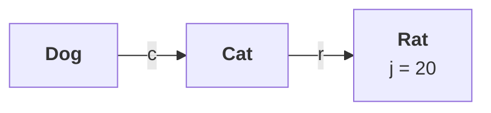

# Object graphs in serialization

**Objects are rarely alone.** A `Dog` holds a `Cat`, that `Cat` holds a `Rat`, and that `Rat` holds an `int`. The question this part answers: **you serialize the dog — what actually goes into the file?**

---

# The setup

```java
class Dog implements Serializable {
    Cat c = new Cat();
}

class Cat implements Serializable {
    Rat r = new Rat();
}

class Rat implements Serializable {
    int j = 20;
}
```

> Whenever a cat saw the dog, immediately it will run like anything.



## How many objects does one `new` create?

```java
Dog d1 = new Dog();
```

> **Explicitly, how many objects did I create? Only one. But internally, how many objects got created? Three.**

**Creating the `Dog` creates the `Cat`, because `c` is an instance variable of `Dog`.** Creating the `Cat` creates the `Rat`, for the same reason. And the `Rat` brings `j = 20` with it.

---

# The rule

```java
oos.writeObject(d1);        // only the dog is named
```

> **Whenever we are serializing an object, the set of all objects which are reachable from that object will be serialized automatically. This group of objects is nothing but the object graph.**

**That is the definition, and it is the one to give word for word.**

Measured on JDK 25 — write the dog, read it back, then reach all the way down:

```java
System.out.println(d2.c.r.j);
```

```
whole graph  -> d2.c.r.j = 20
```

**The `Cat` and the `Rat` were never mentioned in any `writeObject()` call, and both came back.**

---

# Every object in the graph must be serializable

> **In an object graph, every object should be serializable. If at least one object is not serializable, we get a runtime exception saying `NotSerializableException`.**

**His demonstration is a cascade**, and it is the proof that the cat and rat really are being written. Start with none of the three implementing `Serializable`:

| Step | What the JVM says |
|---|---|
| No class implements it | **`NotSerializableException: Dog`** — fair enough, we asked to write a `Dog` |
| Add it to `Dog` only | **`NotSerializableException: Cat`** — but I never asked to write a cat |
| Add it to `Cat` too | **`NotSerializableException: Rat`** |
| Add it to `Rat` too | **`20`** |

Measured on JDK 25, with only the `Rat` left non-serializable:

```
one link not Serializable -> java.io.NotSerializableException: RatN
```

> [!important] **The cascade is the practical proof.** If really the cat is not going to serialize, then we should not get this exception. But still we are going to get it — this means internally the cat object is serializing.
>
> **You never asked for the cat. The exception naming the cat is the evidence that it was on its way into the file.**

> [!warning] **This is what makes `implements Serializable` contagious.** Adding it to one class quietly demands it from every type reachable through its fields. A single non-serializable field deep in the graph — a `Connection`, a `Thread`, a lambda, a logger — **fails the whole write at run time**, and the class named in the exception may be one you have never heard of.

---

# Breaking the graph on purpose

**`transient` is how you cut a link.** Part `03` used it for passwords; here it is the tool for keeping a non-serializable neighbour out of the graph entirely.

```java
class Cat implements Serializable {
    transient Rat r = new Rat();
}
```

Measured on JDK 25:

```
transient link -> d.c.r = null
```

> **The link is cut and the `Rat` is never visited** — so it does not need to be `Serializable` at all. **The cost is that it comes back `null`**, and any code that dereferences it after deserialization will get an NPE. **Part `06` onwards is about how to fill it back in.**

---

# Why graph and not tree

> [!question]- **Deep dive — cycles and shared objects, which is what the word graph is actually promising.** Worth opening: it explains why serialization does not infinitely recurse, and it is a good interview follow-up.
>
> **Two objects pointing at each other:**
>
> ```java
> Node x = new Node("X"), y = new Node("Y");
> x.peer = y;
> y.peer = x;          // a cycle
> ```
>
> A naive write every reachable object algorithm would loop forever. Measured on JDK 25:
>
> ```
> cycle X<->Y  -> x2.peer.name = Y,  x2.peer.peer == x2 ? true
> ```
>
> **It terminates, and the cycle is faithfully rebuilt** — `x2.peer.peer` is `x2` itself, the same object, not a copy.
>
> **The mechanism is a handle table.** As the stream writes each object it assigns it a **handle**; if it meets the same object again it writes a **back-reference to that handle** instead of the object. On the way back in, `ObjectInputStream` keeps the same table and resolves the reference to the object it already built.
>
> ##### The same table preserves sharing
>
> Two cats holding **the same** rat, written to one stream:
>
> ```
> shared Rat preserved as one object? true
> ```
>
> **`r1.r == r2.r`.** The rat was written once and referenced twice — so object identity is preserved **within a single stream**, not just equality.
>
> **The practical catch:** that table is why `ObjectOutputStream` **never releases** the objects it has written — it must keep them to detect repeats. In a long-lived stream this is a memory leak, and it is also why writing a mutated object twice gives you **the old state back** the second time; the stream sees a known handle and writes the back-reference. **`oos.reset()`** clears the table when you need it.

---

# What this part established

| | |
|---|---|
| One `new Dog()` creates | **three** objects — Dog, Cat, Rat |
| The definition | serializing an object serializes **the set of all objects reachable from it** |
| That group is | the **object graph** |
| It happens | **automatically** — you name only the root |
| The condition | **every object in the graph must be serializable** |
| Otherwise | **`NotSerializableException`**, naming the class that failed |
| The proof it really cascades | the exception names **`Cat`** when you only wrote a **`Dog`** |
| To cut a link | declare the reference **`transient`** |
| The cost of cutting | it deserializes to **`null`** |
| Cycles | handled — via a **handle table** of back-references |
| Shared objects | **identity preserved** within one stream |
| To clear that table | **`oos.reset()`** |
