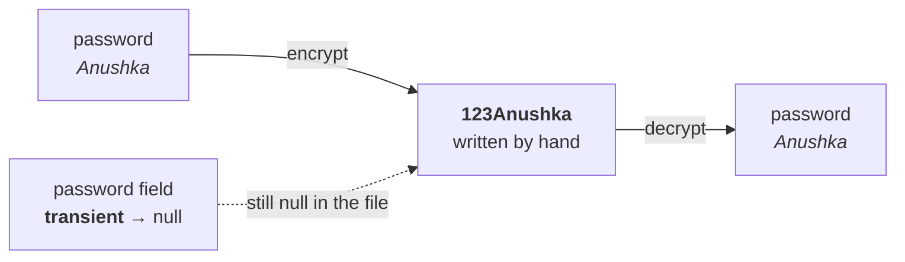

# The plan

Part `06` left three constraints: the password stays `transient`, the file still holds `null`, and the receiver still gets `Anushka`. **Here is the trick that satisfies all three.**

## At the sender side

> **Prepare an encrypted password, and write that encrypted password manually to the file.**

```java
String encryptedPassword = "123" + password;      // -> "123Anushka"
// write encryptedPassword to the file, by hand
```

**The encryption itself is not the point.** Do some modification — maybe reverse the password, add something, remove something, or execute some high-level security algorithm. His is deliberately trivial: **prepend `123`.**

## At the receiver side

> **Read that encrypted password, perform decryption, and assign the value to the original password.**

```java
// read "123Anushka" back
password = encrypted.substring(3);                // -> "Anushka"
```

> Whatever extra thing you added, remove that. Whatever encryption you did, perform the reverse operation.



**The `transient` field still writes `null`.** The real value travels **separately**, disguised — the mangoes and the polythene cover.

---

# The two methods

> **We can implement customized serialization by using two methods.**

```java
private void writeObject(ObjectOutputStream oos) throws Exception { }

private void readObject(ObjectInputStream ois) throws Exception { }
```

| Method | When the JVM runs it | What goes in it |
|---|---|---|
| **`writeObject`** | automatically, **at the time of serialization** | the extra work at the **sender** side |
| **`readObject`** | automatically, **at the time of deserialization** | the extra work at the **receiver** side |

> **`writeObject()` will be executed automatically by the JVM at the time of serialization. That's why at the time of serialization, if we want to do any extra work, we have to define it in this method only.**

**And the same sentence with the words swapped for `readObject()` and deserialization.**

## They are callback methods

> **If any method will be executed automatically by the JVM, such a type of method is by default considered a callback method.**

**You never call `writeObject()` yourself.** You call `oos.writeObject(a1)` — a different method, on the stream — and the JVM calls yours.

---

# The signature is not negotiable

> **Compulsorily the syntax should be like this only, because this is the JVM-understandable syntax. Suppose instead of `private` I took `public` — the JVM may not call it.**

**He is right, and the failure mode is worse than an error.** Measured on JDK 25:

| Declaration | Called? |
|---|---|
| `private void writeObject(ObjectOutputStream)` | ✅ **called** |
| `public void writeObject(ObjectOutputStream)` | ❌ **silently ignored** |
| `private static void writeObject(ObjectOutputStream)` | ❌ **silently ignored** |
| `private void writeObject(OutputStream)` | ❌ **silently ignored** |

```
private void writeObject/readObject:
   [private writeObject CALLED]
   [private readObject CALLED]

public  void writeObject/readObject:
                                       <- nothing

private STATIC writeObject:
                                       <- nothing

private void writeObject(OutputStream):
                                       <- nothing
```

> [!warning] **Get the signature wrong and there is no error, no warning, and no exception — your method simply never runs.** The program compiles, the program runs, and the password comes back `null`. **This is the single nastiest bug in this topic**, because everything looks correct.
>
> **The reason is that these methods are not overrides.** There is no interface declaring them — `Serializable` has no methods at all. The JVM looks them up **reflectively, by exact name and exact parameter type**, and requires them to be private and non-static. Anything else is not the method it is looking for, so it finds nothing and carries on.

> [!important] **Two things make this detectable, and you should use both.**
>
> **1. Annotate them `@Serial`** (Java 14+):
> ```java
> @Serial
> private void writeObject(ObjectOutputStream oos) throws IOException { }
> ```
> It is the serialization equivalent of `@Override` — it tells the compiler this is meant to be one of the magic methods, please check it.
>
> **2. Compile with `-Xlint:serial`.** Measured on JDK 25, against a deliberately `public` version:
> ```
> warning: [serial] serialization-related method writeObject not declared private
> ```
> **That warning is the whole bug, caught at compile time.** Without the flag, `javac` says nothing.

## The real declared exceptions

The JDK's own signatures are narrower than `throws Exception`:

```java
private void writeObject(ObjectOutputStream oos) throws IOException;
private void readObject(ObjectInputStream ois)  throws IOException, ClassNotFoundException;
```

**`throws Exception` works** — the exception list is not part of how the JVM finds the method — but the two above are the conventional forms and the ones `@Serial` expects.

---

# Which class do they go in?

> In our previous example, how many classes are there? The `Account` class, and the demo class. Where do we place these two methods?

> **Whichever object's serialization requires the extra work — in that corresponding class, define these methods.**

**We are serializing an `Account` object and the extra work is about the account's password**, so **both methods go inside `Account`**, not in the class holding `main`.

> While performing dog object serialization, if we have to do extra work, then in the `Dog` class we have to define these methods.

> [!info] **Each class in the graph gets its own pair.** These are per-class, not per-stream: when a graph of objects is written, the JVM calls the `writeObject` of each class that has one, for its own part of the object. **A `Dog` with a custom `writeObject` and a `Cat` with a custom `writeObject` will both have theirs called.**

---

# Where this is going

**Everything is now in place except one thing:** these methods have to write the ordinary fields **too**, not just the extra value — otherwise `username` would be lost as well. **That is `defaultWriteObject()`, and part `08` puts the whole thing together as a running program.**

---

# What this part established

| | |
|---|---|
| The sender-side work | **prepare an encrypted password**, write it manually |
| The receiver-side work | **read it, decrypt it, assign it** to the original variable |
| The encryption used | **`"123" + password`** — deliberately trivial |
| Implemented with | **two methods** |
| Method 1 | **`private void writeObject(ObjectOutputStream)`** |
| Method 2 | **`private void readObject(ObjectInputStream)`** |
| `writeObject` runs | automatically, at **serialization** |
| `readObject` runs | automatically, at **deserialization** |
| Called by the JVM, so they are | **callback methods** |
| Must be | **`private`**, **non-static**, **exact parameter type** |
| ⚠️ Wrong signature | **silently never called** — no error at all |
| To catch that | **`@Serial`** + compile with **`-Xlint:serial`** |
| They go in | the class **whose object needs the extra work** |
