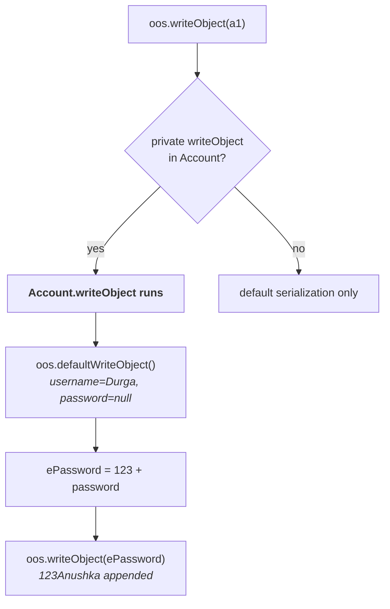

# The complete program

> Take very special care to understand this. At least twice or thrice I will explain — if you can understand this example, nothing is there in customized serialization.

**Everything from parts `06` and `07` as one runnable file.**

```java
import java.io.*;

class Account implements Serializable {

    String username = "Durga";
    transient String password = "Anushka";

    private void writeObject(ObjectOutputStream oos) throws Exception {
        oos.defaultWriteObject();                       // 1. default serialization
        String ePassword = "123" + password;            // 2. prepare encrypted password
        oos.writeObject(ePassword);                     // 3. write it manually
    }

    private void readObject(ObjectInputStream ois) throws Exception {
        ois.defaultReadObject();                        // 1. default deserialization
        String ePassword = (String) ois.readObject();   // 2. read encrypted password
        password = ePassword.substring(3);              // 3. decrypt and assign
    }
}

class CustomSerializeDemo {
    public static void main(String[] args) throws Exception {

        Account a1 = new Account();
        System.out.println(a1.username + " ... " + a1.password);

        FileOutputStream  fos = new FileOutputStream("abc.ser");
        ObjectOutputStream oos = new ObjectOutputStream(fos);
        oos.writeObject(a1);

        FileInputStream  fis = new FileInputStream("abc.ser");
        ObjectInputStream ois = new ObjectInputStream(fis);
        Account a2 = (Account) ois.readObject();

        System.out.println(a2.username + " ... " + a2.password);
    }
}
```

Measured on JDK 25:

```
Durga ... Anushka
Durga ... Anushka
```

**And the file:**

```
file contains 'Anushka' alone? false
file contains '123Anushka'?    true
```

> [!important] **All three constraints from part `06` are met at once.** `password` is still `transient`. The `password` **field** in the file is still `null`. The receiver still gets `Anushka`. **What is actually in the file is `123Anushka` — the box of mangoes.**

---

# Tracing the first half

**The moment `oos.writeObject(a1)` runs:**

> **The JVM checks: in the `Account` class, is there a `private writeObject` method?**

**If there is,** the JVM feels the programmer doesn't want default serialization — the programmer is performing customized serialization. JVM felt very happy, and simply executes this method.

## Inside `writeObject`

**Step 1 — ask for the default behaviour back.**

```java
oos.defaultWriteObject();
```

> Now I have to request the JVM: I want default serialization, can you please do that? This method is meant for default serialization.

**After this line the file holds `username = Durga` and `password = null`** — password is `transient`, so the default machinery writes the default value, exactly as part `03` established.

**Step 2 and 3 — the extra work.**

```java
String ePassword = "123" + password;    // "123Anushka"
oos.writeObject(ePassword);             // appended to the file, by hand
```

**`123Anushka` is now in `abc.ser`, as a separate object after the account's fields.**



---

# Tracing the second half

**The moment `ois.readObject()` runs**, the JVM checks the `Account` class for a `private readObject` and executes it.

```java
ois.defaultReadObject();                        // username = Durga, password = null
String ePassword = (String) ois.readObject();   // "123Anushka"
password = ePassword.substring(3);              // "Anushka"
```

> `substring(3)` — from index three onwards the remaining things will come. `123` will be gone.

**`password` is assigned directly**, inside the object being reconstructed. **After this method returns, the account has both values.**

---

# Comment the two methods out

His own A/B test, and it is the cleanest way to see what the methods are doing:

| Version | Output |
|---|---|
| **Without** `writeObject`/`readObject` | `Durga ... Anushka`<br>**`Durga ... null`** |
| **With** them | `Durga ... Anushka`<br>**`Durga ... Anushka`** |

> If I comment these two methods — is it default serialization or customized serialization? Default only, because I'm not writing any `writeObject`/`readObject` method.

---

# Two ways to get this wrong

> [!warning] **Forget `defaultWriteObject()` and you lose the ordinary fields.** The callback **replaces** the default behaviour; it does not run alongside it.
>
> Measured on JDK 25, with the `defaultWriteObject()` / `defaultReadObject()` lines removed:
> ```
> without defaultWriteObject -> username=null  password=Anushka
> ```
> **Exactly inverted** — the password is recovered and `username` is gone, because nothing ever wrote it. **`defaultWriteObject()` must be the first statement**, and `defaultReadObject()` the first statement on the way back.

> [!warning] **Customize one side only, and it fails silently.** With `writeObject` defined but no matching `readObject`:
> ```
> write customized, read not -> username=Durga  password=null
> ```
> **No exception.** The extra `123Anushka` object is simply left sitting unread in the stream. **The two methods are a matched pair** — they encode a private format, and both halves have to agree on it.

> [!warning] **`"123" + password` is not encryption.** It is a teaching placeholder, and the note keeps it because the mechanism is the lesson. **Never ship this shape.** The value is written to the file in plain sight — `123Anushka` is as readable as `Anushka`. If a password genuinely must survive serialization, store a **salted hash** you never need to reverse, or encrypt with a real key kept outside the file. **Anything you can decrypt with only what is in the stream, so can the attacker.**

---

# What this part established

| | |
|---|---|
| The whole mechanism | **two callback methods** on the class being serialized |
| First line of `writeObject` | **`oos.defaultWriteObject()`** |
| First line of `readObject` | **`ois.defaultReadObject()`** |
| Those two methods mean | JVM, please do the default part as well |
| Then the extra work | `"123" + password`, written with **`oos.writeObject()`** |
| And on the way back | **`ois.readObject()`**, `substring(3)`, assign to `password` |
| Result | `Durga ... Anushka` **both times** |
| The file actually contains | **`123Anushka`** — never the bare password |
| Without the two methods | `Durga ... null` |
| ⚠️ Forgetting `defaultWriteObject()` | the **ordinary fields are lost** |
| ⚠️ Customizing only one side | **silently wrong**, no exception |
| ⚠️ `"123" + password` | **not encryption** — teaching placeholder only |
