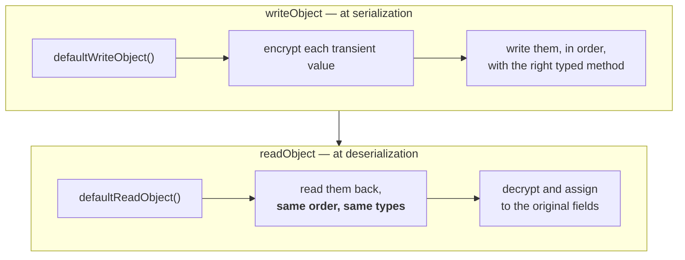

# More than one transient variable

**The previous example had exactly one transient variable.** Suppose more than one transient variable is there — for my account a PIN number is also there in addition to the password. Then how can we implement customized serialization?

**Everything is the same as part `08`. Only the count changes** — and with it, one new rule.

---

# The class

```java
class Account implements Serializable {

    String username = "Durga";
    transient String password = "Anushka";
    transient int pin = 1234;
```

**Three properties, two of them transient.**

## The write side

```java
    private void writeObject(ObjectOutputStream oos) throws Exception {

        oos.defaultWriteObject();               // username=Durga, password=null, pin=0

        String ePassword = "123" + password;    // "123Anushka"
        int    ePin      = pin + 4444;          // 1234 + 4444 = 5678

        oos.writeObject(ePassword);             // a String  -> writeObject
        oos.writeInt(ePin);                     // an int    -> writeInt
    }
```

**After `defaultWriteObject()` the file holds `Durga`, `null` and `0`** — both transient fields get their defaults, `null` for the `String` and `0` for the `int`.

Measured on JDK 25: **`1234 + 4444 = 5678`**, exactly as he works it out on the board.

## The read side

```java
    private void readObject(ObjectInputStream ois) throws Exception {

        ois.defaultReadObject();                        // Durga, null, 0

        String ePassword = (String) ois.readObject();
        int    ePin      = ois.readInt();

        password = ePassword.substring(3);              // "Anushka"
        pin      = ePin - 4444;                         // 1234
    }
}
```

Measured on JDK 25:

```
before: Durga Anushka 1234
after : Durga Anushka 1234
```

**Both transient values recovered.** With the two methods commented out, the same program prints `Durga null 0`.

---

# The one new rule: `writeInt`, not `writeObject`

> `ePassword` is a String — `oos.writeObject`. But the PIN number is an `int` value — `writeInt` method. Observe: not `writeObject`, `writeInt`.

**`ObjectOutputStream` has a typed method for every primitive**, and they pair up exactly:

| Field type | Write | Read |
|---|---|---|
| any object / `String` | `writeObject(o)` | `readObject()` |
| `int` | **`writeInt(i)`** | **`readInt()`** |
| `long` | `writeLong(l)` | `readLong()` |
| `double` | `writeDouble(d)` | `readDouble()` |
| `boolean` | `writeBoolean(b)` | `readBoolean()` |
| `char` | `writeChar(c)` | `readChar()` |
| `String` (compact form) | `writeUTF(s)` | `readUTF()` |

> [!info] **`writeObject` on an `int` would still work** — autoboxing turns it into an `Integer` and it is written as an object, which costs more bytes and needs a cast on the way back. **The typed methods are the right tool**, and `writeInt`/`readInt` is what he uses.

---

# The order rule, again

**Part `04` established that objects in a file must be read in the order they were written. The same rule applies inside the callback methods**, and this is what he stops to emphasise:

| Written | Read |
|---|---|
| `defaultWriteObject()` | `defaultReadObject()` |
| `writeObject(ePassword)` | `readObject()` |
| `writeInt(ePin)` | `readInt()` |

> In which order we added to the file — in the same order we have to deserialize.

**In the file there are now three entries:** the account's own fields, the encrypted string, and the encrypted int.

> [!warning] **Swap the two reads and it breaks.** Measured on JDK 25, reading the `int` before the `String`:
> ```
> java.io.EOFException
> ```
> **Not a `ClassCastException` and not a wrong value** — `readInt()` consumed four bytes from the middle of the string's encoding, and everything after that was garbage until the stream ran out.
>
> **The write side and the read side are one private file format.** They have to agree on the order **and** the types, and nothing checks it for you.

---

# The shape to remember



> [!important] **This scales to any number of transient variables without changing anything structural.** One default call, then one encrypt-and-write per hidden field, mirrored by one read-and-decrypt per hidden field. **The only thing that grows is the number of lines.**

---

# What this part established

| | |
|---|---|
| Several transient variables | handled by the **same two methods** |
| The class here | `username`, **`transient password`**, **`transient int pin`** |
| After `defaultWriteObject()` | `Durga`, **`null`**, **`0`** |
| Encrypted password | `"123" + password` → **`123Anushka`** |
| Encrypted pin | `pin + 4444` → **`5678`** |
| A `String` uses | **`writeObject`** / **`readObject`** |
| An `int` uses | **`writeInt`** / **`readInt`** |
| Entries in the file | **three** — the fields, the string, the int |
| The rule | **read in the same order you wrote** |
| ⚠️ Wrong order | **`EOFException`** |
| Output with the methods | `Durga Anushka 1234` **both times** |
| Output without them | `Durga null 0` |
