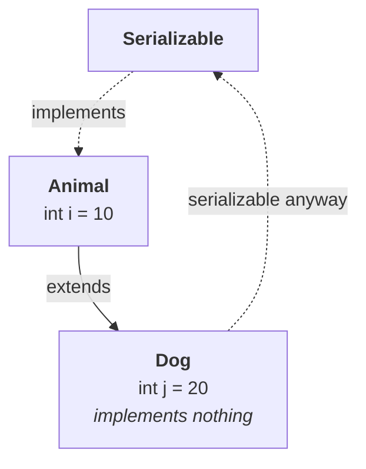

# Serialization with respect to inheritance

**Two cases, and he flags the difficulty of each up front:**

| | |
|---|---|
| **Case 1** | **parent** implements `Serializable`, **child does not** |
| **Case 2** | **parent does not**, **child** implements `Serializable` |

> Case one is very easy — a matter of 5 to 10 minutes. Case two is a bit lengthy, more number of conclusions. Take special care.

**This part is case 1.** Case 2 begins in part `11`.

---

# Case 1 — the parent is serializable

```java
class Animal implements Serializable {
    int i = 10;
}

class Dog extends Animal {          // does NOT implement Serializable
    int j = 20;
}
```

**The child inherits `i`, so a `Dog` has two properties:** `i = 10` from the parent, `j = 20` of its own.

```java
Dog d1 = new Dog();

oos.writeObject(d1);                // serializing a Dog...
Dog d2 = (Dog) ois.readObject();

System.out.println(d2.i + " " + d2.j);
```

## The question he stops on

> Is it going to work, or will I get a runtime exception saying `NotSerializableException` for `Dog`? Because I'm serializing `d1`, `d1` is a `Dog` object, and the `Dog` class doesn't implement `Serializable`.

Measured on JDK 25:

```
before: 10 20
after : 10 20
```

**It works.**

## The rule

> **If the parent implements `Serializable`, then automatically every child is serializable. Serializable nature is inheriting from parent to child.**

**And it is inheritance in the ordinary sense** — measured on JDK 25:

```
Dog10 declares Serializable itself? []          <- it declares no interfaces at all
but Serializable.isAssignableFrom(Dog10)? true  <- yet it IS one
```

> [!important] **Nothing special is happening here.** `Serializable` is an interface, and an interface implemented by a parent is implemented by every subclass — the same rule as any other interface. **`implements Serializable` on a class silently commits every future subclass too**, which is one more reason it is a heavier decision than it looks (part `05`).



---

# Two conclusions he draws from it

## `Object` does not implement `Serializable`

**He argues it by contradiction, and it is a clean piece of reasoning:**

> Can you tell — does the `Object` class implement `Serializable`? If `Object` implemented `Serializable`, then every class in Java would by default be serializable, because all Java classes are child classes of `Object`. But all Java classes are **not** serializable. That's why `Object` does not implement `Serializable`.

Measured on JDK 25:

```
Object implements Serializable? false
Object's interfaces: []
```

**`Object` implements no interfaces at all.**

> [!info] **The counter-example that proves it.** If everything were serializable, `NotSerializableException` could never happen — and part `05` is built on watching it happen three times. **`Thread`, measured on JDK 25, is not serializable.** Nor are `Connection`, `Socket` or a `FileOutputStream`, and that is deliberate: their state is meaningless outside the running JVM.

## Every servlet is serializable

> `GenericServlet` implements `Serializable`. Almost all servlets in Java are child classes of either `GenericServlet` or `HttpServlet` — so **all servlet classes in Java are by default serializable**, because their parent implements `Serializable`.

**This is case 1 applied to a real library**, and it is why servlet containers can persist sessions and migrate them between JVM instances.

> [!example]- **The same shape inside the JDK, measured on JDK 25.** A concrete pair you can check yourself, if the servlet example is unfamiliar.
>
> ```
> Number     serializable? true      <- declares it
> Integer    serializable? true      <- inherits it from Number
> ArrayList  serializable? true
> Thread     serializable? false
> ```
>
> **`Integer` never says `implements Serializable`.** It extends `Number`, and `Number` declares it — exactly `Animal` and `Dog`. **`Thread` is the control case**: no parent in its chain declares it, so it is not serializable, and trying to write one gives `NotSerializableException`.

---

# What this part established

| | |
|---|---|
| Two inheritance cases | parent serializable / **child** serializable |
| Case 1 | **parent** implements it, child does not |
| Serializing the child | ✅ **works** |
| The rule | **serializable nature is inherited from parent to child** |
| Why | `Serializable` is **an ordinary interface** — subclasses implement it too |
| Output | `10 20` **both times** |
| Does `Object` implement it? | **No** |
| The argument | if it did, **every** class would be serializable — but they are not |
| Measured | `Object`'s interface list is **empty** |
| The library example | **`GenericServlet` implements `Serializable`** |
| So | **every servlet** is serializable, via its parent |
| The JDK equivalent | **`Integer`** is serializable because **`Number`** is |
| The counter-example | **`Thread` is not serializable** |
