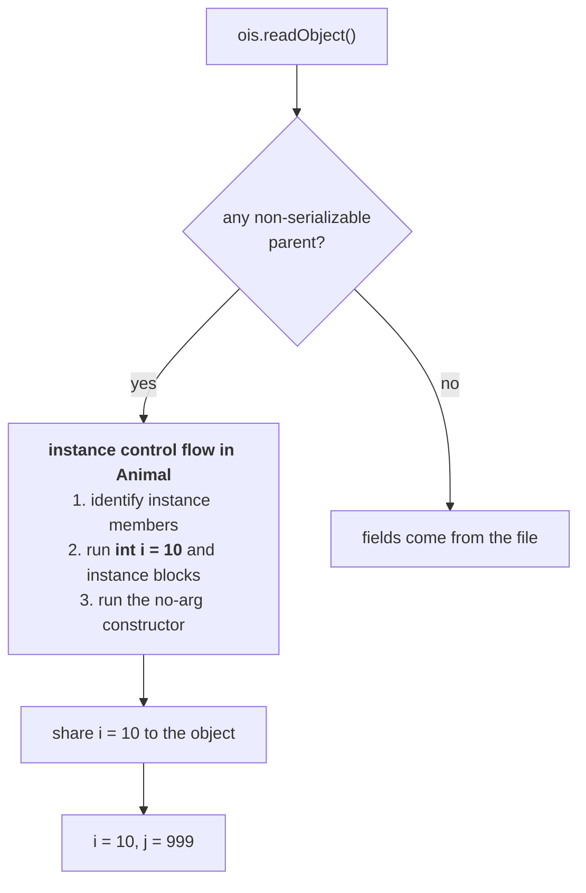

# Case 2 — the parent is *not* serializable

> *"Very dangerous. Almost four conclusions are there, you have to keep these properly. This is the
> most difficult concept — take special care."*

```java
class Animal {                                      // NOT Serializable
    int i = 10;
}

class Dog extends Animal implements Serializable {  // the CHILD declares it
    int j = 20;
}
```

**Case 1 (part `10`) was the parent declaring it. This is the reverse**, and it behaves nothing like
you would guess.

---

# Rule 1 — the parent need not be serializable

> **To serialize a child class object, the parent class need not be serializable.**

**And his argument for why that must be true is the same one from part `10`, run in reverse:**

> *"If we had the conclusion that the parent must be serializable, then you couldn't serialize a single
> Java object — because for all Java classes the parent is `Object`, and `Object` doesn't implement
> `Serializable`. But still we can serialize a `Dog` object, an `Account` object…"*

**So the child implementing `Serializable` is enough.** *"Whether the parent is serializable or not,
not required to worry at all."*

---

# Rule 2 — values from a non-serializable parent are not written

```java
Dog d1 = new Dog();
d1.i = 888;          // inherited from the non-serializable Animal
d1.j = 999;          // the child's own
```

> **At the time of serialization, the JVM will check: is any instance variable inheriting from a
> non-serializable parent? If any instance variable is inheriting from a non-serializable parent, the
> JVM ignores the original value and saves the default value to the file.**

| Variable | Comes from | Written to the file |
|---|---|---|
| `i` | **non-serializable** `Animal` | **`0`** — the default |
| `j` | the serializable `Dog` | **`999`** |

**The `888` is gone**, for exactly the reason `transient` values are gone in part `03`: the machinery
declines to write it.

---

# Rule 3 — instance control flow runs in the parent

**This is the rule nobody predicts.** *"Most of the people are going to expect the answer will become
`888 999`. We are not going to get that output — I'm sure."*

**And it is not `0 999` either.**

> **At the time of deserialization, the JVM will check: is any parent class non-serializable? If any
> parent class is non-serializable, then the JVM will execute instance control flow in every
> non-serializable parent, and share its instance variable values to the current object.**

## What "instance control flow" means

| Step | |
|---|---|
| 1 | **identification** of instance members |
| 2 | **execution of instance variable assignments and instance blocks** |
| 3 | **execution of the constructor** |

**Step 2 is what sets `i` back to `10`** — the field initialiser `int i = 10;` runs again, on the object
being reconstructed. **Then that value is shared to the current object.**



---

# Rule 4 — and it calls the no-arg constructor

> **While executing instance control flow, the JVM will always call the no-argument constructor of the
> non-serializable parent. Hence every non-serializable parent should compulsorily contain a
> no-argument constructor.**

> **If a no-argument constructor is not there, we get a runtime exception saying
> `InvalidClassException`.**

---

# The whole thing, measured

```java
class Animal {
    int i = 10;
    Animal() { System.out.println("Animal constructor called"); }
}

class Dog extends Animal implements Serializable {
    int j = 20;
    Dog() { System.out.println("Dog constructor called"); }
}

class SerializeDemo6 {
    public static void main(String[] args) throws Exception {
        Dog d1 = new Dog();
        d1.i = 888;
        d1.j = 999;

        oos.writeObject(d1);

        System.out.println("deserialization started");
        Dog d2 = (Dog) ois.readObject();
        System.out.println(d2.i + " ... " + d2.j);
    }
}
```

Measured on JDK 25:

```
Animal constructor called          <- from new Dog(): parent first
Dog constructor called             <- then child
deserialization started
Animal constructor called          <- AGAIN. this is the proof of rule 3
10 ... 999
```

> [!important] **The second `Animal constructor called` is the whole lesson.** Nobody called a
> constructor — `readObject()` was called. **That line is direct evidence that the JVM ran instance
> control flow inside the non-serializable parent**, and the constructors he added to the classes exist
> purely to make it visible.
>
> **And the output is `10 ... 999`:**
>
> | Value | Why |
> |---|---|
> | **not `888`** | rule 2 — never written to the file |
> | **not `0`** | rule 3 — the field initialiser `int i = 10` ran again |
> | **`10`** | the parent's **fresh** value, shared to the object |
> | **`999`** | the child's own field, straight from the file |

> [!info] **Note the asymmetry between the two halves of the object.** The `Dog` part is *restored*
> from the file, with its constructor **not** run. The `Animal` part is *constructed*, from scratch,
> with its constructor **run**. **One object, two completely different creation mechanisms** — and the
> dividing line is exactly where `Serializable` stops.

---

# Rule 4, demonstrated

## When there is no constructor at all

```java
class Animal { int i = 10; }        // no constructor written
```

**This still works.** Measured on JDK 25:

```
--- parent has NO constructor (compiler-generated):
got 10 999
```

> *"If the class doesn't contain any constructor, the compiler will always generate a no-argument
> constructor. The default constructor is always no-argument."* **So the requirement is satisfied
> without you doing anything.**

## When there is only a parameterised constructor

```java
class Animal {
    int i = 10;
    Animal(int x) { i = x; }        // only this one
}

class Dog extends Animal implements Serializable {
    int j = 20;
    Dog() { super(5); }             // super(...) is now mandatory
}
```

> *"If we are writing at least one constructor, the compiler won't generate the default no-argument
> constructor. That's why the non-serializable parent class doesn't contain a no-argument
> constructor."*

Measured on JDK 25:

```
--- parent has only Animal(int):
Animal(int) called
Dog constructor called
serialization succeeded
deserialization -> java.io.InvalidClassException: DogP; no valid constructor
```

> [!warning] **Serialization succeeds. Deserialization fails.** The write goes through perfectly and
> the file is produced — the failure arrives only when someone tries to read it back, possibly on
> another machine, possibly much later. **Adding a parameterised constructor to a non-serializable
> parent can break deserialization of files that were written before you added it.**
>
> **Read the exception message carefully:** `InvalidClassException: DogP; no valid constructor`. **It
> names the child** — the class being deserialized — **not `AnimalP`**, which is the class actually
> missing the constructor. The fix is in the parent; the message points at the child.

---

# The four rules together

| # | Rule |
|---|---|
| **1** | To serialize a child class object, **the parent need not be serializable** |
| **2** | At **serialization**, values inherited from a non-serializable parent are **ignored — the default is saved** |
| **3** | At **deserialization**, the JVM runs **instance control flow in every non-serializable parent** and shares its instance variable values to the object |
| **4** | That includes calling the parent's **no-argument constructor** — which must exist, or **`InvalidClassException`** |

---

# What this part established

| | |
|---|---|
| Case 2 | **parent not serializable**, child serializable |
| Can the child be serialized? | **Yes** — rule 1 |
| Why the parent need not be | otherwise **nothing** could be serialized, since `Object` is not |
| Inherited values at write time | **replaced by defaults** — rule 2 |
| At read time | **instance control flow** runs in the parent — rule 3 |
| Instance control flow is | identify members → **run field assignments and instance blocks** → run constructor |
| So the inherited field comes back as | its **initialiser value**, not the file's and not the default |
| The proof | **`Animal constructor called` printed a second time** |
| Measured output | **`10 ... 999`** — not `888 999`, not `0 999` |
| The constructor called | the parent's **no-argument** constructor — rule 4 |
| Must exist | else **`InvalidClassException`** |
| No constructor written | fine — the **compiler generates** one |
| Only a parameterised constructor | **breaks deserialization** |
| ⚠️ The failure appears | at **read** time, not write time |
