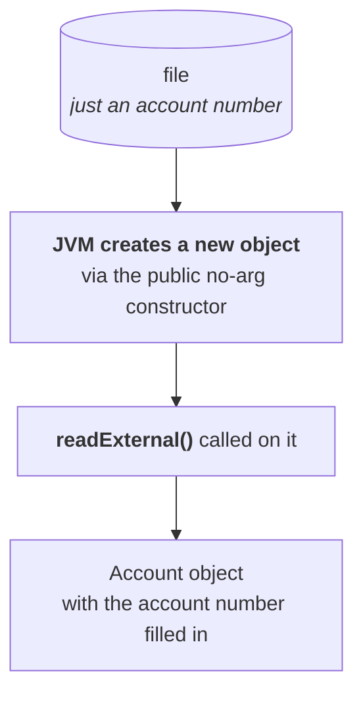

# Externalization

> *"One special concept which is not required for the certification exam, but very important for the
> interview room — where most people are silent at this stage."*

**Serialization already exists.** So the first question is why a second mechanism is needed at all:

> *"Anywhere it's common — if two concepts are there and one concept is already there, what is the need
> of the second? Because with the first there are some problems."*

---

# The two problems with serialization

## Problem 1 — the programmer has no control

```java
oos.writeObject(a1);
```

**Whether the class has ten properties or a thousand, that is the entire code.**

> **In serialization everything is taken care of by the JVM. The programmer doesn't have any control.**

> [!info] **This is stated as a problem, but it is also serialization's selling point.** *"If anyone
> asks what is the advantage of serialization — it is very simple, because most of the work is done by
> the JVM."* **The same fact is the pro and the con.**

## Problem 2 — it is all or nothing

> **In serialization it is always possible to save the total object to the file, and it is not possible
> to save part of the object.**

**And `transient` does not help** — *"instead of the original value, the default value will be saved.
But some value is saving."* **The field still occupies the stream.**

### The arithmetic

His numbers, and they make the case:

| | |
|---|---|
| The account has | **1,000 properties** |
| What you actually need to send | **the account number** — the receiver can look up the rest in a database |
| Time to write one property | ~1 minute |
| **What you need** | write 1 + read 1 = **2 minutes** |
| **What serialization costs** | write 1,000 + read 1,000 = **2,000 minutes** |

> *"For two minutes' work we are spending 2,000 minutes. Performance of the system is going to be
> down."*

---

# What externalization gives you

> *"If you observe the word — **external**."*

> **In externalization everything is taken care of by the programmer. The JVM doesn't have any
> control.** And **based on our requirement, we can save either the total object or part of the
> object.**

## The comparison

| | **Serialization** | **Externalization** |
|---|---|---|
| Who is in control | **JVM** | **programmer** |
| What gets saved | **always the total object** | **total object or part of it** |
| Performance | relatively **low** | relatively **high** |
| Best choice when | you want the **whole object** | you want **part of the object** |

> [!important] **That table is the answer to "give me three differences between serialization and
> externalization",** which he says is a standard question. **Control, completeness, performance.**

---

# The `Externalizable` interface

**To give a class serializable ability you write `implements Serializable`. Same shape here:**

```java
class Account implements Externalizable { … }
```

Measured on JDK 25:

| | |
|---|---|
| Package | **`java.io`** |
| Extends | **`java.io.Serializable`** |
| Declared methods | **2** |

```java
public abstract void writeExternal(ObjectOutput out) throws IOException;
public abstract void readExternal(ObjectInput in)   throws IOException, ClassNotFoundException;
```

> **`Externalizable` is a child interface of `Serializable` only. Don't feel it is something completely
> new.**

> [!important] **And this is itself one of the differences he wants stated:** `Serializable` is a
> **marker interface with no methods**, where the whole ability is provided by the JVM.
> **`Externalizable` declares two methods**, because **the programmer is responsible for providing the
> ability.**

## Both arrived in 1.1

> *"In which version did `Externalizable` come? Most people are going to feel 1.4, 1.5, 6 or 7. But
> make sure — the externalization concept also came in the 1.1 version only."*

**Both are as old as each other.**

## So why is one popular and the other not?

> **"Just because of laziness of the programmer."**

> *"In serialization everything is taken care of by the JVM. If the JVM is going to take care, why do I
> have to worry? But in externalization, who is responsible to provide the implementation? The
> programmer. Why do I have to take that much risk?"*
>
> *"Then you may ask — sir, performance problems? **If there is a performance problem, my client has to
> worry, why do I have to worry?** Most programmers' mindset is nothing but like that."*

---

# The two methods

| Method | Runs | What you write in it |
|---|---|---|
| **`writeExternal`** | automatically at **serialization** | code to **save the required properties** to the file |
| **`readExternal`** | automatically at **deserialization** | code to **read the required variables** from the file and **assign them to the current object** |

**Note what is absent:** there is no `defaultWriteObject()` equivalent, and no default anything.
**Nothing is written unless you write it.**

---

# The loophole: where does the object come from?

**This is the part he flags as most important, and it follows directly from problem 2 being solved.**

| | In serialization | In externalization |
|---|---|---|
| The file contains | **the total object** | **only one or two properties** |
| So on the way back | the object **comes out of the file** | there is **no object in the file to come out** |

**But the receiver wants an `Account` object, not an account number.**

> **At the time of deserialization, the JVM will create a separate new object automatically. On that
> object, the JVM will call `readExternal()`.**



## Which means a constructor is required

> **To create this new object, the JVM will always call the public no-argument constructor. That's why
> an `Externalizable`-implemented class should compulsorily contain a public no-argument constructor.**

> **If a public no-argument constructor is not there, we get a runtime exception saying
> `InvalidClassException`.**

Measured on JDK 25:

```
NoPubCtor: serialization OK
NoPubCtor: deserialization -> java.io.InvalidClassException: NoPubCtor; no valid constructor
```

> [!warning] **A `private` no-arg constructor is not enough.** Measured on JDK 25, a class with
> `private NoPubCtor() { }` fails identically:
> ```
> PrivCtor: deserialization -> java.io.InvalidClassException: PrivCtor; no valid constructor
> ```
> **It must be accessible to the JVM.** And as in part `11`, **serialization succeeds and only
> deserialization fails** — the file is written perfectly before anyone finds out.

> [!important] **This is another difference to have ready.** A `Serializable` class has **no**
> constructor requirement at all — its no-arg constructor is never called (part `02`). An
> `Externalizable` class **must have a public no-arg one**, because its object is genuinely constructed
> rather than restored.

---

# What this part established

| | |
|---|---|
| Problem 1 with serialization | everything by the **JVM**, no programmer control |
| Problem 2 | **always the total object** — cannot save part |
| The cost | 2 minutes of work costing **2,000 minutes** |
| Externalization gives | **programmer control**, and **partial** saving |
| Performance | **higher** than serialization |
| The interface | **`java.io.Externalizable`** |
| It extends | **`Serializable`** — it is a **child interface** |
| Its methods | **`writeExternal(ObjectOutput)`**, **`readExternal(ObjectInput)`** |
| vs `Serializable` | which is a **marker interface** with **no** methods |
| Both introduced in | **Java 1.1** |
| Why externalization is unpopular | **"laziness of the programmer"** |
| `writeExternal` runs at | **serialization** |
| `readExternal` runs at | **deserialization** |
| At deserialization the JVM | **creates a new object**, then calls `readExternal` on it |
| It creates it using | the **public no-argument constructor** |
| Without one | **`InvalidClassException`** |
| ⚠️ A **private** no-arg constructor | also **fails** |
| A `Serializable` class | has **no** constructor requirement |
