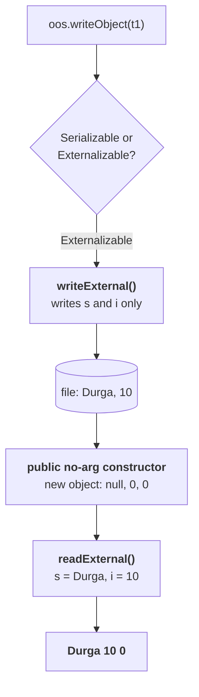

# The externalization program

**Part `12` was the theory. This is it running**, and the output settles four separate questions at once.

```java
import java.io.*;

class ExternalizableDemo implements Externalizable {

    String s;
    int i, j;                                   // three properties

    public ExternalizableDemo() {               // MANDATORY: public, no-arg
        System.out.println("public no-arg constructor");
    }

    public ExternalizableDemo(String s, int i, int j) {
        this.s = s;
        this.i = i;
        this.j = j;
    }

    public void writeExternal(ObjectOutput out) throws IOException {
        out.writeObject(s);                     // save s
        out.writeInt(i);                        // save i
    }                                           // j is NOT saved

    public void readExternal(ObjectInput in) throws IOException, ClassNotFoundException {
        s = (String) in.readObject();
        i = in.readInt();
    }
}
```

**Three properties, and only two of them are written.** The object contains three variables — maybe 1,000 also — but I require only `s` and `i`. That's why only `s` and `i` we are saving to the file.

> [!important] **Note the two constructors and why both exist.** The **parameterised** one is for you, to build the object. The **public no-arg** one is for the JVM, at deserialization time — it is never called by your code, and the print statement inside it is there purely to prove the JVM calls it.

## The signatures

```java
public void writeExternal(ObjectOutput out) throws IOException;
public void readExternal(ObjectInput in)   throws IOException, ClassNotFoundException;
```

**These are `public`**, because they are interface methods being implemented — the exact opposite of the `private` callbacks in part `07`. **And `ObjectOutput` / `ObjectInput` are interfaces**, the parents of `ObjectOutputStream` and `ObjectInputStream`.

---

# Running it

```java
ExternalizableDemo t1 = new ExternalizableDemo("Durga", 10, 20);
oos.writeObject(t1);

ExternalizableDemo t2 = (ExternalizableDemo) ois.readObject();
System.out.println(t2.s + " " + t2.i + " " + t2.j);
```

Measured on JDK 25:

```
public no-arg constructor
Durga 10 0
```

**Two things in two lines:**

| Observation | What it proves |
|---|---|
| **`public no-arg constructor` printed** | the JVM really does **construct a fresh object** at deserialization |
| **`j` is `0`** | `j` was **never written**, so nothing restored it |

> Whether `j` is zero or non-zero, no problem at all — because as a programmer, our requirement is that the receiver requires only two values: `Durga` and `10`.

## Tracing the write

> **Whenever we are serializing `t1`, the JVM checks whether the class implements `Serializable` or `Externalizable`.**

| The class implements | What the JVM does |
|---|---|
| `Serializable` | saves the **total object** |
| **`Externalizable`** | the programmer requires only one or two properties — **calls `writeExternal()`** |

## Tracing the read

> **The JVM creates a separate new object by executing the public no-argument constructor.** At that moment all three fields hold their defaults — `null`, `0`, `0`. **Then `readExternal()` is called on that object**, and it replaces `null` with `Durga` and the first `0` with `10`.

**`j` is never touched, so it keeps the `0` the constructor left it with.**



---

# The same class as `Serializable`

**Change one word — `implements Serializable` — and remove nothing else.** Measured on JDK 25:

```
--- same class but Serializable:
   Durga 10 20
```

| | `Externalizable` | `Serializable` |
|---|---|---|
| Output | **`Durga 10 0`** | **`Durga 10 20`** |
| No-arg constructor called? | ✅ **yes** | ❌ **no** |
| What the file held | **two** values | **the whole object** |

> [!important] **The constructor line does not print in the `Serializable` version, and that is the cleanest possible proof of the difference.** What is the reason? Because the file contains the total object — there is nothing to construct, so nothing is constructed. **Part `02`'s deep dive said deserialization skips your constructor; this is the exception, and the reason for the exception.**

## And without the public no-arg constructor

**Remove it from the `Externalizable` version** and, as part `12` established:

```
java.io.InvalidClassException: ... no valid constructor
```

**Remove it from the `Serializable` version and nothing happens at all** — it was never needed.

---

# `transient` plays no role in externalization

**His last point, and it is a good interview question.**

```java
class ExtDemo implements Externalizable {
    transient String s;
    transient int i, j;          // EVERY field transient
    …
}
```

Measured on JDK 25:

```
--- Externalizable with EVERY field transient:
   Durga 10 0
```

**Identical to the version with no `transient` at all.** For contrast, the same fields under `Serializable`:

```
--- Serializable with transient s and i:
   null 0 20
```

> **`transient` will play a role in serialization, but it won't play any role in externalization.**

> [!important] **The reasoning is a one-liner, and it is the answer to give.** Who is responsible to save the data? The programmer. If you don't want to save the value of a particular variable — **don't save that variable**. Everything is in the programmer's hand. What is the need of using the `transient` keyword?
>
> **`transient` is an instruction to the default machinery**, and in externalization the default machinery never runs. **Using it is harmless but meaningless.**

---

# The differences demonstrated

| | **`Serializable`** | **`Externalizable`** |
|---|---|---|
| What is saved | the **total object** | **only what you write** |
| Output here | `Durga 10 20` | **`Durga 10 0`** |
| Public no-arg constructor | **not required**, not called | **required**, **always called** |
| Missing it | no problem | **`InvalidClassException`** |
| `transient` | **works** | **no effect** |
| Who does the work | the **JVM** | the **programmer** |

---

# What this part established

| | |
|---|---|
| The class implements | **`Externalizable`** |
| It needs | a **public no-arg** constructor **and** a parameterised one |
| Method signatures | **`public void writeExternal(ObjectOutput)`** / **`readExternal(ObjectInput)`** |
| Note they are | **`public`** — interface methods, unlike the `private` callbacks of part `07` |
| Three fields, two written | `s` and `i`; **`j` is skipped** |
| Measured output | **`public no-arg constructor`** then **`Durga 10 0`** |
| The constructor line proves | the JVM **constructs** the object rather than restoring it |
| `j = 0` proves | nothing was written for it |
| Same class as `Serializable` | **`Durga 10 20`**, and **no constructor call** |
| `transient` under externalization | **no effect at all** |
| Why | `transient` instructs the **default machinery**, which never runs |
| The one-line answer | if you don't want to save it, **don't write it** |
