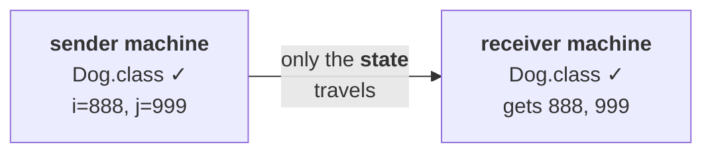

# `serialVersionUID`

> [!info] **Why this part exists at all.** Several students asked: sir, can you please explain about `serialVersionUID`? My very common answer was — internally the JVM is going to take care, we are not required to worry about that.
>
> I told this answer to almost around hundreds of students. **Because even I don't know that.**
>
> One fine day a student came and asked the same question. Same routine answer. Then that student told: **sir, today I went to the interview, and the interview person asked, can you please explain about `serialVersionUID`? I was not in a position to answer.**
>
> Then compulsorily I was required to explain. I told, right — tomorrow I will explain, can you please come. **Then I opened Google.** And once I started digging into this concept, I got the feeling: why did I ignore this for the last eight or nine years? **That much beautiful a concept.**
>
> **Every Java programmer, every time we are serializing, should worry about `serialVersionUID`.**

---

# The facts it rests on

**Five things about sender and receiver, established before the mechanism makes sense.**

## They need not be the same

> **In serialization and deserialization, the sender and the receiver need not be the same person, need not be from the same location, and need not use the same machine.**

> In the morning some X person is serializing; in the evening some Y person is deserializing. Or from UK the sender is serializing, and from India I am trying to deserialize.

| | |
|---|---|
| **Sender** | X person · UK · **Unix, JDK 1.6** |
| **Receiver** | Y person · India · **Windows, JDK 1.8** |

## Each side runs different code

**At the sender side, serialization code executes:**

```java
Dog d1 = new Dog();
oos.writeObject(d1);
```

**At the receiver side, deserialization code executes:**

```java
Dog d2 = (Dog) ois.readObject();
```

## And both need the `.class` file

**To run either of those lines, `Dog.class` must be present on that machine.**

> **In serialization and deserialization, the `.class` file should be available on the sender machine and the receiver machine at the beginning only. Just the state of the object travels from sender to receiver — not the `.class` file.**

## The objection, and the answer

> Then you may have a bigger doubt — sir, the `.class` file is there, the receiver can create the object directly. What is the need of taking it from a remote file or from the network?

**Because the class gives you the code, not the values.**

```java
class Dog { int i = 10; int j = 20; }

Dog d1 = new Dog();
d1.i = 888;              // updated from a database
d1.j = 999;
```

> Even though that `.class` file is there — if you create an object, what values are you going to get? **10 and 20 only, but not 888 and 999.** The updated values the receiver has to get from the file or from the network only.



---

# The mechanism

> **At the time of serialization, with every object, the sender-side JVM will save one unique identifier. This identifier is generated by the sender-side JVM based on the `.class` file.**

> **At the time of deserialization, the receiver-side JVM will compare that object's unique ID with the local class's unique ID. If both match, then only will deserialization happen.**

**His dialogue for it:**

> The object won't be deserialized directly. Receiver-side JVM will ask: **hey object, you belong to which class?** — Yes boss, I belong to the Dog class. — **You should have some ID. What is that ID?** — 101. Immediately the receiver-side JVM checks the local class's unique ID. Is it 101 or not?

| Outcome | |
|---|---|
| **Match** | Yes boss, you are my required object — I can deserialize. |
| **Mismatch** | You are not my required object → **`InvalidClassException`** |

> **This unique ID is nothing but the `serialVersionUID`.**

| Question | Answer |
|---|---|
| Who **generates** it? | the **sender-side JVM**, from the `.class` file |
| Who **uses** it? | the **receiver-side JVM**, to check the object is the right one |
| What travels with the object? | **the state, plus this one unique ID** |

---

# Seeing it happen

**Two versions of the same class, one field apart:**

```java
// v1 — what the sender compiled against
public class Dog implements Serializable {
    public int i = 10;
    public int j = 20;
}

// v2 — what the receiver has
public class Dog implements Serializable {
    public int i = 10;
    public int j = 20;
    public int k = 30;          // ONE field added
}
```

Measured on JDK 25:

```
=== sender uses v1:
wrote  serialVersionUID = -4370522500503404182

=== receiver uses v1 (same class):
local  serialVersionUID = -4370522500503404182
deserialized: 888 999

=== receiver uses v2 (one field added):
local  serialVersionUID = -1320636198254596889
-> java.io.InvalidClassException
   Dog; local class incompatible: stream classdesc serialVersionUID = -4370522500503404182,
   local class serialVersionUID = -1320636198254596889
```

> [!important] **Adding one unused field changed the identity of the class completely.** The two numbers share no relationship — the UID is a hash, so any change scrambles it. **And the exception prints both numbers**, which is what makes this failure diagnosable in production: `stream classdesc serialVersionUID` is the sender's, `local class serialVersionUID` is yours.

---

# The three problems with the default

> If we are depending on the default `serialVersionUID` generated by the JVM, there are several problems.

## Problem 1 — both sides must use the same JVM

**Sender on Unix, JDK 1.6, generates `101`. Receiver on Windows, JDK 1.8** — even though the `.class` file is the same, is there any guarantee it's going to generate the same 101? **It may generate a different number. Different JVM, different vendor.**

**Result: `InvalidClassException`, with identical source code on both sides.**

> **Both sender and receiver should use the same version of JVM, with respect to vendor and version.**

## Problem 2 — both sides must use the same `.class` file version

**This is the one measured above.** After serialization, the receiver-side `.class` file got modified — someone added `int k = 30`. **Same JVM, same source, one new field, and deserialization fails.**

> **Both sender and receiver should use the same `.class` file version.**

> [!warning] **This is the practical killer, and it is a versioning problem, not a distribution problem.** A file written by version 1 of your application cannot be read by version 2 **if anyone added a field** — and adding a field is the most ordinary change there is. **Old data becomes unreadable by new code.**

## Problem 3 — performance

> **To generate the `serialVersionUID`, the JVM will internally use some complex algorithm, which may create performance problems.**

**It is a hash over the class name, modifiers, interfaces, and every field and method signature** — computed at runtime, per class.

---

# The conclusion

> **Don't give the chance to the JVM to generate the `serialVersionUID`. We have to configure our own.**

**How to do that is part `16`.**

---

# What this part established

| | |
|---|---|
| Sender and receiver | need not be the **same person**, **location**, or **machine** |
| Sender runs | **serialization** code; receiver runs **deserialization** code |
| The `.class` file | must be on **both** machines, beforehand |
| What travels | **only the object's state** — never the `.class` file |
| Why the class alone isn't enough | it gives you `10, 20`, not the **updated** `888, 999` |
| At serialization the JVM saves | a **unique ID** with every object |
| Generated from | the **`.class` file**, by the **sender-side** JVM |
| At deserialization | the **receiver-side** JVM compares it with the **local class's** ID |
| Match | deserialization proceeds |
| Mismatch | **`InvalidClassException`** |
| That unique ID is | the **`serialVersionUID`** |
| Problem 1 | both sides need the **same JVM version and vendor** |
| Problem 2 | both sides need the **same `.class` file version** |
| Measured | **one added field** → completely different UID → failure |
| Problem 3 | generating it uses a **complex algorithm** — performance |
| The exception message | prints **both** UIDs — stream's and local |
| The fix | **configure your own `serialVersionUID`** |
