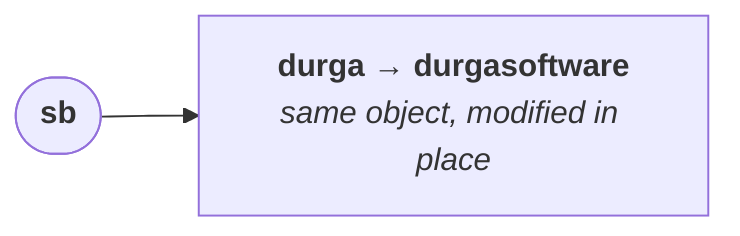
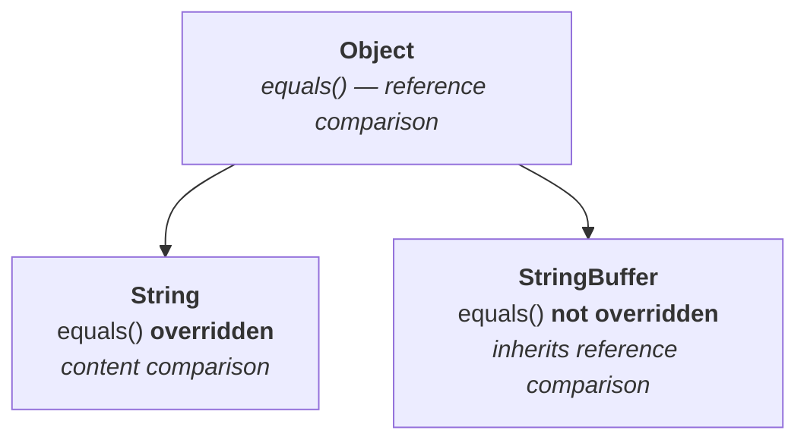

# Why this concept sits above the rest

Of every object type in Java, `String` is the one you cannot avoid. Take any Java project — small, large, it does not matter — and count the objects. If a thousand objects are in play, **more than nine hundred of them are `String` objects**, and fewer than a hundred are anything else. Without `String` you cannot do anything in day-to-day programming.

That gives the topic three separate claims on your attention: **day-to-day coding**, where it is unavoidable; **the interview room**, where the first question is very often this one; and **certification**, where you can expect around twenty questions drawn from `String` and `StringBuffer` directly or indirectly.

> [!important] **The compulsory interview question.** *"What is the difference between `String` and `StringBuffer`?"* — asked of anyone with two, three or more years of experience, effectively without exception. You cannot expect a Java interview that does not touch it.

Order matters here. The certification syllabus lists `String` under `StringBuilder`, but `StringBuilder` cannot be explained until `StringBuffer` is, and `StringBuffer` cannot be explained until `String` is. So the sequence is **`String` → `StringBuffer` → `StringBuilder`**.

---

# Difference one — immutability versus mutability

Ask the difference between `String` and `StringBuffer` in an offline session of a hundred people, and **ninety of them answer immediately**: *String objects are immutable, StringBuffer objects are mutable.* They have read it somewhere in an FAQ list and remembered the two words.

Then comes the follow-up — *"What is the meaning of mutability and immutability? Can you explain with an example?"* — and **ninety percent of the wickets are down.**

So take the words first, and then earn them with an example.

| Word | Meaning |
|---|---|
| **immutable** | non-changeable — you cannot change it |
| **mutable** | changeable — you are happily allowed to modify it |

> Once we create a `String` object, we **can't change its content**. That is why `String` objects are immutable.

> Once we create a `StringBuffer` object, we can **happily perform the required changes** in that object, no problem at all. That is why `StringBuffer` objects are mutable.

## The example that answers it

Two programs, deliberately parallel. Note first which method belongs to which class — **`concat` is `String`'s, `append` is `StringBuffer`'s**, and they are not interchangeable.

```java
String s = new String("durga");
s.concat("software");
System.out.println(s);
```

```java
StringBuffer sb = new StringBuffer("durga");
sb.append("software");
System.out.println(sb);
```

Before reading on, answer both. If you can, you are genuinely comfortable with mutable and immutable.

Measured on JDK 25:

```
durga
durgasoftware
```

**The `String` did not change.** That is the whole lesson.

## Walking the first one

`String s = new String("durga")` — `s` points to an object holding `durga`.

Then `s.concat("software")` is called. `String` is immutable, so **no change is permitted in the existing object**. The concatenation still happens, but with those changes **a new object is created**, holding `durgasoftware`.

And now the part people miss: **that new object is not assigned to any reference variable.** The result of `s.concat(...)` was discarded. With no reference to it, the new object is immediately **eligible for garbage collection**, and `s` is still pointing at `durga`, untouched.

```mermaid
flowchart LR
    S(["<b>s</b>"]) --> A["<b>durga</b><br/><i>unchanged</i>"]
    A -.->|"s.concat(\"software\")<br/>creates a new object"| B["<b>durgasoftware</b><br/><i>no reference →<br/>eligible for GC</i>"]
```

So the output is `durga`. **This non-changeable behaviour is immutability.**

## Walking the second one

`StringBuffer sb = new StringBuffer("durga")` — `sb` points to an object holding `durga`.

`sb.append("software")` — `StringBuffer` is mutable, so the change is made **in the existing object itself**. No new object. `software` is added right there, and `sb` now holds `durgasoftware`.



Output: `durgasoftware`. **This changeable behaviour is mutability.**

> [!important] **This is the example to give in the interview room.** Not a definition — these two four-line programs. They answer *"what is the difference between `String` and `StringBuffer`"* and *"explain mutability and immutability with an example"* in one move, which is two or three questions answered confidently from a single piece of preparation.

---

# Difference two — `equals()` behaves differently in the two classes

Almost everyone stops at mutability. So when the interviewer says *"other than immutability and mutability, is there any other difference?"*, having a second answer is worth a great deal — and there is one.

## The program

```java
String s1 = new String("durga");
String s2 = new String("durga");
System.out.println(s1 == s2);
System.out.println(s1.equals(s2));

StringBuffer sb1 = new StringBuffer("durga");
StringBuffer sb2 = new StringBuffer("durga");
System.out.println(sb1 == sb2);
System.out.println(sb1.equals(sb2));
```

Measured on JDK 25:

```
false
true
false
false
```

**The third and fourth lines are the surprise.** Same shape of code, same contents, and `equals()` gives a different answer depending on the class.

## `==` first, because it is the easy half

> The `==` operator is **always** meant for **reference comparison** (address comparison). If both references point to the same object it returns `true`; otherwise `false`.

Both programs used `new` twice, so both created two distinct objects. Neither pair points at the same object, so `==` is `false` in both cases. **`==` behaves identically for `String` and `StringBuffer`** — there is no difference to learn here.

## `.equals()` is where the difference lives

Ask a thousand people the difference between `==` and `.equals()`, and **at least 999 will say**: *`==` is reference comparison, `.equals()` is content comparison.*

> [!warning] **Strictly speaking, that statement is wrong**, and knowing why is the point of this section.

`equals()` is not born doing content comparison. It comes from `Object`:



> `Object` class's `equals()` method is meant for **reference comparison** — exactly the same as `==`. If both references point to the same object it returns `true`, otherwise `false`.

Content comparison only appears when a **child class overrides it**. `String` overrides `equals()` for content comparison. **`StringBuffer` does not.**

So:

- `s1.equals(s2)` — `s1` is a `String`, so **`String`'s** `equals()` runs. Content comparison. Both hold `durga`, so **`true`**, even though the objects are different.
- `sb1.equals(sb2)` — `sb1` is a `StringBuffer`, `StringBuffer` never overrode it, so **`Object`'s** `equals()` runs. Reference comparison. Two different objects, so **`false`**, even though the content is identical.

| | `==` | `.equals()` |
|---|---|---|
| **`String`** | reference comparison → `false` | **content** comparison → `true` |
| **`StringBuffer`** | reference comparison → `false` | **reference** comparison → `false` |

> [!important] **State it precisely and you separate yourself immediately.** `equals()` in `Object` is reference comparison. It is *not* inherently about content — a class has to override it to make it so, and `String` did while `StringBuffer` did not. If you want content comparison in your own class, you write it yourself.

> [!info] **Why `StringBuffer` never overrode it** is worth a thought, even though the course does not ask. `StringBuffer` is mutable, so its contents change over time. An object whose equality answer changes during its lifetime is unusable as a hash key and surprising everywhere else — so leaving equality as identity is the safer design. `String` can afford content equality precisely *because* it is immutable.

---

# What this part established

| | |
|---|---|
| Most commonly used object in any Java project | **`String`** — over 900 of every 1000 objects |
| `String` objects are | **immutable** — content cannot be changed after creation |
| `StringBuffer` objects are | **mutable** — changed in place |
| Attempting a change on a `String` | creates a **new object**; the original is untouched |
| The method on each | `concat()` for `String`, `append()` for `StringBuffer` |
| `==` on either class | **reference** comparison — no difference between them |
| `.equals()` on `String` | **content** comparison — overridden |
| `.equals()` on `StringBuffer` | **reference** comparison — *not* overridden, so `Object`'s runs |
| `equals()` in `Object` itself | **reference** comparison, not content |
