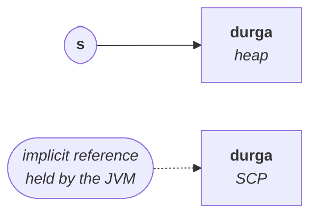
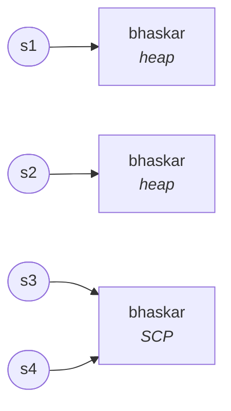

# The most dangerous line in the chapter

Almost everything that follows rests on one comparison. Two lines that look like they do the same thing, and do not:

```java
String s = new String("durga");
String s = "durga";
```

> In the **first** case, **two objects** will be created. In the **second** case, **only one object** will be created.

That single fact is where the whole heap-versus-pool discussion begins, and the rest of this note is examples that make it usable.

## Why two, in the first case

**`new` always creates an object on the heap.** Whenever we use the `new` operator, compulsorily a new object is created in the heap area, holding `durga`, and `s` points to it.

But `"durga"` inside those brackets is a **string literal** — and for every string literal, one copy is placed in the **SCP** (**String Constant Pool**), for future purposes.

That SCP object has **no explicit reference variable**. Instead an **implicit reference is maintained by the JVM**.



**`s` always points to the heap object**, never to the pool one.

> [!important] **The SCP object is not eligible for garbage collection.** It has no reference **you** wrote, so it looks unreachable — but the JVM maintains an implicit reference to every object created because of a string literal. That is what keeps it alive, and it is why the pool can still be there to reuse later.

## Why one, in the second case

`String s = "durga"` has no `new`, so nothing is forced onto the heap. The literal needs a pool object — and **object creation in the SCP is always optional**:

> First the JVM checks whether an object with the required content is **already** in the pool. If it is, that existing object is **reused** instead of creating a new one. Only if it is not already there is a new object created.

So one object, in the SCP, and `s` points straight to it.

---

# The three rules that decide where an object is born

Every example in this note is these three rules applied to a different line. Learn them and you can count the objects in any snippet on sight.

> [!important] **The three rules.**
> **1.** For every use of **`new`** — a new object, **always**, in the **heap**. No checking, no reuse. **2.** For every **string literal** — one copy in the **SCP**, but **only if it is not already there**. **3.** Because of a **runtime operation** (a method call such as `concat`), if a new object is required, it is created **only in the heap**, never in the SCP.

The consequence, and it is asked directly:

> There **may** be a chance of two objects with the same content existing on the **heap**. There is **no** chance of two objects with the same content existing in the **SCP** — duplicates are not allowed there.

Measured on JDK 25:

```java
String a = "bhaskar", b = "bhaskar";
System.out.println(a == b);          // true  — same pooled object

String h1 = new String("bhaskar"), h2 = new String("bhaskar");
System.out.println(h1 == h2);        // false — two distinct heap objects
```

```
true
false
```

> [!info] **Where the pool physically lives, and this part has changed.** Until **1.6**, the SCP was part of the **method area** — the **PermGen**, permanent generation — and it was a **fixed size**. From **1.7 onwards**, for efficient memory utilisation, the SCP was **moved into the heap**, where it can expand.
>
> This is one of the rare places where the course is bang up to date: he states the move correctly. Worth adding is what happened next — **PermGen was removed entirely in Java 8** and replaced by Metaspace, so on any JDK you will actually run, the pool is in the heap. Verified as still true on JDK 25. It also means interned strings **are** collectable now, which they were not in the PermGen days.

---

# Example 1 — counting across four declarations

```java
String s1 = new String("bhaskar");
String s2 = new String("bhaskar");
String s3 = "bhaskar";
String s4 = "bhaskar";
```

Guess before reading: how many objects in total, and how many in each area?

**Line 1.** `new` → heap object `bhaskar`, `s1` points to it. Literal → SCP copy. **Two objects.**

**Line 2.** `new` → a second heap object, `s2` points to it. Literal → but `bhaskar` is **already** in the SCP, so nothing is added. **One new object.**

**Line 3.** No `new`. Needs an SCP object — already there, so it is **reused**. `s3` points to the existing pool object. **Nothing created.**

**Line 4.** Same. `s4` also points to that same pool object. **Nothing created.**



**Three objects total — two in the heap, one in the SCP.** Two heap objects with identical content, which is allowed; only one in the pool, because duplicates there are not.

---

# Example 2 — a runtime operation enters the picture

```java
String s = new String("durga");
s.concat("software");
s = s.concat("solutions");
```

**Line 1.** Heap `durga` (`s` points to it) + SCP `durga`. **Two objects.**

**Line 2.** `"software"` is a literal, so it gets an SCP copy — **that happens first**. Then `s.concat("software")` runs, which is a **runtime operation**, and it produces `durgasoftware`. By rule 3 that object goes **only in the heap**, never the pool. It is assigned to nothing, so it is immediately **eligible for GC**. **Two more objects.**

**Line 3.** `"solutions"` is a literal → SCP copy. `s.concat("solutions")` — `s` is still `durga`, so the result is `durgasolutions`, created in the **heap**. This time it **is** assigned, so `s` now points to it. **Two more objects.**

| Area | Objects |
|---|---|
| **Heap** | `durga`, `durgasoftware` (eligible for GC), `durgasolutions` |
| **SCP** | `durga`, `software`, `solutions` |

**Six objects — three in the heap, three in the SCP.** Two of the heap objects are eligible for garbage collection; none of the SCP ones are.

Measured on JDK 25:

```
durgasolutions
```

> [!important] **Notice what the SCP filled up with.** `software` and `solutions` are in the pool **as literals**, not as results. The pool holds string **constants** — things written in the source — and never holds anything produced by a runtime operation. That is rule 3, and it is the rule people forget when counting.

---

# Example 3 — the same shape, one more link

```java
String s1 = new String("spring");
s1.concat("fall");
String s2 = s1.concat("winter");
s2.concat("summer");
System.out.println(s1);
System.out.println(s2);
```

Nothing new is needed here — it is the three rules again. Count before reading.

**Line 1.** Heap `spring` (`s1`), SCP `spring`. **Two.**

**Line 2.** SCP `fall`. Runtime concat → heap `springfall`, unassigned, **eligible for GC**. **Two.**

**Line 3.** SCP `winter`. Runtime concat on `s1` (still `spring`) → heap `springwinter`, assigned to `s2`. **Two.**

**Line 4.** SCP `summer`. Runtime concat on `s2` → heap `springwintersummer`, unassigned, **eligible for GC**. **Two.**

**Eight objects — four in the heap, four in the SCP.** Two of the four heap objects are eligible for collection.

Measured on JDK 25:

```
spring
springwinter
```

`s1` never moved — the `concat` on line 2 was discarded. `s2` caught line 3's result and then ignored line 4's.

---

# Example 4 — the full proof, with compile-time constants

This is the one to practise on paper. It is long deliberately, and it introduces the one genuinely new idea in this note.

```java
String s1 = new String("you cannot change me!");
String s2 = new String("you cannot change me!");
System.out.println(s1 == s2);

String s3 = "you cannot change me!";
System.out.println(s1 == s3);

String s4 = "you cannot change me!";
System.out.println(s3 == s4);

String s5 = "you cannot " + "change me!";
System.out.println(s3 == s5);

String s6 = "you cannot ";
String s7 = s6 + "change me!";
System.out.println(s3 == s7);

final String s8 = "you cannot ";
String s9 = s8 + "change me!";
System.out.println(s3 == s9);
System.out.println(s6 == s8);
```

Measured on JDK 25:

```
false
false
true
true
false
true
true
```

> [!info] **An aside he makes while writing the content out.** You cannot change me is fine for a `String` and poor advice for a person — be flexible, be adaptable, change with the time. Immutability is a property you want in a string constant and not a personality trait.

## Working through it

**`s1 == s2` → `false`.** Two `new`s, two heap objects. The SCP copy is made once on line 1 and reused on line 2, but neither `s1` nor `s2` points at it.

**`s1 == s3` → `false`.** `s3` is a literal, so it points at the **pool** object. `s1` points at a **heap** object. Different objects.

**`s3 == s4` → `true`.** The first `true`. Both are literals, and the pool does not hold duplicates, so both point at the same pooled object.

**`s5` is where it gets interesting.**

```java
String s5 = "you cannot " + "change me!";
```

The instinct is: two literals, two pool objects, and a result object on the heap. **That is wrong**, and the reason is a compiler behaviour worth naming.

> If **both arguments are constants**, the operation is performed at **compile time**. It does not wait until runtime.

The same thing you have already seen with numbers — `System.out.println(10 + 20)` is replaced by `30` during compilation, and the JVM only ever sees `30`. Concatenation of two constants works identically: after compilation, that line is simply

```java
String s5 = "you cannot change me!";
```

— an ordinary literal. So the JVM searches the SCP, finds the object already there, and `s5` points at it. **`s3 == s5` → `true`.**

**`s7` breaks it, and the break is the lesson.**

```java
String s6 = "you cannot ";
String s7 = s6 + "change me!";
```

`s6` is a **normal variable**, not a constant. And:

> If **at least one argument is a variable**, the operation is performed at **runtime** only.

A runtime operation creating a new object puts it in the **heap** (rule 3). So `s7` points to a heap object while `s3` points to a pool object. **`s3 == s7` → `false`.**

**`s9` restores it, using `final`.**

```java
final String s8 = "you cannot ";
String s9 = s8 + "change me!";
```

`s8` is not a normal variable — it is **`final`**, which means constant.

> Every **`final` variable is replaced by its value by the compiler**, at compile time.

So by the time concatenation is considered, `s8` is no longer a variable at all; it has already become the literal `"you cannot "`. Now **both arguments are constants**, so the concatenation happens at compile time, exactly as it did for `s5`, and the line collapses to a plain literal. `s9` points at the pooled object. **`s3 == s9` → `true`.**

**`s6 == s8` → `true`**, because both are literals with the same content, and the pool holds one copy.

> [!important] **Two rules generate every line of this program.**
> **1.** Both operands constant → concatenation at **compile time** → the result is a literal → it comes from the **SCP**. **2.** At least one operand a non-final variable → concatenation at **runtime** → the result is a new object in the **heap**.
>
> And **`final` turns a variable back into a constant**, which is why `s7` and `s9` differ by nothing but that one keyword and give opposite answers.

> [!important] **If you decompile this expecting to find `StringBuilder`, you will not.** Runtime `a + b` compiles to a single **`invokedynamic`**, which hands the job to `StringConcatFactory` to build an optimised concatenation at first execution. Older JDKs emitted `new StringBuilder().append(a).append(b).toString()` instead, which is why so much material describes `+` that way.
>
> **Nothing above depends on which one you get.** Compile-time constant folding is a separate mechanism — `s5` and `s9` still resolve during compilation — and every `true`/`false` in this note is the same either way. Verified on JDK 25.

---

# What this part established

| | |
|---|---|
| `new String("x")` creates | **two** objects — one heap, one SCP |
| `String s = "x"` creates | **one** object, in the SCP, and only if not already there |
| `s` in `new String(...)` points to | the **heap** object, always |
| The SCP object is kept alive by | an **implicit reference maintained by the JVM** |
| Duplicates in the heap | **possible** |
| Duplicates in the SCP | **impossible** — existing object is reused |
| A runtime operation's result goes | **only in the heap**, never the SCP |
| Constant `+` constant | folded at **compile time** → result is a literal → SCP |
| Variable `+` constant | performed at **runtime** → result in the heap |
| `final` variable | replaced by its value at compile time — so it counts as a **constant** |
| Where the SCP lives | method area / PermGen until 1.6; **moved into the heap from 1.7** |
