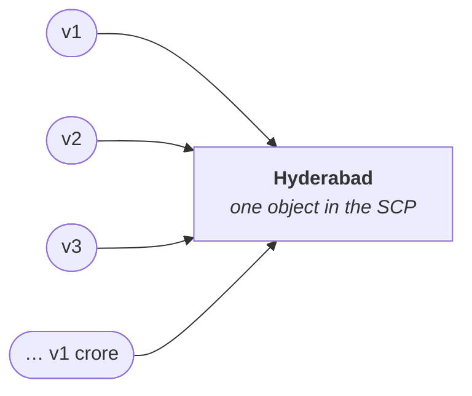
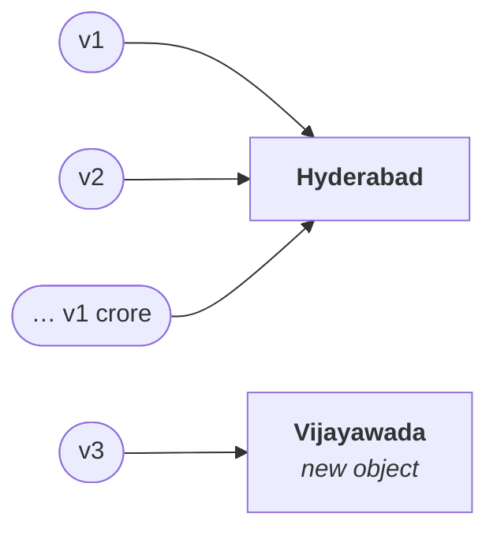

# The importance of the String constant pool

The last note established *where* objects are created. This one answers the question underneath it: **why does a special memory area exist for strings at all?**

The whole argument rests on one claim, and it is worth taking seriously rather than accepting: **in any application, in any programming language, the most commonly used object is the `String` object.**

## The voter registration form

Picture an ordinary voter registration form and list its fields:

| Field | Type |
|---|---|
| Name | `String` |
| Father's name | `String` |
| Mother's name | `String` |
| House number | `String` |
| Street number | `String` |
| Village / city | `String` |
| Mandal | `String` |
| District | `String` |
| State | `String` |
| PIN code | number |
| Identification mark 1 | `String` |
| Identification mark 2 | `String` |

Out of twelve or thirteen fields, **ten or eleven are strings**. And the form is not special — take a college application instead: college name, director name, principal name, every subject name, the roll number. All strings. Only the marks are numbers.

> [!info] **The identification-mark field is not invented.** It is the one on the school certificate — *a mole on the right hand, a mole on the left eyebrow.* Two of them, and both are strings.

So: string objects dominate any real application. That is the premise. Now the problem it creates.

## One crore voters in Hyderabad

The first voter registers and enters the city name **Hyderabad**. One `String` object is created for it.

Now — how many voters are there in Hyderabad? Roughly **one crore**.

If a separate `Hyderabad` object is created for every one of them:

```
voter 1       → "Hyderabad"   (object 1)
voter 2       → "Hyderabad"   (object 2)
voter 3       → "Hyderabad"   (object 3)
   ⋮
voter 1 crore → "Hyderabad"   (object 1,00,00,000)
```

**One crore identical string objects.** Object creation is costly, so performance falls; and memory is simply wasted, since every one of them holds the same characters.

But the city name is the *same* for all of them. So why create it a crore times?

> [!important] **The rule this leads to.** If a `String` object is required repeatedly, it is **never recommended** to create a separate object for every requirement. Create **one** object and share it.

**Create one object; let all one crore references point at it.** In Java that is possible precisely because of the SCP.



When the second voter's city is also Hyderabad, the object created a moment ago is **reused**. No new object.

> [!important] **The advantage of the SCP, stated the way it should be said in an interview.** In the SCP, a **single object can be referenced by multiple references**. So instead of creating one crore objects, one object with one crore references is enough. **Performance improves and memory utilisation improves.** If asked why the SCP is needed, take the voter registration form and explain it exactly like this — the interviewer will be convinced.

---

# The problem with the SCP, and where immutability comes from

There is a universal rule: **if you gain something, you must lose something.** The SCP gains performance and memory. What does it cost?

Go back to the picture. **One** `Hyderabad` object. **One crore** references pointing at it.

Now voter 3 gets transferred and wants to change his city from Hyderabad to Vijayawada. He opens his account and edits the field.

**If he were allowed to change the content of that object**, how many references would be affected?

**All one crore of them.**

Every other voter's city name would change too. You would check your city in the morning and it would say Hyderabad; ten minutes later, Vijayawada; ten minutes after that, something else — each time a different voter somewhere edited their own record. Forget the memory benefit and the performance benefit: **the application is now behaving abnormally.**

## The fix

The Java designers analysed exactly this and came up with immutability.

> Once we create a `String` object, we are **not allowed to change its content**. If any person tries to change it, **with those changes a new object is created**, and only *that* reference is reassigned. All the remaining references still point at the original object.



Voter 3 gets his change. Nobody else is touched.

> [!important] **This is the causal chain, and it is the answer to "why are `String` objects immutable?"**
>
> **SCP → the same object is shared by many references → one reference changing it would affect all of them → therefore `String` must be immutable.**
>
> Immutability is not a virtue Java decided strings should have. It is the **price of the pool**. Without the SCP — without object reuse — immutability would not be required at all.

---

# Three questions this sets up, all asked in interviews

## 1. Why is SCP available only for `String` and not for `StringBuffer`?

Suppose you go to the same bar every evening. One day you forget your wallet. Will they still serve you? Of course — you are a regular. *No problem sir, pay tomorrow, or settle it at month end.*

Now suppose you go **once a year**. You turn up, you have forgotten your money, and you ask for the same favour. You will be looked at from top to bottom, and refused.

> **Special privileges are available only for regular customers.**

That is the whole answer.

- **`String` is the regular customer** — the most commonly used object in Java, in every application without exception. So Java's designers gave it special privileges: a specially designed memory area with special memory management.
- **`StringBuffer` is not.** In twenty thousand lines of code you might use it once, or never. There are plenty of applications with no `StringBuffer` in them at all. **There is no application without `String`.**

So a special memory area is justified for one and not the other.

## 2. Why are `String` objects immutable while `StringBuffer` objects are mutable?

This follows directly from the chain above.

**For `String`:** because of the SCP, the same object is reused across many references. If one reference could change the content, all the others would be affected. To prevent that, `String` must be immutable.

**For `StringBuffer`:** there is **no SCP for `StringBuffer`**. No pool means no reuse, which means **every time, a separate object is created**.

```java
StringBuffer s1 = new StringBuffer("durga");   // its own object
StringBuffer s2 = new StringBuffer("durga");   // a different object
```

Change the content through `s1` and there is no effect on anything else, **because every reference has its own object**. Nobody is sharing, so nobody can be surprised. Immutability is not required, so `StringBuffer` does not have it.

| | `String` | `StringBuffer` |
|---|---|---|
| SCP / object reuse | **yes** | no |
| One object shared by many references | **yes** | no — one object each |
| A change through one reference would affect others | **yes** | no |
| Therefore immutability is | **required** | not required |

> [!important] **Answer it as a consequence, not as a pair of facts.** *"`String` is immutable because of the SCP; `StringBuffer` has no SCP, so every reference has its own object and there is nothing to protect."* That is one sentence and it explains both halves.

## 3. Besides `String`, are any other objects immutable in Java?

Yes — **all wrapper class objects are immutable**. `Integer`, `Character`, `Boolean`, and the rest.

And the reason rhymes with the string case: in wrapper classes too, **up to a certain range the same object is reused**. Where objects are shared, immutability follows.

> [!info] **The range he alludes to is worth naming, since it is asked separately.** `Integer` caches the values **−128 to 127**, so `Integer a = 127, b = 127;` gives `a == b` as `true`, while at `128` it becomes `false`. Same reasoning as the SCP — shared objects must not be mutable — applied to a small band of common values. This is checked directly in certification questions and is verified behaviour on JDK 25.

---

# What this part established

| | |
|---|---|
| Why a special memory area exists for strings | `String` is the **most commonly used object** in any application |
| The advantage of the SCP | **one object, many references** — performance and memory utilisation both improve |
| The disadvantage of the SCP | a change through one reference would **affect every other reference** |
| How Java prevents that | **immutability** — a change creates a new object instead |
| So immutability exists because of | the **SCP**. No pool, no need for it |
| Why the SCP is only for `String` | `String` is the **regular customer**; `StringBuffer` is rarely used, so no special privileges |
| Why `StringBuffer` is mutable | no SCP → **no sharing** → nothing to protect |
| What else is immutable in Java | **all wrapper class objects** |
