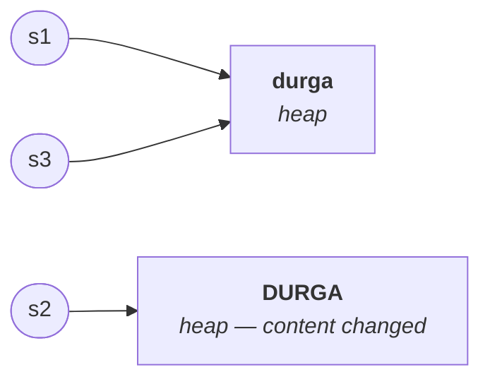
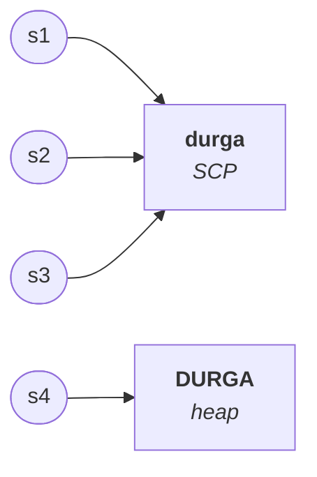

# The loophole in immutability

You already know the rule: once a `String` object is created, its content cannot be changed, and an attempted change produces a new object instead.

There is a second half to that rule which almost nobody states, and it is where the certification questions live.

> If there is a **change** in the content, a new object is created.
> If there is **no change** in the content, **the existing object is reused.**

The method being called is not what decides it. **The outcome decides it.** Call a method that would change nothing, and you get the same object back.

> [!important] **And the rule is the same whether the object is on the heap or in the SCP.** That is the sentence to carry — the two examples below differ only in where the starting object lives, and the rule does not change.

## Example 1 — starting from the heap

```java
String s1 = new String("durga");
String s2 = s1.toUpperCase();
String s3 = s1.toLowerCase();

System.out.println(s1 == s2);
System.out.println(s1 == s3);
```

**`s1.toUpperCase()`** — `durga` becomes `DURGA`. **The content changed**, so a new object is created. Being the result of a runtime operation it goes in the **heap**, and `s2` points at it.

**`s1.toLowerCase()`** — `durga` is already lowercase. **Nothing changed.** So no new object is created; `s3` is simply pointed at the existing object.



Measured on JDK 25:

```
false
true
```

## Example 2 — starting from the SCP

```java
String s1 = "durga";
String s2 = s1.toString();
String s3 = s1.toLowerCase();
String s4 = s1.toUpperCase();

System.out.println(s1 == s2);
System.out.println(s1 == s3);
System.out.println(s1 == s4);
```

`s1` is a literal, so the object is in the **SCP**.

**`s1.toString()`** — a `String` converted to a `String`. There is nothing to do. **No change**, so the existing object is reused.

**`s1.toLowerCase()`** — already lowercase. **No change**, existing object reused.

**`s1.toUpperCase()`** — `DURGA` is different. **Change**, so a new object — and because it comes from a runtime operation it is created in the **heap**, not the pool.



Measured on JDK 25:

```
true
true
false
```

> [!important] **How to answer any question of this shape.** One question, asked once per line: *does this operation change the content?*
> **Yes** → new object, in the **heap**, new reference.
> **No** → the **existing object is reused**, wherever it happens to live.

---

# Creating your own immutable class

> *"Is it possible to create our own immutable class?"* — **yes.** *"Explain with an example."*

This is one of the most valuable questions in the room, and it is really a test of whether you understood the rule above, because you are about to implement it yourself.

## The program

```java
final class Test {
    private int i;

    Test(int i) {
        this.i = i;
    }

    public Test modify(int i) {
        if (this.i == i) {
            return this;
        }
        else {
            return new Test(i);
        }
    }
}
```

```java
Test t1 = new Test(10);
Test t2 = t1.modify(100);
Test t3 = t1.modify(10);

System.out.println(t1 == t2);
System.out.println(t1 == t3);
```

Measured on JDK 25:

```
false
true
```

## Why it works

**`t1.modify(100)`** — the current object's `i` is 10, the argument is 100. **They differ, so the content would change.** You are not allowed to change the existing object, so a **new `Test` object** is created with `i = 100` and returned. `t2` points at it, and `t1` is untouched. → `t1 == t2` is **`false`**.

**`t1.modify(10)`** — the current object's `i` is 10 and the argument is 10. **No change.** So there is no reason to create anything; **`return this`** hands back the current object. `t3` and `t1` are the same object. → `t1 == t3` is **`true`**.

The entire immutability behaviour is those two branches:

```java
if (this.i == i) return this;              // no change → reuse
else             return new Test(i);       // change    → new object
```

> [!important] **`modify()` is what makes the class immutable** — not any keyword. Every method in `String` is implemented in exactly this style: if the content would change, build and return a new object; if not, return the existing one. That is *why* `String` is immutable.

## Why the class is `final`

Once you have written a class nobody is allowed to change, you must also stop anyone from **subclassing** it and overriding `modify()` to do something else. Marking the class `final` closes that door.

> **All immutable classes are declared `final`.** `String` is a `final` class. All wrapper classes are `final`, because they are immutable too.

---

# `final` versus immutability

Here is a misunderstanding worth dismantling, because it sounds plausible.

Since `String` is immutable and `StringBuffer` is mutable — **can I make a `StringBuffer` immutable by declaring its reference `final`?**

**No.** And the two ideas are not related at all.

> **`final` applies to variables. Immutability applies to objects.** Declaring a reference variable `final` gives you **no immutability whatever.**

## The proof

```java
final StringBuffer sb = new StringBuffer("durga");
sb.append("software");
System.out.println(sb);
```

If `final` produced immutability, the content could not change. Measured on JDK 25:

```
durgasoftware
```

**The content changed.** `sb` is `final` and the object was modified anyway — ordinary `StringBuffer` behaviour, entirely unaffected.

## So what does `final` actually do?

It prevents **reassignment of the reference variable**. You cannot point it at a different object.

```java
final StringBuffer sb = new StringBuffer("durga");
sb.append("software");          // ✅ fine — changing the object
sb = new StringBuffer("ravi");  // ❌ compile-time error — changing the variable
```

Measured on JDK 25:

```
E.java:5: error: cannot assign a value to final variable sb
        sb = new StringBuffer("ravi");
        ^
1 error
```

> [!important] **The distinction in one line.**
> **`final`** → you cannot **reassign the variable**. The object is entirely open to change.
> **Immutable** → you cannot **change the object**. The variable is entirely free to be reassigned.
>
> They constrain opposite things, which is why one can never substitute for the other.

## The four phrases, and which two are meaningful

A small question built on exactly this:

| Phrase | Meaningful? | Why |
|---|---|---|
| **`final` variable** | ✅ **valid** | reassignment is prevented |
| `final` object | ❌ invalid | no such concept — `final` is not about objects |
| immutable variable | ❌ invalid | no such concept — immutability is not about variables |
| **immutable object** | ✅ **valid** | the object's content cannot be changed |

**`final` is a word for variables. Immutable is a word for objects.**

> [!info] **So can a `StringBuffer` ever be made immutable?** Not from the outside. Its methods are implemented for mutability — `append` modifies in place, by design. You would have to change the source of every method in the class, which is not going to happen. Immutability is a property built into a class when it is written, not something applied to it afterwards.

---

# What this part established

| | |
|---|---|
| Change in content | **new object**, created in the heap |
| **No** change in content | the **existing object is reused** |
| Does the object's location matter | **no** — the rule is identical for heap and SCP |
| `"durga".toLowerCase()` returns | the **same object** — nothing changed |
| `"durga".toUpperCase()` returns | a **new object** in the heap |
| How to make your own class immutable | in every mutating method: **`return this`** if unchanged, **`return new …`** if changed |
| Why immutable classes are `final` | to stop a subclass overriding that behaviour |
| `final` constrains | the **variable** — no reassignment |
| Immutability constrains | the **object** — no content change |
| `final` reference + mutable object | content **can** still be changed |
| Meaningful phrases | **`final` variable** and **immutable object** only |
