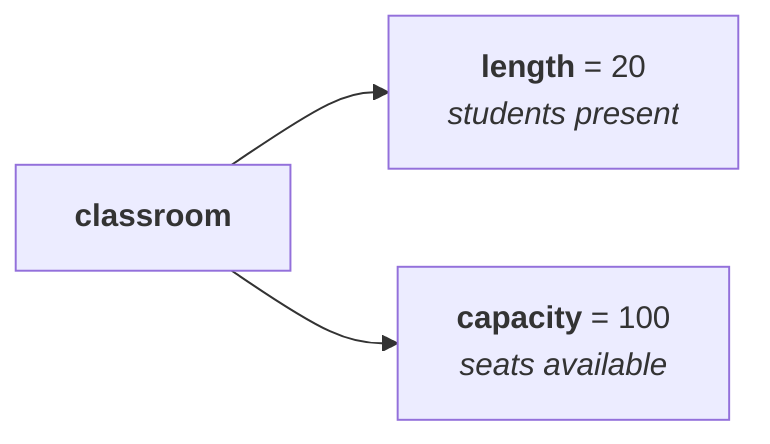

# Why `StringBuffer` exists

`String` is already there. So what is missing?

The answer is the cost of immutability when the content keeps moving.

> If the content is **fixed** and won't change frequently, go for **`String`**.
> If the content **keeps changing**, `String` is **never recommended**.

## What goes wrong

```java
String s = "durga";
s.concat("soft");
s.concat("ware");
s.concat("solutions");
```

Every one of those is a change, and `String` is immutable, so **every one creates a new object**. Change the content ten times and you have created **ten objects**. Performance falls and memory is wasted, and every intermediate object is garbage the moment the next line runs.

`StringBuffer` was built for exactly this.

> The main advantage of `StringBuffer` over `String` is that **all required changes are performed in the existing object only** — no new object is created.

Ten changes to a `StringBuffer` produce **one object**.

| | `String` | `StringBuffer` |
|---|---|---|
| A change | creates a **new object** | modifies the **existing object** |
| Ten changes | ten objects | **one** object |
| Suits content that is | **fixed** — city name, college name, an address | **changing** |

> [!important] **Say the advantage in one sentence.** *"All required changes are performed in the existing object only, so a new object is not created for every small change."*

---

# Length versus capacity

Before the constructors, one distinction that does not exist for `String` at all.

Ask for the **capacity** of a `String` and the question is meaningless. You cannot add to it or remove from it, so however many characters it had at creation is however many it will ever have. **Length and capacity would always be the same number**, which is why the word *capacity* is never used with `String`.

`StringBuffer` is different, because you *can* add. So two separate questions arise:

> **Length** — how many characters are **currently** present.
> **Capacity** — how many characters the object **can hold** in total.

## The classroom

A classroom holds a maximum of **100** students. Right now **20** students are sitting in it, and 80 chairs are empty.

- **Length = 20** — how many are actually there.
- **Capacity = 100** — how many could be there.



---

# The constructors

## 1 · `new StringBuffer()`

Creates an **empty** `StringBuffer` with a **default initial capacity of 16**.

```java
StringBuffer sb = new StringBuffer();
System.out.println(sb.capacity());
```

Measured on JDK 25: `16`.

### What happens when it fills up

Add a 17th character to a full 16-capacity buffer and, internally, a **bigger `StringBuffer` object is created**, all existing characters are copied across, the new character is added, and your reference is repointed at it. The old object becomes eligible for garbage collection. All of this happens internally — you never see it.

The new capacity is:

> **new capacity = (current capacity + 1) × 2**

So the growth sequence is:

| Current | Calculation | New capacity |
|---|---|---|
| 16 | (16 + 1) × 2 | **34** |
| 34 | (34 + 1) × 2 | **70** |
| 70 | (70 + 1) × 2 | 142 |

Measured on JDK 25, adding characters one at a time:

```
empty                16
after 16 characters  16
after the 17th       34
at 34 characters     34
after the 35th       70
```

**Exactly as stated**, including that adding the 16th character does *not* trigger growth — only the 17th does.

> [!info] **Why this internal detail is worth knowing.** He mentions having felt, in regular classes, that explaining this much internal behaviour was wasting students' time — until a student came back from an interview where he had been asked precisely this: the default initial capacity, and what happens internally when a `StringBuffer` fills up. He answered it and the interviewer was visibly impressed. Sometimes the internals are the question.

## 2 · `new StringBuffer(int initialCapacity)`

If you already know roughly how much you need, ask for it up front.

Growing to 1000 characters from the default means creating objects at 16, 34, 70, 142, 286, 574, and only then 1150 — seven allocations and seven copies, every one of them wasted work. Instead:

```java
StringBuffer sb = new StringBuffer(1000);
System.out.println(sb.capacity());
```

Measured: `1000`. And `new StringBuffer(19)` measures `19`.

Once those 1000 are used, the same `(current + 1) × 2` formula takes over.

## 3 · `new StringBuffer(String s)` — the one with the twist

Creates an equivalent `StringBuffer` for a given `String`. The twist is the capacity.

```java
StringBuffer sb = new StringBuffer("durga");
System.out.println(sb.capacity());
```

**Guess first.** Is it `5` (five characters), `16` (the default), `80`, or `21`?

Ask this in a room and everyone eliminates two options immediately and settles on **5 or 16**. Both are wrong.

> **capacity = s.length() + 16**

`durga` is 5 characters, so 5 + 16 = **21**.

Measured on JDK 25: `21`. And `new StringBuffer("ashok")` — also five characters — likewise measures `21`.

The reasoning is sensible once seen: you get exactly enough room for the content you supplied, **plus** the standard 16 spare, so the first few appends do not trigger a resize.

---

# The methods

## 1 · `public int length()` · 2 · `public int capacity()`

Characters currently present, and characters the object can hold.

```java
StringBuffer sb = new StringBuffer("saiashokkumarreddy");
System.out.println(sb.length());     // 18
System.out.println(sb.capacity());   // 34
```

Measured: `18` and `34`. Eighteen characters, so capacity is 18 + 16 = 34.

## 3 · `public char charAt(int index)`

The character at the given index, exactly as in `String`.

```java
StringBuffer sb = new StringBuffer("durga");
System.out.println(sb.charAt(3));    // g
System.out.println(sb.charAt(30));   // runtime exception
```

**Which exception?** The instinct is `StringBufferIndexOutOfBoundsException`, since this is a `StringBuffer`.

> [!important] **There is no such exception in Java.** Whether it is a `String` or a `StringBuffer`, you get **`StringIndexOutOfBoundsException`**.

Measured on JDK 25: `java.lang.StringIndexOutOfBoundsException`. This is asked precisely because the plausible-sounding name does not exist.

## 4 · `public void setCharAt(int index, char ch)`

Replaces the character at the given index. Note the **`void`** return — this one modifies in place and hands nothing back.

```java
StringBuffer sb = new StringBuffer("java");
sb.setCharAt(0, 'Y');
System.out.println(sb);
```

Measured: `Yava`.

## 5 · `public StringBuffer append(...)`

The most commonly used method of the class. It adds content **at the end**.

The argument does **not** have to be a `String`. There are many `append` methods — for `int`, `long`, `float`, `double`, `boolean`, `char`, and `Object` — all sharing one name with different parameter types. **Methods related this way are called overloaded methods.**

```java
StringBuffer sb = new StringBuffer();
sb.append("PI value is :");
sb.append(3.14);
sb.append(" this is exactly ");
sb.append(true);
System.out.println(sb);
```

Measured on JDK 25:

```
PI value is :3.14 this is exactly true
```

A `String`, a `double`, a `String` and a `boolean`, all through the same method name.

## 6 · `public StringBuffer insert(int index, ...)`

`append` always adds at the end. When you want the content somewhere specific, use `insert` — same idea, same overloads, plus a position.

```java
StringBuffer sb = new StringBuffer("abcdefgh");
sb.insert(2, "xyz");
System.out.println(sb);
```

Measured: `abxyzcdefgh` — `xyz` sits from index 2 onwards. Non-string arguments work identically; inserting `true` or `10.56` at index 2 places them in exactly the same spot.

## 7 · `public StringBuffer delete(int begin, int end)`

Deletes characters from `begin` to **`end − 1`** — the same exclusive-end convention as `substring`.

```java
StringBuffer sb = new StringBuffer("abcdefgh");
sb.delete(2, 5);
System.out.println(sb);
```

2 to 5 means indices 2, 3 and 4 — `c`, `d`, `e`. Measured: `abfgh`.

## 8 · `public StringBuffer deleteCharAt(int index)`

Deletes exactly one character.

```java
StringBuffer sb = new StringBuffer("abcdefgh");
sb.deleteCharAt(3);
System.out.println(sb);
```

Index 3 is `d`. Measured: `abcefgh`.

## 9 · `public StringBuffer reverse()`

Reverses the order of the characters. **`String` has no `reverse()`** — this is a `StringBuffer` capability.

```java
StringBuffer sb = new StringBuffer("durga");
System.out.println(sb.reverse());
```

Measured: `agrud`.

> [!info] **Only the *order* is reversed, not the characters themselves.** An `a` does not become a mirror-image `a`. The letters are unchanged; their positions are not.

## 10 · `public void setLength(int length)`

Forces the buffer to exactly the given length. Extra characters are **removed**; if the content is shorter than the requested length, **spaces are added**.

```java
StringBuffer sb = new StringBuffer("aishwaryaabhi");
sb.setLength(8);
System.out.println(sb);
```

Measured on JDK 25:

```
aishwary
```

> [!important] **Count it: `a-i-s-h-w-a-r-y` is eight characters.** The second `a` is the ninth and is cut, so the answer is `aishwary` and not `aishwarya`. `setLength(8)` keeps **exactly** eight — no rounding to a word boundary, no mercy.

## 11 · `public void ensureCapacity(int capacity)`

Increases the capacity on the fly, when you realise mid-way that you need more room than you asked for.

```java
StringBuffer sb = new StringBuffer();   // capacity 16
sb.ensureCapacity(1000);
System.out.println(sb.capacity());
```

Measured: `1000`.

## 12 · `public void trimToSize()`

The opposite problem. You asked for 1000, used 3, and now know you will add no more — leaving **997 memory locations wasted**. `trimToSize()` deallocates the extra so that capacity matches length.

```java
StringBuffer sb = new StringBuffer(1000);
sb.append("abc");
System.out.println(sb.capacity());      // 1000
sb.trimToSize();
System.out.println(sb.capacity());      // 3
```

Measured on JDK 25: `1000` then `3`.

> [!important] **The last three are the ones singled out as important**, and they are the ones people have not used: **`setLength`** to force a length, **`ensureCapacity`** to grow deliberately, **`trimToSize`** to give memory back.

---

# What this part established

| | |
|---|---|
| Why `StringBuffer` exists | `String` creates a **new object for every change** |
| Its main advantage | all changes are made **in the existing object** |
| Use `String` when | content is **fixed** |
| Use `StringBuffer` when | content **keeps changing** |
| **Length** | characters **currently** present |
| **Capacity** | characters the object **can hold** |
| Default initial capacity | **16** |
| Growth formula | **(current capacity + 1) × 2** → 16, 34, 70, 142 |
| `new StringBuffer(String s)` capacity | **`s.length() + 16`** — so `"durga"` gives **21** |
| `charAt` out of range | **`StringIndexOutOfBoundsException`** — there is no `StringBuffer` version |
| `append` and `insert` | **overloaded** for every type; `append` adds at the end, `insert` at a position |
| `delete(b, e)` removes | `b` to **`e − 1`** |
| `reverse()` | exists on `StringBuffer`, **not** on `String` |
