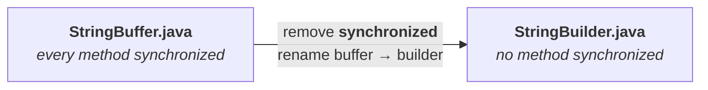
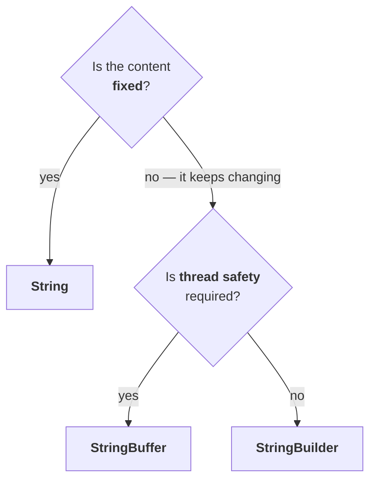

# Why `StringBuilder` exists

`StringBuffer` already handles changing content. So what is wrong with it?

> **Every method present inside `StringBuffer` is synchronized.**

You never wrote the `synchronized` keyword and never saw it in any example — it is in the class's own source. And a synchronized method means:

> At a time, **only one thread** is allowed to operate on a `StringBuffer` object.

The first thread runs to completion, then the second gets its chance, then the third. Threads queue up. **Waiting time increases and performance falls.**

To fix that, `StringBuilder` was introduced in **1.5**.

## The proof, without taking it on trust

`javap` prints a class's method signatures, so the claim can be checked directly:

```
javap java.lang.StringBuffer
```

Measured on JDK 25 — every method carries the keyword:

```
public synchronized int length();
public synchronized int capacity();
public synchronized void ensureCapacity(int);
public synchronized void trimToSize();
public synchronized void setLength(int);
public synchronized char charAt(int);
public synchronized StringBuffer append(java.lang.String);
public synchronized StringBuffer insert(int, java.lang.String);
public synchronized StringBuffer reverse();
```

`synchronized` on `length`, on `capacity`, on `append`, on `insert`, on `reverse` — the whole class.

---

# What `StringBuilder` actually is

This is not a new concept. Picture what Java's designers did to build it:

1. Open `StringBuffer.java`.
2. Wherever the word **buffer** appears, replace it with **builder**.
3. Wherever the **`synchronized`** keyword appears, **remove** it.
4. Save as `StringBuilder.java`.

**Beyond that, nothing.**



> [!important] **So there is nothing new to learn.** Every constructor covered for `StringBuffer` applies unchanged to `StringBuilder` — including capacity 16, the `(current + 1) × 2` growth, and `s.length() + 16`. Every method — `append`, `insert`, `delete`, `deleteCharAt`, `reverse`, `setLength`, `ensureCapacity`, `trimToSize` — is the same. **`StringBuilder` is the non-synchronized version of `StringBuffer`.**
>
> Four or five hours went on `String`, an hour or so on `StringBuffer`, and `StringBuilder` is a matter of two minutes — because it is two changes to a file that already existed.

---

# `StringBuffer` versus `StringBuilder`

Only **two** real differences, and the other two rows are consequences of the first.

| `StringBuffer` | `StringBuilder` |
|---|---|
| Every method is **synchronized** | **No** method is synchronized |
| At a time only **one thread** may operate on the object — hence it is **thread safe** | **Multiple threads** may operate simultaneously — hence it is **not thread safe** |
| Threads must **wait**, so performance is relatively **low** | Threads never wait, so performance is relatively **high** |
| Introduced in **1.0** | Introduced in **1.5** |

Everything else — constructors, methods, behaviour — is identical.

---

# `String` versus `StringBuffer` versus `StringBuilder`

The three-way decision, which is really two questions asked in order.



> **1.** If the content is **fixed** and won't change frequently → **`String`**.
> **2.** If the content **changes frequently** but **thread safety is required** → **`StringBuffer`**.
> **3.** If the content **changes frequently** and **thread safety is not required** → **`StringBuilder`**.

The reason `String` wins the fixed case is everything from note `03`: the same content can be reused through the SCP, so no separate object is needed and both performance and memory utilisation improve.

## Is `String` thread safe?

`StringBuffer` is thread safe and `StringBuilder` is not — so what about `String`?

**`String` is always thread safe**, and for a completely different reason from `StringBuffer`'s.

`StringBuffer` achieves it by **locking** — one thread at a time. `String` achieves it by **having nothing to protect**: once created, the object cannot be modified at all. A change produces a new object, so no thread can ever observe another thread's half-finished modification.

> [!important] **And it generalises.** **All immutable objects are automatically thread safe** — `String`, all wrapper classes, and any immutable class you write yourself, such as the `Test` class from note `05`. Nobody is allowed to modify the existing object, so there is no shared mutable state to corrupt.
>
> This is one of the strongest reasons immutability is favoured in modern Java: thread safety for free, with no locking cost.

| | Thread safe? | Why |
|---|---|---|
| **`String`** | ✅ yes | **immutable** — nothing can be modified |
| **`StringBuffer`** | ✅ yes | **synchronized** — one thread at a time |
| **`StringBuilder`** | ❌ no | neither immutable nor synchronized |

> [!info] **Which one you will actually reach for.** In ordinary single-threaded code — a loop building a message, a query, a report — **`StringBuilder` is the default choice**, because the synchronization `StringBuffer` pays for buys nothing when only one thread is involved. `StringBuffer` is for a buffer genuinely shared across threads, which is rare, and even then a lock around the whole operation is usually what you want rather than per-method locking. Nothing above changes; this is which branch of the flowchart you land on in practice.

---

# Method chaining

A concept that applies to all three classes, and it comes out of one observation:

> For most methods in `String`, `StringBuffer` and `StringBuilder`, **the return type is the same type as the object**.

`sb.append(...)` returns a `StringBuilder`. So does `reverse()`, `insert()` and `delete()`. And if the result is a `StringBuilder`, you can call another method on it — and another.

```java
sb.m1().m2().m3()...
```

**This is method chaining.** You can chain a kilometre of calls if you like.

## The rule that decides the answer

> In method chaining, **all method calls are executed from left to right.**

Not the innermost first, not right to left — left to right, each one operating on the result of the one before it.

## A worked example

```java
StringBuilder sb = new StringBuilder();
sb.append("durga").append("solutions").reverse().insert(2, "xyz").delete(3, 7);
System.out.println(sb);
```

Left to right, one step at a time:

| Step | Call | Result |
|---|---|---|
| 1 | `append("durga")` | `durga` |
| 2 | `append("solutions")` | `durgasolutions` |
| 3 | `reverse()` | `snoitulosagrud` |
| 4 | `insert(2, "xyz")` | `snxyzoitulosagrud` |
| 5 | `delete(3, 7)` | removes indices 3–6 → `yzoi` |

Measured on JDK 25:

```
snxtulosagrud
```

`sn` + `x` survives from the inserted `xyz`, and `tulosagrud` is what remains of the reversed string.

> [!important] **Do not panic when you meet a line like this in an exam.** It is valid code, not a compile error and not a runtime exception. Evaluate it **left to right**, one call at a time, writing down the intermediate value after each.

---

# What this part established

| | |
|---|---|
| Problem with `StringBuffer` | every method is **synchronized** → threads wait → performance falls |
| What `StringBuilder` is | `StringBuffer` with **`synchronized` removed** — nothing else changed |
| Introduced in | `StringBuffer` **1.0**, `StringBuilder` **1.5** |
| Constructors and methods | **identical** between the two |
| Thread safe | `String` ✅ (immutable) · `StringBuffer` ✅ (synchronized) · `StringBuilder` ❌ |
| Why `String` is thread safe | **immutability** — and so are all immutable objects |
| Content fixed | → **`String`** |
| Content changing, thread safety needed | → **`StringBuffer`** |
| Content changing, thread safety not needed | → **`StringBuilder`** |
| Method chaining works because | most methods **return the same type** |
| Chained calls execute | **left to right** |
