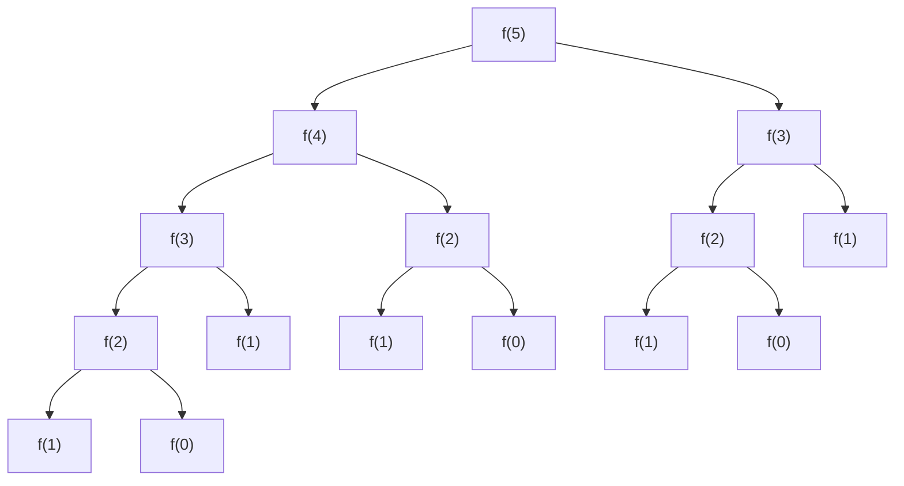

## The starting problem — Fibonacci

The Fibonacci sequence is the simplest place to see DP being born, because the problem statement is already a recurrence.

```
fib(0) = 0
fib(1) = 1
fib(n) = fib(n-1) + fib(n-2)
```

Given `n`, return `fib(n)`.

The most obvious solution — the brain-off, just-translate-the-definition-into-code solution — is pure recursion:

```java
int f(int n) {
    if (n <= 1) return n;
    return f(n-1) + f(n-2);
}
```

This is the simplest thing that works. It is also a direct translation of the problem statement — no cleverness has been added. That is deliberate. Before optimising anything, the naive solution has to be shown to be broken, otherwise the optimisation is a fix for a problem that does not exist.

---

## Proving the recursion is broken — do not optimize before you measure

A good engineering instinct is to never optimize before proving the naive solution fails. So before we touch this recursion, we measure it.

Trace `f(5)` mentally. `f(5)` calls `f(4)` and `f(3)`. Each of those calls two more. The shape is a binary tree of recursive calls.



Two facts about this tree:

- **Branching factor at every internal node is 2** — each call spawns two more calls.
- **Depth of the tree is n** — the recursion bottoms out when the argument reaches 0 or 1.

Level 0 has 1 node, level 1 has 2 nodes, level k has up to 2^k nodes, and the last level n has up to **2^n nodes**.

To count the total, add up all levels. First, look at what happens when you sum the levels manually for small values of n:

```
n = 0 → 1                    = 1   = 2^1 - 1
n = 1 → 1 + 2                = 3   = 2^2 - 1
n = 2 → 1 + 2 + 4            = 7   = 2^3 - 1
n = 3 → 1 + 2 + 4 + 8        = 15  = 2^4 - 1
n = 4 → 1 + 2 + 4 + 8 + 16   = 31  = 2^5 - 1
```

The pattern: every sum is exactly one less than the next power of 2. There is a clean reason for this. Look at the sum of all levels *above* level i:

```
above level 1:  level 0 alone        → 1       = 2^1 - 1
above level 2:  levels 0 + 1         → 1+2 = 3 = 2^2 - 1
above level 3:  levels 0 + 1 + 2     → 1+2+4=7 = 2^3 - 1
```

Every level has more nodes than all levels above it combined — by exactly 1. So when computing the grand total, the last level n contributes 2^n nodes, and everything above it contributes exactly `2^n - 1` nodes:

```
Total = (all levels above n) + (level n)
      = (2^n - 1) + 2^n
      = 2 · 2^n - 1
      = 2^(n+1) - 1
```

The total number of function calls is **2^(n+1) − 1**, which is **O(2^n)** asymptotically.

> [!important] In any recursion tree: **Time = branching_factor ^ depth**
> The last level alone has `branching^depth` nodes, and all levels above it combined are less than that — so the last level dominates. You never need to sum the series again. See branching factor, see depth, write the answer.

---

## The universal time-complexity formula for recursion

Whenever you analyze a recursive algorithm — including every DP variant we are about to derive — the formula is the same:

```
Time = (number of function calls) × (work done per call)
```

For our Fibonacci brute force:

- Number of function calls = **O(2^n)** — the tree size we just derived.
- Work per call = **O(1)** — one comparison and one addition.
- Total = **O(2^n) × O(1) = O(2^n)**.

This formula reappears whenever a DP version of a problem is compared against its brute-force ancestor — it is what *proves* the optimisation actually saved time, instead of just claiming it.

---

## What exponential actually feels like at scale

It is easy to say "O(2^n) is slow." It is more useful to feel it.

Assuming a standard 10⁸ operations per second:

- `n = 30` → 2³⁰ ≈ 10⁹ ops → ~**10 seconds**
- `n = 40` → 2⁴⁰ ≈ 10¹² ops → ~**3 hours**
- `n = 50` → 2⁵⁰ ≈ 10¹⁵ ops → ~**4 months**

LeetCode commonly gives `n ≤ 30` or higher on Fibonacci-style problems. The brute force times out well before `n = 35`.

> [!danger] The recursion is broken at scale — confirmed by numbers, not by gut feeling. The fix is now justified rather than premature.

---

## Where the wasted work lives

Look at the tree of `f(5)` again. `f(3)` appears twice. `f(2)` appears three times. `f(1)` and `f(0)` appear even more often.

Every one of those repeated calls computes the same number. `f(2)` returns `1` whether it is called the first time or the fifth time — same input, same output, every time. The function has no hidden state, no randomness, no external dependency.

So the brute force tree is not just exponential because it branches. It is exponential because **it solves the same subproblems over and over**. That is the entire diagnosis.

The fix is not a clever new technique. It is the obvious response to this diagnosis: when the answer to a subproblem is already known, do not compute it again.

---

## The fix — memoization

Before computing `f(n)`, check if the answer is already stored. If it is, return it immediately. If it is not, compute it, store it, then return it.

```java
Map<Integer, Integer> memo = new HashMap<>();

int f(int n) {
    if (n <= 1) return n;
    if (memo.containsKey(n)) return memo.get(n);
    int result = f(n-1) + f(n-2);
    memo.put(n, result);
    return result;
}
```

This is called **memoization** — caching the result of a function call so it is never recomputed for the same input.

Now apply the same time-complexity formula:

```
Time = (number of function calls) × (work done per call)
```

With the cache in place, each subproblem is computed exactly once. `f(0), f(1), f(2), ..., f(n)` — that is **n+1 unique calls**, each doing O(1) work:

```
Time = (n+1) × O(1) = O(n)
```

Before memoization: **O(2^n)**. After: **O(n)**. The formula is identical — what changed is the number of calls collapsed from exponential to linear.

The tree did not change shape. What changed is that every duplicate branch gets short-circuited the moment it hits the cache. Instead of a fat binary tree recomputing the same nodes over and over, the recursion now walks a single path from `f(n)` down to `f(0)`, filling the cache on the way down, and every other branch returns instantly on the way back up.

> [!important] Memoization does not change the structure of the recursion. It eliminates redundant calls by storing results. The same recurrence, the same base cases — just with a cache in front.

---

## From memoization to bottom-up DP

Trace the order in which the memoized recursion actually computes and stores values. When `f(5)` runs, the first value computed is `f(0)`, then `f(1)`, then `f(2)`, all the way up to `f(5)`. The cache fills from the bottom up, in order, every single time.

So instead of recursion accidentally filling the cache in that order, fill an array intentionally in that same order:

```java
int f(int n) {
    int[] dp = new int[n + 1];
    dp[0] = 0;
    dp[1] = 1;
    for (int i = 2; i <= n; i++) {
        dp[i] = dp[i-1] + dp[i-2];
    }
    return dp[n];
}
```

No recursion. No HashMap. Just an array filled left to right. Time complexity is the same:

```
Time = (number of iterations) × (work per iteration) = n × O(1) = O(n)
```

---

## Space optimisation — from O(n) to O(1)

Both memoization and bottom-up array use O(n) space. But look at the recurrence:

```java
dp[i] = dp[i-1] + dp[i-2];
```

At step `i`, only the last two values are ever needed. `dp[0]` through `dp[i-3]` are never touched again. Bottom-up knows the access pattern in advance, so old values can be thrown away. Memoization cannot do this — the recursion might need any cached value at any point, so the entire cache must stay alive.

With bottom-up, the array collapses to two variables:

```java
int f(int n) {
    if (n <= 1) return n;
    int prev2 = 0, prev1 = 1;
    for (int i = 2; i <= n; i++) {
        int curr = prev1 + prev2;
        prev2 = prev1;
        prev1 = curr;
    }
    return prev1;
}
```

Space drops from O(n) to **O(1)**.

```
                   Top-down memo    Bottom-up array    Bottom-up O(1)
Time               O(n)             O(n)               O(n)
Space              O(n)             O(n)               O(1)
Stack overflow?    yes (risk)       no                 no
Space optimise?    no               yes                already done
```

> [!tip] In contests, write bottom-up directly. Once the recurrence is clear — dp[i] depends on dp[i-1] and dp[i-2] — skip the recursion entirely and fill the array left to right. The top-down path is a derivation tool, not a contest tool.

---

## When does memoized recursion overflow the stack?

Java's default call stack allows roughly **5000–10000 frames**. Each recursive call consumes one frame. The danger is recursion **depth**, not total number of calls — a tree with 1000 branches but depth 5 is perfectly safe; a linear recursion with depth 100,000 overflows.

```
n ≤ 1,000     → recursion is safe
n ≤ 10,000    → borderline, avoid recursion
n > 10,000    → always use bottom-up
```

In a contest, the constraint on n tells you immediately. If `n ≤ 10^5` or higher, memoized recursion will overflow in Java — write bottom-up from the start.

> [!important] In Java: if n > 10,000, never use memoized recursion. Write bottom-up.

---

## The DP derivation framework — what we have been doing all along

Every DP problem, regardless of dimension or pattern, follows four steps:

```
1. Define the state      — what does f(i) mean in plain English?
2. Write the recurrence  — how does the answer at this state depend
                           on answers at smaller states?
3. Identify base cases   — which states have known answers without recursion?
4. Fill the table        — bottom-up, in the order states depend on each other
```

The template — `dp[i] = dp[i-1] + dp[i-2]` — is just step 4. Steps 1 through 3 are what actually matter. If you jump straight to writing `dp[i] = ...` without knowing what `dp[i]` means, you are guessing.

**State** is the minimum set of variables that uniquely identifies a subproblem. The number of variables is the dimension of the DP table.

**Recurrence** is how the answer at the current state is built from answers at smaller states.

For Fibonacci:

```
State:       f(n) = number of ways to reach step n
Recurrence:  f(n) = f(n-1) + f(n-2)
Base cases:  f(0) = 0, f(1) = 1
```

The state definition in plain English is the most important step. Once you know what `f(n)` means, the recurrence almost writes itself — you ask "what smaller subproblems do I need to compute this?" and the answer follows from the meaning.

> [!important] Always define the state in plain English before writing any recurrence. If you cannot say what `dp[i]` means in one sentence, you are not ready to write the recurrence.
