> [!abstract] Which LLD problems to learn first, by how often they are actually asked
> The problems learned first are the ones revised most, so the order should follow interview frequency, not learning convenience. Two methods: an exact count of company-named interview reports on LeetCode Discuss, and a company-by-company search across the Tier A and Tier B targets in `CLAUDE.md`.

---

## The order

```mermaid
flowchart LR
    D[Parking Lot<br/>done] --> B[1 BookMyShow]
    B --> S[2 Splitwise]
    S --> R[3 Rate Limiter<br/>Track B, half built]
    R --> L[4 Logging]
    L --> E[5 Elevator]
    E --> SL[6 Snake and Ladder<br/>timed rep]
    SL --> V[7 Vending Machine]
    V --> SP[8 Spreadsheet]
    classDef done fill:#e0e0e0,stroke:#777,color:#000
    classDef a fill:#dff5e1,stroke:#27ae60,color:#000
    classDef b fill:#e3ecfb,stroke:#2e6fd8,color:#000
    class D done
    class B,S,L,E,SL,V,SP a
    class R b
```

| # | Problem | Why it is here |
|---|---|---|
| 1 | **BookMyShow** | Second only to Parking Lot: 109 company-named reports since 2023, across 58 companies |
| 2 | **Splitwise** | 51 since 2023, and the most machine-coding-specific of the list: Swiggy, Groww, Meesho, ThoughtWorks, Flipkart |
| 3 | **Rate Limiter** | The most reported item in the whole count (190 since 2023), already half built; finishing it beats leaving all of Track B to the end |
| 4 | **Logging framework** | 52 since 2023: Microsoft, Amazon, Salesforce, Razorpay |
| 5 | **Elevator** | 46 since 2023: Amazon, Microsoft, Salesforce |
| 6 | **Snake and Ladder** | 46 since 2023, spread wide; small enough to be the timed speed rep |
| 7 | **Vending Machine** | 27 since 2023, mostly Amazon; promoted from a cheap variant to a real slot |
| 8 | **Spreadsheet** | 33 since 2023, but concentrated at Google, Microsoft and Rippling |

The rest of Track B (Circuit Breaker, retry, LRU) follows in week 4.

---

## The count: company-named interview reports on LeetCode Discuss

| Problem | Since 2023 | All years | Companies | Where it is asked most |
|---|---|---|---|---|
| Parking Lot | 153 | 281 | 52 | Amazon 91, Microsoft 30, Wayfair 22, Uber 14, Goldman Sachs 11, Oracle 9, Swiggy 8 |
| **BookMyShow** | **109** | 185 | **58** | Amazon 46, Flipkart 13, Microsoft 11, Oracle 10, Tekion 5, PhonePe 5, Blinkit 4, Walmart 4 |
| **Logging framework** | **52** | 77 | 26 | Microsoft 18, Amazon 12, Google 7, Flipkart 5, PhonePe 4, Oracle 4 |
| **Splitwise** | **51** | 88 | 36 | Swiggy 14, Amazon 13, Groww 5, Goldman Sachs 5, Meesho 4, Dunzo 4, Salesforce 3 |
| **Elevator** | **46** | 95 | 24 | Amazon 29, Microsoft 15, Google 11, Salesforce 6, Oracle 5, Tekion 4, Adobe 4 |
| **Snake and Ladder** | **46** | 92 | 27 | Microsoft 16, Amazon 11, Salesforce 10, Goldman Sachs 9, PhonePe 6, Meesho 4, Swiggy 4 |
| Spreadsheet | 33 | 72 | 17 | Google 18, Microsoft 10, Amazon 10, Meta and Facebook 9, Rippling 8 |
| Vending Machine | 27 | 60 | 23 | Amazon 26, Microsoft 5, Nutanix 4, Goldman Sachs 3 |
| Library Management | 18 | 31 | 15 | Zeta 4, Walmart 4, Amazon 4, Microsoft 3 |
| *Rate Limiter (Track B)* | *190* | 287 | 58 | Amazon 40, Microsoft 37, Google 36, Atlassian 33, Uber 9, Apple 9 |

Left out of the ranking on purpose: Chess (83 since 2023) and Tic-Tac-Toe (36). LeetCode has algorithm problems with the same names (Design Tic-Tac-Toe, chessboard and knight problems), so their counts mix in coding rounds and cannot be separated.

### How it was counted

LeetCode's own search API was queried from a logged-in browser. For each problem:

1. Every post matching a distinctive keyword was listed (`splitwise`, `elevator`, `bookmyshow` and `movie`, `ladder`, `logger` and `logging`, `spreadsheet` and `excel`, `vending`, `limiter`, `library`, `parking`).
2. Only posts whose **title names a real company** were kept, as the closest proxy for an actual interview report rather than a practice post.
3. Each kept post's **full text** was checked for the problem's phrase (`parking lot`, `snake and ladder`, `logging framework`, `movie ticket` and so on), so a post mentioning `ladder` for Word Ladder does not count.
4. Reports dated 2023 or later are the headline number.

The run was stopped after 15 of its 31 searches. Food delivery, cab booking, notification system, pub-sub, key-value store, task scheduler, wallet, ATM, shopping cart, inventory, calendar and LRU have no counts.

---

## What companies actually ask: three kinds of problem

| Kind | Companies | What it means for preparation |
|---|---|---|
| **Classic named problems**, the list above | Amazon, Microsoft, Salesforce, Goldman Sachs, Swiggy, Zeta, ThoughtWorks, Groww | Preparable problem by problem: the core list |
| **Made-up business problems**, new every time | Flipkart, PhonePe, CRED, Navi, Myntra, Meesho | Cannot be memorised. What transfers is the build skill: entities, in-memory storage, a service layer and a driver inside 90 minutes. Timed reps matter more here than the exact list. |
| **Infrastructure and concurrency** | Uber, Microsoft (2025), Juspay, Razorpay | Track B: rate limiter, key-value store with expiry, LRU, message queue, job scheduler. More frequent than half the classic list. |

### Per company

Most rows come from search-engine summaries of candidate reports; the three marked read in full were opened and read on the page.

| Company | Round | Reported problems |
|---|---|---|
| **Flipkart** | 30 min clarify, 90 min code, 30 min review | Wallet system (May 2024, read in full), flight booking with fewest hops or cheapest route (Apr 2025), online auction (Nov 2024), distributed task scheduler (Jan 2025), e-commerce loyalty points, developer Q&A platform like Stack Overflow (Jul 2024), restaurant management (Jun 2024), doctor appointment booking; Splitwise in an older Glassdoor report |
| **Swiggy** | Machine coding, then review | Parking lot, Splitwise, fleet management, cab booking, packing boxes with least empty space, employee information system |
| **PhonePe** | About 90 min to 2 h, then a 30 min review | Hackathon platform, Snake and Ladder (90 min), issue management system, to-do list with analytics, vehicle rental |
| **Razorpay** | 60 to 120 min, working code expected | In-memory relational database (most reported), in-memory search engine, notification system, logger with a different sink per level, ATM, version control system |
| **CRED** | Up to 150 min, skeleton code provided | Blogging workflow, credit card management, file manager, payments with several payment types |
| **Zepto** | LLD with schema and APIs | Online bookstore, coupon recommendation, database schema for a ride app |
| **Zomato** | LLD alongside DSA | Delivery systems, notification at scale, LRU cache |
| **Meesho** | 60 to 90 min | Inventory management, car pooling, vending machine with a twist, ride-sharing features |
| **Uber** | 60 min, design and code, concurrency-heavy | Job scheduler, pub-sub, async queues; parking lot (L4, June 2024, read in full) |
| **Groww** | 90 min | Splitwise, stock exchange with bids, cache, chess move validator, group chat with limits |
| **Navi** | 90 min, then 30 min with three engineers | Inventory management with concurrency and unit tests |
| **Myntra** | Machine coding | In-memory e-commerce back end with credit-limit installments |
| **BrowserStack** | One or two machine-coding rounds | Remote `tail -f` log watcher, web service that starts and stops browsers |
| **Zeta** | Machine coding / LLD | Parking lot, in-memory cache, cheapest flight, locker management, airplane reservation |
| **ThoughtWorks** | Pairing round | Splitwise |
| **Salesforce** | LLD round | Logging framework, quick-commerce app, expense sharing, elevator, connection pool with a request queue |
| **Atlassian** | About 45 min code design | Customer satisfaction ratings ranking, middleware router, snake game, cost explorer; rate limiter (33 LeetCode reports) |
| **Walmart** | About 60 min LLD | Meeting planner with room and attendee availability, social feed, rate limiter, parking lot, inventory, notification |
| **Amazon** | Discussion, usually no compiling | Meeting room reservation (June 2025), Stack Overflow, extensible calculator; LeetCode counts: parking lot 91, chess 52, BookMyShow 46, elevator 29, vending machine 26 |
| **Microsoft** | LLD round, sometimes AI-assisted | 2025 consolidated list (read in full): key-value store with expiry, rate limiter, message queue, scheduler, producer-consumer, file system, LRU, snake game. Other reports: Spotify, board game like Sudoku, generic cache extended to LRU, thread-safe transaction filter, job scheduler, Windows notifications, elevator (2025) |
| **Juspay** | Machine coding | Rate limiter with concurrency, payment workflow, thread-safe LRU |
| **Intuit** | Craft demo, about 1.5 h | Your own project, presented and extended live |
| **Arcesium** | LLD with database design | Ride-hailing like Uber |
| **Morgan Stanley** | LLD | Employee attendance system, Battleship |
| **Rippling** | 60 min LLD | Key-value store with transactions, Excel sheet, music player play counts, delivery tracking |
| **Dream11** | No dedicated backend machine coding reported | DSA and system design instead |

---

## Caveats

> [!warning] What the numbers can and cannot say
> - **LeetCode leans towards Amazon and Microsoft**: big-company candidates post more, so their favourites rank higher.
> - **A mention is not always an LLD round.** Some BookMyShow and Rate Limiter reports are system-design rounds, which inflates both. Even halved, BookMyShow stays second.
> - **Practice-site company tags were discounted.** CodeZym's tags are self-reported, and its founder's Medium articles that the tags draw on have been suspended by Medium.
> - **The 2024 LeetCode list of frequently asked questions was ignored**: a commenter asked whether it was written by ChatGPT, and it gives no evidence.
> - The count is a lower bound: it misses reports whose title names no company.

---

## Sources

**Counted directly**
- [LeetCode Discuss](https://leetcode.com/discuss/), queried through its search API on 2026-10-05

**Read in full**
- [Microsoft SDE-2 recent questions 2025, consolidated (LeetCode)](https://leetcode.com/discuss/interview-question/6403987/Microsoft-SDE-2-Recent-questions-2025-or-Consolidated/)
- [Flipkart SDE-2 interview experience: wallet system (Medium)](https://medium.com/@anmol15554/flipkart-interview-experience-for-sde-2-9b7fbfadbdf1)
- [Uber L4 interview experience: parking lot (Medium)](https://khaniqbal.medium.com/uber-l4-interview-experience-5350c0e5918d)
- [CodeZym question list with company tags](https://codezym.com/)
- [workat.tech machine coding practice](https://workat.tech/machine-coding/practice)
- [LLD Mastery: Top 20 LLD interview questions (2026)](https://www.lowleveldesignmastery.com/blog/low-level-design-interview-questions/)
- [LeetCode: Frequently asked LLD questions (2024), discounted](https://leetcode.com/discuss/post/5328221/frequently-asked-low-level-design-lld-qu-l0xk/)

**Per-company search summaries**
- [Flipkart SDE2 machine coding, PSDS, design round questions (LeetCode)](https://leetcode.com/discuss/post/6687653/flipkart-sde2-machine-codingpsdsdesign-r-kw1u/)
- [Flipkart SDE 2 machine coding round (LeetCode)](https://leetcode.com/discuss/interview-question/6039919/Flipkart-or-SDE-2-or-Machine-Coding-Round/)
- [Flipkart: machine coding 90 min, Design Splitwise (Glassdoor)](https://www.glassdoor.com/Interview/Machine-coding-90-min-Design-Splitwise-Group-contains-Users-User-can-be-in-multiple-Groups-Bill-is-assigned-to-a-Gr-QTN_2799023.htm)
- [Swiggy all interview questions (LeetCode)](https://leetcode.com/discuss/interview-question/2515595/SWIGGY-ALL-INTERVIEW-QUESTIONS/)
- [PhonePe interview experience (GeeksforGeeks)](https://www.geeksforgeeks.org/interview-experiences/phonepe-interview-experience-1-10-years-experience/)
- [PhonePe SDE2 (roundz)](https://roundz.substack.com/p/interview-experience-174-phonepe-sde2)
- [Razorpay machine coding round (LeetCode)](https://leetcode.com/discuss/interview-experience/6888761/)
- [CRED backend interview experience (Medium)](https://medium.com/@dbarnwal888/cred-interview-experience-backend-2022-26c312595397)
- [Zepto LLD SDE-II (LeetCode)](https://leetcode.com/discuss/interview-question/5703566/Zepto-LLD-SDE-II/)
- [Meesho machine coding SDE-1 (LeetCode)](https://leetcode.com/discuss/interview-experience/5925685/Meesho-or-Machine-Coding-or-SDE-1-(-Backend-)-or-Oct.-2024-or-Offcampus/)
- [Uber SDE-2 L4 (roundz)](https://roundz.substack.com/p/interview-experience-uber-sde-2-l4)
- [Groww machine coding SDE 2: Splitwise (LeetCode)](https://leetcode.com/discuss/post/2013143/groww-machine-coding-round-sde-2-design-splitwise/)
- [Navi SDE interview experience (Medium)](https://medium.com/@koliv5936/interview-experience-at-navi-for-a-software-development-engineer-role-986350c1e98d)
- [Myntra interview experience (GeeksforGeeks)](https://www.geeksforgeeks.org/myntra-interview-experience-2/)
- [BrowserStack machine coding: tail -f (Glassdoor)](https://www.glassdoor.co.in/Interview/Machine-Coding-round-and-gt-implement-tail-f-QTN_6892251.htm)
- [Zeta machine coding / LLD round SDE2 (LeetCode)](https://leetcode.com/discuss/interview-question/1409162/zeta-machine-coding-lld-round)
- [ThoughtWorks Splitwise assignment (GitHub)](https://github.com/pulkitent/thoughtworks-split-wise-lld-oop-ood)
- [Salesforce SMTS interview experience (LeetCode)](https://leetcode.com/discuss/post/6162551/Salesforce-SMTS-Interview-experience/)
- [Atlassian interview experience (gagan93)](https://gagan93.me/blog/2024/05/04/atlassian-interview-experience.html)
- [Walmart SDE 3 interview experience (LeetCode)](https://leetcode.com/discuss/interview-question/6146111/Walmart-SDE-3-Interview-Experience/)
- [Amazon SDE 2 interview experience (LeetCode)](https://leetcode.com/discuss/post/6923887/amazon-sde-2-interview-experience-select-rwpm/)
- [Microsoft SDE2 interview experience (LeetCode)](https://leetcode.com/discuss/post/7357425/microsoft-sde2-interview-experience-by-a-9v91/)
- [Juspay interview experience (GUVI)](https://www.guvi.in/blog/juspay-interview-experience/)
- [Intuit craft round experience (LeetCode)](https://leetcode.com/discuss/interview-experience/1949930/intuit-craft-round-experience/)
- [Arcesium SSE interview experience (LeetCode)](https://leetcode.com/discuss/post/7178192/)
- [Rippling SDE-2 2024 (LeetCode)](https://leetcode.com/discuss/interview-experience/5868538/Rippling-SDE-2-Interview-Experience-2024-Offer/)
- [Dream11 SDE-2 backend interview experience (Medium)](https://medium.com/@kunalkunkulol/dream11-sde-2-backend-interview-experience-a0175b202b57)
