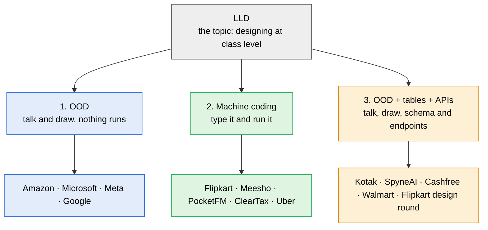

> [!abstract] LLD is the topic, not the round
> LLD is the skill of designing at class level: which classes exist, what each one owns, how they talk, where the patterns go. One level up, HLD is services, databases and servers. Companies test LLD in three formats, and the same problem, BookMyShow for example, can arrive in any of them.

## The three formats side by side

| Does the code have to run? | 1. OOD | 2. Machine coding | 3. OOD + tables + APIs |
|---|---|---|---|
| **Runs** | No | **Yes, a `Main` shows every feature working** | No |
| **What you hand over** | Entities, class diagram, method signatures, pattern choices, maybe one method in code | A working program, then a review of it | Everything in OOD, plus the **DB tables** and the **API request and response** for each endpoint |
| **Time** | About 45 min; at Amazon 20 to 25 of them go on Leadership Principles | 60 to 90 min of coding, then 15 to 30 min of review | 20 to 60 min, often one part of a longer round |
| **Who runs it** | US and FAANG: Amazon, Microsoft, Meta, Google | Indian product startups: Flipkart, Meesho, PocketFM, ClearTax, Uber, Scapia | Indian SDE-2 loops in 2026: Kotak, SpyneAI, Cashfree, Walmart, Flipkart design round |
| **Graded on** | Are the classes right, and does the design extend cleanly | Does it run, does it cover the requirements, is the code clean and extensible | Classes, plus a schema with no holes, plus API shapes, plus the concurrency answer |
| **The usual failure** | A diagram with no clear owner for each piece of state | Correct design, code that never ran | A table missing (payments), or a schema that cannot take a new kind of event |

> [!danger] Two rejections that show how machine coding is graded
> - **Uber L4:** 40 minutes of design talk left 20 for code, the code never ran, and a correct design was rejected.
> - **Meesho SDE-3:** the tests passed, but the business logic sat in one class, and that was rejected too.
>
> Running code is the gate. Clean code is the score.

> [!important] The third format is the common SDE-2 round in 2026
> In the 2026 BookMyShow reports, most rounds labelled LLD asked for classes, tables and API shapes together, with no compiling. Our `CLAUDE.md` parks this as flavor D, but the research says it comes up as often as machine coding.

## One moment, three answers

Two users click seat A5 for the 7 pm show at the same moment. What each format wants for that moment:

| Format | Your answer |
|---|---|
| **OOD** | A `ShowSeat` class holding the status, a `book(showId, seatIds, userId)` method, and you point at the line that stops the second user |
| **Machine coding** | Real code: two threads both try A5, and `Main` prints one success and one rejection |
| **OOD + tables + APIs** | A `show_seat` table with a `status` and a `version` column, `UPDATE show_seat SET status = 'BOOKED', version = version + 1 WHERE id = ? AND version = ?`, and `POST /bookings` with its success and seat-taken responses |

## How one build covers all three

| Step | Format it covers |
|---|---|
| Build it as machine coding, against the clock | 2 |
| Stop before typing: entities, diagram, signatures | 1 |
| Add about 15 minutes of tables and three API signatures | 3 |

The machine-coding build is the biggest of the three, so it comes first. The other two are cuts of it.

> [!tip] Ask which format in the first minute
> An Amazon candidate (Aug 2025, bus booking) prepared class diagrams and code, and was asked for API and schema instead. One question settles it: running code, a class design, or tables and APIs?
