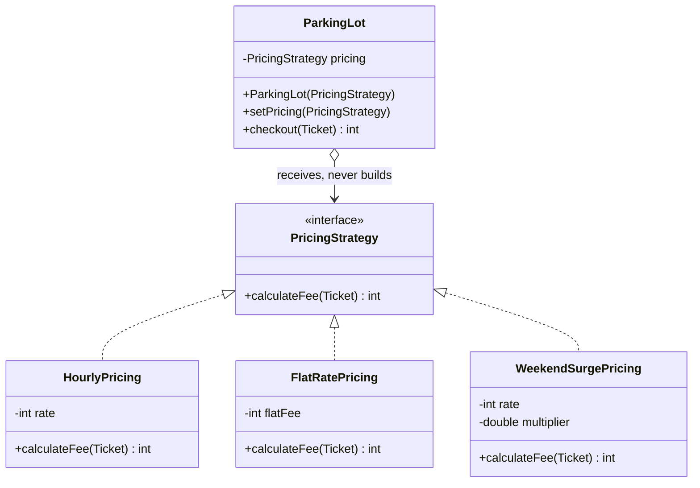

> [!abstract] Strategy
> Put each variant of an algorithm in **its own class behind a shared interface**, so the class using it can swap algorithms without being changed.

---

## 🎯 Trigger

> [!tip]
> **Value varies → parameter.  Formula varies → Strategy.**
>
> - **value** — only a number changes, the calculation keeps its shape: `hours × 20` → `hours × 40`
> - **formula** — the shape of the calculation itself changes: `hours × rate` → flat ₹200 regardless of hours
>
> A number can be passed in as an argument. A formula cannot — it has to be passed in as an object.

**Value varies** — car ₹20/hr, truck ₹40/hr. A parameter handles it, no pattern:

```java
int calculateFee(Ticket t, int rate) {
    return t.getHours() * rate;          // car → rate=20, truck → rate=40 ✅
}
```

**Formula varies** — add a day pass: ₹200 flat, any duration. No `rate` can express it:

|Stay|`rate = 200` gives|Wanted|
|---|---|---|
|3 h|₹600 ❌|₹200|
|9 h|₹1800 ❌|₹200|

`hours × rate` always scales with hours; a flat fee doesn't. The calculation itself has to be swappable → **Strategy**.

---

## 🧱 Structure



---

## 🔩 Component Mapping

|Component|Role|Here|
|---|---|---|
|**Strategy**|Interface for the varying operation|`PricingStrategy`|
|**ConcreteStrategy**|One formula + its own config|`HourlyPricing`, `FlatRatePricing`|
|**Context**|Uses a strategy, never names a concrete one|`ParkingLot`|
|**Client**|Chooses which strategy to inject|`Main`|

---

## 📐 Template

```
src/
├── model/
│   └── Ticket.java
├── strategy/
│   ├── PricingStrategy.java        ← 1️⃣ interface
│   ├── HourlyPricing.java          ← 2️⃣ implementations
│   └── FlatRatePricing.java
├── ParkingLot.java                 ← 3️⃣ context
└── Main.java                       ← client
```

##### `strategy/PricingStrategy.java`

```java
public interface PricingStrategy {
    int calculateFee(Ticket ticket);
}
```

##### `strategy/HourlyPricing.java`

```java
public class HourlyPricing implements PricingStrategy {

    private final int rate;

    public HourlyPricing(int rate) {
        this.rate = rate;
    }

    @Override
    public int calculateFee(Ticket ticket) {
        return ticket.getHours() * rate;
    }
}
```

##### `strategy/FlatRatePricing.java`

```java
public class FlatRatePricing implements PricingStrategy {

    private final int flatFee;                  // different field — the interface unifies
                                                // the method, never the state
    public FlatRatePricing(int flatFee) {
        this.flatFee = flatFee;
    }

    @Override
    public int calculateFee(Ticket ticket) {
        return flatFee;                         // ignores hours entirely
    }
}
```

##### `ParkingLot.java`

```java
public class ParkingLot {

    private PricingStrategy pricing;            // the interface, never a concrete class

    public ParkingLot(PricingStrategy pricing) {
        this.pricing = pricing;                 // RECEIVES — never `new HourlyPricing(...)`
    }

    public void setPricing(PricingStrategy pricing) {
        this.pricing = pricing;                 // runtime swap
    }

    public int checkout(Ticket ticket) {
        return pricing.calculateFee(ticket);
    }
}
```

##### `Main.java`

```java
public class Main {
    public static void main(String[] args) {
        ParkingLot mall    = new ParkingLot(new HourlyPricing(20));
        ParkingLot airport = new ParkingLot(new FlatRatePricing(200));

        mall.checkout(new Ticket(3));           // 60
        airport.checkout(new Ticket(3));        // 200

        mall.setPricing(new FlatRatePricing(150));
    }
}
```
