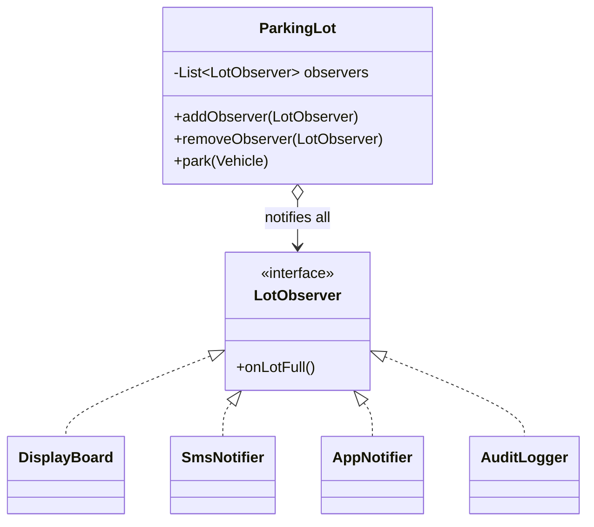

> [!abstract] Observer
> One event, **many independent reactions**. The subject keeps a list of listeners and notifies all of them, without ever knowing who they are.

---

## 🎯 Trigger

> [!tip]
> **One → call it.  Which one? → Strategy.  All of them → Observer.**
>
> - **one fixed reaction** — nothing varies, just call the method directly
> - **which one** — pick one behaviour out of several alternatives → **Strategy** (one field, one call)
> - **all of them** — one event fires several independent reactions → **Observer** (a list, a loop)
>
> Strategy and Observer are the same building block — interface + implementations. The difference is **cardinality**.

**One reaction** — the lot fills, the display board updates. No pattern:

```java
if (isFull()) board.showFull();          // ✅ done
```

**Many reactions** — now also SMS the manager, push to the app, write an audit line. A single field cannot hold four listeners:

```java
private NotificationStrategy notifier;   // ❌ set it to SMS and the board stops updating
```

They are not alternatives, they all fire → **Observer**.

> [!warning] Observer is fire-and-forget
> The subject gets no results back and controls no ordering. If the SMS gateway throws, the loop dies halfway and the audit log never runs — so wrap each callback in try/catch.
> Need results, ordering, or all-or-nothing? Observer is the wrong tool.

---

## 🧱 Structure



---

## 🔩 Component Mapping

|Component|Role|Here|
|---|---|---|
|**Subject** (Publisher)|Holds the list, fires the event, knows no concrete listener|`ParkingLot`|
|**Observer** (Listener)|Interface every reaction implements|`LotObserver`|
|**ConcreteObserver**|One reaction each|`DisplayBoard`, `SmsNotifier`, `AppNotifier`, `AuditLogger`|
|**Client**|Registers observers at wiring time or at runtime|`Main`|

---

## 📐 Template

```
src/
├── observer/
│   ├── LotObserver.java            ← interface
│   ├── DisplayBoard.java           ← concrete observers
│   ├── SmsNotifier.java
│   └── AuditLogger.java
├── ParkingLot.java                 ← subject
└── Main.java                       ← registers the observers
```

##### `observer/LotObserver.java`

```java
public interface LotObserver {
    void onLotFull();
}
```

##### `observer/DisplayBoard.java`

```java
public class DisplayBoard implements LotObserver {

    @Override
    public void onLotFull() {
        System.out.println("Gate display: LOT FULL");
    }
}
```

##### `observer/SmsNotifier.java`

```java
public class SmsNotifier implements LotObserver {

    private final String managerPhone;

    public SmsNotifier(String managerPhone) {
        this.managerPhone = managerPhone;
    }

    @Override
    public void onLotFull() {
        System.out.println("SMS to " + managerPhone + ": lot is full");
    }
}
```

##### `ParkingLot.java`

```java
public class ParkingLot {

    private final List<LotObserver> observers = new ArrayList<>();

    public void addObserver(LotObserver observer) {
        observers.add(observer);                 // runtime registration
    }

    public void removeObserver(LotObserver observer) {
        observers.remove(observer);
    }

    public void park(Vehicle vehicle) {
        // ... assign a spot
        if (isFull()) {
            notifyLotFull();
        }
    }

    private void notifyLotFull() {
        for (LotObserver observer : observers) {
            try {
                observer.onLotFull();            // one bad listener must not kill the rest
            } catch (Exception e) {
                System.err.println("observer failed: " + e.getMessage());
            }
        }
    }
}
```

##### `Main.java`

```java
public class Main {
    public static void main(String[] args) {
        ParkingLot lot = new ParkingLot();

        lot.addObserver(new DisplayBoard());     // adding a reaction never
        lot.addObserver(new SmsNotifier("+91..."));  // touches ParkingLot
        lot.addObserver(new AuditLogger());

        lot.park(new Car("KA-01-1234"));
    }
}
```
