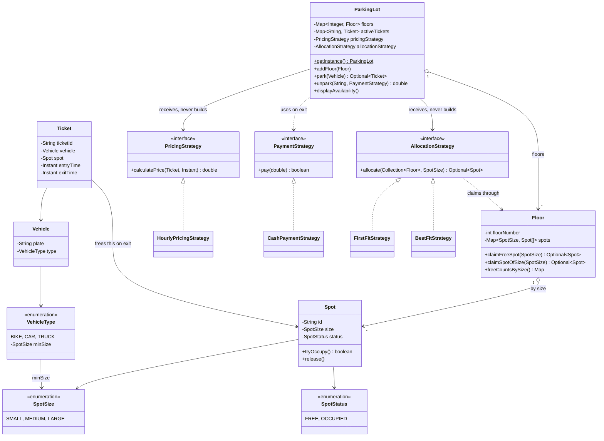

> [!abstract] Parking Lot
> Flavor A (domain modeling) · Target: 90 min from a blank editor · Patterns: Singleton, Strategy, Factory, Observer

---

## 📄 Problem Statement

Design a parking lot for a mall.

The lot has **multiple floors**, and each floor has **spots of different sizes**. A vehicle drives up to an entry gate, is assigned a spot, and receives a **ticket**. When it leaves, the fee is calculated from the time parked and the vehicle's type, the driver pays at the exit gate,and the spot is released.

Several entry gates operate at once, so two vehicles can arrive at the same instant.

---

## ✅ Functional Requirements

1. **Multiple floors** — the lot holds a list of floors; each floor holds its own spots.
2. **Spot sizes** — every spot has a size (`SMALL`, `MEDIUM`, `LARGE`). Every vehicle type declares the minimum size it needs.
3. **Allocation policy (pluggable)** — a vehicle takes the *smallest free spot it fits in*; a bike uses a car spot only when no bike spot is free, so large spots aren't wasted on small vehicles. *Which* fitting spot wins (first-fit today; best-fit or nearest-to-entrance later) is a swappable `AllocationStrategy` — the spec now asks for more than one policy, which is what earns the Strategy.
4. **Ticket on entry** — records the vehicle, the assigned spot, and the entry time.
5. **Fee on exit** — computed from the ticket's duration and the vehicle type. Pricing must
   support more than one rule (hourly, flat rate).
6. **Release on exit** — the spot returns to free **only after payment succeeds**.
7. **Lot full** — if no spot fits, entry is rejected cleanly (no exception-as-control-flow).
8. **Concurrent entry** — two gates must never assign the same spot to two vehicles.
9. **Availability display** — show free spots grouped by floor and size. Read-only; a slightly
   stale count is acceptable (locking the whole lot for a count would serialize every gate).

### Out of scope (do not build)

Advance reservations · allocation policies beyond smallest-fits · real payment gateway ·
multi-lot · pricing by floor · exit-gate barriers.


## 🔩 Classes

Every class below owns exactly one thing. If you can't say what a class owns in one sentence,
it shouldn't exist — that test alone kills most of the clutter people add under time pressure.

We build bottom-up: fixed values first, then dumb containers, then the classes with logic.

### Enums

#### `SpotSize` — the ranking

> *"Classify parking spots by size and match them with appropriate vehicles"*

`SMALL, MEDIUM, LARGE`. This is the only place in the system where sizes are ordered, and the **declaration order is the ordering** — `ordinal()` gives us `SMALL < MEDIUM < LARGE` for free.

That ordering is what makes "a bike may use a car spot" expressible in code. Without a rank,`BIKE` and `CAR` are just two unrelated labels and no loop can walk from one to the other.

#### `VehicleType` — identity, plus the size it needs

> *"Support multiple vehicle types, including bikes, cars, and trucks"*

`BIKE, CAR, ELECTRIC_CAR, TRUCK`, each constant carrying the minimum `SpotSize` it fits in.
Many types collapse onto one size: `CAR` and `ELECTRIC_CAR` are both `MEDIUM`.

> [!tip] Why not one enum for both, or a class per vehicle?
> **One enum** (`VehicleSize` doing double duty) works, and is what the AlgoMaster chapter does
> — but then vehicle identity has to live somewhere else, so it grows `Bike`/`Car`/`Truck`
> subclasses: three extra files that hold no behaviour.
> **Our version** keeps identity in the enum constant and size in a field, so it's one file
> instead of four. Both designs are correct; this one is smaller.
> What matters is the shared principle: **allocation is written in terms of size, never type.**
> That's why adding `MINI_TRUCK` is one constant and zero edits to the search loop.

#### `SpotStatus`

`FREE, OCCUPIED`. Deliberately two values, and the missing third one is the decision.

> [!note] A lock is not a `LOCKED` status
> A held reservation — a `LOCKED` value plus a TTL plus a reaper to clean up abandoned holds —
> is only needed when there's a **human-sized gap** between claiming and confirming.
> BookMyShow has one: you pick seats, then spend four minutes entering card details, and you
> can't hold a mutex that long, so the hold has to become data.
> Parking has no gap. The car arrives and parks inside a single method call, microseconds apart.
> A mutex covers it, so `LOCKED` would buy nothing but a reaper you don't need.

### Data classes

#### `Vehicle`

A licence plate and a `VehicleType`. No behaviour, both fields final. It exists so that a plate
and its type travel together instead of being passed as two loose arguments.

#### `Ticket`

> *"Issue a parking ticket upon vehicle entry and track entry and exit times"*

Ticket id, the `Vehicle`, the assigned `Spot`, and the entry time. Created on entry; the exit
time is the only thing that changes later.

The `Spot` reference is the important field and it's the one people forget. Without it, exit
means scanning every floor for the spot holding this vehicle — 2,500 checks on a 5×500 lot,
every single time a car leaves. With it, exit is O(1).

### The classes with logic

#### `Spot`

An id, its `SpotSize`, its `SpotStatus`, and the one operation that matters:

`tryOccupy()` — `synchronized`, returns `boolean`. Checks free and marks occupied **as one
atomic step**, so two gates can never both win the same spot. Returning `false` rather than
throwing keeps a lost race on the normal path, where it belongs: two cars arriving together is
a Tuesday, not an exceptional condition.

> [!danger] The check-then-act race — why `tryOccupy()` exists
> ```java
> Spot s = findFree(size);      // both threads return S12   ← check
> s.setStatus(OCCUPIED);        // both write                 ← act
> ```
> `ConcurrentHashMap` does **not** fix this — each map call is individually safe, but the race
> spans two of them.
>
> **Lock per spot, not per lot.** Finding and claiming stay two steps, so the lot's search loop
> *is* the retry: when `tryOccupy()` returns `false`, it moves to the next candidate. Only the
> loser retries, and gates working on different spots never block each other.
> A single `synchronized` on `ParkingLot.park()` is also correct and simpler to write, but it
> serializes every entry in the building. Say which you chose and why.

> [!tip] Occupancy lives here, not on an association class
> Status splits onto an association (like `ShowSeat`) only when it varies over a **second
> dimension**. BookMyShow has time — one seat is free for the 6pm show and booked for the 9pm.
> Parking has only "now", so a plain field on `Spot` is correct.
> *Add advance reservations and that changes:* occupancy would move to a spot × time-window
> class. Name that in the interview; don't pre-build it.

> [!note] The spot does not hold the vehicle
> The ticket already links vehicle to spot. Storing it on the spot too means the same fact
> lives in two places and both must be updated on every exit.
> (The AlgoMaster chapter stores it, justified as "we need to know which vehicle is parked
> there to generate tickets" — but the lot creates the ticket and already holds the vehicle.)

#### `Floor`

> *"Support multiple parking floors, each with a configurable number of spots"*

A floor number and `Map<SpotSize, List<Spot>>`. It answers exactly one question:
**"do you have a free spot of *this exact size*?"**

The floor knows nothing about fitting rules, nothing about vehicles, and nothing about other
floors. That ignorance is the point — it's why the map can be keyed by size and looked up
directly instead of scanned.

> [!important] Whoever owns the data owns the code that builds it
> The constructor takes counts — `new Floor(1, 2, 2, 1)` — and fills its own map. It does **not**
> take a ready-made `Map<SpotSize, List<Spot>>` built by the caller.
> Hand-building that map in `Main` splits the knowledge: the driver would have to know the map
> has one bucket per size, how spot ids are formatted, and that a new spot starts `FREE`.
> Add `SpotSize.XL` for buses and you'd edit the enum *and* every caller that ever builds a floor.
> **The test that it landed in the right class: the caller's import list gets shorter.**
> `Main` should not import `SpotSize`, `SpotStatus`, `ArrayList`, or `Map` at all.

#### `ParkingLot` — the orchestrator

> *"Automatically assign parking spots based on availability"*

Singleton. Holds `List<Floor>`, the active `PricingStrategy`, and `Map<String, Ticket>` of live
tickets. Three operations: `park`, `unpark`, `displayAvailability`.

`park()` derives the vehicle's `minSize`, hands the floors to the `AllocationStrategy`, wraps the
claimed spot in a `Ticket`, and stores it. Four lines — it **sequences**, it doesn't search.
The fitting walk itself lives in `FirstFitStrategy`: sizes from `minSize` upward, each floor asked
the dumb exact-size question, `tryOccupy()` on the first candidate, moving on if another gate won
it. Smallest-fits falls out of that walk order.

Keeping the walk behind one interface is the whole reason a new vehicle type — or a new
allocation policy — costs zero edits to the orchestrator.

> [!tip] Eager singleton, not double-checked locking
> `static final ParkingLot INSTANCE = new ParkingLot();` — the JVM guarantees class
> initialization runs once and is thread-safe, so no lock is needed.
> The chapter uses double-checked locking with `volatile`: more code, more ways to get it
> wrong, and pointless when construction is cheap. Use the holder idiom if it ever isn't.

#### `PricingStrategy` + `HourlyPricing`, `FlatRatePricing`

> *"Calculate fees based on duration, and support different pricing strategies"*

`calculateFee(Ticket, exitTime) → double`. The requirement names two rules whose *shape*
differs — one scales with duration, one ignores it — so no parameter can express both.
That is the Strategy trigger, and it's met here on the requirements alone.

Each implementation holds its own config: `HourlyPricing` a rate, `FlatRatePricing` an amount.
The lot **receives** a strategy; it never constructs one.

#### `PaymentProcessor`

`pay(amount) → boolean`, stubbed. It exists only so the failure path is real: the spot is freed
**only when this returns true**. Free it earlier and a declined card leaves a car sitting in a
spot the system believes is empty, and the next driver gets sent into it.

> [!note] Why `Payment` and `PaymentStatus` were cut
> A real gateway is out of scope, and a status enum with no transitions to protect is ceremony.
> A boolean is enough to exercise the only rule that matters here.

#### `AllocationStrategy` + `FirstFitStrategy`

> *"Support multiple allocation policies"*

`allocate(floors, minSize) → Optional<Spot>`, returning a spot it has **already claimed**.
`FirstFitStrategy`: first floor with any fitting spot; smallest fitting size within it; prefers
same-floor over walking. `park()` delegates to it, so the orchestrator sequences and the strategy
searches.

> [!tip] One implementation is still worth the interface here
> Because the interface *also* lifts the floor-loop out of `park` — it slims the orchestrator, it
> doesn't just wrap one class. A lone interface that wraps one class and removes nothing is the
> over-engineering to avoid; this one earns its place, and best-fit / nearest-to-entrance drop in
> as new classes with zero edits to the lot.

---

## 🧱 Class Diagram



---

## 🔑 Key code (the load-bearing bits — revise these, not the whole file)

**Size/type decoupling** — `VehicleType` carries its `minSize` as an enum-constructor field; the
fitting rule reads size, never type. Adding `MINI_TRUCK` is one constant, zero other edits.

```java
public enum VehicleType {
    BIKE(SpotSize.SMALL), CAR(SpotSize.MEDIUM), TRUCK(SpotSize.LARGE);
    private final SpotSize minSize;
    VehicleType(SpotSize minSize) { this.minSize = minSize; }
    public SpotSize getMinSize() { return minSize; }
}
```

**The concurrency answer** — `tryOccupy()` makes check-and-claim one atomic step, so two gates
can't win the same spot. The search loop *is* the retry: a lost race returns `false`, caller moves on.

```java
public synchronized boolean tryOccupy() {
    if (status == SpotStatus.FREE) { status = SpotStatus.OCCUPIED; return true; }
    return false;                       // someone beat me → caller tries next spot
}
public synchronized void release() { status = SpotStatus.FREE; }
```

**Fallthrough (FR3)** — `Floor` walks sizes from `minSize` up; `ordinal()` gives "bigger fits" free.
Two primitives so best-fit can reuse the exact-size claim.

```java
public Optional<Spot> claimSpotOfSize(SpotSize size) {          // exact bucket
    for (Spot spot : spots.getOrDefault(size, List.of()))
        if (spot.tryOccupy()) return Optional.of(spot);
    return Optional.empty();
}
public Optional<Spot> claimFreeSpot(SpotSize minSize) {         // size-or-bigger, smallest first
    for (SpotSize size : SpotSize.values()) {
        if (size.ordinal() < minSize.ordinal()) continue;
        Optional<Spot> spot = claimSpotOfSize(size);
        if (spot.isPresent()) return spot;
    }
    return Optional.empty();
}
```

**`park` sequences, doesn't search** — derives `minSize`, delegates to the `AllocationStrategy`,
wraps in a `Ticket`. `Optional.empty()` = lot full (FR7, a clean return, not an exception).

```java
public Optional<Ticket> park(Vehicle vehicle) {
    SpotSize minSize = vehicle.getType().getMinSize();
    Optional<Spot> spot = allocationStrategy.allocate(floors.values(), minSize);
    if (spot.isEmpty()) return Optional.empty();          // lot full
    Ticket ticket = new Ticket(vehicle, spot.get());
    activeTickets.put(ticket.getTicketId(), ticket);
    return Optional.of(ticket);
}
```

**`unpark` — release on success ONLY** (FR6). Payment fails ⇒ spot stays `OCCUPIED` (the car is
still physically there). Unknown ticket ⇒ throw (broken caller, not an expected outcome).

```java
public double unpark(String ticketId, PaymentStrategy payment) {
    Ticket ticket = activeTickets.get(ticketId);
    if (ticket == null) throw new IllegalArgumentException("No active ticket: " + ticketId);
    ticket.setExitTime(Instant.now());
    double fee = pricingStrategy.calculatePrice(ticket, ticket.getExitTime());
    if (!payment.pay(fee)) throw new IllegalStateException("Payment failed");  // spot NOT freed
    ticket.getSpot().release();                          // only on success
    activeTickets.remove(ticketId);
    return fee;
}
```

**Integer ceil pricing** — `(a + b - 1) / b`, min 1 hour, no floating point.

```java
long minutes = Duration.between(t.getEntryTime(), exitTime).toMinutes();
long hours = Math.max(1, (minutes + 59) / 60);   // ceil(minutes/60), min 1 hour
return hours * hourlyRate;
```

## 🎯 Strong-hire talking points (SDE-2, 3–4 YOE — say these out loud)

Researched against senior LLD rubrics. The build is at the bar; these are the *spoken* gaps that
separate hire from strong-hire — they cost zero code.

- **Deadlock-freedom.** The classic parking-lot deadlock is "car holds a floor lock *and* waits for
  a spot lock." We avoid it structurally: **only one lock is ever held — the spot's** (`tryOccupy`).
  No nested locks → no deadlock. Say this; it's the difference between "I used a lock" and "I
  reasoned about lock ordering."
- **Optimistic locking = the distributed answer.** Single-JVM uses `synchronized` per spot
  (pessimistic). Make it multi-node and that becomes a **version column + CAS**:
  `UPDATE spot SET status=OCCUPIED WHERE id=? AND version=?` — retry on 0 rows updated. Name this
  when asked "now make it distributed." (See [[CLAUDE#Concurrency control cheat-sheet]].)
- **Lock granularity, stated as a choice.** Per-spot lock (fine-grained, high throughput) vs one lock
  on the lot (simple, serializes every gate). We chose per-spot; say *why* — the lot lock makes two
  gates on different floors block each other for no reason.
- **Fair queue (if pushed on ordering).** If cars must be served first-come-first-served under
  contention, a fair `ReentrantLock(true)` or a request queue — name it, don't build it.
