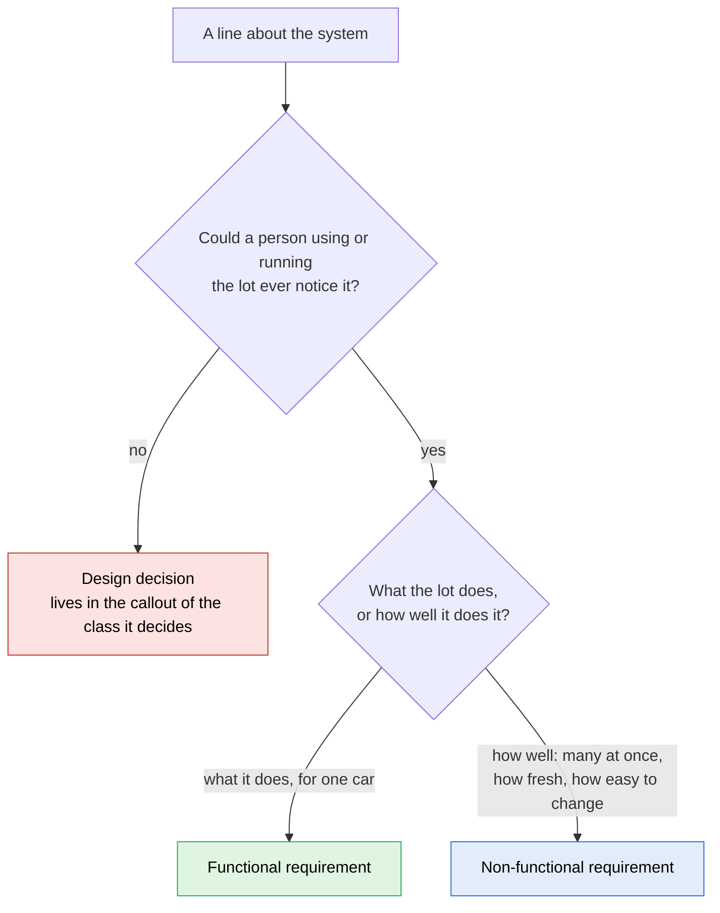
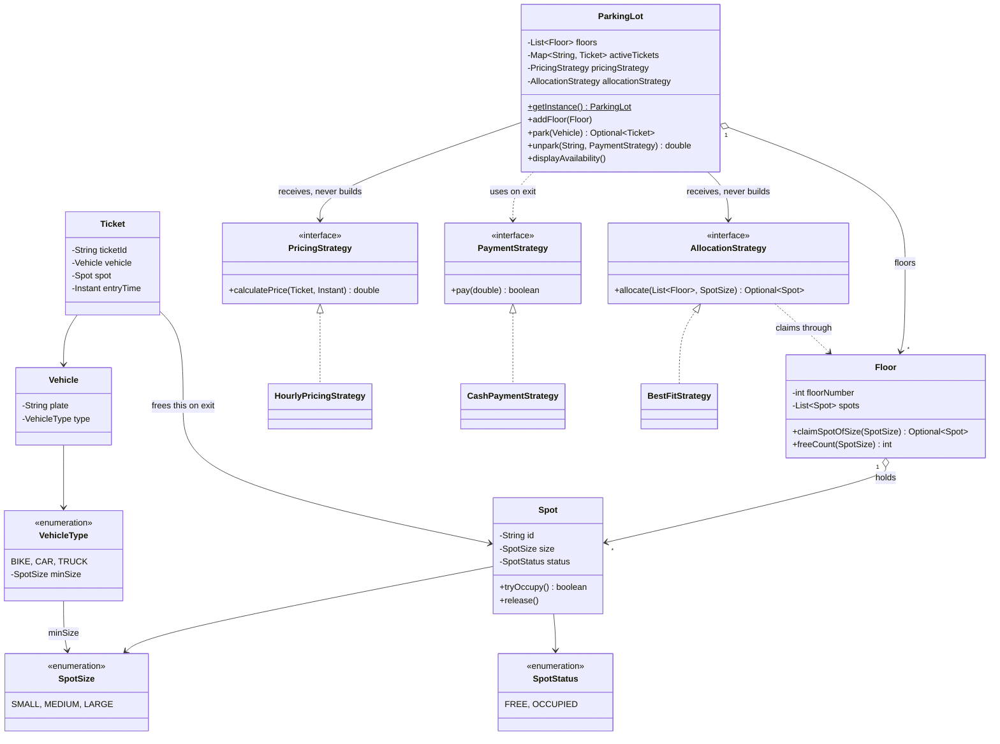

> [!abstract] Parking Lot
> Flavor A (domain modeling) · Target: 90 min from a blank editor · Patterns: Singleton, Strategy, Factory, Observer

---

## 📄 Problem Statement

Design a parking lot for a mall.

The lot has **multiple floors**, and each floor has **spots of different sizes**. A vehicle drives up to an entry gate, is assigned a spot, and receives a **ticket**. When it leaves, the fee is calculated from the time parked and the vehicle's type, the driver pays at the exit gate, and the spot is released.

Several entry gates operate at once, so two vehicles can arrive at the same instant.

---

## 🔍 FR, NFR or design: sorting what gets said in the first ten minutes

Every line said while clarifying lands in one of three buckets. Putting a line in the wrong bucket is how a requirements list ends up naming classes before any class exists, or promising behaviour the build never delivers. Two questions sort every line.


```mermaid
flowchart TD
    L[A line about the system] --> Q1{Could a person using or running<br/>the lot ever notice it?}
    Q1 -- no --> D[Design decision<br/>lives in the callout of the class it decides]
    Q1 -- yes --> Q2{What the lot does,<br/>or how well it does it?}
    Q2 -- what it does, for one car --> F[Functional requirement]
    Q2 -- how well: many at once,<br/>how fresh, how easy to change --> N[Non-functional requirement]
    classDef d fill:#fde2e2,stroke:#c0392b,color:#000
    classDef f fill:#dff5e1,stroke:#27ae60,color:#000
    classDef n fill:#e3ecfb,stroke:#2e6fd8,color:#000
    class D d
    class F f
    class N n
```

**Question 1 filters out design.** The people who can notice things are the driver (the gate, the ticket in hand, the spot they are sent to, the bill), the next driver, the admin reading the display, and the owner asking for a change. If none of them could ever tell the difference, the line is about how the code is built, not about the lot.

**Question 2 splits what is left.** What happens when one car arrives or leaves is functional. Whether that still holds when many cars arrive at once, how fresh a number has to be, and how cheaply a rule can be changed later are non-functional: qualities of the system rather than things it does.

| Line | Who could notice it | Bucket |
|---|---|---|
| A bike is sent to the smallest free spot it fits in | the biker, reading the spot on the ticket | **FR** |
| Floors are stored in a `Map` | nobody: a `List` sends the biker to the same spot | **Design** |
| `Spot.tryOccupy()` is `synchronized` | nobody directly | **Design** |
| Two gates at the same instant never get the same spot | the second driver, finding a car in their spot | **NFR** (many at once) |
| The spot is freed only after payment succeeds | the next driver, sent to a spot that still has a car in it | **FR** |
| A full lot returns `Optional.empty()` instead of throwing | nobody: the driver sees the same rejection either way | **Design** |
| The availability count may be a few seconds stale | the admin | **NFR** (freshness) |
| A weekend flat rate can be added without touching park and unpark | the owner, asking for the change | **NFR** (ease of change) |

> [!tip] One topic, two buckets, two different claims
> Pricing appears as FR5 and again in NFR3, and that is not a duplicate. FR5 states **today's** rule, which the driver reads on the bill. NFR3 states that **tomorrow** a different rule can be added without changing the parking flow, which only the owner asking for the change ever notices. Allocation splits the same way: FR3 is the rule in use, NFR3 is the freedom to swap it.

---

## ✅ Functional Requirements

1. **Floors.** A lot has multiple floors, each with a configurable number of spots.
2. **Spot sizes.** A spot is `SMALL`, `MEDIUM` or `LARGE`.
3. **Vehicles and fitting.** The lot supports bikes, cars and trucks. A vehicle gets the **smallest free spot it fits in, across the whole lot**; a bigger spot is used only when no spot of its own size is free anywhere.
4. **Ticket on entry.** The lot issues a ticket carrying a ticket id, the allocated spot and the entry time.
5. **Fee on exit.** The fee is computed from the time parked, **rounded up to the hour**, and the vehicle type. No exit until payment succeeds.
6. **Release on payment.** The spot becomes free **only when payment succeeds**. A declined payment leaves the ticket active and the spot occupied.
7. **No compatible spot.** Entry is rejected when no spot the vehicle fits in is free. Not when the lot is full: with every `LARGE` spot taken and forty `SMALL` spots free, a truck is still rejected.
8. **Exit validation.** Exit is rejected for an unknown ticket or a ticket that has already been paid.
9. **Gates.** The lot has several entry gates and several exit gates.
10. **Availability.** The admin sees free spot counts per floor and per size.

> [!question] FR3 is a clarifying question, not an assumption
> Interviewers do not share one rule here; some mean smallest compatible spot, some mean nearest floor. Ask, then commit out loud:
> > Should a bike stay on the floor it entered, or should we protect the big spots across the whole lot? I will default to the smallest compatible spot anywhere in the lot, so trucks are not turned away while bikes sit in large spots.

## ⚙️ Non-functional Requirements

1. **Concurrency.** With several gates working at the same instant, a spot is never given to two vehicles, and a ticket is paid at most once.
2. **Freshness.** The admin's availability count may be slightly stale. Locking the whole lot to count it would make every gate wait for the count.
3. **Ease of change.** A new pricing rule or a new allocation rule can be added without changing the parking flow.

### Out of scope (do not build)

Advance reservations · real payment gateway · multi-lot · pricing by floor · exit-gate barriers.


## 🔩 Classes

Every class below owns exactly one thing. If you can't say what a class owns in one sentence,it shouldn't exist — that test alone kills most of the clutter people add under time pressure.

We build bottom-up: fixed values first, then dumb containers, then the classes with logic.

### Enums

#### `SpotSize` — the ranking

> *"Classify parking spots by size and match them with appropriate vehicles"*

`SMALL, MEDIUM, LARGE`. This is the only place in the system where sizes are ordered, and the **declaration order is the ordering**: `ordinal()` gives each constant its position, so `SMALL < MEDIUM < LARGE` comes for free.

That ordering is what makes "a bike may use a car spot" expressible in code. Without a rank,`BIKE` and `CAR` are just two unrelated labels and no loop can walk from one to the other.

#### `VehicleType` — identity, plus the size it needs

> *"Support multiple vehicle types, including bikes, cars, and trucks"*

`BIKE, CAR, TRUCK`, each constant carrying the minimum `SpotSize` it fits in as a constructor field. Allocation reads `getMinSize()` and never asks which vehicle it is.

> [!tip] Allocation looks at what the vehicle needs, not at what the vehicle is
> The search loop never checks whether the vehicle is a bike, a car or a truck. It checks only one thing: the smallest spot size this vehicle needs. So adding a `VAN` that needs a `MEDIUM` spot changes nothing in the loop.
>
> Why say **needs** and not **size**? Because of the most common follow-up, electric cars:
>
> | Vehicle | What it needs |
> |---|---|
> | Car | a `MEDIUM` spot |
> | Electric car | a `MEDIUM` spot **with a charger** |
>
> A size cannot express with a charger. A medium spot with a charger is still just medium. So if the rule were allocation looks only at size, the charger would have nowhere to go.
>
> With the rule as needs, the charger fits in naturally. The vehicle's needs become size plus charger. Each spot records whether it has a charger. The loop matches the two.

> [!warning] Adding a vehicle type means editing the enum
> An enum is a fixed list. To add `MINI_TRUCK`, you open `VehicleType.java` and add one line. That is one changed file. Our extension target is stricter: one new file and zero changed files. So the enum misses it.
>
> The other option is one class per vehicle: `Bike`, `Car`, `Truck`, each in its own file. The AlgoMaster chapter does this (as noted on the first read of it, not re-checked since). There, adding a mini truck is one new file and nothing else changes.
>
> | | Enum (our build) | One class per vehicle |
> |---|---|---|
> | To add a mini truck | add 1 line to `VehicleType.java` | add a new file `MiniTruck.java` |
> | Files changed | 1 | 0 |
>
> We still pick the enum, for two reasons:
> 1. New vehicle types are rare.
> 2. Those classes would hold no behaviour, only a size. A class with no behaviour is just data pretending to be a class.
>
> Say this before the interviewer asks. The search loop needs zero edits, and that is true. But zero edits to the loop is not the same as zero changed files, and an interviewer who knows enums will point that out.

#### `SpotStatus`

`FREE, OCCUPIED`. Deliberately two values, and the missing third one is the decision.

> [!note] A lock is not a `LOCKED` status
> A held reservation — a `LOCKED` value plus a TTL plus a reaper to clean up abandoned holds —
> is only needed when there's a **human-sized gap** between claiming and confirming.
> BookMyShow has one: you pick seats, then spend four minutes entering card details, and you
> can't hold a mutex that long, so the hold has to become data.
> Parking has no gap. The car arrives and parks inside a single method call, microseconds apart.
> A mutex covers it, so `LOCKED` would buy nothing but a reaper you don't need.

### Data classes

#### `Vehicle`

A licence plate and a `VehicleType`. No behaviour, both fields final. It exists so that a plate and its type travel together instead of being passed as two loose arguments.

#### `Ticket`

> *"Issue a parking ticket upon vehicle entry and track entry and exit times"*

Ticket id, the `Vehicle`, the assigned `Spot`, and the entry time. Created on entry and never changed: every field is `final`. The exit time is not stored; `unpark` reads the clock once and hands that instant to pricing.

The `Spot` reference is the important field and it's the one people forget. Without it, exit means scanning every floor for the spot holding this vehicle — 2,500 checks on a 5×500 lot, every single time a car leaves. With it, exit is O(1).

### The classes with logic

#### `Spot`

An id, its `SpotSize`, its `SpotStatus`, and the one operation that matters:

`tryOccupy()` — `synchronized`, returns `boolean`. Checks free and marks occupied **as one
atomic step**, so two gates can never both win the same spot. Returning `false` rather than
throwing keeps a lost race on the normal path, where it belongs: two cars arriving together is
a Tuesday, not an exceptional condition.

> [!danger] The check-then-act race — why `tryOccupy()` exists
> ```java
> Spot s = findFree(size);      // both threads return S12   ← check
> s.setStatus(OCCUPIED);        // both write                 ← act
> ```
> `ConcurrentHashMap` does **not** fix this — each map call is individually safe, but the race
> spans two of them.
>
> **Lock per spot, not per lot.** Finding and claiming stay two steps, so the lot's search loop
> *is* the retry: when `tryOccupy()` returns `false`, it moves to the next candidate. Only the
> loser retries, and gates working on different spots never block each other.
> A single `synchronized` on `ParkingLot.park()` is also correct and simpler to write, but it
> serializes every entry in the building. Say which you chose and why.

> [!tip] Occupancy lives here, not on an association class
> Status splits onto an association (like `ShowSeat`) only when it varies over a **second
> dimension**. BookMyShow has time — one seat is free for the 6pm show and booked for the 9pm.
> Parking has only "now", so a plain field on `Spot` is correct.
> *Add advance reservations and that changes:* occupancy would move to a spot × time-window
> class. Name that in the interview; don't pre-build it.

> [!note] The spot does not hold the vehicle
> The ticket already links vehicle to spot. Storing it on the spot too means the same fact
> lives in two places and both must be updated on every exit.
> (The AlgoMaster chapter stores it, justified as "we need to know which vehicle is parked
> there to generate tickets" — but the lot creates the ticket and already holds the vehicle.)

#### `Floor`

> *"Support multiple parking floors, each with a configurable number of spots"*

A floor number and one flat `List<Spot>`. It answers two questions, both about one exact size: **can I have a free spot of this size?** `claimSpotOfSize(size)` walks the list and calls `tryOccupy()` on each spot of that size until one succeeds. **How many spots of this size are free?** `freeCount(size)` counts them for the availability display (FR10).

The floor knows nothing about fitting rules, nothing about vehicles, and nothing about other floors. Which size to ask for, and in what order, is the allocation strategy's job.

> [!tip] Why a flat list, not a map keyed by size
> A `Map<SpotSize, List<Spot>>` would let the floor jump straight to the spots of one size instead of checking every spot's size. But a floor holds a few hundred spots, and checking a few hundred sizes takes microseconds. The map costs more than it saves: a nested structure, a lookup per size, and a `null` to guard against when a size has no spots. A flat list reads in one go. If the interviewer asks about a floor with tens of thousands of spots, name the map as the optimization then; don't build it before anyone needs it.

> [!important] Whoever owns the data owns the code that builds it
> The constructor takes counts, `new Floor(1, 2, 2, 1)`, and fills its own list. It does **not** take a ready-made `List<Spot>` built by the caller. Hand-building that list in `Main` splits the knowledge: the driver would have to know how spot ids are formatted and that a new spot starts `FREE`.
> **The test that it landed in the right class: the caller's import list gets shorter.** `Main` should not import `ArrayList`, `List`, `SpotStatus` or `Spot`: those are the floor's internals. Importing `VehicleType` or `SpotSize` is fine. They are the domain's vocabulary, the words a caller needs to say what it wants.

> [!warning] Three positional counts tie the constructor to the size list
> `Floor(number, small, medium, large)` and `addSpots()` both name the three sizes, so adding `SpotSize.XL` for buses changes the constructor signature and every call that builds a floor. That is acceptable while the size list is fixed, and it is the simplest thing to type in 90 minutes. If the interviewer says sizes will change, take the counts as data instead:
> ```java
> new Floor(1, Map.of(SpotSize.SMALL, 2, SpotSize.MEDIUM, 2, SpotSize.LARGE, 1));
> ```
> `addSpots()` then loops over the map, and a new size is one more entry at the call site with zero edits to `Floor`. The line between allowed and not allowed is the one in the callout above: `Map<SpotSize, Integer>` is the caller's parameters, `List<Spot>` is the floor's internals.

#### `ParkingLot` — the orchestrator

> *"Automatically assign parking spots based on availability"*

Singleton. Holds a `List<Floor>` in the order floors were added, the active `PricingStrategy` and `AllocationStrategy`, and a `ConcurrentHashMap<String, Ticket>` of live tickets. Three operations: `park`, `unpark`, `displayAvailability`.

Every field is `private`, so nothing outside the lot can touch the ticket map or swap a floor list. Both strategies start with a default, best-fit and hourly at 100, so the lot works before anyone configures it. Without the pricing default, the first `unpark` on an unconfigured lot threw a `NullPointerException` (measured on the first build), and that car could never leave.

> [!tip] Floors in a `List`, not a `Map<Integer, Floor>`
> Nothing looks a floor up by its number; the lot only walks all floors in order. And best-fit's lowest floor first depends on that order. A `HashMap` promises no iteration order. Measured (JDK 25): floors 1 to 20 happened to come out in numeric order, but add basements and floors `-2` to `3` come out as `[-1, 0, -2, 1, 2, 3]`, so floor `-1` would be searched before floor `-2`. A `List` returns floors in the order they were added, every time.

`park()` derives the vehicle's `minSize`, hands the floors to the `AllocationStrategy`, wraps the claimed spot in a `Ticket`, and stores it. Four lines: it **sequences**, it doesn't search. The fitting walk itself lives in `BestFitStrategy`: sizes from `minSize` upward, every floor asked the exact-size question for one size before moving to the next size, `tryOccupy()` on each candidate, moving on if another gate won it. Smallest-fits across the whole lot (FR3) falls out of that walk order.

Keeping the walk behind one interface is the whole reason a new vehicle type, or a new allocation policy, costs zero edits to the orchestrator.

> [!note] No compatible spot is a return value, not an exception
> `park()` returns `Optional.empty()` when nothing fits (FR7). A truck arriving when every large spot is taken is a normal Saturday afternoon, so it stays on the normal path; an exception would make the gate code catch something that is not exceptional.

> [!tip] Eager singleton, not double-checked locking
> `static final ParkingLot INSTANCE = new ParkingLot();` with a `private ParkingLot() {}`. The JVM guarantees class initialization runs once and is thread-safe, so no lock is needed. The chapter uses double-checked locking with `volatile`: more code, more ways to get it wrong, and pointless when construction is cheap. Use the holder idiom if it ever isn't.

> [!warning] Forget the private constructor and the singleton is not enforced
> Without `private ParkingLot() {}`, Java supplies a public constructor and `new ParkingLot()` compiles anywhere. Measured on the first build, which left it out: `new ParkingLot() == ParkingLot.getInstance()` printed `false`. With the private constructor in place, the same call fails to compile with `ParkingLot() has private access in ParkingLot`.

> [!bug] The build double-charges a ticket scanned at two exits at once
> The build's `unpark()` reads the ticket with `get()`, takes payment, and only then calls `remove()`. Two exit gates scanning the same ticket both pass the `get()` before either removes it: the same check-then-act race as `park()`, on the exit side. Measured on a copy of the build with a payment that takes 200 ms: both scans printed `paid 100.0` and the card was charged twice. The fix is under Key code; the build in `ParkingLot/src` still has the bug until the Day 12 rebuild.

#### `PricingStrategy` + `HourlyPricing`, `FlatRatePricing`

> *"Calculate fees based on duration, and support different pricing strategies"*

`calculatePrice(Ticket, exitTime) → double`. The trigger is NFR3: the interviewer has said pricing will change, and what pricing changes is a stock follow-up. An interface rather than a rate parameter, because the next rule has a different **shape**: hourly scales with duration, a flat weekend rate ignores duration entirely, so no single formula with a parameter can express both.

Each implementation holds its own config: `HourlyPricing` a rate, `FlatRatePricing` an amount. The lot **receives** a strategy; it never constructs one.

> [!bug] The build prices every vehicle the same
> FR5 prices by vehicle type, but the build has only `HourlyPricingStrategy` with one rate for all vehicles, and no `FlatRatePricing`. Per-type rates (a rate per `VehicleType`, read in `calculatePrice`) are a Day 12 rebuild target.

#### `PaymentProcessor`

`pay(amount) → boolean`, stubbed. It exists only so the failure path is real: the spot is freed
**only when this returns true**. Free it earlier and a declined card leaves a car sitting in a
spot the system believes is empty, and the next driver gets sent into it.

> [!note] Why `Payment` and `PaymentStatus` were cut
> A real gateway is out of scope, and a status enum with no transitions to protect is ceremony.
> A boolean is enough to exercise the only rule that matters here.

#### `AllocationStrategy` + `BestFitStrategy`

`allocate(floors, minSize) → Optional<Spot>`, returning a spot it has **already claimed**. `park()` delegates to it, so the orchestrator sequences and the strategy searches.

`BestFitStrategy` is the one FR3 describes: sizes in the outer loop, floors in the inner loop. Every floor is asked for the smallest size before any floor is asked for the next size, so a bike never takes a car spot while a bike spot is free anywhere. The driver shows it: with one `SMALL` spot on floor 1 and two on floor 2, bikes 1 to 3 take all three `SMALL` spots, and only bike 4 gets `1-MEDIUM-0`.

> [!tip] First-fit is the alternative to name, not to build
> Swap the loops, floors outer and sizes inner, and the first floor with any fitting spot wins: a bike stays on its floor and takes a car spot there rather than walking up a level. That breaks FR3 lot-wide. Measured on a copy of the earlier build, which shipped first-fit as its default: the second bike went to `1-MEDIUM-0` while floor 2 still had two `SMALL` spots free. In the room, say that first-fit drops in as a second class with zero edits to the lot, and leave it unbuilt.

> [!tip] Why the interface is worth it with one implementation
> Two reasons, and neither is that it shows the code could be extended someday, which is the justification bar point 5 rejects. First, it **lifts the search loop out of `park`**: the orchestrator shrinks to four lines, so the interface removes code rather than wrapping one class and removing nothing. Second, a requirement asks for it: NFR3 makes allocation swappable.

---

## 🧱 Class Diagram


```mermaid
classDiagram
    direction TB

    class ParkingLot {
        -List~Floor~ floors
        -Map~String, Ticket~ activeTickets
        -PricingStrategy pricingStrategy
        -AllocationStrategy allocationStrategy
        +getInstance()$ ParkingLot
        +addFloor(Floor)
        +park(Vehicle) Optional~Ticket~
        +unpark(String, PaymentStrategy) double
        +displayAvailability()
    }
    class Floor {
        -int floorNumber
        -List~Spot~ spots
        +claimSpotOfSize(SpotSize) Optional~Spot~
        +freeCount(SpotSize) int
    }
    class Spot {
        -String id
        -SpotSize size
        -SpotStatus status
        +tryOccupy() boolean
        +release()
    }
    class Ticket {
        -String ticketId
        -Vehicle vehicle
        -Spot spot
        -Instant entryTime
    }
    class Vehicle {
        -String plate
        -VehicleType type
    }
    class VehicleType {
        <<enumeration>>
        BIKE, CAR, TRUCK
        -SpotSize minSize
    }
    class SpotSize {
        <<enumeration>>
        SMALL, MEDIUM, LARGE
    }
    class SpotStatus {
        <<enumeration>>
        FREE, OCCUPIED
    }
    class PricingStrategy {
        <<interface>>
        +calculatePrice(Ticket, Instant) double
    }
    class PaymentStrategy {
        <<interface>>
        +pay(double) boolean
    }
    class AllocationStrategy {
        <<interface>>
        +allocate(List~Floor~, SpotSize) Optional~Spot~
    }

    ParkingLot "1" o--> "*" Floor : floors
    ParkingLot --> PricingStrategy : receives, never builds
    ParkingLot --> AllocationStrategy : receives, never builds
    ParkingLot ..> PaymentStrategy : uses on exit
    Floor "1" o--> "*" Spot : holds
    Spot --> SpotSize
    Spot --> SpotStatus
    Ticket --> Spot : frees this on exit
    Ticket --> Vehicle
    Vehicle --> VehicleType
    VehicleType --> SpotSize : minSize
    AllocationStrategy ..> Floor : claims through
    PricingStrategy <|.. HourlyPricingStrategy
    PaymentStrategy <|.. CashPaymentStrategy
    AllocationStrategy <|.. BestFitStrategy
```

---

## 🔑 Key code (the load-bearing bits — revise these, not the whole file)

**What the vehicle needs, not what it is**: `VehicleType` carries its `minSize` as an enum-constructor field, and the search reads only that. Adding `MINI_TRUCK` is one new constant in this file and no other edit.

```java
public enum VehicleType {

    BIKE(SpotSize.SMALL), 
    CAR(SpotSize.MEDIUM), 
    TRUCK(SpotSize.LARGE);
    
    private final SpotSize minSize;
    
    VehicleType(SpotSize minSize) { this.minSize = minSize; }
    
    public SpotSize getMinSize() { return minSize; }
}
```

**The concurrency answer** — `tryOccupy()` makes check-and-claim one atomic step, so two gates can't win the same spot. The search loop *is* the retry: a lost race returns `false`, caller moves on.

```java
public synchronized boolean tryOccupy() {
    if (status == SpotStatus.FREE) { status = SpotStatus.OCCUPIED; return true; }
    return false; // someone beat me → caller tries next spot
}
public synchronized void release() { status = SpotStatus.FREE; }
```

**Smallest fit across the lot (FR3)**: `Floor` answers only the exact-size question over its flat list; `BestFitStrategy` walks sizes from `minSize` upward and asks every floor at each size before going bigger. `SpotSize.values()` returns the constants in declaration order, and `ordinal()` is each one's position in that order (`SMALL` 0, `MEDIUM` 1, `LARGE` 2), so `size.ordinal() < minSize.ordinal()` means too small.

```java
// Floor: claim a free spot of EXACTLY this size
public Optional<Spot> claimSpotOfSize(SpotSize size) {
    for (Spot spot : spots)
        if (spot.getSize() == size && spot.tryOccupy()) {
	        return Optional.of(spot);
        }
    return Optional.empty();
}

// BestFitStrategy: sizes outer, floors inner
public Optional<Spot> allocate(List<Floor> floors, SpotSize minSize) {
    for (SpotSize size : SpotSize.values()) {
        if (size.ordinal() < minSize.ordinal()) continue; // too small, skip
        for (Floor floor : floors) {
            Optional<Spot> spot = floor.claimSpotOfSize(size);
            if (spot.isPresent()) return spot;
        }
    }
    return Optional.empty();
}
```

**`park` sequences, doesn't search** — derives `minSize`, delegates to the `AllocationStrategy`,
wraps in a `Ticket`. `Optional.empty()` = no compatible spot free (FR7, a clean return, not an exception).

```java
public Optional<Ticket> park(Vehicle vehicle) {
    SpotSize minSize = vehicle.getType().getMinSize();
    Optional<Spot> spot = allocationStrategy.allocate(floors.values(), minSize);
    if (spot.isEmpty()) return Optional.empty();          // lot full
    Ticket ticket = new Ticket(vehicle, spot.get());
    activeTickets.put(ticket.getTicketId(), ticket);
    return Optional.of(ticket);
}
```

**`unpark`: claim the ticket first, release on success only** (FR6, FR8, NFR1). `remove()` on a `ConcurrentHashMap` is atomic and returns the ticket to exactly one caller, so a second scan of the same ticket gets `null` and is rejected. A declined payment puts the ticket back and leaves the spot `OCCUPIED`, because the car is still there.

```java
public double unpark(String ticketId, PaymentStrategy payment) {
    Ticket ticket = activeTickets.remove(ticketId);          // claim: only one exit gets it
    if (ticket == null)
        throw new IllegalArgumentException("Unknown or already-used ticket: " + ticketId);
    Instant now = Instant.now();
    double fee = pricingStrategy.calculatePrice(ticket, now);
    if (!payment.pay(fee)) {
        activeTickets.put(ticketId, ticket); // declined: ticket active again
        throw new IllegalStateException("Payment failed for " + ticketId);
    }
    ticket.getSpot().release();       // only on success
    return fee;
}
```

**Integer ceil pricing** — `(a + b - 1) / b`, min 1 hour, no floating point.

```java
long minutes = Duration.between(t.getEntryTime(), exitTime).toMinutes();
long hours = Math.max(1, (minutes + 59) / 60); // ceil(minutes/60), min 1 hour
return hours * hourlyRate;
```

## 🎯 Strong-hire talking points (SDE-2, 3–4 YOE — say these out loud)

Researched against senior LLD rubrics. The build is at the bar; these are the *spoken* gaps that
separate hire from strong-hire — they cost zero code.

- **Deadlock-freedom.** The classic parking-lot deadlock is "car holds a floor lock *and* waits for
  a spot lock." We avoid it structurally: **only one lock is ever held — the spot's** (`tryOccupy`).
  No nested locks → no deadlock. Say this; it's the difference between "I used a lock" and "I
  reasoned about lock ordering."
- **The exit side has the same race.** Everyone guards `park()`; the probe is whether you also guard `unpark()`. Two exit gates scanning one ticket is check-then-act on the ticket map, and the cost is a double charge. Answer: claim the ticket with an atomic `remove()` before taking payment, and put it back if payment is declined.
- **Optimistic locking = the distributed answer.** Single-JVM uses `synchronized` per spot
  (pessimistic). Make it multi-node and that becomes a **version column + CAS**:
  `UPDATE spot SET status=OCCUPIED WHERE id=? AND version=?` — retry on 0 rows updated. Name this
  when asked "now make it distributed." (See [[CLAUDE#Concurrency control cheat-sheet]].)
- **Lock granularity, stated as a choice.** Per-spot lock (fine-grained, high throughput) vs one lock
  on the lot (simple, serializes every gate). We chose per-spot; say *why* — the lot lock makes two
  gates on different floors block each other for no reason.
- **Fair queue (if pushed on ordering).** If cars must be served first-come-first-served under
  contention, a fair `ReentrantLock(true)` or a request queue — name it, don't build it.
