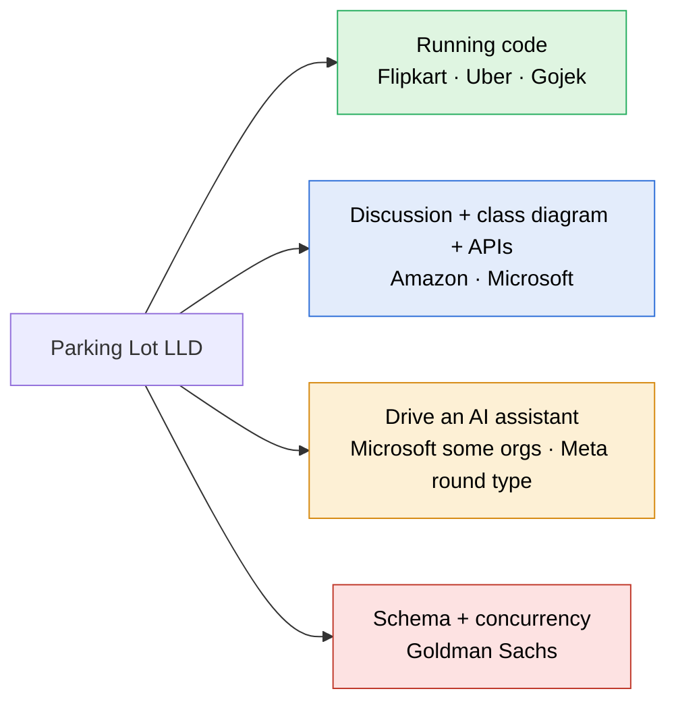

> [!abstract] Parking Lot: who asks it, in what format, and what our requirements leave out
> Web research against candidate reports and reference specs. No public source counts how often each company asks it, so companies are ranked by the number of independent reports found, and each row says how strong its evidence is.

---

## Which companies ask it, and in what format

| Company | Evidence | Format | What they expect |
|---|---|---|---|
| **Flipkart** | Strong: several candidate write-ups | **Machine coding, running code.** 2.5 hours split as 30 min brief, 90 min coding, 30 min review. Around 20 candidates on one call get the same problem. | Code that runs and prints output for their inputs. The review probes patterns, naming and modularity, and feeds new inputs to test the logic. In-memory `HashMap` storage is fine; no database. |
| **Gojek** | Strong: dozens of public repos of the same take-home | **Take-home, running code.** A command-line app: `create_parking_lot n`, `park <reg> <colour>`, `leave <slot>`, `status`, plus queries by colour and by registration number. | Commands read from a file and interactively. Clean, tested code. |
| **Amazon** | Strong: called the classic Amazon question across several sources | **Discussion, usually no compiling.** 45 to 60 minutes, about 25 of them on Leadership Principles. | Entities, a class diagram, **API signatures**, patterns, extensibility. Deep follow-ups on the API design. |
| **Microsoft** | Medium: a 2026 SDE-2 report gave the choice of vending machine or parking lot | **LLD discussion** with a deep dive on SOLID and on State or Strategy. Some orgs (CoreAI, Copilot-adjacent teams, SDE II) run an **AI-assisted variant** with GitHub Copilot. | In the AI variant: whether you direct the assistant, check its suggestions and debug what it produces, not whether you can type the syntax. |
| **Uber** | Medium: SDE-2 screening reports | **Machine coding / LLD.** Classes, interfaces and relationships, with OOP theory questions along the way. | Reported twist: at busy times, four bikes can park in one car spot. |
| **Goldman Sachs** | Medium: Glassdoor plus practice-site tags | **LLD on CoderPad.** Variants: plain, pricing system, multi-threaded. | Class hierarchy, an **SQL schema with queries over assumed tables**, and concurrency. |
| Google, Adobe, Grab | Weak: listed by aggregator blogs only, no first-hand report found | Unknown | |
| **Meta** | No parking-lot report found | **AI-enabled coding round.** 60 minutes, multi-file CoderPad, a choice of models. | Can include object-oriented design problems. Graded on problem solving, code quality, **verification** and communication. |

> [!note] Rippling does not ask it
> Reported Rippling LLD rounds are a key-value store with transactions (then nested transactions), an Excel sheet with formulas and cell references, and a music-player play-count problem. Parking Lot stays in the track for the patterns it carries, not for Rippling.

### What each round type needs from our note

| Round type | Companies | What it needs |
|---|---|---|
| Running code in 90 minutes | Flipkart, Uber, Gojek | A build from a blank editor with a driver that prints every use case: the core of the track |
| Discussion with diagram and APIs | Amazon, Microsoft | An **API signatures** block: `park`, `unpark`, `findVehicle`, `availability` |
| Driving an AI assistant | Microsoft some orgs, Meta | Directing the assistant one component at a time and catching the bug in what it writes |
| Schema and concurrency | Goldman Sachs | A `spot` and `ticket` table schema, plus the optimistic-lock `UPDATE ... WHERE version = ?` |

---

## What our requirements leave out

Ranked by how often the gap appears across the sources.

| # | Missing | Who asks | What it does to our design |
|---|---|---|---|
| 1 | **Spot types beyond size**: EV charging, handicapped | Grokking twelve-requirement spec, HelloInterview, Amazon prep sites | **High.** Our allocation ranks spots by size alone. A medium spot with a charger is a **capability**, independent of its size. The follow-up most likely to break the allocation loop. |
| 2 | **Search by vehicle**: which slot holds registration X, every car of colour Y | Gojek core commands, the search-vehicle variant on practice sites | **Medium.** Needs a second index from plate to ticket; today, finding a plate means scanning every active ticket. |
| 3 | **Several payment methods** (cash, card) at an exit panel, an attendant, or a per-floor portal | Grokking | **Low.** `PaymentStrategy` and `CashPaymentStrategy` already exist in the build; no FR states it. |
| 4 | **Admin changes while the lot runs**: add or remove a floor or a spot, change rates | Grokking use cases | **Medium.** Raises a real question: what happens to a spot removed while a car is in it. |
| 5 | **Tiered hourly pricing**: first hour at one rate, later hours cheaper | Grokking | **Low.** One more `PricingStrategy`. |
| 6 | **A display board on each floor for drivers** | Grokking | **Low.** Our FR10 shows availability to the admin only; the reference adds drivers on every floor. Same data. |
| 7 | **One spot holding several vehicles**: four bikes in a car spot at busy times | Uber | **High if asked.** Breaks the two-value `SpotStatus`: a spot becomes a count against a capacity. |
| 8 | **Persistence**: table schema and API contract | Goldman Sachs, Amazon, a LeetCode thread on LLD with API spec and DB schema | **Medium** for those two companies; not needed for machine coding. |

> [!question] One addition with no source behind it
> Reject entry for a plate that already holds an active ticket. It is the entry-side mirror of FR8, which rejects exit for a ticket already used. Reasoned, not found in any source.

> [!success] Already covered, and matching the references
> Multiple floors · multiple gates · ticket on entry · size fallback · rejection when nothing fits · exit validation for unknown or used tickets · payment before release · concurrency on both entry and exit.

---

## Sources

- [Grokking OOD: Design a Parking Lot (requirements, actors, use cases)](https://github.com/tssovi/grokking-the-object-oriented-design-interview/blob/master/object-oriented-design-case-studies/design-a-parking-lot.md)
- [HelloInterview: Parking Lot LLD](https://www.hellointerview.com/learn/low-level-design/problem-breakdowns/parking-lot)
- [DesignGurus: Designing a Parking System](https://www.designgurus.io/blog/design-parking-system)
- [DEV: LLD Interviews and the Rules Behind a Parking Lot](https://dev.to/sarah23/low-level-design-interviews-and-the-rules-behind-a-parking-lot-71)
- [Flipkart SDE-2 interview experience (Medium)](https://medium.com/@anmol15554/flipkart-interview-experience-for-sde-2-9b7fbfadbdf1)
- [Flipkart interview process (FinalRound)](https://www.finalroundai.com/blog/flipkart-interview-process)
- [Machine Coding Round guide (LLD Mastery)](https://www.lowleveldesignmastery.com/blog/machine-coding-round/)
- [Gojek parking lot assignment](https://developerinsider.co/gojek-parking-lot-assignment-using-python/)
- [Gojek parking lot repo](https://github.com/themaverikk/parking-lot)
- [Amazon SDE 2 interview (IGotAnOffer)](https://igotanoffer.com/en/advice/amazon-sde-2-interview)
- [Amazon parking lot (FinalRound)](https://www.finalroundai.com/interview-questions/amazon-system-design-parking-lot)
- [Microsoft SDE-2 interview experience (LeetCode)](https://leetcode.com/discuss/post/7769548/)
- [Microsoft AI-assisted coding guide (PracHub)](https://prachub.com/resources/microsoft-ai-assisted-coding-interview-guide-2026-tools-rules-and-scoring)
- [Microsoft SWE AI-assisted coding (Coditioning)](https://www.coditioning.com/blog/408/microsoft-swe-ai-copilot-coding)
- [Uber SDE-2 interview experience (roundz)](https://roundz.substack.com/p/interview-experience-169-uber-sde2)
- [Uber SDE-2 LLD and HLD rounds (1point3acres)](https://www.1point3acres.com/interview/post/7896720)
- [Goldman Sachs: Design a parking lot (Glassdoor)](https://www.glassdoor.com/Interview/Design-a-system-to-manage-a-parking-lot-QTN_93784.htm)
- [Goldman Sachs LLD questions (CodeZym)](https://codezym.com/lld/goldmansachs)
- [LeetCode: Parking Lot LLD, API spec, DB schema](https://leetcode.com/discuss/interview-question/6114469/Parking-Lot-LLD-API-spec-DB-schema/)
- [Meta AI-assisted coding interview (interviewing.io)](https://interviewing.io/blog/how-to-use-ai-in-meta-s-ai-assisted-coding-interview-with-real-prompts-and-examples)
- [Meta AI-enabled coding interview format (AmigoHelp)](https://www.amigohelp.ai/blog/meta-ai-enabled-coding-interview/)
- [Rippling SDE-2 interview experience (LeetCode)](https://leetcode.com/discuss/post/5868538/rippling-sde-2-interview-experience-2024-m9aw/)
- [Rippling: key-value store with transactions (darkinterview)](https://darkinterview.com/collections/rippling/questions/601e6b2b-1b57-46d5-87d3-18576339a0e4)
- [Top 20 LLD interview questions (LLD Mastery)](https://www.lowleveldesignmastery.com/blog/low-level-design-interview-questions/)
