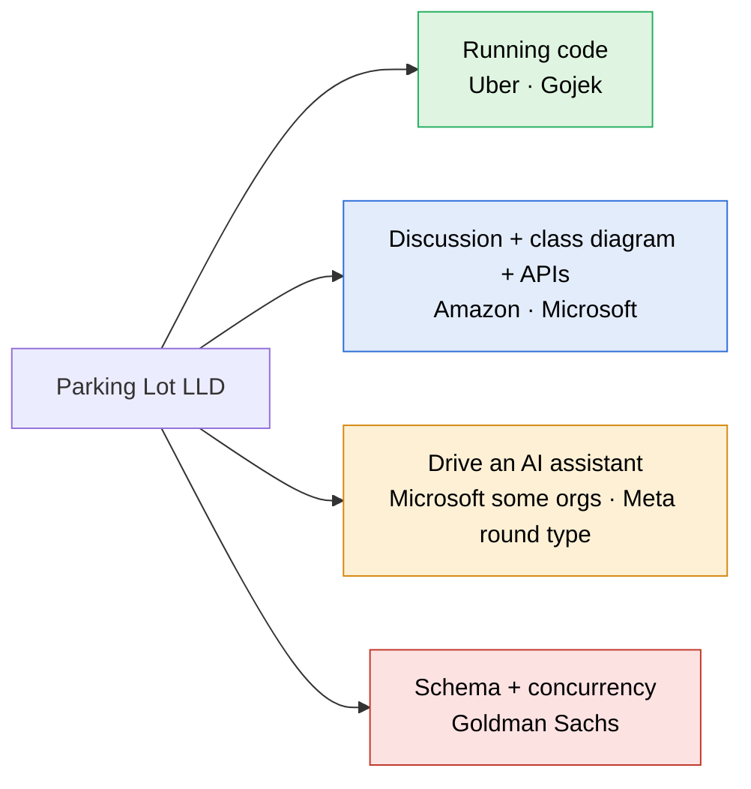

> [!abstract] Parking Lot: who asks it, in what format, and what our requirements leave out
> Web research against candidate reports and reference specs. No public source counts how often each company asks it, so companies are ranked by the number of independent reports found, and each row says how strong its evidence is and how recent it is.

> [!warning] What was read in full and what was not
> The Medium, LeetCode, IGotAnOffer and CodeZym pages were read in full through a browser, after plain fetches were refused. The 1point3acres page sits behind a bot check and was not read. The Glassdoor Goldman Sachs question page no longer exists. Where a row still says search summary, the wording came from a search engine's summary, not from the page.

---

## Which companies ask it, and in what format



| Company | Evidence and date | Format | What they expect |
|---|---|---|---|
| **Flipkart** | **No confirmed parking-lot report.** The SDE-2 write-up read in full (interview May 2024, published 2024-06-20) was asked to design a **wallet system**, not a parking lot. Flipkart appears for the parking lot only in practice-site tags. The format column below is from that write-up and holds for the round in general. | **Machine coding, running code.** 2.5 hours split as 30 min brief, 90 min coding, 30 min review. Around 20 candidates on one call get the same problem. | Code that runs and prints output for their inputs. The review probes patterns, naming and modularity, and feeds new inputs to test the logic. In-memory `HashMap` storage is fine; no database. |
| **Gojek** | Strong for the statement, which is read verbatim from candidate repos (see below). **Old: the repos date from 2017 to 2019**, and nothing newer shows the take-home is still used. | **Take-home, running code.** A command-line app: `create_parking_lot n`, `park <reg> <colour>`, `leave <slot>`, `status`, plus queries by colour and by registration number. | Commands read from a file and interactively. Clean, tested code. |
| **Amazon** | Medium: IGotAnOffer's list headed Example system design questions asked at Amazon, introduced as the most common according to reports, includes: Parking lot system (three floors and two vehicle sizes, big and small; small ones fit into big spots. Read on the page. Undated, and second-hand rather than a candidate report. | **Discussion, usually no compiling.** 45 to 60 minutes, about 25 of them on Leadership Principles. | Entities, a class diagram, **API signatures**, patterns, extensibility. Deep follow-ups on the API design. |
| **Microsoft** | **Weak.** The 2026 SDE-2 report (LeetCode, 2026-04-04) was read in full and does say Vending Machine or Parking Lot, with a deep dive on SOLID and State or Strategy. But two of its four comments call it a fake post, and nothing else confirms it. | **LLD discussion** with a deep dive on SOLID and on State or Strategy. Some orgs (CoreAI, Copilot-adjacent teams, SDE II) run an **AI-assisted variant** with GitHub Copilot. | In the AI variant: whether you direct the assistant, check its suggestions and debug what it produces, not whether you can type the syntax. |
| **Uber** | **Strong, read in full.** Uber L4, 5 years of experience, interview June 2024 (published 2024-09-17): the LLD and machine coding round asked to design the parking lot. The roundz SDE-2 write-up (2025-08-25) does not name its problem. | **One hour, design then code.** 40 minutes went on the class diagram and discussion, leaving 20 to code. The candidate wrote every entity and service but could not run the code in time, and was rejected with a correct design. | A twist of four bikes parking in one car spot at busy times appeared only in a search summary with no source that could be opened. Treat it as unverified. |
| **Goldman Sachs** | Weak: the Glassdoor question page no longer exists. What remains is CodeZym's tags (Design a Parking Lot, Design Parking Lot Pricing System, Design a Parking Lot - Multi-Threaded) and a search summary mentioning SQL queries. | **LLD on CoderPad.** Variants: plain, pricing system, multi-threaded. | Class hierarchy, an **SQL schema with queries over assumed tables**, and concurrency. |
| Google, Adobe, Grab | Weak: listed by aggregator blogs only, no first-hand report found | Unknown | |
| **Meta** | No parking-lot report found | **AI-enabled coding round.** 60 minutes, multi-file CoderPad, a choice of models. | Can include object-oriented design problems. Graded on problem solving, code quality, **verification** and communication. |

> [!danger] The Uber L4 rejection is the timing lesson
> One hour, a correct design, and a rejection: 40 minutes of discussion left 20 minutes of coding, and the code never ran. This is the case for writing `Main` first and keeping design talk short. A running ordinary design beats a correct design that does not run.

### How recent is the evidence

| Source | Date | What it shows |
|---|---|---|
| Microsoft SDE-2 report | 2026-04-04 | Parking lot or vending machine; commenters call the post fake |
| Uber L4 write-up | interview June 2024 | Parking lot, one hour, rejected because the code did not run |
| Flipkart SDE-2 write-up | interview May 2024 | Wallet system, not a parking lot |
| Microsoft AI-assisted round guides | 2026 | Copilot allowed in some orgs |
| Meta AI-enabled coding round | rolled out from October 2025 | object-oriented problems possible with an AI assistant |
| roundz Uber SDE-2 write-up | 2025-08-25 | machine coding round, problem not named |
| HelloInterview breakdown | current | reference prompt and requirements |
| Gojek take-home repos | 2017 to 2019 | the only verbatim company statement |
| IGotAnOffer Amazon list | undated | Parking lot among the most common Amazon design questions |
| Glassdoor Goldman Sachs question | page removed | nothing left to read |

So the firm evidence after 2023 is one candidate report: Uber L4, June 2024. The 2026 Microsoft report may be fake, the Amazon list is undated, and the verbatim company statement (Gojek) is older than 2020. Prep sites keep listing the problem, which says it is still practised, not that it is still asked.

> [!note] Rippling does not ask it
> Reported Rippling LLD rounds are a key-value store with transactions (then nested transactions), an Excel sheet with formulas and cell references, and a music-player play-count problem. Parking Lot stays in the track for the patterns it carries, not for Rippling.

### What each round type needs from our note

| Round type | Companies | What it needs |
|---|---|---|
| Running code in 60 to 90 minutes | Uber (one hour, design and code together), Gojek | A build from a blank editor with a driver that prints every use case: the core of the track |
| Discussion with diagram and APIs | Amazon, Microsoft | An **API signatures** block: `park`, `unpark`, `findVehicle`, `availability` |
| Driving an AI assistant | Microsoft some orgs, Meta | Directing the assistant one component at a time and catching the bug in what it writes |
| Schema and concurrency | Goldman Sachs | A `spot` and `ticket` table schema, plus the optimistic-lock `UPDATE ... WHERE version = ?` |

---

## Problem statements to practise, with time limits

Every statement below is stored here so it never has to be fetched again. Each one is word for word from its source unless marked.

> [!info] Two kinds of time limit
> **Stated** means the source gives the time. **Practice box** is our own limit where the source gives none, set to the shortest real round that asks this problem. Every limit covers design and code together, and the clock starts when the prompt is read.

| # | Prompt | Source | Time limit | What to hand in |
|---|---|---|---|---|
| 1 | Design the parking lot | Uber L4, June 2024 | **60 min, stated**: design and machine coding in one round | Classes, then code that runs |
| 2 | Three floors, big and small vehicles | Amazon, via IGotAnOffer | **About 25 min of design, from a search summary**: a 45 to 60 min round shared with Leadership Principles | Classes, API signatures, where the patterns go; no compiling |
| 3 | Multi-threaded lot with a fixed API | CodeZym | **60 min, practice box** | Code against their exact API, thread-safe |
| 4 | n slots with colour and registration queries | Gojek take-home, 2017 to 2019 | **90 min, practice box**; the take-home deadline is not in the source | A command-line app that reads commands from a file and interactively |
| 5 | Vehicle types, spot assignment, fee on exit | HelloInterview reference | **60 min, practice box** | Matches our FR list almost one to one |

> [!tip] If the round is Flipkart-style
> The Flipkart SDE-2 write-up (May 2024, a wallet system that time) gives the format that any Flipkart machine-coding problem runs on: **30 min to read and clarify, 90 min to code, 30 min review** where the reviewer feeds new inputs and questions naming and modularity. Stated.

### 1. Uber L4: design the parking lot (60 min)

> The interviewer asked me to design the parking lot.

That is the whole prompt as the candidate reported it; every requirement comes from your own clarifying questions. The round was low-level design and machine coding together, one hour. The candidate spent 40 minutes on the class diagram and discussion, had 20 left, wrote every entity and service, could not run the code, and was rejected with a correct design.

The split to aim for:

```
 0–10   clarify, name the classes out loud (no diagram drawing)
10–50   code; Main running by minute 25, then add layers
50–60   demo + the concurrency answer
```

| Layer | What | Runs after it? |
|---|---|---|
| 1 | Enums, `Vehicle`, `Spot.tryOccupy`, `Ticket`, `Floor`, `ParkingLot.park` and `unpark`, `Main` | Park, exit, no compatible spot |
| 2 | `PricingStrategy` with hourly pricing | Plus fees |
| 3 | The search moved into `BestFitStrategy` behind `AllocationStrategy` | Plus swappable allocation |
| 4 | `PaymentStrategy`, the declined-payment path, the exit-race fix | The full build |

Whatever layer the clock stops at, it runs; the layers not reached are said out loud.

### 2. Amazon: three floors, two vehicle sizes (about 25 min of design)

> Parking lot system (three floors and two vehicle sizes, big and small; small ones fit into big spots

As captured from IGotAnOffer's list headed Example system design questions asked at Amazon; the end of the line may have been cut off in capture. The round length (45 to 60 minutes, about half of it Leadership Principles) comes from a search summary, not a page.

Hand in by talking, not compiling: the classes and who holds whom, the public operations with their signatures (`park(Vehicle) → Optional<Ticket>`, `unpark(ticketId, payment) → fee`, `availability()`), which pattern goes where and why, and the concurrency answer. In our terms this is `SpotSize` with two values and three floors; the fallback rule is FR3.

### 3. CodeZym: multi-threaded, fixed API (60 min practice box)

Read in full. The site tags it as asked at Amazon, Microsoft, Goldman Sachs, Uber, Salesforce, Adobe, Walmart, Flipkart, Swiggy and others; the tags are the site's own and cannot be checked.

> Write code for low level design of a parking lot system. The parking lot has two kinds of parking spaces: type = 2, for 2 wheeler vehicles and type = 4, for 4 wheeler vehicles.
>
> There are multiple floors in the parking lot. On each floor, vehicles are parked in parking spots arranged in rows and columns. For simplicity, lets assume that each floor will have same number of rows and each row will have same number of columns.
>
> Some of the parking spots are inactive. You can't park your vehicle in those spots.
>
> For Java, your code will be tested in a multi-threaded environment. So make sure that you take care of thread safety and synchronization.

```
init(Helper helper, String[][][] parking)
    parking[i][j][k] = spot on floor i, row j, column k
    "4-1" active 4-wheeler · "2-1" active 2-wheeler · "4-0" and "2-0" inactive

park(int vehicleType, String vehicleNumber, String ticketId)        → ParkingResult(status, spotId, vehicleNumber, ticketId)
    spotId = floor + "-" + row + "-" + column, e.g. "2-0-15"

removeVehicle(String spotId, String vehicleNumber, String ticketId) → 201 success, 404 failure
    exactly one of the three arguments is non-blank

searchVehicle(String spotId, String vehicleNumber, String ticketId) → ParkingResult
    exactly one argument non-blank; must still find the last spotId after the vehicle has left

getFreeSpotsCount(int floor, int vehicleType)                       → int
```

Constraints: type 2 or 4; 1 to 5 floors; rows × columns up to 10,000 per floor.

Their first example, one floor, 4 × 4:

```
parking = [[
  ["4-1","4-1","2-1","2-0"],
  ["2-1","4-1","2-1","2-1"],
  ["4-0","2-1","4-0","2-1"],
  ["4-1","4-1","4-1","2-1"]]]

park(4, "bh234", "tkt4534")        → {status: 201, spotId: "0-3-1", vehicleNumber: "bh234", ticketId: "tkt4534"}
searchVehicle("", "bh234", "")     → same result, spotId "0-3-1"
getFreeSpotsCount(0, 4)            → 5
removeVehicle("", "", "tkt4534")   → 201, and getFreeSpotsCount(0, 4) is 6 again
```

The spotId returned can differ with the implementation. Against our design: no fallback to bigger spots, inactive spots, no pricing, and search by plate or ticket that still works after exit, which needs a history map beside the live ticket map.

### 4. Gojek: n slots, colour and registration queries (90 min practice box)

Read verbatim from a candidate's repo of the take-home; repos of this assignment date from 2017 to 2019.

> Design a Parking lot which can hold `n` Cars. Every car been issued a ticket for a slot and the slot been assigned based on the nearest to the entry. The system should also return some queries such as:
> - Registration numbers of all cars of a particular colour.
> - Slot number in which a car with a given registration number is parked.
> - Slot numbers of all slots where a car of a particular colour is parked.

```
create_parking_lot <n>                                      must run first
park <registration_number> <colour>                         prints the allocated slot
leave <slot>                                                prints the slot freed
status
slot_numbers_for_cars_with_colour <colour>
slot_number_for_registration_number <registration_number>
registration_numbers_for_cars_with_colour <colour>
```

Runs from a file (`parking_lot input.txt`) or interactively (`parking_lot`). One spot size, no pricing, no floors. The core is the nearest free slot and the three lookups by colour and registration.

### 5. HelloInterview: the reference prompt (60 min practice box)

> Design a parking lot system where different types of vehicles can park, and the system manages spot assignment and calculates fees upon exit.

Its requirements: motorcycle, car and large vehicle; a compatible spot assigned on entry; a ticket at entry; exit by ticket id, validated, hourly fee rounded up, spot freed; one rate for all vehicles; reject entry with no compatible spot; reject exit with an invalid or used ticket. Out of scope: payment processing, gate hardware, cameras, display systems, reservations. Ours is stricter in two places: pricing by vehicle type, and a real payment-failure path.

---

## What our requirements leave out

Ranked by how often the gap appears across the sources.

| # | Missing | Who asks | What it does to our design |
|---|---|---|---|
| 1 | **Spot types beyond size**: EV charging, handicapped | Grokking twelve-requirement spec, HelloInterview, Amazon prep sites | **High.** Our allocation ranks spots by size alone. A medium spot with a charger is a **capability**, independent of its size. The follow-up most likely to break the allocation loop. |
| 2 | **Search by vehicle**: which slot holds registration X, every car of colour Y | Gojek core commands, the search-vehicle variant on practice sites | **Medium.** Needs a second index from plate to ticket; today, finding a plate means scanning every active ticket. |
| 3 | **Several payment methods** (cash, card) at an exit panel, an attendant, or a per-floor portal | Grokking | **Low.** `PaymentStrategy` and `CashPaymentStrategy` already exist in the build; no FR states it. |
| 4 | **Admin changes while the lot runs**: add or remove a floor or a spot, change rates | Grokking use cases | **Medium.** Raises a real question: what happens to a spot removed while a car is in it. |
| 5 | **Tiered hourly pricing**: first hour at one rate, later hours cheaper | Grokking | **Low.** One more `PricingStrategy`. |
| 6 | **A display board on each floor for drivers** | Grokking | **Low.** Our FR10 shows availability to the admin only; the reference adds drivers on every floor. Same data. |
| 7 | **One spot holding several vehicles**: four bikes in a car spot at busy times | Uber, **unverified** (search summary only; the likely source sits behind a bot check) | **High if asked.** Breaks the two-value `SpotStatus`: a spot becomes a count against a capacity. |
| 8 | **Persistence**: table schema and API contract | Goldman Sachs, Amazon, a LeetCode thread on LLD with API spec and DB schema | **Medium** for those two companies; not needed for machine coding. |

> [!question] One addition with no source behind it
> Reject entry for a plate that already holds an active ticket. It is the entry-side mirror of FR8, which rejects exit for a ticket already used. Reasoned, not found in any source.

> [!success] Already covered, and matching the references
> Multiple floors · multiple gates · ticket on entry · size fallback · rejection when nothing fits · exit validation for unknown or used tickets · payment before release · concurrency on both entry and exit.

---

## Sources

- [Grokking OOD: Design a Parking Lot (requirements, actors, use cases)](https://github.com/tssovi/grokking-the-object-oriented-design-interview/blob/master/object-oriented-design-case-studies/design-a-parking-lot.md)
- [HelloInterview: Parking Lot LLD](https://www.hellointerview.com/learn/low-level-design/problem-breakdowns/parking-lot)
- [DesignGurus: Designing a Parking System](https://www.designgurus.io/blog/design-parking-system)
- [DEV: LLD Interviews and the Rules Behind a Parking Lot](https://dev.to/sarah23/low-level-design-interviews-and-the-rules-behind-a-parking-lot-71)
- [Flipkart SDE-2 interview experience (Medium), read in full: wallet system](https://medium.com/@anmol15554/flipkart-interview-experience-for-sde-2-9b7fbfadbdf1)
- [CodeZym: Design a Parking Lot - Multi-Threaded](https://codezym.com/question/1-design-parking-lot-multithreaded)
- [Flipkart interview process (FinalRound)](https://www.finalroundai.com/blog/flipkart-interview-process)
- [Machine Coding Round guide (LLD Mastery)](https://www.lowleveldesignmastery.com/blog/machine-coding-round/)
- [Gojek parking lot assignment](https://developerinsider.co/gojek-parking-lot-assignment-using-python/)
- [Gojek parking lot repo](https://github.com/themaverikk/parking-lot)
- [Amazon SDE 2 interview (IGotAnOffer)](https://igotanoffer.com/en/advice/amazon-sde-2-interview)
- [Amazon parking lot (FinalRound)](https://www.finalroundai.com/interview-questions/amazon-system-design-parking-lot)
- [Microsoft SDE-2 interview experience (LeetCode), read in full, flagged fake by commenters](https://leetcode.com/discuss/post/7769548/)
- [Microsoft AI-assisted coding guide (PracHub)](https://prachub.com/resources/microsoft-ai-assisted-coding-interview-guide-2026-tools-rules-and-scoring)
- [Microsoft SWE AI-assisted coding (Coditioning)](https://www.coditioning.com/blog/408/microsoft-swe-ai-copilot-coding)
- [Uber SDE-2 interview experience (roundz), read in full, problem not named](https://roundz.substack.com/p/interview-experience-169-uber-sde2)
- [Uber L4 interview experience (Medium), read in full](https://khaniqbal.medium.com/uber-l4-interview-experience-5350c0e5918d)
- [Gojek parking lot README, verbatim statement (developerinsider)](https://github.com/developerinsider/InterviewAssignments/tree/master/Go-Jek/Go-Jek-Parking-Lot-Assignment-Python)
- [Gojek parking lot in Go (agungdwiprasetyo)](https://github.com/agungdwiprasetyo/gojek-parking-lot)
- [Gojek code challenge 2017 (krishna2nd)](https://github.com/krishna2nd/GOJEK-CODE-CHALLENGE-2017)
- [Uber SDE-2 LLD and HLD rounds (1point3acres)](https://www.1point3acres.com/interview/post/7896720)
- [Goldman Sachs: Design a parking lot (Glassdoor), page no longer exists](https://www.glassdoor.com/Interview/Design-a-system-to-manage-a-parking-lot-QTN_93784.htm)
- [Goldman Sachs LLD questions (CodeZym)](https://codezym.com/lld/goldmansachs)
- [LeetCode: Parking Lot LLD, API spec, DB schema](https://leetcode.com/discuss/interview-question/6114469/Parking-Lot-LLD-API-spec-DB-schema/)
- [Meta AI-assisted coding interview (interviewing.io)](https://interviewing.io/blog/how-to-use-ai-in-meta-s-ai-assisted-coding-interview-with-real-prompts-and-examples)
- [Meta AI-enabled coding interview format (AmigoHelp)](https://www.amigohelp.ai/blog/meta-ai-enabled-coding-interview/)
- [Rippling SDE-2 interview experience (LeetCode)](https://leetcode.com/discuss/post/5868538/rippling-sde-2-interview-experience-2024-m9aw/)
- [Rippling: key-value store with transactions (darkinterview)](https://darkinterview.com/collections/rippling/questions/601e6b2b-1b57-46d5-87d3-18576339a0e4)
- [Top 20 LLD interview questions (LLD Mastery)](https://www.lowleveldesignmastery.com/blog/low-level-design-interview-questions/)
