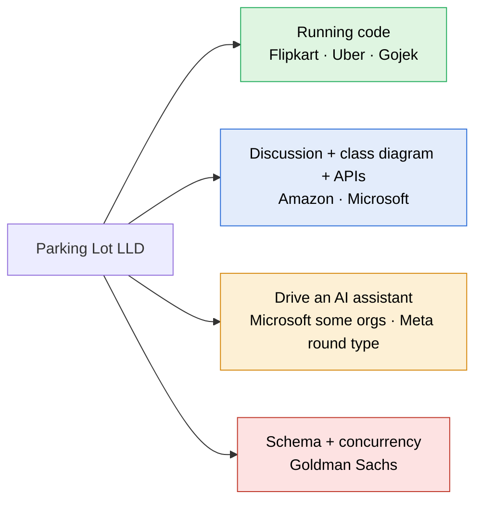

> [!abstract] Parking Lot: who asks it, in what format, and what our requirements leave out
> Web research against candidate reports and reference specs. No public source counts how often each company asks it, so companies are ranked by the number of independent reports found, and each row says how strong its evidence is and how recent it is.

> [!warning] Most interview-report pages block automated reading
> Medium, LeetCode Discuss, Glassdoor, IGotAnOffer and 1point3acres all refused the fetch. Where a row says search summary, the wording came from a search engine's summary of that page, not from the page itself. Only the Gojek statement and the two reference specs were read in full.

---

## Which companies ask it, and in what format



| Company | Evidence and date | Format | What they expect |
|---|---|---|---|
| **Flipkart** | Medium: the format is described the same way across several prep sites; the one candidate write-up that may hold the statement blocked the fetch. Date unknown. | **Machine coding, running code.** 2.5 hours split as 30 min brief, 90 min coding, 30 min review. Around 20 candidates on one call get the same problem. | Code that runs and prints output for their inputs. The review probes patterns, naming and modularity, and feeds new inputs to test the logic. In-memory `HashMap` storage is fine; no database. |
| **Gojek** | Strong for the statement, which is read verbatim from candidate repos (see below). **Old: the repos date from 2017 to 2019**, and nothing newer shows the take-home is still used. | **Take-home, running code.** A command-line app: `create_parking_lot n`, `park <reg> <colour>`, `leave <slot>`, `status`, plus queries by colour and by registration number. | Commands read from a file and interactively. Clean, tested code. |
| **Amazon** | Medium: prep sites repeatedly call it a classic Amazon question. The specific wording (three floors, small and large vehicles, small may use large) is a search summary of a page that blocked the fetch. Date unknown. | **Discussion, usually no compiling.** 45 to 60 minutes, about 25 of them on Leadership Principles. | Entities, a class diagram, **API signatures**, patterns, extensibility. Deep follow-ups on the API design. |
| **Microsoft** | Medium, and **the most recent**: a 2026 SDE-2 report gave the choice of vending machine or parking lot. Search summary; the page blocked the fetch. | **LLD discussion** with a deep dive on SOLID and on State or Strategy. Some orgs (CoreAI, Copilot-adjacent teams, SDE II) run an **AI-assisted variant** with GitHub Copilot. | In the AI variant: whether you direct the assistant, check its suggestions and debug what it produces, not whether you can type the syntax. |
| **Uber** | **Unconfirmed.** An Uber L4 write-up says the candidate was asked to design a parking lot and drew the class diagram (search summary; page blocked). The roundz SDE-2 write-up (published 2025-08-25) was read in full and does **not** name its machine-coding problem. | **Machine coding / LLD.** Classes, interfaces and relationships, with OOP theory questions along the way. | A twist of four bikes parking in one car spot at busy times appeared only in a search summary with no source that could be opened. Treat it as unverified. |
| **Goldman Sachs** | Weak to medium: the Glassdoor question title is exact (Design a system to manage a parking lot) but undated; practice-site tags; the SQL detail is a search summary. | **LLD on CoderPad.** Variants: plain, pricing system, multi-threaded. | Class hierarchy, an **SQL schema with queries over assumed tables**, and concurrency. |
| Google, Adobe, Grab | Weak: listed by aggregator blogs only, no first-hand report found | Unknown | |
| **Meta** | No parking-lot report found | **AI-enabled coding round.** 60 minutes, multi-file CoderPad, a choice of models. | Can include object-oriented design problems. Graded on problem solving, code quality, **verification** and communication. |

### The one company statement that is public in full: Gojek

Read verbatim from a candidate's repo of the take-home (repos of this assignment date from 2017 to 2019):

> Design a Parking lot which can hold `n` Cars. Every car been issued a ticket for a slot and the slot been assigned based on the nearest to the entry. The system should also return some queries such as:
> - Registration numbers of all cars of a particular colour.
> - Slot number in which a car with a given registration number is parked.
> - Slot numbers of all slots where a car of a particular colour is parked.

```
create_parking_lot <n>
park <registration_number> <colour>
leave <slot>
status
slot_numbers_for_cars_with_colour <colour>
slot_number_for_registration_number <registration_number>
registration_numbers_for_cars_with_colour <colour>
```

Runs from a file of commands or interactively. One size of spot, no pricing, no floors. The core is the nearest slot and **search by colour and by registration**, the gap our design does not cover.

### The reference prompt closest to our requirements: HelloInterview

> Design a parking lot system where different types of vehicles can park, and the system manages spot assignment and calculates fees upon exit.

Its requirements: motorcycle, car and large vehicle; a compatible spot assigned on entry; a ticket at entry; exit by ticket id, validated, hourly fee rounded up, spot freed; one rate for all vehicles; reject entry with no compatible spot; reject exit with an invalid or used ticket. Out of scope: payment processing, gate hardware, cameras, display systems, reservations. Ours is stricter in two places: pricing by vehicle type, and a real payment-failure path.

### How recent is the evidence

| Source | Date | What it shows |
|---|---|---|
| Microsoft SDE-2 report | 2026 | Parking lot or vending machine in the LLD round |
| Microsoft AI-assisted round guides | 2026 | Copilot allowed in some orgs |
| Meta AI-enabled coding round | rolled out from October 2025 | object-oriented problems possible with an AI assistant |
| roundz Uber SDE-2 write-up | 2025-08-25 | machine coding round, problem not named |
| HelloInterview breakdown | current | reference prompt and requirements |
| Gojek take-home repos | 2017 to 2019 | the only verbatim company statement |
| Amazon, Flipkart, Goldman Sachs, Uber L4 reports | unknown | pages blocked; dates not readable |

So the claim that the parking lot is still asked after 2023 rests on one 2026 Microsoft report read through a search summary, plus prep sites that keep listing it. The verbatim company statement is older than 2020.

> [!note] Rippling does not ask it
> Reported Rippling LLD rounds are a key-value store with transactions (then nested transactions), an Excel sheet with formulas and cell references, and a music-player play-count problem. Parking Lot stays in the track for the patterns it carries, not for Rippling.

### What each round type needs from our note

| Round type | Companies | What it needs |
|---|---|---|
| Running code in 90 minutes | Flipkart, Uber, Gojek | A build from a blank editor with a driver that prints every use case: the core of the track |
| Discussion with diagram and APIs | Amazon, Microsoft | An **API signatures** block: `park`, `unpark`, `findVehicle`, `availability` |
| Driving an AI assistant | Microsoft some orgs, Meta | Directing the assistant one component at a time and catching the bug in what it writes |
| Schema and concurrency | Goldman Sachs | A `spot` and `ticket` table schema, plus the optimistic-lock `UPDATE ... WHERE version = ?` |

---

## What our requirements leave out

Ranked by how often the gap appears across the sources.

| # | Missing | Who asks | What it does to our design |
|---|---|---|---|
| 1 | **Spot types beyond size**: EV charging, handicapped | Grokking twelve-requirement spec, HelloInterview, Amazon prep sites | **High.** Our allocation ranks spots by size alone. A medium spot with a charger is a **capability**, independent of its size. The follow-up most likely to break the allocation loop. |
| 2 | **Search by vehicle**: which slot holds registration X, every car of colour Y | Gojek core commands, the search-vehicle variant on practice sites | **Medium.** Needs a second index from plate to ticket; today, finding a plate means scanning every active ticket. |
| 3 | **Several payment methods** (cash, card) at an exit panel, an attendant, or a per-floor portal | Grokking | **Low.** `PaymentStrategy` and `CashPaymentStrategy` already exist in the build; no FR states it. |
| 4 | **Admin changes while the lot runs**: add or remove a floor or a spot, change rates | Grokking use cases | **Medium.** Raises a real question: what happens to a spot removed while a car is in it. |
| 5 | **Tiered hourly pricing**: first hour at one rate, later hours cheaper | Grokking | **Low.** One more `PricingStrategy`. |
| 6 | **A display board on each floor for drivers** | Grokking | **Low.** Our FR10 shows availability to the admin only; the reference adds drivers on every floor. Same data. |
| 7 | **One spot holding several vehicles**: four bikes in a car spot at busy times | Uber, **unverified** (search summary only) | **High if asked.** Breaks the two-value `SpotStatus`: a spot becomes a count against a capacity. |
| 8 | **Persistence**: table schema and API contract | Goldman Sachs, Amazon, a LeetCode thread on LLD with API spec and DB schema | **Medium** for those two companies; not needed for machine coding. |

> [!question] One addition with no source behind it
> Reject entry for a plate that already holds an active ticket. It is the entry-side mirror of FR8, which rejects exit for a ticket already used. Reasoned, not found in any source.

> [!success] Already covered, and matching the references
> Multiple floors · multiple gates · ticket on entry · size fallback · rejection when nothing fits · exit validation for unknown or used tickets · payment before release · concurrency on both entry and exit.

---

## Sources

- [Grokking OOD: Design a Parking Lot (requirements, actors, use cases)](https://github.com/tssovi/grokking-the-object-oriented-design-interview/blob/master/object-oriented-design-case-studies/design-a-parking-lot.md)
- [HelloInterview: Parking Lot LLD](https://www.hellointerview.com/learn/low-level-design/problem-breakdowns/parking-lot)
- [DesignGurus: Designing a Parking System](https://www.designgurus.io/blog/design-parking-system)
- [DEV: LLD Interviews and the Rules Behind a Parking Lot](https://dev.to/sarah23/low-level-design-interviews-and-the-rules-behind-a-parking-lot-71)
- [Flipkart SDE-2 interview experience (Medium)](https://medium.com/@anmol15554/flipkart-interview-experience-for-sde-2-9b7fbfadbdf1)
- [Flipkart interview process (FinalRound)](https://www.finalroundai.com/blog/flipkart-interview-process)
- [Machine Coding Round guide (LLD Mastery)](https://www.lowleveldesignmastery.com/blog/machine-coding-round/)
- [Gojek parking lot assignment](https://developerinsider.co/gojek-parking-lot-assignment-using-python/)
- [Gojek parking lot repo](https://github.com/themaverikk/parking-lot)
- [Amazon SDE 2 interview (IGotAnOffer)](https://igotanoffer.com/en/advice/amazon-sde-2-interview)
- [Amazon parking lot (FinalRound)](https://www.finalroundai.com/interview-questions/amazon-system-design-parking-lot)
- [Microsoft SDE-2 interview experience (LeetCode)](https://leetcode.com/discuss/post/7769548/)
- [Microsoft AI-assisted coding guide (PracHub)](https://prachub.com/resources/microsoft-ai-assisted-coding-interview-guide-2026-tools-rules-and-scoring)
- [Microsoft SWE AI-assisted coding (Coditioning)](https://www.coditioning.com/blog/408/microsoft-swe-ai-copilot-coding)
- [Uber SDE-2 interview experience (roundz), read in full, problem not named](https://roundz.substack.com/p/interview-experience-169-uber-sde2)
- [Uber L4 interview experience (Medium)](https://khaniqbal.medium.com/uber-l4-interview-experience-5350c0e5918d)
- [Gojek parking lot README, verbatim statement (developerinsider)](https://github.com/developerinsider/InterviewAssignments/tree/master/Go-Jek/Go-Jek-Parking-Lot-Assignment-Python)
- [Gojek parking lot in Go (agungdwiprasetyo)](https://github.com/agungdwiprasetyo/gojek-parking-lot)
- [Gojek code challenge 2017 (krishna2nd)](https://github.com/krishna2nd/GOJEK-CODE-CHALLENGE-2017)
- [Uber SDE-2 LLD and HLD rounds (1point3acres)](https://www.1point3acres.com/interview/post/7896720)
- [Goldman Sachs: Design a parking lot (Glassdoor)](https://www.glassdoor.com/Interview/Design-a-system-to-manage-a-parking-lot-QTN_93784.htm)
- [Goldman Sachs LLD questions (CodeZym)](https://codezym.com/lld/goldmansachs)
- [LeetCode: Parking Lot LLD, API spec, DB schema](https://leetcode.com/discuss/interview-question/6114469/Parking-Lot-LLD-API-spec-DB-schema/)
- [Meta AI-assisted coding interview (interviewing.io)](https://interviewing.io/blog/how-to-use-ai-in-meta-s-ai-assisted-coding-interview-with-real-prompts-and-examples)
- [Meta AI-enabled coding interview format (AmigoHelp)](https://www.amigohelp.ai/blog/meta-ai-enabled-coding-interview/)
- [Rippling SDE-2 interview experience (LeetCode)](https://leetcode.com/discuss/post/5868538/rippling-sde-2-interview-experience-2024-m9aw/)
- [Rippling: key-value store with transactions (darkinterview)](https://darkinterview.com/collections/rippling/questions/601e6b2b-1b57-46d5-87d3-18576339a0e4)
- [Top 20 LLD interview questions (LLD Mastery)](https://www.lowleveldesignmastery.com/blog/low-level-design-interview-questions/)
