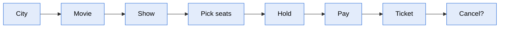

> [!abstract] BookMyShow
> Flavor A (domain modeling) plus the spoken flavor D cut · Target: 60 min from a blank editor, machine-coding format · Patterns: Strategy, Facade · Mechanics: seat hold with a timeout, all-or-nothing claim

---

## 📄 Problem Statement

Design a movie ticket booking system like BookMyShow. Users find a movie, pick a show, choose seats and book them. The code must run.

This is the prompt as the interviewer gives it, deliberately vague. Everything below the next heading was pulled out by asking.

---

## ❓ Clarifying questions

### How to generate them

Questions do not come from thinking hard about the system as a whole. They come from walking the user's journey one step at a time and asking the same three things at every step.

| Lens | The question at each step | What it found here |
|---|---|---|
| **Who** does this? | a user, or an admin or organiser? | an admin creates cities, theatres, screens and shows |
| **How many** at once? | one seat or several, one screen or several? | one booking can hold several seats |
| **What if** it fails? | seat taken, payment fails, time runs out? | all or nothing; payment failure frees the seats; a hold ends after 5 minutes |

> [!tip] The journey has an end, and the end gets a question too
> After the ticket comes the question nobody walks to: can it be undone? That is how cancellation gets found.

---

## ✅ Functional Requirements

**Admin**

1. **Setup.** An admin adds cities, theatres, screens and shows. A screen has a fixed seat layout: rows of seats, each with a type (Silver, Gold, Platinum). A show is a movie on a screen at a start time, with **a price for each seat type**.
2. **No overlapping shows.** A show cannot be added to a screen at a time that overlaps another show on that screen.

**User**

3. **Find a movie.** The user picks a city and sees the movies playing there; a movie can be found by its exact name.
4. **Find a show.** Picking a movie lists the theatres in that city and their shows. Picking a theatre lists its shows. Only shows that have not started are listed or bookable.
5. **Seat layout.** For a chosen show, the user sees the screen's layout with each seat marked free, held or booked.
6. **Hold, all or nothing.** The user holds several seats of one show in one go. If any of them is held or booked, **none are held**, and the user is told which ones were unavailable.
7. **Hold expiry.** A hold lasts **5 minutes from the moment it is made**. After that its seats are free again.
8. **Pay.** Paying for a hold either confirms the booking or frees the seats at once if the payment fails. A payment for a hold that has already expired is rejected.
9. **Ticket.** A confirmed booking carries a unique id, the show, the seats with their types, and the total: the sum of each seat's price for its type in that show.
10. **One show at a time.** Booking a seat for one show does not block that seat for any other show.
11. **Cancel.** A confirmed booking can be cancelled, and its seats become free again.

## ⚙️ Non-functional Requirements

1. **Concurrency.** When many users go for the same seat at the same instant, exactly one gets it, and a multi-seat hold is never left half-taken. A hold paid twice at the same moment (a double click, two devices) confirms one booking and charges once.
2. **Freshness.** An expired hold counts as free the moment anyone looks at the seat or tries to hold it, not when a cleanup job gets round to it. The seat map may be a moment out of date; the hold attempt is the final check.
3. **Ease of change.** A new pricing rule (weekend prices) or a new payment method is a new class, with no edits to the booking flow.

### Out of scope (do not build)

Refunds · persistence · several servers (talk about it, do not build it) · time-range search · REST · real payment gateway · login · notifications · other event types such as concerts or sports (the design must not block them) · surge scale of millions of users.
