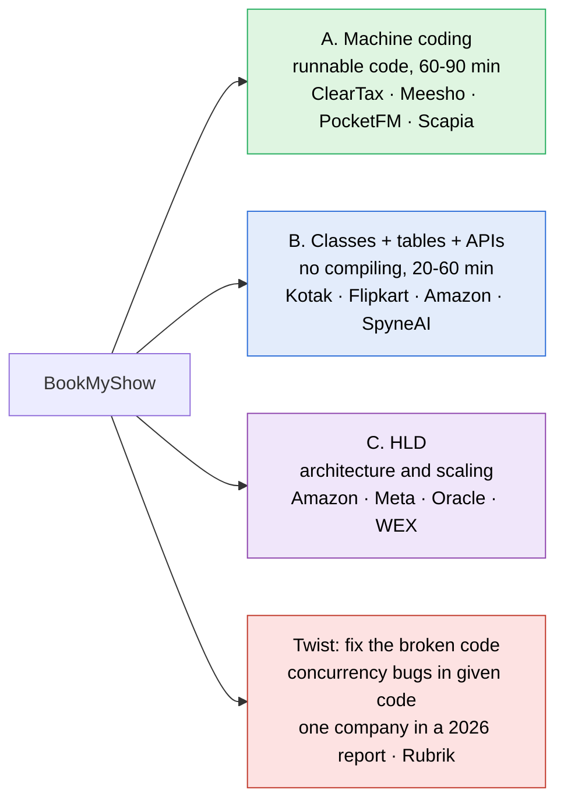

> [!abstract] BookMyShow: who asks it, in what format, and what they probe
> Every LeetCode Discuss post since 2023 that names BookMyShow, a movie booking, a cinema or a ticket booking was pulled through LeetCode's own API and read newest first. 283 posts matched since 2023: 31 in 2023, 87 in 2024, 110 in 2025 and 55 in 2026 up to October. The 2025 and 2026 posts were read; the company rows and problem statements below come from them.

> [!warning] What the count is and is not
> A post counts once it mentions the problem, so prep diaries and resource lists are inside the 283. The tables below use only posts that describe a real round. Formats are read from what the candidate wrote; where a post does not say whether code had to run, the row says so.

---

## The same problem, three formats

| Format | What you hand over | Seen at (newest first) |
|---|---|---|
| **A. Machine coding** | Code that runs, with a driver, then a review of it | ClearTax SDE-3 (Aug 2026), slice campus drive (Oct 2026, chat AI allowed with screen shared), Scapia (Apr 2026), Walmart SSE (Mar 2026), PocketFM SSE (Dec 2025), Meesho SDE-3 (Dec 2025), Amazon SDE-2 (Sep 2025, code and class diagram), Goldman Sachs Analyst (Jun 2025, full implementation) |
| **B. Classes, tables and APIs** | Class list with methods and parameters, DB schema, API request and response, patterns, seat-booking concurrency. Nothing is compiled | Kotak SDE-2 (three reports, Aug to Sep 2026), Dezerv (Sep 2026), SpyneAI (Aug 2026), Amazon SDE-2 (Aug and Nov 2025), Project44 (Nov 2025), JP Morgan SDE-3 (Nov 2025, schema plus a little code), Cashfree SDE-2 (Jun 2025), Walmart SDE-3 (Apr 2025), Flipkart SDE-2 design round (Apr 2025, two reports) |
| **C. HLD** | Services, databases, caching, locking at scale | Amazon (many), Meta product architecture, Oracle, WEX, slice SDE-2, JioStar, Blinkit, PayPal, Salesforce, Motive |
| **Twist: fix it** | Find and fix the races in booking code someone else wrote | One company inside a multi-company report (Jun 2026; the post does not say which), Rubrik (May 2025, multithreading round) |

> [!important] Format B is the common SDE-2 round in 2026
> Most 2026 reports labelled LLD ask for classes, tables and API shapes in one sitting, not for runnable code. A candidate at Amazon (Aug 2025, bus booking) prepared class diagrams and code and was asked for API and schema instead. Ask in the first minute which of the three is wanted.

---

## Problem statements to practise, with time limits

| Prompt | Format | Time | Source |
|---|---|---|---|
| 1. PocketFM: events with filters | A | 75 min of coding, any language | PocketFM SSE, Dec 2025 |
| 2. ClearTax: city to seat, with a 5-minute hold | B and C at ClearTax; the fullest statement found, so build it as A | 60 min practice box | ClearTax SDE-2, Apr 2025 |
| 3. Meesho: cinema, screen, show, user, booking | A, tests must pass | 90 min | Meesho SDE-3, Dec 2025 |
| 4. Flipkart: interfaces first, then tables | B | design round, length not stated | Flipkart SDE-2, Apr 2025 |
| 5. Kotak: event ticket booking | B inside a 90 min bar raiser with DSA and HLD | about 20 to 30 min of it | Kotak SDE-2, 2026 |
| 6. Amazon bar raiser | B | **20 min** of technical time | Amazon SDE-2, Jul 2025 |
| 7. Atlassian: can this movie be scheduled | code design | not stated | Atlassian Senior SE, Feb 2026 |

> [!danger] The ClearTax SDE-3 timing lesson
> One hour of coding and 30 minutes of review (Aug 2026). The candidate finished about 60% of the requirements and **never reached the concurrency part**, which is the part every interviewer probes. Build the seat claim in the first layer, not the last.

### 1. PocketFM: events with filters (75 min)

> Design BookMyShow. Required conditions:
> 1. Organizer can create a event
> 2. User can filter event based upon location and event type
> 3. User can book an event. Make sure to avoid double booking.
> 4. Bonus requirement: make your code scalable and for high load server

The candidate set up a project on a shared screen and coded for 1 h 15 min, followed by 10 minutes of discussion. They forgot the lock around seat booking; the closing discussion went to locks and then to what else production would need.

### 2. ClearTax: city to seat, with a 5-minute hold (60 min practice box)

The fullest statement found. Read from the post:

> - List the cities where partner cinemas are located.
> - After a city is picked, show the movies released in that city.
> - After a movie is picked, show the cinemas running it and their shows.
> - The user picks a show at a cinema and books tickets.
> - Show the seating arrangement of the hall; the user can select several seats.
> - The user can tell available seats from booked ones.
> - The user can hold seats for five minutes before paying to finalise the booking.
> - There are several kinds of seat, for example Silver, Gold, Platinum.

ClearTax asked this as LLD plus HLD, mostly diagrams, with follow-ups on scaling and concurrency. As a coding drill it is the best-specified prompt available, so it is the one to build against the clock.

### 3. Meesho SDE-3: cinema, screen, show, user, booking (90 min)

Design a movie system with cinema, screen, show, user and booking. The tests passed, and the candidate was **rejected because the main business logic sat in a single class**. Running code is the gate, not the score.

### 4. Flipkart SDE-2 design round: interfaces first, then tables

Two reports in April 2025 carry the same wording:

> Design a ticket booking system for movies, for example BookMyShow. Functionality to be implemented:
> - Search movie (by name, by theatre name)
> - Book ticket
> - Cancel ticket
> - List upcoming movies

The candidate was told to write plain interfaces first, in no particular language, then design the database with a free choice of DB. The interviewer found a mistake in every table. A second Flipkart report (Jul 2025, airline booking) failed the same round because the schema was not extensible and the interfaces were not written in time.

### 5. Kotak SDE-2: event ticket booking (about 20 to 30 min inside a 90 min bar raiser)

Asked to cover:

| Part | What they wanted |
|---|---|
| DB schema | tables and relations |
| Classes | classes and relationships, methods with parameters |
| API | request and response for each endpoint |
| Patterns | which ones apply and why |
| Concurrency | seat-booking races |

Follow-ups in the same round: what a distributed lock is, what happens when it is held too long or expires, how to make the book button safe to click twice, strong versus eventual consistency, circuit breakers. One candidate wrote that the question repeats almost word for word from earlier posts.

### 6. Amazon bar raiser: BookMyShow in 20 minutes

Thirty minutes went on two Leadership Principle questions, which left 20 for the design, and the scope was not cut down to fit. Have a 20-minute spoken version ready: entities, the seat-in-show table, three API signatures, one sentence on the lock.

### 7. Atlassian: can this movie be scheduled

> We have a cinema hall where movies are scheduled. The hall has one screen. Shows start around 10 am and the last can run up to 11 pm. If a movie ends at 12 pm, the next can start exactly at 12 pm. Each screening has a movie name, a start time and a duration.
> Write `canSchedule(Movie movie, CurrentMovieSchedule)` returning whether the movie fits with no overlap and inside the 10 am to 11 pm window.
> Follow-ups: replace a movie in the schedule; each movie carries a revenue.

Not a booking problem at all: an interval-overlap check dressed as a cinema. It shows how far the name stretches.

---

## The same problem under other names

| Name in the round | Where | What changes |
|---|---|---|
| Event ticket booking | Kotak, Amazon (Jul 2026), PocketFM | event instead of movie; an organiser creates events |
| Ticketmaster | Meta, JioStar, PayPay | a concert surge; thousands want the same seats at once |
| Train, IRCTC | Swiggy, Adobe, Allen, PayPal, Media.net, ClearTax | a seat is free on part of a route; a waitlist |
| Airline | Flipkart (Cleartrip) | seat classes, schema extensibility |
| Bus | Amazon | API and schema instead of classes |
| IPL tickets | Adyen | a sporting event surge |

> [!tip] Model a limited seat per occurrence, not a movie
> Every variant is the same core: a fixed set of seats per occurrence, and many people trying to take the same seat at once. A design built on `Show` and `ShowSeat`, with nothing movie-specific in the booking path, moves to all of them.

---

## What interviewers probe

| Probe | Reported at |
|---|---|
| Two users take the same seat at the same moment | nearly every report, in all three formats |
| Pessimistic versus optimistic locking | Walmart SDE-3, Blinkit, Amazon (Jul 2026), Oracle |
| A seat hold that expires (5 minutes) and frees the seat if payment does not come | ClearTax; lock expiry at Kotak |
| DB schema, especially the **table that maps a seat to a show**, and how it resolves seat races | SpyneAI, Flipkart, Kotak, Cashfree, Amazon, M2P (indexing and partitioning) |
| Idempotency: the book button clicked twice, or the same booking from two devices | Kotak, PayPay |
| Java concurrency theory: `volatile`, `synchronized` versus `ReentrantLock`, when to use `ReentrantReadWriteLock` | Walmart SSE, Oracle |
| Design patterns and SOLID, extensible code | Zscaler, Walmart SDE-3, Kotak, Meesho |
| Payment as part of booking | WEX (payment part only), JioStar, PayPal |
| Search by city, movie or theatre | ClearTax, Flipkart, Amazon, Meta |
| Seat types with different prices | ClearTax |
| Cancellation | Flipkart |

> [!info] The mapping-table question is the ShowSeat fix
> SpyneAI's round went deep on the mapping between tables to resolve seat-booking races. That is the same point as the known course flaw: booking status belongs to the seat within one show, not to the physical seat, or one booking blocks that seat for every show.

---

## Sources

All LeetCode Discuss, read through LeetCode's API on 2026-10-05.

| Date | Post |
|---|---|
| 2026-10-05 | [slice SDE-1 campus drive](https://leetcode.com/discuss/post/8557148/) |
| 2026-09-28 | [Kotak SDE-2 bar raiser](https://leetcode.com/discuss/post/8544406/) |
| 2026-09-20 | [Kotak SDE-2](https://leetcode.com/discuss/post/8532150/) |
| 2026-09-14 | [Dezerv Lead Engineer](https://leetcode.com/discuss/post/8521293/) |
| 2026-09-11 | [Kotak SDE-2](https://leetcode.com/discuss/post/8515948/) |
| 2026-09-08 | [WEX SDE-3](https://leetcode.com/discuss/post/8509616/) |
| 2026-09-04 | [slice SDE-2](https://leetcode.com/discuss/post/8501747/) |
| 2026-08-29 | [ClearTax SDE-3](https://leetcode.com/discuss/post/8488472/) |
| 2026-08-27 | [Kotak SDE-2 bar raiser](https://leetcode.com/discuss/post/8485816/) |
| 2026-08-17 | [SpyneAI SDE-2](https://leetcode.com/discuss/post/8465971/) |
| 2026-08-04 | [JioStar](https://leetcode.com/discuss/post/8441150/) |
| 2026-07-27 | [Amazon L5](https://leetcode.com/discuss/post/8423184/) |
| 2026-06-13 | [Blinkit SDE-1](https://leetcode.com/discuss/post/8331559/) |
| 2026-06-07 | [Multi-company report, concurrency fix round](https://leetcode.com/discuss/post/8319169/) |
| 2026-06-06 | [Zscaler Senior Staff](https://leetcode.com/discuss/post/8317923/) |
| 2026-04-23 | [Scapia](https://leetcode.com/discuss/post/8082742/) |
| 2026-03-23 | [Walmart SSE](https://leetcode.com/discuss/post/7685652/) |
| 2026-03-11 | [Walmart SDE-3](https://leetcode.com/discuss/post/7642112/) |
| 2026-02-23 | [PayPay SDE-2](https://leetcode.com/discuss/post/7603671/) |
| 2026-02-07 | [Flipkart SDE-2, airline](https://leetcode.com/discuss/post/7560534/) |
| 2026-02-04 | [Atlassian Senior SE](https://leetcode.com/discuss/post/7551850/) |
| 2026-01-27 | [JioHotstar SDE-2](https://leetcode.com/discuss/post/7529922/) |
| 2025-12-24 | [PocketFM SSE machine coding](https://leetcode.com/discuss/post/7436183/) |
| 2025-12-19 | [Meesho SDE-3 among others](https://leetcode.com/discuss/post/7423270/) |
| 2025-11-21 | [JP Morgan SDE-3](https://leetcode.com/discuss/post/7364431/) |
| 2025-11-17 | [Project44](https://leetcode.com/discuss/post/7356187/) |
| 2025-11-09 | [Amazon SDE-2](https://leetcode.com/discuss/post/7337246/) |
| 2025-09-27 | [Amazon SDE-2](https://leetcode.com/discuss/post/7228788/) |
| 2025-09-10 | [Amazon SDE-2, bus booking](https://leetcode.com/discuss/post/7176045/) |
| 2025-08-23 | [Amazon SDE-2](https://leetcode.com/discuss/post/7114462/) |
| 2025-08-13 | [Meta E4/E5, Ticketmaster](https://leetcode.com/discuss/post/7074839/) |
| 2025-08-12 | [M2P Fintech](https://leetcode.com/discuss/post/7071489/) |
| 2025-07-15 | [Amazon SDE-2, 20-minute bar raiser](https://leetcode.com/discuss/post/6961332/) |
| 2025-06-30 | [Goldman Sachs Analyst](https://leetcode.com/discuss/post/6903685/) |
| 2025-06-10 | [Cashfree SDE-2](https://leetcode.com/discuss/post/6830186/) |
| 2025-05-24 | [Rubrik](https://leetcode.com/discuss/post/6777801/) |
| 2025-04-26 | [Flipkart SDE-2 design round](https://leetcode.com/discuss/post/6687653/) |
| 2025-04-15 | [Flipkart SDE-2 design round](https://leetcode.com/discuss/post/6652668/) |
| 2025-04-15 | [Walmart SDE-3](https://leetcode.com/discuss/post/6652175/) |
| 2025-04-14 | [ClearTax SDE-2](https://leetcode.com/discuss/post/6651280/) |
