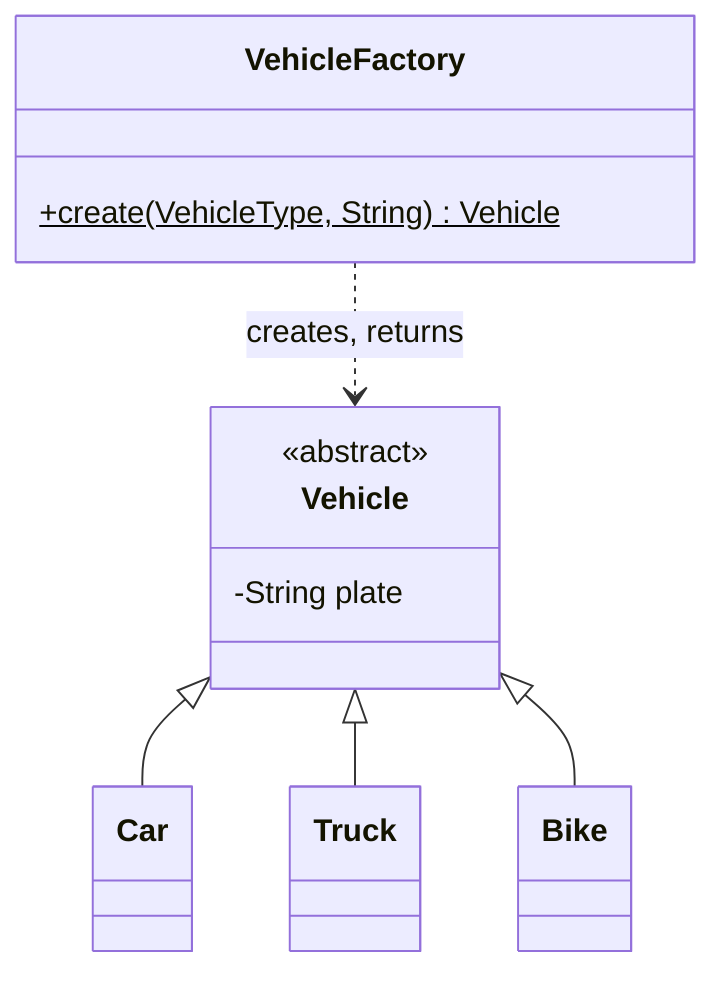

> [!abstract] Factory
> Move the *"which concrete class do I create"* decision into **one place**, so every caller asks for an object by type instead of naming the class itself.

---

## 🎯 Trigger

> [!tip]
> **Concrete class picked from runtime data, in more than one place → Factory.**
>
> - **runtime data** — the type arrives as a value (a scanned string, an API field), so you cannot write `new Car(...)` literally
> - **more than one place** — the same mapping is needed at several call sites, so it would otherwise be copy-pasted
>
> Factory **concentrates** the creation decision into one file. It never eliminates it.

---

## 🧱 Structure



---

## 🔩 Component Mapping

|Component|Role|Here|
|---|---|---|
|**Product**|Common type the callers depend on|`Vehicle`|
|**ConcreteProduct**|The classes actually built|`Car`, `Truck`, `Bike`|
|**Factory**|Sole owner of the type → class mapping|`VehicleFactory`|
|**Client**|Asks by type, never names a concrete class|entry gate, CSV import, booking API, tests|

---

## 📐 Template

```
src/
├── model/
│   ├── VehicleType.java            ← enum, never String
│   ├── Vehicle.java                ← product
│   ├── Car.java                    ← concrete products
│   ├── Truck.java
│   └── Bike.java
├── factory/
│   └── VehicleFactory.java         ← sole owner of type → class
└── EntryGate.java                  ← client
```

##### `model/VehicleType.java`

```java
public enum VehicleType { CAR, TRUCK, BIKE }
```

##### `model/Vehicle.java`

```java
public abstract class Vehicle {

    private final String plate;

    protected Vehicle(String plate) {
        this.plate = plate;
    }

    public String getPlate() {
        return plate;
    }
}
```

##### `model/Car.java`

```java
public class Car extends Vehicle {

    public Car(String plate) {
        super(plate);
    }
}
```

##### `factory/VehicleFactory.java`

```java
public class VehicleFactory {

    private VehicleFactory() {}                 // no instances — pure creation helper

    public static Vehicle create(VehicleType type, String plate) {
        return switch (type) {                  // exhaustive: adding a new enum value
            case CAR   -> new Car(plate);       // breaks the build until handled here
            case TRUCK -> new Truck(plate);
            case BIKE  -> new Bike(plate);
        };
    }
}
```

##### `EntryGate.java`

```java
public class EntryGate {

    public void onVehicleArrival(VehicleType type, String plate) {
        Vehicle vehicle = VehicleFactory.create(type, plate);   // never names Car / Truck / Bike
        // ... assign a spot, issue a ticket
    }
}
```
