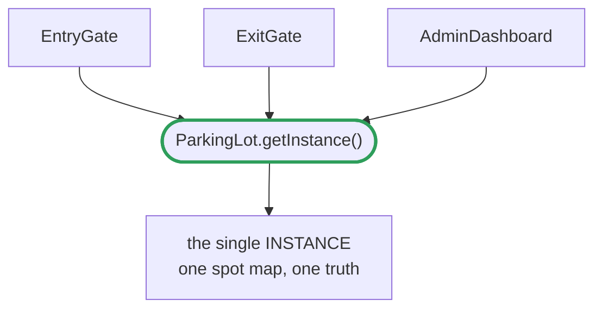

> [!abstract] Singleton
> Exactly **one instance** of a class in the whole system, plus a global way to reach it.

---

## 🎯 Trigger

> [!tip]
> **One shared thing everyone must see the same copy of → Singleton.**
>
> - **one instance** — a second copy would mean two versions of the truth (exit gate frees a spot the entry gate never knew was taken)
> - **global access** — unrelated callers need it without being handed it through five constructors

Two things must be true, and each has its own line of code:

```java
private ParkingLot() {}                                 // ① nobody outside can call new
private static final ParkingLot INSTANCE = new ...();   // ② created once, by the JVM
```

> [!danger] The two holes in the naive version
> ```java
> static ParkingLot instance;                       // ❌ constructor still public → new ParkingLot() anywhere
> static ParkingLot getInstance() {
>     if (instance == null)                         // ❌ two threads both see null,
>         instance = new ParkingLot();              //    both construct → two lots
>     return instance;
> }
> ```

> [!note] Why eager needs no lock
> The JVM guarantees class initialization runs **exactly once and is thread-safe**. The first thread to touch the class triggers loading; the JVM locks internally, runs the static initializer, and any other thread arriving mid-load blocks until it finishes.
> No `synchronized`, no `volatile`, no double-checked locking — the classloader already did the work.

---

## 🧱 Structure



---

## 🔩 Component Mapping

|Component|Role|Here|
|---|---|---|
|**Private constructor**|Blocks outside construction|`private ParkingLot()`|
|**Static instance**|The one and only object|`INSTANCE`|
|**Accessor**|Global entry point|`getInstance()`|
|**Client**|Calls the accessor, never `new`|entry gate, exit gate, dashboard|

---

## ⚖️ Which variant

|Variant|Use when|Cost|
|---|---|---|
|**Eager** (default)|Construction is cheap — in-memory maps, counters|Built even if never used|
|**Holder idiom**|Construction is expensive (DB connection, file read)|One extra nested class|
|**synchronized method**|— (avoid)|Locks on *every* call forever, for a race that can happen once|

> [!warning] Say this out loud in an interview
> Singleton is the most criticized of the eleven: global mutable state, awkward to test (no fresh instance per test), hides dependencies.
> Modern practice is often to build **one** instance in `main` and inject it — "exactly one" without the global access point.
> Naming the trade-off reads senior; reflexively reaching for `getInstance()` reads junior.

---

## 📐 Template

```
src/
├── ParkingLot.java                 ← the singleton
└── EntryGate.java                  ← client
```

##### `ParkingLot.java` — eager (use this by default)

```java
public class ParkingLot {

    private static final ParkingLot INSTANCE = new ParkingLot();   // ② JVM builds it once

    private final Map<String, ParkingSpot> spots = new HashMap<>();

    private ParkingLot() {}                                        // ① no outside construction

    public static ParkingLot getInstance() {
        return INSTANCE;                                           // no lock needed
    }

    public void park(Vehicle vehicle) {
        // ... shared state every caller sees
    }
}
```

##### `ParkingLot.java` — holder idiom (only if construction is expensive)

```java
public class ParkingLot {

    private ParkingLot() {}

    private static class Holder {                                  // loads on first access only
        private static final ParkingLot INSTANCE = new ParkingLot();
    }

    public static ParkingLot getInstance() {
        return Holder.INSTANCE;                                    // lazy AND lock-free
    }
}
```

##### `EntryGate.java`

```java
public class EntryGate {

    public void onVehicleArrival(VehicleType type, String plate) {
        ParkingLot lot = ParkingLot.getInstance();                 // same object as ExitGate sees
        lot.park(VehicleFactory.create(type, plate));
    }
}
```
