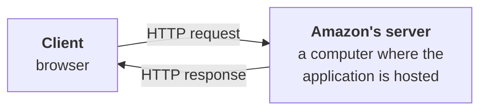
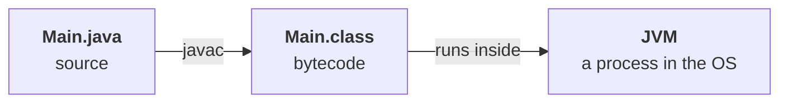
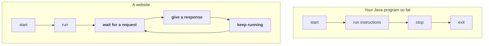
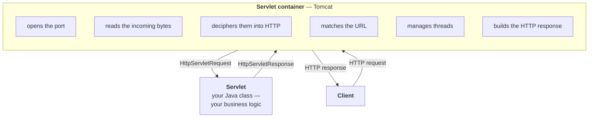
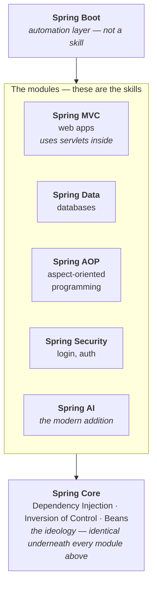
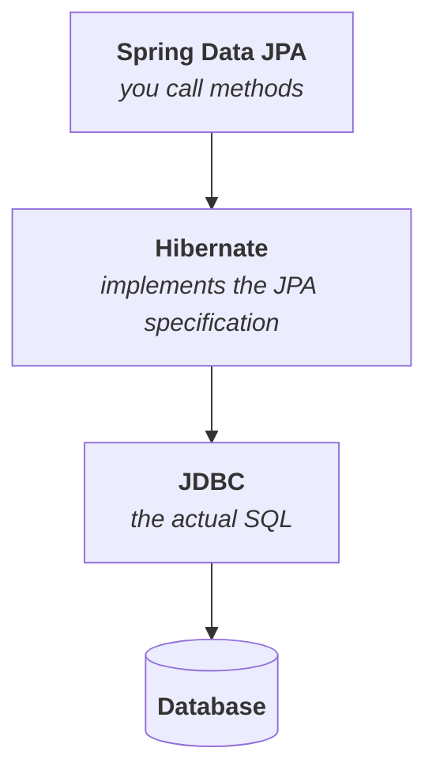
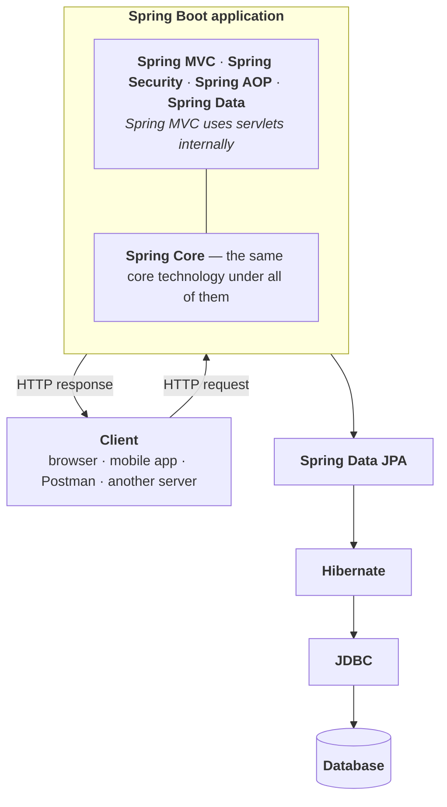

# Client–server architecture

**Start with the most basic question there is: how does a user visit a website?**

You open a browser and type `www.amazon.com` — or `www.amazon.in` if you want the India server.

> *"Somewhere there must be an Amazon server. And you know that a server is nothing but **a computer** where Amazon's application is hosted."*

**That server takes your request, entertains it, and sends back a response.** The moment the response arrives, your browser paints it onto the page.



| The one who **requests** | the **client** |
|---|---|
| The one who **responds** | the **server** |

**That is the whole of client–server architecture.** A client, a server, an HTTP request going one way, an HTTP response coming back.

## A client is anything that makes the request

**This is the part people get wrong — they assume "client" means "browser" or "user".**

> *"A client can be anything at all."*

| | |
|---|---|
| A **browser** | you typing a URL |
| A **mobile application** | the Amazon app on your phone — Android or iOS |
| A **front-end application** | a React app calling your backend |
| **Postman** | a tool for firing API calls at a backend by hand |
| **Another server** | ← the one that surprises people |

> [!important] **A server can itself be a client.** In a microservice architecture there are many servers, and one calls another. *"Some order service wants to talk to the payment service or the notification service — so it sends it an HTTP request."* **In that exchange the order service is the client.**
> 
> Client and server are **roles in one exchange**, not permanent identities.

## A server is anything that entertains the request

**"Entertaining" a request means three things: receive it, process it, respond.**

**And "processing" hides a lot:**

| What the client wants | What the server does |
|---|---|
| store some data | write it to the database |
| fetch some information | read it and return it |
| update something | modify the stored record |
| delete something | remove the record |
| **log in** | **authenticate you** — check you are who you claim |

> **Client asks for information. Server responds with that information.** That is the one-line version.

---

# HTTP

**`HTTP` = Hyper Text Transfer Protocol.** The question is what that actually buys you.

> *"When our client and our server interact with each other, the two of them need a **language** to interact in, they need a **format**."*

**They cannot just throw bytes at each other and hope.** Something has to fix, in advance, what a request looks like and what a response looks like.

> [!info] **"Protocol" just means a rule book of the internet.** It is the agreement both sides already know before they ever talk.

**Four things HTTP specifies:**

| | |
|---|---|
| **The structure of a request** | what a client is allowed to send, and in what order |
| **The structure of a response** | what comes back |
| **Which methods exist** | what *kind* of operation you are asking for |
| **How data is sent** | encrypted or not |

## The methods

| Method | What you are asking for |
|---|---|
| **`GET`** | **retrieve** information only |
| **`POST`** | **store** new information |
| **`PUT`** | **update** information |
| **`PATCH`** | update a **specific part** of it |
| **`DELETE`** | **delete** information |

## HTTP versus HTTPS

**By default, HTTP data is not encrypted.** Anyone positioned between client and server can read it.

> *"That is why we switched from HTTP to HTTPS."*

**`HTTPS` is the same Hyper Text Transfer Protocol. The `S` is `Secured`.** Both the request going out and the response coming back are encrypted, *"so that nobody in the middle can listen in on it."*

---

# The structure of a request

**A request has four parts.**

| Part | |
|---|---|
| **Method name** | `GET`, `POST`, `PUT`, `PATCH`, `DELETE` |
| **URL** | also called the **path** or the **endpoint** |
| **Headers** | key–value pairs carrying extra **metadata** |
| **Body** | the detailed information you are sending |

## A `GET` request

**Say you want the list of courses from Coder Army:**

```http
GET /courses
Host: www.coderarmy.in
Accept: application/json
```

| | |
|---|---|
| Method | **`GET`** — you only want to read |
| Host | **`www.coderarmy.in`** |
| Endpoint | **`/courses`** |
| Full URL | **`www.coderarmy.in/courses`** |

**`Accept: application/json` is a header**, and it says what format you are willing to receive back. Other headers carry authentication — *"who you are"* — so the server can identify you before it decides whether to answer.

> [!important] **A `GET` has no body.** The body is for detailed information you want the server to store. **When you are only reading, there is nothing to send.**

## A `POST` request

**Now log in to the same site.** This one needs a body, because you have something to send.

```http
POST /login
Host: www.coderarmy.in
Content-Type: application/json

{
  "email": "someone@example.com",
  "password": "somepassword"
}
```

**`Content-Type: application/json` is the mirror image of `Accept`.** `Accept` says *what I want back*; `Content-Type` says **what I am sending you right now**.

> **The server sees a login request, reads the email and password out of the body, authenticates you against them, and — if they are correct — sends back a response.**

---

# The structure of a response

**A response has three parts.**

| Part | |
|---|---|
| **Status code** | success, failure, or something else — the most important single field |
| **Headers** | optional key–value metadata |
| **Body** | the actual returned data |

```http
200 OK
Content-Type: application/json

{
  "message": "Login successful"
}
```

## Status codes

| Code                            | Meaning      |                                                                                      |
| ------------------------------- | ------------ | ------------------------------------------------------------------------------------ |
| **`200 OK`**                    | success      | the ordinary success response                                                        |
| **`201 Created`**               | success      | you **created a resource** — the natural answer to a `POST`                          |
| **`404 Not Found`**             | client error | **resource not found** — the one everybody has seen on screen                        |
| **`500 Internal Server Error`** | server error | something broke **inside** the server                                                |
| **`503 Service Unavailable`**   | server error | the server is up but **cannot serve right now** — overloaded or down for maintenance |
|                                 |              |                                                                                      |
> [!info] **The first digit is the whole classification.** `2xx` succeeded, `3xx` redirect, `4xx` the **client** got it wrong, `5xx` the **server** got it wrong. If you remember only that, you can place any code you have never seen.

---

# What core Java gives you, and what it does not

**Recap of where you already are.** You write a class, you compile it, you run it:

```java
public class Main {
    public static void main(String[] args) {
        // your code
    }
}
```



**Bytecode is platform independent** — *write once, run anywhere* — and it does **not** run natively on the operating system. **It runs inside the JVM, and the JVM is itself just a process in the OS.**

## The first missing piece — who calls the method?

**Now look back at that endpoint.** You hit `www.coderarmy.in/courses` and something happens on the server. And if a Java application is running there, **you are interacting with Java code** — code that was also compiled to a `.class` file and is also running on some JVM.

> *Java is an object oriented language. Everything inside Java is methods. So even if you are making an API call by hitting `/courses`, **somewhere inside, some method must be getting called.*

```java
public class Main {
    List<Course> courses() { … }   // hit when someone visits /courses
    void signup()          { … }   // hit when someone visits /signup
}
```

**You know how to write classes, objects and methods. What you do not know is how an endpoint gets mapped to one of them.**

## The second missing piece — a program that never ends

**Watch the two flows side by side.**



> *"Take Instagram.com — at any time of day you hit Instagram, you will get a response. Instagram will always look active to you."*

> **A website is not a program that runs once. A website is a program that stays up continuously.**

**Could you fake this with what you already know?** Yes — `while (true)` is an infinite loop and the condition is always true, so anything inside it runs forever. **That hack keeps the process alive.**

**But it does not answer the first question.** Staying up is not the same as knowing which method a `/courses` request should call.

## What core Java genuinely cannot do

**You know how to make objects, write classes, use inheritance, follow the OOP principles.** You do **not** know how to:

- read an HTTP request in Java
- send an HTTP response
- read a URL, read headers, read a body

> *Can we do all of these things using our core Java knowledge? **The answer is both yes and no.***

---

# The "yes" half — `java.net`

**The internet is a network, and Java has always been able to do networking.**

> *This Java functionality has existed from the very beginning, ever since Java arrived.*

Measured on JDK 25:

| | |
|---|---|
| Package | **`java.net`** |
| Module | **`java.base`** — it is in the core JDK, no dependency needed |
| Key classes | **`Socket`**, **`ServerSocket`** |
| Present since | **Java 1.0** |

```java
ServerSocket server = new ServerSocket(8080);
```

**That one line claims port `8080` and starts listening.** Anything arriving on that port belongs to your program.

## Why a port number is needed at all

**Your computer runs many applications at once** — WhatsApp, Chrome, Spotify. **An incoming request from the network carries your computer's IP address**, and that gets it as far as the machine. **But which application on that machine is it for?**

> **That is what the port number answers. Every application runs on a particular port.**

`8080` and `9090` are ordinary examples. **A JVM listening on `8080` receives what arrives on `8080`, and nothing else.**

## `localhost`

**When you send a request to your own computer, the host is `localhost`:**

```
http://localhost:8080/courses
```

Measured on JDK 25:

```
localhost resolves to: localhost/127.0.0.1
```

> **`127.0.0.1` is your own machine's address.** *"If you want to send yourself a message or ping yourself, you can get there on this particular IP address, or by writing localhost."*

---

# The "no" half — what actually arrives

**Here is the problem, and it is worth seeing rather than being told.**

> *"My Java code **does not understand** an HTTP request or the HTTP format. So to my Java code, what is this `GET`? What is `/courses`? What is this host? **It understands none of it.** To it, this is just a **stream of bytes**."*

**The whole program is this:**

```java
import java.io.*;
import java.net.*;

public class RawSocket {
    public static void main(String[] args) throws Exception {
        ServerSocket server = new ServerSocket(8080);
        System.out.println("listening on 8080");

        Socket client = server.accept(); // blocks until a request arrives
        BufferedReader in = new BufferedReader(
                new InputStreamReader(client.getInputStream()));

        String line;
        while ((line = in.readLine()) != null && !line.isEmpty()) {
            System.out.println("[bytes] " + line);
        }

        client.close();
        server.close();
    }
}
```

**Hit it with a browser or `curl`.** Measured on JDK 25:

```
listening on 8080
[bytes] GET /courses HTTP/1.1
[bytes] Host: localhost:8080
[bytes] User-Agent: curl/8.7.1
[bytes] Accept: application/json
```

> [!important] **Read what that output is, and what it is not.** The request **is** all there — method, path, host, headers. **But to Java it is four `String`s.** There is no `request.getMethod()`, no `request.getHeader("Accept")`, no object of any kind. **`BufferedReader` gave you lines of text, and that is the entire extent of the JVM's understanding.**
>
> *"The JVM has no idea what this whole stream means. It can only read it as-is, in a **dumb way**."*

## And the client gets nothing

**The program above never writes anything back.** Measured:

```
curl: (52) Empty reply from server
```

**Then fire a second request:**

```
curl: (7) Failed to connect to localhost port 8080 — Couldn't connect to server
```

> [!important] **Two failures in two lines, and they are exactly the two gaps.** The first request got **no response** because nothing built one. The second got **no server at all** because the program did its one job and exited — **the `start → run → stop → exit` flow, in a place that needs the website flow.**

> [!info] **What you are reading in that output is HTTP/1.1, which is plain text with one field per line.** That is why a `BufferedReader` can show it to you at all. **HTTP/2 and HTTP/3 are binary and would print as unreadable bytes** — the "just read the lines" approach only ever worked for the text version of the protocol.

---

# The manual burden

**So you *can* build a web server on core Java. Here is the bill.**

| # | What you must write yourself |
|---|---|
| **1** | **Read the input stream** — `BufferedReader`, bytes to characters |
| **2** | **Parse the request manually** — work out what `GET` is, what `/courses` is, what the host is |
| **3** | **Map an endpoint to a method** — `if (endpoint.equals("/courses")) …` |
| **4** | **Build the HTTP response manually** — status line, headers, blank line, body |
| **5** | **Implement multithreading yourself** — or one user blocks everyone |

## Why step 5 is not optional

> *"Think about it — while you were doing all this work you had **only one thread, the main thread**, and it was busy doing all of it. If another request arrived at your server in the meantime, it would just **get stuck**."*

**One thread parsing one request means every other user waits.** You have to create threads yourself so that requests are handled **concurrently**.

## What it looks like written out

```java
import java.io.*;
import java.net.*;

public class ManualServer {
    public static void main(String[] args) throws Exception {
        ServerSocket server = new ServerSocket(8080);

        while (true) {       // never exits
        
            Socket client = server.accept();
            var in  = new BufferedReader(new  
                            InputStreamReader(client.getInputStream()));
            
            var out = new PrintWriter(client.getOutputStream());

            String requestLine = in.readLine(); // "GET /courses HTTP/1.1"
            String[] parts     = requestLine.split(" ");// parse it yourself
            String method      = parts[0];
            String endpoint    = parts[1];

            String body;    // map endpoint -> method
            if (endpoint.equals("/courses"))     body = getCourses();
            else if (endpoint.equals("/signup")) body = signup();
            else body = "{\"error\":\"not found\"}";

            out.print("HTTP/1.1 200 OK\r\n"); // build the response yourself
            out.print("Content-Type: application/json\r\n");
            out.print("Content-Length: " + body.length() + "\r\n");
            out.print("\r\n");
            out.print(body);
            out.flush();
            client.close();
        }
    }

    static String getCourses() { return "{\"courses\":[\"Java\",\"Spring\"]}"; }
    static String signup()     { return "{\"message\":\"signed up\"}"; }
}
```

Measured on JDK 25:

```
--- GET /courses
HTTP/1.1 200 OK
Content-Type: application/json
Content-Length: 29

{"courses":["Java","Spring"]}

--- GET /signup
HTTP/1.1 200 OK
Content-Type: application/json
Content-Length: 23

{"message":"signed up"}
```

**It works.** Two endpoints, two methods, real JSON coming back. **And it is already wrong.**

```
--- GET /nope
HTTP/1.1 200 OK
Content-Type: application/json
Content-Length: 21

{"error":"not found"}
```

> [!warning] **`404 Not Found` returned as `200 OK`.** The status line is hardcoded, so every response — success, error, anything — claims success. **A client checking the status code would treat that error as a valid answer.**
>
> **This is the real argument against hand-rolling, and it is not "too much typing".** Thirty lines of hand-written protocol code already has a protocol bug in it, and nothing warned you. **The boilerplate is not just tedious — it is where the bugs live.**

> [!question]- **Deep dive — everything the 30-line server still gets wrong.** Worth opening once, to see how much a framework is actually doing on your behalf.
>
> **The `/nope` status code is the visible bug. These are the ones that are not visible yet:**
>
> | Missing | What breaks |
> |---|---|
> | **Concurrency** | one `while` loop, one thread — user B waits for user A to finish |
> | **Query parameters** | `/courses?level=beginner` is treated as an endpoint literally named `/courses?level=beginner`, matching nothing |
> | **Path variables** | `/courses/42` cannot be matched at all without writing a pattern matcher |
> | **Request body** | never read — a `POST` login would silently see nothing |
> | **`Content-Length` in bytes** | `body.length()` counts **characters**; one non-ASCII character makes the declared length wrong and the client hangs or truncates |
> | **Keep-alive** | the connection is closed after one request, so every call pays a fresh TCP handshake |
> | **Malformed input** | a request with no space in the first line throws `ArrayIndexOutOfBoundsException` and kills the loop |
> | **HTTP methods** | `method` is parsed and then **never used** — a `DELETE /courses` returns the course list |
>
> **Eight more items, and that is before authentication, sessions, file uploads, timeouts, or TLS.** **This is the exact list a servlet container was built to take off your hands.**

---

# Servlets and the servlet container

**Introduced in 1997**, as a Java Enterprise Edition package.

> **This was the first package in Java designed for web development.**

## What a servlet is

> A servlet is nothing but **a Java class that runs inside a servlet container.**

**And the obvious objection:** *"But we were taught that in Java everything runs inside the JVM."*

> **Correct — and the servlet container itself runs inside the JVM. The servlet runs inside the container.** Nothing about the JVM changed; a layer was added inside it.

## The container is what you call "the server"

| Container    |                                                          |
| ------------ | -------------------------------------------------------- |
| **Tomcat**   | **the most popular by a distance** — the one we will use |
| **Jetty**    |                                                          |
| **Undertow** |                                                          |

**The container does every one of the five manual steps for you:**



> **You write your code inside a servlet. The container's job is to call the right servlet, depending on which endpoint the user hit.** When your servlet responds, the container turns that into a proper HTTP response, having handled the threading itself.

| | |
|---|---|
| Tomcat hands your servlet | an **`HttpServletRequest`** |
| Your servlet hands back | an **`HttpServletResponse`** |
| Tomcat then | writes the real HTTP response to the client |

**And there can be many servlets**, one per kind of request. Which one runs is the container's decision.

> [!important] **This is the moment the `while (true)` question stops mattering.** Tomcat is the thing that stays up. It will always stay on, listening out for our client. **Your servlet is called and returns like a normal method** — the never-ending loop lives in the container, not in your code. **You went back to writing ordinary Java.**

> [!important] **The package was renamed, and you will hit this on day one of a real project.** The classes above are **`jakarta.servlet.*`** today. They were **`javax.servlet.*`** through Java EE 8, and the rename came with Jakarta EE 9 in 2020 after the platform moved to the Eclipse Foundation. **Spring Boot 3 and later use `jakarta`; Spring Boot 2 and older tutorials use `javax`.** The class names and behaviour are identical — only the import changes, and mixing the two will not compile.

---

# Why Spring came, then

**If servlets solved it, why is there a framework on top?**

> When you **scale** servlet-oriented code a very long way — when you build an enterprise level application — your entire application becomes extremely **tightly coupled**.

**Tightly coupled means many objects become interlinked with each other**, and once they are, changing or growing the application gets very hard.

> **Spring introduced its own ideology** — **Dependency Injection**, **Inversion of Control** — which made applications **loosely coupled**, so that scaling them became easy.

## Spring is not a framework

> Calling Spring a framework is wrong, because Spring itself contains multiple frameworks. **So we can call Spring an ecosystem.**

**And it is not only for web applications.** From `spring.io`, what Spring can build:

|                             |                                 |
| --------------------------- | ------------------------------- |
| **GenAI applications**      | **Microservices**               |
| **Reactive applications**   | **Cloud applications**          |
| **Event-driven systems**    | **Web apps** ← we will use this |
| **Serverless architecture** | **Batch processing**            |

> Spring makes Java simple, it makes Java modern, it makes Java productive.

---

# The Spring ecosystem, layer by layer



## The base — Spring Core

**This is the ideology Spring introduced**, and it is what every layer above is built on: **Dependency Injection**, **Inversion of Control**, **Beans**. **Things whose whole purpose is to make the system loosely coupled.**

> **Spring Core is the same for everybody.** Whatever module you are using, the core technology underneath does not change.

## The modules

| Module | What it is for |
|---|---|
| **Spring MVC** | **building web applications** — and **internally it uses servlets** |
| **Spring Data** | connecting your application to a **database** |
| **Spring AOP** | **A**spect **O**riented **P**rogramming |
| **Spring Security** | **login and authentication** |
| **Spring AI** | the modern addition |

> **Because Spring MVC uses servlets internally, you no longer need to use Java's servlets directly.** But we still have to understand it, so that we can go into the depth and debug an issue.

## The top — Spring Boot, which is not a skill

**This is the single most misread thing in the whole ecosystem.**

> A lot of people get confused. They think Spring Boot made the Spring framework obsolete, that it replaced it. **Absolutely not.** In fact, **Spring Boot is not even a skill.**

> **The skills are the modules — Spring MVC, Spring Data, Spring AOP, Spring Security. Spring Boot is an automation layer above them.**

| | |
|---|---|
| Its ideology | you should be able to **start developing very fast** — hence the name, you **boot up** quickly |
| What it is | an **opinionated framework** — it has its own opinions and assumptions |
| What it does | **sets the project up for you**, assuming a set of configurations |
| If you like the defaults | start writing your APIs immediately |
| If you do not | **change them** — the configuration is still yours |

**Without Spring Boot**, building a web application with Spring MVC means writing all of that configuration by hand. **Spring Boot removes that manual effort — and nothing else.**

> [!important] **Which is exactly why "just learn Spring Boot" fails.** You can only change a configuration you understand, and understanding it means knowing Spring MVC, Spring Data, Spring AOP, Spring Security — **and Spring Core, which is identical under all of them.** It can never be the case that you have only studied Spring Boot and not studied all of this, because its core technology is the same."*

---

# Spring Data, and the three layers under it

**Getting from a Java application to a database has its own stack, and it is the same shape as everything else — a convenience on top of a convenience on top of the real thing.**

## The old way — JDBC

**`JDBC` = Java Database Connectivity.** You write SQL queries directly in your Java code:

```java
// Demo.java
"SELECT * FROM courses WHERE level = 'beginner'"
```

**The database returns the result. It works, and every SQL query is yours to write.**

## The next step — JPA

**Then people said they did not want to write SQL by hand any more.**

> **`JPA` = Java Persistence API.** We will stop writing SQL queries. We will just call some methods, and internally we will be able to talk to the database.

**But think about it carefully — this cannot be magic.**

> Underneath, the database only understands SQL queries. So you know that somewhere inside, **JDBC must be the thing being used.**

## Who implements what

> [!important] **JPA is not an implementation. JPA is an idea — a rule book.** **Hibernate** implements JPA. And Hibernate internally uses **JDBC**



> **To understand Spring Data and Spring JPA you must understand Hibernate. To understand Hibernate you must understand JDBC.**

---

# The complete architecture



> **Knowing this complete architecture is what it means to be called a Java full-stack developer.**

# What this part established

|                                             |                                                                                                                          |
| ------------------------------------------- | ------------------------------------------------------------------------------------------------------------------------ |
| Client                                      | whoever **makes** the request — browser, mobile app, React app, Postman, **another server**                              |
| Server                                      | whoever **entertains** it — receive, process, respond                                                                    |
| A server is                                 | **a computer** where the application is hosted                                                                           |
| `HTTP`                                      | **Hyper Text Transfer Protocol** — the rule book for how the two talk                                                    |
| `HTTPS`                                     | the same protocol, **encrypted**                                                                                         |
| Methods                                     | **`GET`** read · **`POST`** store · **`PUT`** update · **`PATCH`** partial update · **`DELETE`** remove                  |
| Request has **4** parts                     | **method**, **URL/endpoint**, **headers**, **body**                                                                      |
| Response has **3** parts                    | **status code**, **headers**, **body**                                                                                   |
| Key status codes                            | **`200 OK`** · **`201 Created`** · **`404 Not Found`** · **`500 Internal Server Error`** · **`503 Service Unavailable`** |
| Code flow                                   | start → run → stop → **exit**                                                                                            |
| Website flow                                | start → run → **wait for request** → respond → **keep running**                                                          |
| So a website is                             | **not a program that runs once** — a program that **stays up**                                                           |
| Two gaps in core Java                       | it cannot **map an endpoint to a method**, and it does not **stay up**                                                   |
| Java **can** do networking                  | **`java.net`**, since **Java 1.0**, in module **`java.base`**                                                            |
| The classes                                 | **`Socket`**, **`ServerSocket`**                                                                                         |
| Why a **port**                              | one machine runs many applications — the IP finds the machine, the **port finds the app**                                |
| `localhost`                                 | your own machine — **`127.0.0.1`**                                                                                       |
| ⚠️ But to Java, a request is                | **a stream of bytes** — measured: four `String`s, no request object                                                      |
| Doing it by hand means                      | read the stream · **parse** it · **map** endpoint→method · **build** the response · **thread** it                        |
| Measured failure of the hand-rolled version | **`404` returned as `200 OK`** — the boilerplate is where bugs live                                                      |
| The fix, from **1997**                      | **servlets** and the **servlet container**, the first Java package for web development                                   |
| A servlet is                                | **a Java class that runs inside a servlet container**                                                                    |
| The container runs                          | **inside the JVM**                                                                                                       |
| Popular containers                          | **Tomcat** (most used), **Jetty**, **Undertow**                                                                          |
| Container gives / takes                     | **`HttpServletRequest`** → your servlet → **`HttpServletResponse`**                                                      |
| ⚠️ Package today                            | **`jakarta.servlet`** (Spring Boot 3+), **`javax.servlet`** in older material                                            |
| Why Spring came                             | servlet-oriented code at enterprise scale becomes **tightly coupled**                                                    |
| Spring's answer                             | **Dependency Injection**, **Inversion of Control** → **loosely coupled**                                                 |
| Spring is                                   | an **ecosystem**, not a framework                                                                                        |
| The base                                    | **Spring Core** — identical under every module                                                                           |
| The modules (**the skills**)                | **MVC**, **Data**, **AOP**, **Security**, **AI**                                                                         |
| Spring MVC internally uses                  | **servlets**                                                                                                             |
| Spring Boot is                              | an **automation layer** — **opinionated**, gives you defaults you may override                                           |
| ⚠️ Spring Boot is **not**                   | a replacement for Spring, and **not a skill**                                                                            |
| Database stack                              | **Spring Data JPA** → **Hibernate** → **JDBC** → database                                                                |
| JPA is                                      | **a specification**, not an implementation — **Hibernate** implements it                                                 |
| Microservices is                            | **an architecture design**, not a Spring module                                                                          |
| The alternative                             | **monolithic** — one application handling every endpoint                                                                 |
