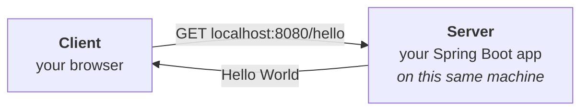
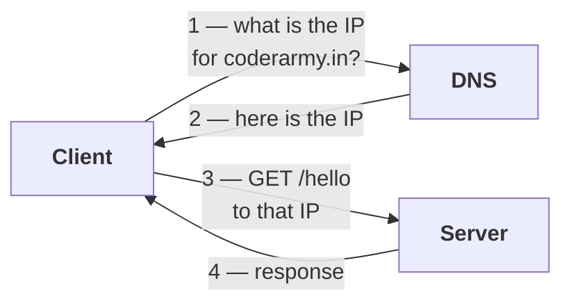
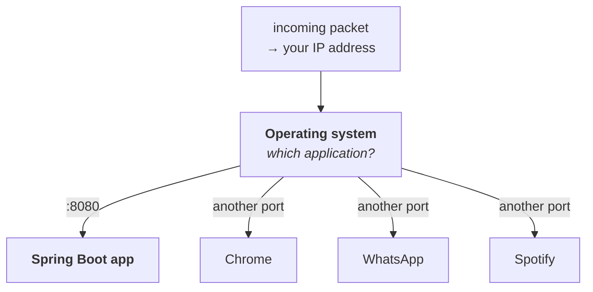
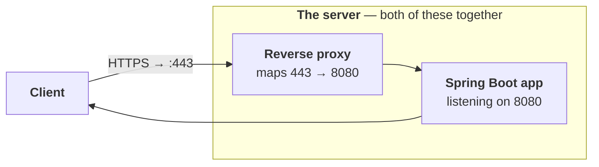
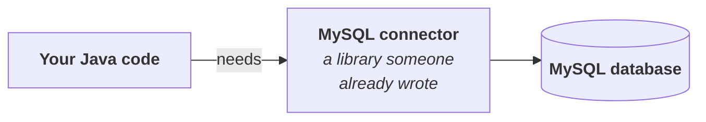

**The goal is small: open a browser, type a URL, see `Hello World`.** No syntax has been taught yet, so almost nothing in the code will make sense — and that is deliberate.

> Even though we will not understand a thing there, I want us to find out **how simple it is to build a Spring Boot application** — how it automatically configures everything for you, so that we can start straight away with our business logic.

**The point of this part is the speed, not the syntax.** Everything unexplained here is written down at the end as a list of open questions, and those questions are what the rest of the series answers.

---

# The flow being built

| | |
|---|---|
| **Client** | your own browser — Chrome |
| **Server** | your own Spring Boot application |
| Both running on | **the same computer** |
| So the host is | **`localhost`** |



**Because client and server are the same machine, you are hitting your own address.** Endpoint `/hello`, method `GET`, and the response should be the string `Hello World`, which the browser then displays on screen.

---

# How a request actually finds a server

## Every device has an IP address

> **If any client anywhere in the world wants to send a request to your computer, it has to send it to that particular IP address.**

## DNS resolves the name to the address

**The client does not know what `coderarmy.in` means. So before anything else, it asks.**

> **DNS's job is to resolve a domain name to an IP address.**



**Measured — the resolution is real and you can watch it happen:**

```
$ dig +short coderarmy.in A
18.161.246.4
18.161.246.45
18.161.246.20
18.161.246.44
```

> [!info] **Four addresses came back for one name, and that is normal.** DNS returns a **set** of addresses, and the client picks one — which is the cheapest form of load balancing there is. **One domain name does not mean one machine.**

**Only after step 2 can the client make the actual call**, and the request it sends carries the IP, not the name.

## `localhost` is the shortcut for myself

**When the client is your browser and the server is your own Spring Boot application on the same computer, no DNS lookup is needed.** The host becomes:

| | |
|---|---|
| **`127.0.0.1`** | **a fixed IP** meaning you are sending the request to yourself |
| **`localhost`** | the word you can write instead |

---

# Ports

**The IP address got the packet as far as your computer. Now what?**

> Inside this computer of mine there will be **multiple applications** running.

**Chrome, WhatsApp, Spotify, and your Spring Boot application are all running right now.** A data packet arrives at your IP — **how does the operating system know which of them it belongs to?**



> **Besides the IP address there is one more unique thing — the port number. One IP address can have many ports, and one unique application runs on each port.**

| | |
|---|---|
| The **IP address** finds | **the machine** |
| The **port number** finds | **the application on it** |

**That is why the URL is `localhost:8080` and not just `localhost`** — the client has to say which port on the server it wants.

## The question that follows immediately

**You never type a port when you visit a website.** `https://www.coderarmy.in` has no `:` in it. **So how does that request reach the right application?**

> **Because some ports are defined by standard.**

Measured from `/etc/services`:

```
http     80/tcp   www www-http  # World Wide Web HTTP
https   443/tcp                 # http protocol over TLS/SSL
```

| Request is | Port it goes to |
|---|---|
| **HTTP** | **80** |
| **HTTPS** | **443** |

> **The browser attaches the port itself.** `https://www.coderarmy.in` is silently `https://www.coderarmy.in:443`, and all HTTP traffic silently goes to port 80.

## But the application is on 8080

**Now the two facts collide.** The browser sent the request to port **443**, and the Spring Boot application on that server is listening on **8080**. Nothing would connect.

> **Between the client and the server there is one more thing — a reverse proxy. Its job is to map an incoming request on one port to another port.**



> **The reverse proxy is part of the server too.** You can take it that both of these together are what is called the server. **Every HTTPS request arriving on 443 is redirected to port 8080**, and the application receives the API call.

**And you can change the port** — which this part does later, and measures.

## The whole path, in order

| # | |
|---|---|
| **1** | Client takes the **domain name** to **DNS** |
| **2** | DNS returns the server's **unique IP address** |
| **3** | The browser **attaches the standard port** itself — **443** for HTTPS, **80** for HTTP |
| **4** | The request reaches the server on that port |
| **5** | A **reverse proxy** maps it to the port the application actually listens on — e.g. **8080** |
| **6** | The application sees the **endpoint** — `/hello` — and handles it |

---

# What you need installed

| | |
|---|---|
| **An IDE** | **IntelliJ IDEA** is used here — by far the most popular for Java. **Eclipse or NetBeans work identically**; nothing in this series depends on the IDE. |
| **Java** | any recent version, installed on your machine |

> We will put in a little effort ourselves too. Installing the JDK and picking an IDE is deliberately left to you.

---

# Spring Initializr

**Website: `start.spring.io`.** Before using it, the question worth asking is **why it exists at all.**

## What building a Java web app from scratch costs you

| You must first                        |                                                                                                                                                                          |
| ------------------------------------- | ------------------------------------------------------------------------------------------------------------------------------------------------------------------------ |
| **Create the folder structure**       | Until now, when we wrote code, we organised the folders any way we liked — **any file could be lying anywhere**. A web app has many classes and needs a proper structure. |
| **Do a lot of configuration**         |                                                                                                                                                                          |
| **Download dependencies**             | every external library your code needs                                                                                                                                   |
| **Configure the Spring Boot version** |                                                                                                                                                                          |
| **Configure the Java version**        |                                                                                                                                                                          |
| **Decide the package structure**      |                                                                                                                                                                          |

> **And look at this — you have not written a single line of business code yet.** You are just playing around with configurations.

## What a dependency is

**Say your Java code needs to connect to a MySQL database.**



> **A library means already-written code that someone has made as a template. Your job is just to use it.** You are not going to write everything from scratch — **you will not build your own MySQL connector**.

> **When you use any external library in your code, it becomes a dependency of your code** — because your code is dependent on that library.

## What Initializr gives you

> **Select your options, click Generate, and a ZIP downloads. Unzip it and you have a ready-made skeleton** — Spring Boot version, Java version, folder structure, all configured. **Your job is to go straight to your business logic.**

---

# Filling in the form

## Project — the build tool

| Option | |
|---|---|
| Gradle - Groovy | |
| Gradle - Kotlin | |
| **Maven** | **← used throughout this series**, the most popular |

> **These are project management tools.**

## Language

**Java.** Kotlin and Groovy are not used here.

## Spring Boot version — and what the suffixes mean

| Suffix | Meaning | Use it? |
|---|---|---|
| **SNAPSHOT** | **work in progress** — not complete, not finalised | ❌ chance of bugs |
| **RC** | **Release Candidate** — almost final, a candidate for release, **not actually released yet** | ❌ still a risk |
| (no suffix) | **stable** | ✅ **take the latest stable** |

**Measured against the live Initializr:**

```
4.1.1 (SNAPSHOT)     <- work in progress
4.1.0                <- stable, latest
4.0.8 (SNAPSHOT)
4.0.7                <- stable
```

**The notes are written against Spring Boot 4.** Whichever `4.x` stable you pick, everything here holds.

> [!info] **The rule outlives the version numbers.** By the time you read this there may be a Spring Boot 5. A few things will change; everything else is going to stay the same. **Pick the newest version with no suffix** and carry on.

## Project metadata — Group, Artifact, Package name

**Left at their defaults for now.** What they actually represent is covered with Maven in the next part.

## Packaging — JAR or WAR

| | |
|---|---|
| **JAR** | **J**ava **AR**chive — **what all modern Spring Boot applications use** ✅ |
| **WAR** | **W**eb **AR**chive — what Java web apps used in the older days |

## Configuration — `.properties` or `.yml`

**Either works. `.properties` is used here.**

## Java version

**Options are 17, 21, 25, 26.** The video picks **21** — it is neither very latest nor very old. **Everything measured in this note was run on Java 25**; nothing in it is version-sensitive.

## Dependencies — Spring Web

**You are building a Java web app, so your code needs to interact with the web and listen on a port.** That is one dependency: **Spring Web**.

**Read its description on the site, because two things in it matter:**

> Build web, including RESTful, applications using **Spring MVC**. Uses **Apache Tomcat as the default embedded container**.

| It says             | Which means                                                                          |
| ------------------- | ------------------------------------------------------------------------------------ |
| **Spring MVC**      | the module from part `01` — the web layer, which internally uses servlets            |
| **embedded Tomcat** | **the servlet container comes with it** — we will not need to download it separately |

> [!important] **In Spring Boot 4 the artifact this actually pulls in is `spring-boot-starter-webmvc`.** Measured in the generated `pom.xml`:
> ```xml
> <dependency>
>     <groupId>org.springframework.boot</groupId>
>     <artifactId>spring-boot-starter-webmvc</artifactId>
> </dependency>
> ```
> **Older tutorials, StackOverflow answers, and every Spring Boot 2 and 3 project say `spring-boot-starter-web`.** Same thing, renamed — but if you copy a dependency block from an older source into a Boot 4 project, the name is the thing to change.

---

# The generated project

**Click Generate, unzip, and open the folder in your IDE.** Measured contents:

```
demo/
├── pom.xml
├── mvnw                 <- Maven wrapper
├── mvnw.cmd
├── HELP.md
└── src/
    ├── main/
    │   ├── java/com/example/demo/
    │   │   └── DemoApplication.java
    │   └── resources/
    │       └── application.properties
    └── test/
        └── java/com/example/demo/
            └── DemoApplicationTests.java
```

 The one file worth opening is the Java one:

```java
package com.example.demo;

import org.springframework.boot.SpringApplication;
import org.springframework.boot.autoconfigure.SpringBootApplication;

@SpringBootApplication
public class DemoApplication {

    public static void main(String[] args) {
        SpringApplication.run(DemoApplication.class, args);
    }

}
```

> In fact, if you look at this carefully, this code will look familiar. **`public static void main`** — yes! Now we can see our Java code.

| Recognisable | Not recognisable |
|---|---|
| **`public static void main`** — and you know execution starts from `main` | **`@SpringBootApplication`** — what is this annotation? |
| | **`SpringApplication.run(...)`** — what does this method do? |
| | **and nothing else is written here at all** |


---

# First run — printing to the console

**Before touching the browser, check the application runs at all.** Add an ordinary `println`:

```java
public static void main(String[] args) {
    System.out.println("Hello World");
    SpringApplication.run(DemoApplication.class, args);
}
```

> **Remember: this prints nothing to the browser.** This is a plain Java program printing to its own console.

**Measured on Spring Boot 4.0.7 / Java 25:**

```
Hello World

  .   ____          _            __ _ _
 /\\ / ___'_ __ _ _(_)_ __  __ _ \ \ \ \
( ( )\___ | '_ | '_| | '_ \/ _` | \ \ \ \
 \\/  ___)| |_)| | | | | || (_| |  ) ) ) )
  '  |____| .__|_| |_|_| |_\__, | / / / /
 =========|_|==============|___/=/_/_/_/

 :: Spring Boot ::                (v4.0.7)

INFO --- [demo] [main] com.example.demo.DemoApplication  : Starting DemoApplication v0.0.1-SNAPSHOT using Java 25.0.1 with PID 63522

INFO --- [demo] [main] com.example.demo.DemoApplication  : No active profile set, falling back to 1 default profile: "default"

INFO --- [demo] [main] o.s.boot.tomcat.TomcatWebServer   : Tomcat initialized with port 8080 (http)

INFO --- [demo] [main] o.apache.catalina.core.StandardService : Starting service [Tomcat]

INFO --- [demo] [main] o.apache.catalina.core.StandardEngine  : Starting Servlet engine: [Apache Tomcat/11.0.22]

INFO --- [demo] [main] b.w.c.s.WebApplicationContextInitializer : Root WebApplicationContext: initialization completed in 372 ms

INFO --- [demo] [main] o.s.boot.tomcat.TomcatWebServer   : Tomcat started on port 8080 (http) with context path '/'

INFO --- [demo] [main] com.example.demo.DemoApplication  : Started DemoApplication in 0.794 seconds
```

**`Hello World` printed, so the application runs.** But there is far more in that log than there was code.

> [!important] Notice where `Hello World` appears — above the banner, before Spring has done anything. In Java, execution starts from the main method.**`System.out.println` ran first because it is written first**, and `SpringApplication.run(...)` — the line that does everything else in that log — had not been called yet. **The whole framework starts inside that one method call.**

## The line that matters

**Read the log for these four:**

| Log line | |
|---|---|
| `Tomcat initialized with port 8080 (http)` | **Tomcat got port 8080** |
| `Starting service [Tomcat]` | the service started |
| `Starting Servlet engine: [Apache Tomcat/11.0.22]` | **the servlet container from part `01`, embedded** |
| **`Tomcat started on port 8080`** | ← **the living proof that your server is up** |

---

# The server is already up, with no endpoints

**Visit `localhost:8080` before writing any controller.** Something appears — but not `Hello World`:

> **Whitelabel Error Page** This application has no explicit mapping for /error, so you are seeing this as a fallback. There was an unexpected error (type=Not Found, status=404).

> **That page says nobody has mapped this endpoint**, and since you have not built an error fallback either, you are seeing the default one.

> [!important] **A page appearing at all is the point.** Before you wrote a single endpoint, **the port is open and listening for network calls** — because Tomcat started, not because your code did anything. **That is the whole difference from part `01`**, where `start → run → stop → exit` meant nothing was there to answer.

> [!example]- **The same 404 looks completely different to a browser and to an API client.** Worth opening the first time you test an endpoint with Postman or `curl` and get something the video never showed.
>
> **Measured — a browser's `Accept` header:**
>
> ```
> $ curl -i -H "Accept: text/html,application/xhtml+xml,..." http://localhost:8080/
>
> HTTP/1.1 404
> Content-Type: text/html;charset=UTF-8
>
> <html><body><h1>Whitelabel Error Page</h1><p>This application has no explicit mapping
> for /error, so you are seeing this as a fallback.</p>…</body></html>
> ```
>
> **Measured — the same URL with `Accept: */*`, which is what `curl` and Postman send by default:**
>
> ```
> HTTP/1.1 404
> Content-Type: application/json
>
> {"timestamp":"2026-08-16T07:09:59.853Z","status":404,"error":"Not Found","path":"/"}
> ```
>
> **Same request, same status, two different bodies.** Spring looks at what the client said it would accept and picks a representation to match. **The Whitelabel page is the browser-facing view of a plain 404** — there is nothing special about it, and an API client never sees it.

---

# The controller

**In the `com.example.demo` package, create a new Java class — `HelloController`.**

> What does controller mean? For now you can take it that we have just made a simple Java class.

## What a controller is, roughly

> **Think of it as a gateway for writing your API endpoints.**

**Inside a controller you write: if someone hits `/hello`, which method should be called? If someone hits `/orders`, which method?**

> We talked about this in the first video — that this is exactly what we have to map: how a URL or an endpoint maps to a Java method.**This is that mapping.**

## Step one — an ordinary Java method

**Nothing new, nothing Spring-specific:**

```java
public String hello() {
    return "Hello World";
}
```

**It cannot be `void`** — the return type has to be `String`, because the method's job is to return one.

## Step two — proving it is an ordinary method

**You could call it yourself, the way you always have:**

```java
HelloController controller = new HelloController();
String s = controller.hello();
System.out.println(s);          // prints: Hello World
```

**It prints `Hello World` to the console, because the method returns `Hello World`.** Nothing magical is happening yet.

> **But you do not want to call it yourself.** I want that when someone goes to the browser and types `/hello`, **then** this method gets called.

## Step three — the two annotations

```java
package com.example.demo;

import org.springframework.web.bind.annotation.GetMapping;
import org.springframework.web.bind.annotation.RestController;

@RestController
public class HelloController {

    @GetMapping("hello")
    public String hello() {
        return "Hello World";
    }
}
```

| Annotation | What it says |
|---|---|
| **`@RestController`** | **this class is a controller** — a gateway where API endpoints are written |
| **`@GetMapping("hello")`** | **a `GET` request to `/hello` calls this method** |

**The leading slash is optional** — `@GetMapping("hello")` and `@GetMapping("/hello")` behave the same.

## And that is the entire application

**Restart, open `localhost:8080/hello`.** Measured:

```
$ curl -i http://localhost:8080/hello

HTTP/1.1 200
Content-Type: text/plain;charset=UTF-8
Content-Length: 11

Hello World
```

**`Hello World`, in the browser.** Count what it took:

| | |
|---|---|
| Downloaded the project from Initializr | ✅ |
| Changed the folder structure | ❌ **nothing** |
| Wrote configuration | ❌ **nothing** |
| Created **one** Java file with **one** method | ✅ |
| Wrote **two** annotations | ✅ |

---

# More than one endpoint

**Nothing limits you to one, and the method name does not have to match the endpoint:**

```java
@RestController
public class HelloController {

    @GetMapping("hello")
    public String hello() {
        return "Hello World";
    }

    @GetMapping("bye")
    public String greetBye() { // name deliberately different from the endpoint
        return "Bye";
    }
}
```

Measured:

```
$ curl http://localhost:8080/hello
Hello World

$ curl http://localhost:8080/bye
Bye
```

> **`hello()` and `greetBye()` are methods being called on the basis of the endpoint**, each returning a `String`, and the browser displays that string.

> [!info] **Every change needs a restart.** You will have to rerun every time, so that my changes can be deployed. The compiled class is what is running, so editing the source changes nothing until you rebuild. **Adding the `spring-boot-devtools` dependency makes the app restart itself when a class is recompiled** — worth knowing about now, though everything here is done the manual way.

---

# Returning HTML

**Wrap the string in an `<h1>` tag:**

```java
@GetMapping("hello")
public String hello() {
    return "<h1>Hello World</h1>";
}
```

**In the browser, `Hello World` now renders as a large heading.**

> [!question]- **Deep dive — why the tag renders in a browser but shows up literally in Postman.** Worth opening, because the same endpoint genuinely returns two different things and this is the first place Spring's behaviour depends on the client rather than on your code.
>
> **The bytes are identical either way. The `Content-Type` header is not.**
>
> **Measured with a browser's `Accept` header:**
>
> ```
> HTTP/1.1 200
> Content-Type: text/html;charset=UTF-8
> Content-Length: 20
>
> <h1>Hello World</h1>
> ```
>
> **Measured with `Accept: */*`, which is what `curl` and Postman send:**
>
> ```
> HTTP/1.1 200
> Content-Type: text/plain;charset=UTF-8
> Content-Length: 20
>
> <h1>Hello World</h1>
> ```
>
> **Same 20 bytes, two content types.** A browser told `text/html` parses the tag and paints a heading. A browser told `text/plain` would print `<h1>Hello World</h1>` as visible characters — which is exactly what an **API client** shows you.
>
> **The mechanism is content negotiation.** Your method returns a `String`; Spring looks at the request's `Accept` header and chooses a representation. **This is also why `Content-Type` was worth learning in part `01`** — it is not decoration, it decides how the receiver interprets identical bytes.
>
> **The practical consequence:** returning HTML from a `@RestController` works by accident of the browser asking for HTML. **Real APIs return JSON**, and real pages are rendered by a template engine or a front end — not by concatenating tags into a `String`.

---

# Changing the port

**`Tomcat started on port 8080` is a default, not a law.** Open `src/main/resources/application.properties`:

```properties
spring.application.name=demo
server.port=9090
```

**Restart. Measured:**

```
INFO --- o.s.boot.tomcat.TomcatWebServer : Tomcat initialized with port 9090 (http)
INFO --- o.s.boot.tomcat.TomcatWebServer : Tomcat started on port 9090 (http) with context path '/'
```

**And the old port is genuinely gone:**

```
$ curl http://localhost:8080/hello
curl: (7) Failed to connect to localhost port 8080 — Couldn't connect to server

$ curl http://localhost:9090/hello
<h1>Hello World</h1>
```

> [!important] **Read the property name carefully — `server.port`, not `app.port`.** It is not my Spring Boot application listening on this port — the **Tomcat server** is listening. **You are configuring the embedded servlet container**, which is the thing that owns the socket. Your code never touches a port at all.

---

# The questions this leaves open

**Everything worked. Almost nothing is understood.**

| Question                                       |                                                                                                                                                                              |
| ---------------------------------------------- | ---------------------------------------------------------------------------------------------------------------------------------------------------------------------------- |
| **Who started the Tomcat server?**             | You never wrote a line to start one                                                                                                                                          |
| **Did we even install Tomcat?**                | **No — and yes.** We did not install it separately ourselves — it came with the Spring Web dependency, which said it **uses Apache Tomcat as the default embedded container** |
| **How did `/hello` map to `hello()`?**         | You never called that method from `main`                                                                                                                                     |
| **What is `@RestController`?**                 |                                                                                                                                                                              |
| **What is `@GetMapping`?**                     |                                                                                                                                                                              |
| **What is `@SpringBootApplication`?**          |                                                                                                                                                                              |
| **What does `SpringApplication.run(...)` do?** | if we go inside this `run`, we will not understand a thing about what is happening inside.                                                                                   |
|                                                |                                                                                                                                                                              |

> [!important] **The mapping question is the sharpest one, because it contradicts what Java taught you.** Having studied Java, we just assume that our API only gets hit if we call something from `main`. **Nothing in `main` calls `hello()`. Yet it runs.**
> 
> Something in the background is finding that method and wiring it to a URL — and that something is what the rest of the series is about.

## Why you cannot skip to Spring Boot

**The obvious reaction is: if Spring Boot configures everything, why learn Spring MVC and the rest?**

> The answer I have is that **you simply cannot understand Spring Boot directly.** Even if you set out to understand Spring Boot, I will have to explain to you what `@GetMapping` is, what `@RestController` is — and I will have to explain its ideology to you, which is **Spring Core**.

**Two arguments, and the second is the practical one:**

| | |
|---|---|
| **You end up there anyway** | explaining Spring Boot's annotations is explaining Spring MVC and Spring Core |
| **Debugging** | suppose you add `/bye`, restart, and nothing appears. **Without the internals you cannot go a single level down.** You would not know what the annotation does, what a controller is, or how the endpoint was ever reached |

---

# What this part established

| | |
|---|---|
| The goal | browser → **`localhost:8080/hello`** → **`Hello World`** |
| Client and server here | **both your own machine** |
| Every device has | a unique **IP address** |
| Before calling, the client asks | **DNS**, to resolve a **domain name** to an **IP address** |
| Measured | one domain returned **four IPs** — DNS returns a set |
| Your own machine is | **`127.0.0.1`**, written as **`localhost`** |
| Why a **port** is needed | one machine runs many apps — **IP finds the machine, port finds the app** |
| One IP has | **many ports**, one application each |
| Standard port for **HTTP** | **80** |
| Standard port for **HTTPS** | **443** |
| The browser attaches the port | **itself** — you never type it |
| But the app listens on | **8080** — so a **reverse proxy** maps **443 → 8080** |
| The reverse proxy is | **part of the server** |
| Tools needed | an **IDE** (IntelliJ used here; any is fine) and **Java** installed |
| Building from scratch means | folder structure · configuration · **dependencies** · Spring Boot version · Java version · package structure |
| …all before | **one line of business code** |
| A **library** is | already-written code someone made as a template |
| A **dependency** is | an external library your code depends on |
| **Spring Initializr** | `start.spring.io` — generates a ready-made **skeleton** as a ZIP |
| Build tool chosen | **Maven** (Gradle Groovy / Gradle Kotlin also offered) |
| **SNAPSHOT** means | **work in progress** — do not use |
| **RC** means | **Release Candidate** — almost final, not released — do not use |
| The rule | take the **latest version with no suffix** |
| **JAR** | **Java Archive** — what modern Spring Boot uses ✅ |
| **WAR** | **Web Archive** — the older Java web app format |
| Config file format | **`.properties`** or **`.yml`** — either |
| Dependency added | **Spring Web** — builds RESTful apps with **Spring MVC** |
| It brings | **Apache Tomcat as the default embedded container** — no separate install |
| ⚠️ In Boot 4 the artifact is | **`spring-boot-starter-webmvc`** — older material says `spring-boot-starter-web` |
| Generated entry point | **`DemoApplication.java`** with **`@SpringBootApplication`** and **`SpringApplication.run(...)`** |
| Measured startup | **Tomcat 11.0.22**, port **8080**, started in **0.794 s** |
| The proof the server is up | **`Tomcat started on port 8080`** |
| Before any endpoint exists | **Whitelabel Error Page** — `no explicit mapping for /error` |
| ⚠️ Measured | that same 404 returns **JSON** to `curl`/Postman and **HTML** to a browser |
| A **controller** is | a **gateway** where you write API endpoints |
| **`@RestController`** | marks the class as a controller |
| **`@GetMapping("hello")`** | a `GET` to `/hello` calls this method |
| The leading `/` | **optional** |
| The method name | **need not match** the endpoint — `greetBye()` served `/bye` |
| Every code change | needs a **restart** (`spring-boot-devtools` automates it) |
| Returning `<h1>…</h1>` | renders in a **browser**, shows literally to an **API client** |
| Why | **content negotiation** — the same bytes get `text/html` or `text/plain` |
| Changing the port | **`server.port=9090`** in `application.properties` |
| What you are configuring | **the embedded Tomcat**, not your code |
| Total code written | **one class, one annotation on it, one annotation per endpoint** |
| ⚠️ Still unexplained | who started Tomcat · how `/hello` reached `hello()` · every annotation · `SpringApplication.run` |
| Why you cannot skip ahead | explaining Boot's annotations **is** explaining Spring MVC and Spring Core — and without them you cannot **debug** |
