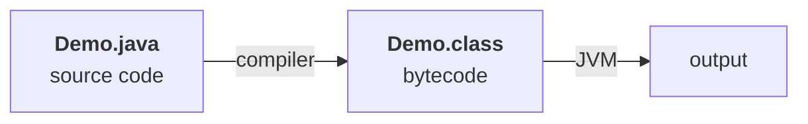
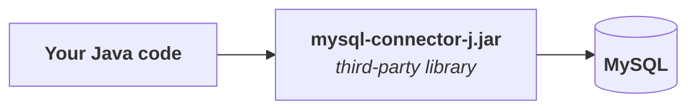
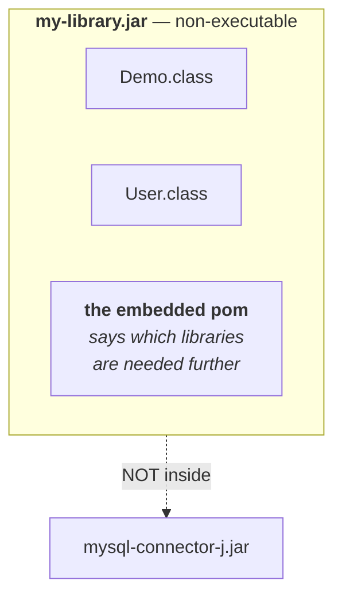
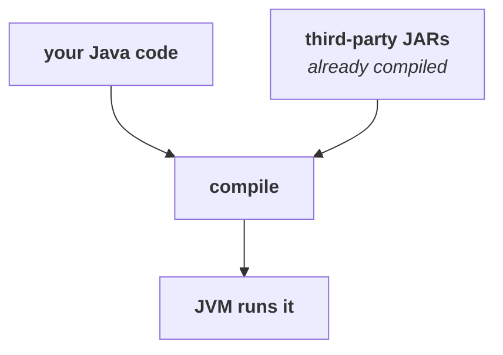
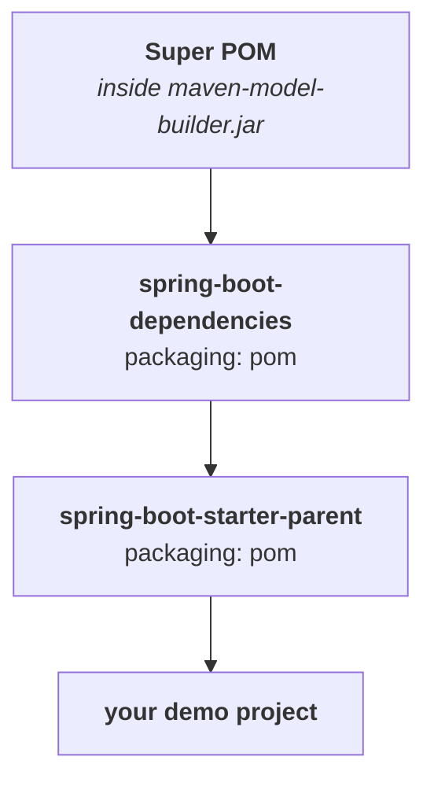
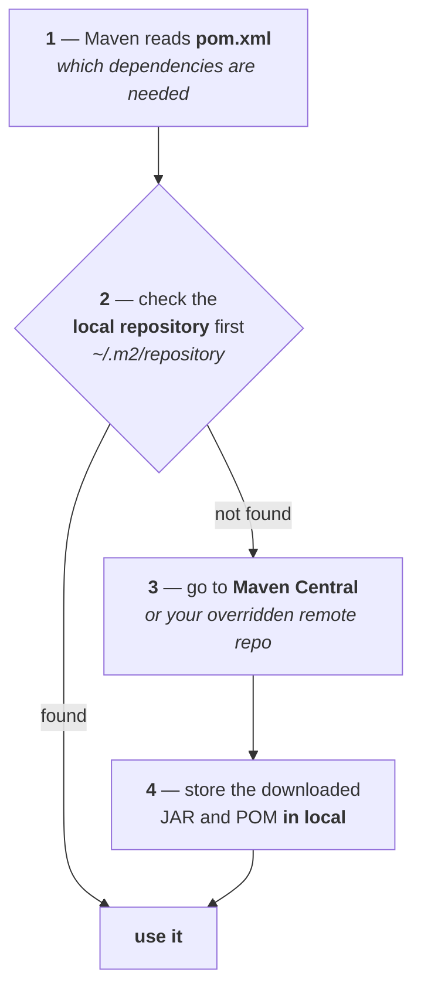

**Maven is not a Spring thing.** It works with core Java, Spring, Spring Boot, Hibernate, and any other Java project. Nothing in this part depends on Spring at all.

# The journey of Java code, before Maven

**Everything already known:** you write a `.java` file, push it through a compiler, and get bytecode with a `.class` extension. Any JVM can run that bytecode, and your program produces output.



| | |
|---|---|
| **`.java` file** | source code written by the developer |
| **`.class` file** | compiled bytecode understood by the JVM |

**Java code is never executed as `.java`.** It is compiled first, and the JVM runs the result.

## A real project is not one file

**Think of any real-world application** — and it does not have to be a web project; a console project counts. It will have many classes:

```
Order.java
User.java
Payment.java
EmailService.java
InvoiceGenerator.java
Main.java
```

**Compile them and you get one `.class` file per source file:**

```
Order.class
User.class
Payment.class
EmailService.class
InvoiceGenerator.class
Main.class
```

> If you compile them one by one, first of all it will take a lot of time — and even once you have compiled them all, you end up with a lot of class files.

## Now share that project with a friend

**One option is to email every `.class` file.** It is a terrible option — they have to download each one and put it back together.

**The better-looking option is to zip the folder.** Put every class in one folder, zip it, send it; your friend unzips it and opens it in IntelliJ.

> Technically you can do this, but it is very ugly.

**It breaks the moment the project is real:**

| What goes wrong | |
|---|---|
| **Files get missed** | there can be hundreds of Java files |
| **The folder structure is not preserved** | it is not the structure you intended it to have |
| **Your friend uses a different structure** | now nothing lines up |
| **Extra resources get left out** | images, static resources, `.properties` files |

**So Java needed a standard way for developers to share a project's many files. That is where the JAR is born.**

---

# JAR — Java Archive

**JAR stands for Java Archive**, and it is not complicated:

> **You can think of it exactly like a ZIP file, one that stores multiple `.class` files inside it so you can share them with your friend.**

**Basically it is a package.** What can it hold?

| Inside a JAR | |
|---|---|
| **multiple `.class` files** | the compiled code |
| **resources** | images, `.properties` files, configuration files |
| **folders / packages** | every package you made in Java |
| **metadata** | |

**All of it packed into one package, called a JAR.** You share that one file; your friend integrates it into their application, and their job just got easy.

> [!important] **A JAR always packages *compiled* code.** You compiled all of these first and then made a package of them. It is always the compiled code that gets packaged. The `.class` files go in, not the `.java` files.

## Two reasons JAR files exist

### Reason 1 — to share your own Java code easily

**Say you wrote a calculator library.** You wrote many classes; finally you package them into `calculator.jar`. Share that, and your friend can use your classes and methods from inside their own application.

### Reason 2 — to use external libraries yourself

**This one matters more.** Your Java application needs to connect to a database — say MySQL. To do that you need a **connector**, and which connector depends on the database: MySQL needs the MySQL connector, PostgreSQL needs the Postgres connector.

> Obviously you are not going to write that connector from scratch yourself.

**Someone has already built it as a third-party library, and you download it as a JAR** — `mysql-connector-j.jar` or whatever its exact name is.



> **Whether you are sharing your own code or consuming somebody else's, a JAR file is what is moving.** Every third-party library your application depends on — you are using it *as a JAR file*.

**This is true of every Spring Boot project too.** The Spring Boot dependency, the Spring MVC dependency — all JARs.

---

# Library vs application

**A doubt that comes up immediately, and the whole next section depends on the answer.**

| | |
|---|---|
| **Library** | code that is **not runnable**. There may be no `main` method in it at all. It is packages and classes that *somebody else's* code can use. |
| **Application** | code that **actually runs** — it has a `main` method, and you can run the whole thing. |

> A library means some classes are inside it. **You cannot run it independently**. But you can put a library inside an application.

And that is where the word from part `01` comes back:

> **If you use a library inside an application, that library becomes a dependency for the application.** In Spring Boot's language — in Maven's language — we call it a **dependency**.

**Many of Java's own built-in libraries work exactly this way.** They are not independently runnable code; they are just classes you can use.

---

# Does your JAR contain your dependencies' JARs?

**The question everyone asks.** You built an application. It has your own code — `Demo.java`,`User.java` — and it uses third-party JARs like `mysql-connector-j.jar`. **When you build a JAR of your whole application, are those third-party JARs inside it?**

> **It depends on whether you built an application or a library.**

## If you built a library



**The external JARs are not present inside it.** Only your own code is.

> So then how will anyone using my library know that my library needs some other library?

**Because inside the library there is a special file** that says which further libraries this library needs to run. Whoever uses `my-library.jar` will know they also need those dependencies.

**That special file is `pom.xml`, if you are using Maven** — and it is present in the application case too.

> [!example]- **Measured — cracking a plain library JAR open and finding that file.** Worth opening, because the special file is not an abstraction: it is sitting inside the archive at a fixed path.
>
> **Built from a project with two declared dependencies — `mysql-connector-j` and `hibernate-core`:**
>
> ```
> $ unzip -l target/MavenDemo-1.0-SNAPSHOT.jar
>
>   Length      Name
> ---------     ----
>        81     META-INF/MANIFEST.MF
>       316     org/example/controller/HelloController.class
>       264     org/example/Demo2.class
>       261     org/example/Demo.class
>       539     org/example/Main.class
>      1157     META-INF/maven/org.example/MavenDemo/pom.xml
>        62     META-INF/maven/org.example/MavenDemo/pom.properties
> ---------
>      2680     14 files
> ```
>
> **2,680 bytes, and not one byte of MySQL or Hibernate in it.** The four `.class` files are the author's own; `mysql-connector-j-9.5.0.jar` alone is about 2.5 MB and is nowhere in the archive.
>
> **`META-INF/maven/org.example/MavenDemo/pom.xml` is the special file.** It is a verbatim copy of the project's `pom.xml`, carried inside the JAR, and it is what tells any consumer this thing further needs mysql-connector-j 9.5.0 and hibernate-core 7.3.6.Final. **Nothing downloads them automatically — the consumer's own Maven reads that list and resolves it.**

## If you built an application

**Say it is a Spring Boot application.** It has your own code, plus a `Main.java` that is runnable, plus dependencies like `mysql-connector-j.jar`. Build a JAR of *that*, and you get something different:

> **`my-application.jar` is an independent JAR. We call it an executable JAR.**

**It can execute independently.** When your friend uses it, the further dependencies inside it — like the MySQL connector — **come along automatically**. There is nothing separate to download.

| | |
|---|---|
| **Library JAR** | **non-executable**. Your compiled code only. External library *details* live in the embedded pom, not the JARs themselves. |
| **Application JAR** | **executable** — Spring Boot packages the application code **plus its dependencies**, so it runs as one complete file. Also called a **fat JAR**. |

> [!example]- **Measured — the same contrast, on a real Spring Boot 4.0.7 build.** Worth opening once, because the size difference is the whole point and it is startling.
>
> **After `mvn package` on the Initializr project from part `02`, the `target/` folder holds two files:**
>
> ```
> 19M   target/demo-0.0.1-SNAPSHOT.jar
> 4.0K  target/demo-0.0.1-SNAPSHOT.jar.original
> ```
>
> **`.jar.original` is the plain library-style JAR** — 4 KB, your classes and nothing else. **The 19 MB file is the executable JAR**, and the difference is entirely other people's code:
>
> ```
> BOOT-INF/
> BOOT-INF/classes/          <- your own compiled code
> BOOT-INF/lib/              <- 34 JAR files
> BOOT-INF/classpath.idx
> META-INF/MANIFEST.MF
> org/                       <- Spring Boot's own launcher
> ```
>
> **A sample of what is in `BOOT-INF/lib/`:**
>
> ```
> tomcat-embed-core-11.0.22.jar
> spring-boot-autoconfigure-4.0.7.jar
> jackson-databind-3.1.4.jar
> logback-classic-1.5.34.jar
> snakeyaml-2.5.jar
> ```
>
> **`tomcat-embed-core-11.0.22.jar` is the answer to part `02`'s open question.** *"Did we even install Tomcat?"* — no. It was shipped inside the JAR, and the version in that filename is exactly the `Apache Tomcat/11.0.22` that appeared in the startup log.

---

# Classpath

**Put the two halves together.** Your own Java code plus third-party JARs get compiled together, and the JVM runs the compiled result.



**Note the asymmetry:** the third-party JARs are *already* compiled code, so the compiler only ever compiles yours.

**Now the question at runtime.** Your code calls a class or a method that belongs to a third-party library. **How does the JVM know which method to call, and where it lives?**

> **This is where the classpath comes in. You can think of the classpath as a special place where Java searches for files.**

| Java looks | |
|---|---|
| **1** | in **your own project's classes** first — if the class is there, it uses it |
| **2** | otherwise inside the **external JARs' bytecode** — if it is there, it uses it from there |
| **3** | any other configured class locations |

> **In simple words: the classpath tells Java where to search for the classes it needs.**

---

# Doing it by hand, and why that collapses

**You need to connect your application to MySQL, so you need the MySQL connector JAR. The simplest possible approach:** search mysql connector jar download, land on `mysql.com`, pick your version (9.7.0 is what is offered), pick your operating system, download.

> That is quite simple. But think — is this approach practical?

**It was one JAR. Real applications need hundreds.**

## The four problems

|                                         |                                                                                                                                                                                                                                                  |
| --------------------------------------- | ------------------------------------------------------------------------------------------------------------------------------------------------------------------------------------------------------------------------------------------------ |
| **1 — Manual effort**                   | downloading hundreds of third-party libraries one by one                                                                                                                                                                                         |
| **2 — Version mismatch**                | Today we use **Spring 7**, which works with **Spring Boot 4**. But if you use Spring 6, it will not work with Spring Boot 4. Download Spring 7 and pair it with Spring Boot 3, and the two do not line up. **You have to manage that yourself.** |
| **3 — Transitive dependencies**         | you download one dependency, and **it depends on further dependencies**. You have to download those too — and you have to *know* what they are                                                                                                   |
| **4 — Nobody else knows what you used** | ship a library JAR to a friend, and they have no information about which JARs it needs                                                                                                                                                           |

**Problem 4 is the ugliest one.** Without a tool, you would put a text file in the project listing every dependency: if you want to use my library, here is the list, download these. Then they download them — but which **versions**? So you list the versions too. **Now they are doing all your manual work again.**

## Maven's offer

> **You do not need to do any of this. When you write an application or a library, focus on your business logic, focus on your code. Just tell me which dependency you need and I will download it myself.**

And it goes further:

> **"In fact, if your dependency further depends on other dependencies — transitive dependencies — I will download those too, automatically. You do not even need to tell me about them."**

---

# What Maven is

**In as few words as possible:**

> **Maven is a project management tool.**

**Meaning it manages your project.** When you write code, build an application or a library, use multiple third-party libraries, there are a lot of complications — **Maven says it will handle all of them for you.**

**Roughly, it does four things:**

| # | | |
|---|---|---|
| **1** | **Maintains a folder structure** | a fixed standard structure, the same for everyone |
| **2** | **Compiles your Java code** | every class, in one click |
| **3** | **Creates your JAR file** | packaging your own project |
| **4** | **Downloads dependencies** | other people's external JARs, easily |

**Points 2 and 3 are really part of something bigger** — a **lifecycle** with phases like `clean`,`compile`, `test` and more, covered at the end of this part.

## Why the fixed folder structure matters

**Imagine a team of several people on one application.** If everyone used their own folder structure, one person's main class would be somewhere, another's configuration classes somewhere else.

> **Maven says no — there will be one fixed folder structure, common to everybody.**

**This principle has a name: convention over configuration.** Maven already assumes a standard project structure. Follow it, and you do not have to configure anything manually — Maven knows **where the source code is**, **where the tests are**, **where resources are**, and **where to put generated output**.

> [!important] **This folder structure is Maven's, not Spring Boot's.** The `MavenDemo` project above has no Spring in it at all and still gets `src/main/java`, `src/main/resources`, `src/test/java` and `target/classes`. **Spring Boot is opinionated about entirely different things** — which is worth pinning down now, because both layers advertise themselves with the phrase *"convention over configuration"*.

> [!question]- **Deep dive — which conventions belong to Maven and which to Spring Boot.** Worth opening once, because the two get blamed for each other constantly and auto-configuration will assume you have them separated.
>
> **Maven decides *where files go*. Spring Boot decides *what they mean and what gets wired up because of them*.**
>
> | Maven's conventions | Spring Boot's conventions |
> |---|---|
> | **`src/main/java`** is where source lives | **which beans exist**, inferred from what is on the classpath — *auto-configuration* |
> | **`src/main/resources`** is where non-Java files live | **`application.properties`** — that *filename*, in that folder, meaning app config |
> | **`src/test/java`** is where tests live | **`static/`** and **`templates/`** meaning served content |
> | **`target/classes`** is where bytecode goes | **port 8080**, embedded Tomcat, `@SpringBootApplication` scanning its own package downward |
> | the JAR is **`artifactId-version.jar`** | **starter** dependencies, and versions chosen for you by the parent |
>
> **Measured — `spring-boot-starter-parent` never mentions a source path at all:**
>
> ```
> $ grep -cE "sourceDirectory|src/main/java|testSourceDirectory" spring-boot-starter-parent-4.0.7.pom
> 0
> ```
>
> **It inherits them from the super POM, exactly like your project does.**
>
> **The cleanest place to see the two layers stacked** is the only mention of resources in that parent. It does not define `src/main/resources` — it **references** Maven's folder and layers its own meaning onto one filename inside it:
>
> ```xml
> <resource>
>   <directory>${basedir}/src/main/resources</directory>   <!-- Maven's folder -->
>   <filtering>true</filtering>
>   <includes>
>     <include>**/application*.properties</include>        <!-- Boot's filename -->
>     <include>**/application*.yml</include>
>   </includes>
> </resource>
> ```
>
> **The test that keeps them straight:**
>
> | | |
> |---|---|
> | **Switch Maven → Gradle**, keep Spring Boot | the layout **stays** `src/main/java` — Gradle copied Maven's layout. It is the JVM-wide standard directory layout now; **Maven only established it** |
> | **Drop Spring Boot**, keep Maven | the layout is **unchanged**, but nothing starts a Tomcat, nothing reads `application.properties`, and `static/` is just a folder nobody serves |

## Getting Maven

**Search maven download and Apache's site comes up** — Maven is an Apache project. You can download it and set it up on your system with the class path configured.

> But we do not need to do any of this

**Every IDE ships Maven pre-installed.** IntelliJ, Eclipse, NetBeans, VS Code — you create projects that use Maven internally without installing anything.

**Installing it for the terminal is separate**, and worth doing, because `mvn` on the command line is how it is used in real projects. That comes at the end of this part.

---

# Creating a Maven project

**New Project in IntelliJ.** Name it `MavenDemo`, pick a location, and then the field that matters: **Build system.**

| Option | |
|---|---|
| **IntelliJ** | the IDE's own built-in build system |
| **Maven** | ← **this one** |
| **Gradle** | |

**Why not IntelliJ's own?** Because you would be the only one using it.

> Somebody else in my own team might use Maven. A third person might use Gradle. **Then everyone's folder structure and everyone's build systems would end up very different**.

**What a build system decides:**

| | |
|---|---|
| how your code is **built** | |
| how it is **compiled** | |
| how it is **packaged** | |
| the **folder structure** | it varies per build system |
| how **dependencies are downloaded** | that varies too |

> **Choose Maven and it stops mattering which IDE anyone uses** — IntelliJ, Eclipse, NetBeans. The build system is Maven for all of them.

**Then the Java version** (whatever you have installed), **and Add sample code** ticked so a `main` class is generated for you — untick it and you would write that file yourself.

**Under Advanced Settings, two fields:**

| | Default |
|---|---|
| **GroupId** | `org.example` |
| **ArtifactId** | `MavenDemo` |

**Leave them for now.** They are the subject of `pom.xml`, below — but note them, because the folder structure is about to be built out of them.

---

# The standard folder structure

**What Maven generates:**

```
MavenDemo/
├── pom.xml
└── src/
    ├── main/
    │   ├── java/
    │   │   └── org/example/          <- groupId as folders
    │   │       └── Main.java
    │   └── resources/
    └── test/
        └── java/
```

**Plus two things to ignore:** `.mvn` (Maven's internal folder) and `.idea` (IntelliJ's internal folder). **And in the project pane, `External Libraries`** — where every external JAR you download will appear. Right now it holds only the JDK.

**Two things actually matter: the `src` package and `pom.xml`.**

## `src` — main and test

**`src` means: whatever application I am building lives in here.** Open it and there are two:

| | |
|---|---|
| **`main`** | every class you write for the application itself |
| **`test`** | the test cases for them |

> **You can write test cases for a Spring Boot application, or any Java application — what we call unit tests.** There are many libraries for it — **Mockito**, **JUnit** — and this series will use them.

## `main` — java and resources

| | |
|---|---|
| **`src/main/java`** | every `.java` file — your actual Java code. Controllers, services, repositories, utility classes, the main application class |
| **`src/main/resources`** | every **non-Java** file — text files, static images, `.properties` files, `.yml`, templates |

## The groupId becomes folders

**Open `src/main/java` and the structure is `org.example`** — which was the GroupId from Advanced Settings.

> [!important] **Do not be confused by the dot.** `org.example` is **not one folder**. Inside `java` there is a folder `org`, and inside `org` there is a folder `example`. IntelliJ collapses them into `org.example` only because `org` has just one child.
>
> **Proof:** add a second package `org.example2`, and the display splits into `org` containing `example` and `example2`. Delete it and they collapse again.

**Every Java file you write goes inside `org.example`** — `Demo.java`, `Demo2.java`, and your own sub-packages: `org.example.controller` holding `HelloController.java`.

> In Spring Boot we definitely create a controller directory. We will see why.

## `test` mirrors `main`

**The empty Maven project has only `src/test/java`, with nothing in it.** But the moment you write a test file, **its folder structure is exactly the same as `main`'s.**

**The Spring Boot project from part `02` shows it already built.**

> [!info]- **Don't have that project? Regenerate it on `start.spring.io` in a minute.** The exact form settings, so the folder structure below matches yours.
>
> | Field | |
> |---|---|
> | **Project** | **Maven** |
> | **Language** | **Java** |
> | **Spring Boot** | **any 4.x with no suffix** — `4.0.7` or `4.1.0`. *"Do not use snapshots, because that is work in progress"* |
> | **Group / Artifact** | leave as `com.example` / `demo` |
> | **Packaging** | **Jar** |
> | **Configuration** | **Properties** |
> | **Java** | any — the video takes 21 |
> | **Dependencies** | **Spring Web** → Add Dependencies |
>
> **Generate**, unzip the ZIP, and open the folder in IntelliJ. **What each field means is part `02`.**
>
> **You will not have `HelloController.java`** — that was written by hand last part — **and you may not have a `target` folder**, since you have not built anything yet. Neither matters here.

**The structure:**

```
src/
├── main/
│   ├── java/com/example/demo/
│   │   ├── DemoApplication.java      <- Spring Boot generated this
│   │   └── HelloController.java      <- you wrote this
│   └── resources/
│       ├── static/                   <- static resources, images
│       ├── templates/                <- templates
│       └── application.properties    <- where server.port was changed
└── test/
    └── java/com/example/demo/
        └── DemoApplicationTests.java
```

**`com.example.demo` is `groupId` + `artifactId`** — Group `com.example`, Artifact `demo`, which is what the Initializr form asked for. **Inside `com` is `example`, inside `example` is `demo`.**

> **A test file's location mirrors the class it tests.** A test for `HelloController` goes at `src/test/java/com/example/demo/HelloControllerTest.java` — same package, same hierarchy.

**There is also `src/test/resources`** for resources needed only during testing — test configuration files, test data files.

---

# `target` — the folder Maven creates

**The empty Maven project has no `target` folder. The Spring Boot project from part `02` does**, and that is the one difference between the two structures.**`target` is generated output, not source code.** It appears the moment you build, and it can hold:

| | |
|---|---|
| compiled **`.class`** files | under `target/classes` |
| the final **JAR / WAR** | |
| **test reports** | |
| generated sources | |
| temporary build files | |

**Delete it and Maven recreates it on the next build.**

## Compiling, and watching it appear

**In IntelliJ's Maven panel** — the `m` icon on the right; if it is not there, turn it on in Settings— **open `MavenDemo` and there are four sections:**

| | |
|---|---|
| **Lifecycle** | the phases: `clean`, `validate`, `compile`, `test`, `package`, `verify`, `install`, `site`, `deploy` |
| **Plugins** | |
| **Dependencies** | where the **hierarchy** of what you pulled in is visible |
| **Repositories** | |

**Click `compile`.** The build succeeds, and `target` appears:

```
target/
├── classes/
│   └── org/example/
│       ├── Demo.class
│       ├── Demo2.class
│       ├── Main.class
│       └── controller/
│           └── HelloController.class
├── generated-sources/
├── maven-status/
└── test-classes/
```

> **Maven knows a proper way to store bytecode: the same folder structure, the same hierarchy.** `org/example/controller/HelloController.class` mirrors `org/example/controller/HelloController.java` exactly.

> [!info] **Opening a `.class` file shows readable Java, not bytecode.** That is the IDE decompiling it back to source for display. The file on disk is `Main.class`, and it is bytecode.

## The green Run button does not use Maven

**A genuinely interesting detail.** Write `System.out.println("Hello World")` in `Main.java` and press the green Run arrow. `Hello World` prints — and a `target` folder appears with the same structure. **So Maven compiled it?**

> **No.**

|                       |                                                                         |
| --------------------- | ----------------------------------------------------------------------- |
| **Green Run button**  | **IntelliJ's own build system** compiles the code, and IntelliJ runs it |
| **Maven → `compile`** | Maven compiles it                                                       |
|                       |                                                                         |

**But IntelliJ knows the project uses Maven's build system**, so it puts its compiled output in exactly the same place — a `target` folder, same internal structure. **It does not invent a separate folder system.**

> So it feels to us like it is compiling through Maven and there is no difference between the two. But if we go all the way inside, there is a difference.

---

# `pom.xml` — Project Object Model

**The single most important file for Maven.**

> **POM stands for Project Object Model.**

**What it tells Maven — complete information about your project:**

| | |
|---|---|
| the project's **name** | |
| its **version** | |
| which **third-party libraries** it uses | |
| which **plugins** it uses | |
| **build configuration** | |
| a **parent** configuration, if any | |

**In a brand-new empty project the file is tiny.** As you add configuration and dependencies, it grows.

```xml
<?xml version="1.0" encoding="UTF-8"?>
<project xmlns="http://maven.apache.org/POM/4.0.0"
         xmlns:xsi="http://www.w3.org/2001/XMLSchema-instance"
         xsi:schemaLocation="http://maven.apache.org/POM/4.0.0 http://maven.apache.org/xsd/maven-4.0.0.xsd">

    <modelVersion>4.0.0</modelVersion>

    <groupId>org.example</groupId>
    <artifactId>MavenDemo</artifactId>
    <version>1.0-SNAPSHOT</version>

    <properties>
        <maven.compiler.source>25</maven.compiler.source>
        <maven.compiler.target>25</maven.compiler.target>
        <project.build.sourceEncoding>UTF-8</project.build.sourceEncoding>
    </properties>

</project>
```

## `<project>` — the root tag

**Every POM starts with it.** It says a `pom.xml` file is beginning.

## The three schema lines

**Those `xmlns` and `xsi:schemaLocation` attributes are the POM's schema design — its rules.**

**XML is tags: an opening tag, a closing tag, content between them.** The schema decides **which tags are allowed** and which are not.

> **It is not as if you can put any tag you like in there.**

**Measured — put an invented tag in and hover it:**

```xml
<abc></abc>
```

```
Invalid content was found starting with element 'abc'
```

**It does not know what that tag is. It is against the rules.**

## `<modelVersion>`

```xml
<modelVersion>4.0.0</modelVersion>
```

> [!important] This is the version of the *POM model*, not of Maven. Maven's own version can be anything. The POM's model version is **`4.0.0`**, and essentially every Maven project uses it.

## GAV — the three tags that identify your project

```xml
<groupId>org.example</groupId>
<artifactId>MavenDemo</artifactId>
<version>1.0-SNAPSHOT</version>
```

> **These three together uniquely identify your entire project.** They are called the **Maven coordinates**.

### `groupId` — and why it is a reversed domain

**It has to be unique.** If you build a JAR of your project and upload it to the internet, no other JAR anywhere should carry that name — otherwise nobody can name your library unambiguously.

> But how will you make your name unique? For this we use a very good nomenclature.

**The most unique name any of us has is our domain name.** So the convention is: **take your domain and reverse it.**

| Domain | groupId |
|---|---|
| `coderarmy.in` | `in.coderarmy` |
| | `in.coderarmy.course` |
| | `in.coderarmy.spring` |

**It tells anyone reading that this JAR belongs to that company.**

> **No domain of your own? `org.example` is completely fine.** We just have to practise. This was only to show you the convention.

### `artifactId` — the project's name

**`MavenDemo`** The name of the project or module.

### `version` — and `SNAPSHOT`

**Maven defaults a new project to `1.0-SNAPSHOT`.**

> **SNAPSHOT means the project is still in its working phase** — work is going on, there may be bugs. The same word from part `02`'s Initializr form, applied to your own project this time.

| | |
|---|---|
| `1.0.0` | a **stable release** version |
| `1.0.0-SNAPSHOT` | a **development** version |

**When your work is complete, tested, and free of bugs, drop the suffix** so anyone can safely use the JAR you publish. **This is a convention, not a rule Maven enforces.**

## `<packaging>`

**A famous tag, and one you will meet in downloaded templates:**

```xml
<packaging>jar</packaging>
```

| | |
|---|---|
| **`jar`** | creates a JAR file |
| **`war`** | **W**eb **AR**chive — for traditional web applications |
| **`pom`** | for **parent or aggregator** projects |

> **Leave it out entirely and Maven defaults to `jar`.**

## `<properties>` — key–value pairs

**The tag name is the key; the content is the value.**

```xml
<properties>
    <maven.compiler.source>25</maven.compiler.source>
    <maven.compiler.target>25</maven.compiler.target>
    <project.build.sourceEncoding>UTF-8</project.build.sourceEncoding>
</properties>
```

**Generated for you, and saying:** compile source at this Java version, target that Java version, use UTF-8 encoding.

**You can add your own keys freely** — nothing in the schema stops you:

```xml
<properties>
    <java.version>25</java.version>
    <author.name>Aditya</author.name>
</properties>
```

**No error, because inside `<properties>` any key–value you like is legal.**

### Reusing a property with `${...}`

**Once a key exists, `${key}` reads it anywhere in the POM.** Put it in the version:

```xml
<version>1.0-SNAPSHOT-${author.name}</version>
```

**Measured — `mvn package` now builds:**

```
[INFO] Building jar: target/MavenDemo-1.0-SNAPSHOT-Aditya.jar
```

**It works.** But it does not work quietly:

> [!warning] Maven warns about an expression in `<version>`, and says it may stop building such projects. Measured on the build above:
>
> ```
> [WARNING] Some problems were encountered while building the effective model
> [WARNING] 'version' contains an expression but should be a constant.
> [WARNING] It is highly recommended to fix these problems because they threaten
>           the stability of your build.
> [WARNING] For this reason, future Maven versions might no longer support
>           building such malformed projects.
> ```
>
> **`${...}` in `<properties>`, `<dependencies>` and plugin configuration is normal and expected. In `<groupId>`, `<artifactId>` or `<version>` it is not** — those three have to be constants, because other projects resolve your artifact by them before your properties are ever evaluated.

---

# `<dependencies>` — the fourth thing Maven does

**Everything so far was structure, compiling and packaging. This is the dependency download.**

```xml
<dependencies>
    <dependency>
        <groupId>...</groupId>
        <artifactId>...</artifactId>
        <version>...</version>
    </dependency>
</dependencies>
```

> **Every JAR file has its own groupId and artifactId, exactly like yours does.** You are downloading a JAR from the internet too.

**But you do not know the MySQL connector's exact groupId and artifactId. Do you have to memorise them?**

> **Absolutely not.**

## `mvnrepository.com`

**Search the dependency by name.** For `mysql connector`, the first result is **MySQL Connector/J**. Open it and every published version is listed, with how many projects use each.

**Which version should you take?**

| | |
|---|---|
| **The very latest** | ❌ **highest chance of bugs**, possibly not well tested, very few people using it |
| **A little older** | ✅ more users — 168 on one, 193 on the next — and the further back you go, the more |
| **Much older** | ❌ risks a **version mismatch** with everything else |

> **The practical rule he lands on: take the third one down.** Recent enough to stay current, not so recent that nobody has tested it.

**Pick the version, scroll down, and the page offers the dependency block in every format** — Maven, Gradle, SBT, Mill, Ivy, Grape. **Click the Maven one, it copies to the clipboard, paste it into `<dependencies>`** (and delete the comment line it brings along):

```xml
<dependency>
    <groupId>com.mysql</groupId>
    <artifactId>mysql-connector-j</artifactId>
    <version>9.5.0</version>
    <scope>compile</scope>
</dependency>
```

| | |
|---|---|
| **`groupId`** | `com.mysql` — MySQL built this connector, so the name is theirs |
| **`artifactId`** | `mysql-connector-j` — their project's name |
| **`version`** | `9.5.0` — the one chosen above |

## `<scope>`

> **Scope is optional — earlier versions of the site did not even show it.** Only groupId, artifactId and version are essential.

**It tells Maven in which phase of your code the dependency is needed.**

| | |
|---|---|
| **`compile`** | **the default** — needed at compile time. Most dependencies are this |
| **`test`** | needed only in the test phase |

## Pasting is not downloading

**Write the dependency and check `External Libraries` — still only the JDK.** Nothing was downloaded.

> **You have only told Maven the name. Now you have to tell it to fetch.**

**Click the little `m` reload icon that appears** — or the reload button in the Maven panel; same thing. **Now the dependencies download from the internet and appear under `External Libraries`.**

## Transitive dependencies, seen for real

**Two things arrive in `External Libraries`, not one:** `mysql-connector-j` **and** a Google **protobuf** library.

> But I only wanted MySQL connector. Where did this come from?

**The Maven panel shows the hierarchy properly.** Open **Dependencies** and there is one entry, `mysql-connector-j` — expand it, and `protobuf-java` is nested inside it.

> **That is a transitive dependency.** You need the MySQL connector; the MySQL connector needs protobuf to run.

**Add a second dependency — Hibernate — the same way** (`mvnrepository.com` → *hibernate* → **Hibernate ORM / hibernate-core** → a slightly older version, `7.3.6.Final`, even though only about 30 projects were using it — which is very few; the latest is still the one to avoid):

```xml
<dependency>
    <groupId>org.hibernate.orm</groupId>
    <artifactId>hibernate-core</artifactId>
    <version>7.3.6.Final</version>
    <scope>compile</scope>
</dependency>
```

**Paste, sync, and a crowd arrives** — Jakarta libraries, GlassFish, Eclipse. **Two lines in the POM, a dozen JARs on the classpath.**

> [!example]- **Measured — the full transitive tree from `mvn dependency:tree`.** Worth opening to see exactly how much you did not have to know about.
>
> ```
> org.example:MavenDemo:jar:1.0-SNAPSHOT
> +- com.mysql:mysql-connector-j:jar:9.5.0:compile
> |  \- com.google.protobuf:protobuf-java:jar:4.31.1:compile
> \- org.hibernate.orm:hibernate-core:jar:7.3.6.Final:compile
>    +- jakarta.persistence:jakarta.persistence-api:jar:3.2.0:compile
>    +- jakarta.transaction:jakarta.transaction-api:jar:2.0.1:compile
>    +- org.jboss.logging:jboss-logging:jar:3.6.1.Final:runtime
>    +- org.hibernate.models:hibernate-models:jar:1.1.1:runtime
>    +- net.bytebuddy:byte-buddy:jar:1.18.8:runtime
>    +- jakarta.xml.bind:jakarta.xml.bind-api:jar:4.0.4:runtime
>    |  \- jakarta.activation:jakarta.activation-api:jar:2.1.4:runtime
>    +- org.glassfish.jaxb:jaxb-runtime:jar:4.0.6:runtime
>    |  \- org.glassfish.jaxb:jaxb-core:jar:4.0.6:runtime
>    |     +- org.eclipse.angus:angus-activation:jar:2.0.3:runtime
>    |     +- org.glassfish.jaxb:txw2:jar:4.0.6:runtime
>    |     \- com.sun.istack:istack-commons-runtime:jar:4.1.2:runtime
>    +- jakarta.inject:jakarta.inject-api:jar:2.0.1:runtime
>    \- org.antlr:antlr4-runtime:jar:4.13.2:runtime
> ```
>
> **Two declared dependencies became 17 JARs.** Note the nesting depth — `hibernate-core` needs `jaxb-runtime`, which needs `jaxb-core`, which needs three more. **Nobody could maintain that list by hand**, and this is a two-dependency project.
>
> **Note also the `runtime` scopes Maven assigned on its own.** They are not needed to compile against, only to run — Maven works that out from each dependency's own POM. `External Libraries` in the IDE shows a flat list with no hierarchy; the Maven panel and this command are where the shape is visible.

> **This is exactly the manual work Maven removed.** I just gave Maven the name of one dependency. It downloaded that, and whatever else MySQL needed, it downloaded that too.

## Dependencies vs plugins

**The Spring Boot project's POM has a `<build>` tag the empty one does not:**

```xml
<build>
    <plugins>
        <plugin>
            <groupId>org.springframework.boot</groupId>
            <artifactId>spring-boot-maven-plugin</artifactId>
        </plugin>
    </plugins>
</build>
```

**Plugins are what Maven uses to carry out its lifecycle** — compiling, packaging, verifying, installing.

| | |
|---|---|
| **Dependency** | used by **your application code** |
| **Plugin** | used by **Maven**, during the build |

**Plugins can compile code, run tests, create JARs, generate reports, and run a Spring Boot application.** The `spring-boot-maven-plugin` above is what turns an ordinary JAR into the 19 MB executable one measured earlier.

---

# Inheritance — super POM, parent POM, effective POM

**`pom.xml` supports inheritance, and it works exactly like Java's.**

> **In Java there is an `Object` class, which is the parent of all classes. In the same way, POMs have a parent POM, which we call the super POM. It is everybody's parent.**

**The empty `MavenDemo` POM declares no parent — so its parent is the super POM**, precisely as a Java class that extends nothing still extends `Object`.

## Why inheritance at all

**Our POM looks very simple. A POM actually needs far more configuration than that** — and all of it is sitting in the super POM, already declared.

> **If it all had to be written here, our POM would become very heavy.**

## Seeing it — Show Effective POM

**Right-click the POM → Maven → Show Effective POM.** A file opens named `MavenDemo-effective-pom.xml`.

**What is the same:** `modelVersion`, groupId, artifactId, version, the properties, and the two dependencies you added. **What is new is everything you never wrote** — a `<repositories>` tag,`<pluginRepositories>`, build directories, resources, test resources, plugin management.

> [!example]- **Measured — how much the super POM is actually contributing.** Worth opening for the line count alone, and for where the super POM physically lives.
>
> ```
> $ wc -l pom.xml                     35
> $ mvn help:effective-pom -Doutput=/tmp/effective-pom.xml
> $ wc -l /tmp/effective-pom.xml      253
> ```
>
> **35 lines in, 253 lines out.** Among what appears without being asked for:
>
> ```xml
> <repositories>
>   <repository>
>     <snapshots><enabled>false</enabled></snapshots>
>     <id>central</id>
>     <name>Central Repository</name>
>     <url>https://repo.maven.apache.org/maven2</url>
>   </repository>
> </repositories>
> ```
>
> ```xml
> <sourceDirectory>.../src/main/java</sourceDirectory>
> <testSourceDirectory>.../src/test/java</testSourceDirectory>
> <outputDirectory>.../target/classes</outputDirectory>
> <testOutputDirectory>.../target/test-classes</testOutputDirectory>
> <directory>.../target</directory>
> <finalName>MavenDemo-1.0-SNAPSHOT</finalName>
> ```
>
> **That block is convention over configuration, written down.** `src/main/java`, `target/classes`and the JAR's name are not hard-coded into Maven — they are *defaults inherited from the super POM*, which is why overriding them is possible at all.
>
> **And the super POM is a real file you can find**, shipped inside Maven itself:
>
> ```
> $ unzip -l .../lib/maven-model-builder-*.jar | grep pom-4.0.0
>      4524   org/apache/maven/model/pom-4.0.0.xml
> ```
>
> **4.5 KB, and every Maven project on earth inherits from it.**

## Super POM vs effective POM

**Two words that get used interchangeably, and mostly that is fine — but they are not the same thing.**

| | |
|---|---|
| **Super POM** | the **parent of all POMs**. Every POM has it in its ancestry |
| **Effective POM** | what **Maven finally uses** — your POM plus everything inherited, merged into one |

> **When Maven builds your project, the POM it actually works from is the effective POM.**

## Overriding an inherited tag

**Anything inherited can be overridden by declaring it in your own POM.** `<repositories>` is the obvious candidate — the reason to want it is in the next section:

```xml
<repositories>
    <repository>
        <id>company-repo</id>
        <url>https://repo.coderarmy.in/maven</url>
    </repository>
</repositories>
```

**Declare that, and yours is the one used — not the inherited `central`.**

## A real chain — the Spring Boot project

**The Spring Boot POM from part `02` has a `<parent>` tag the empty project does not:**

```xml
<parent>
    <groupId>org.springframework.boot</groupId>
    <artifactId>spring-boot-starter-parent</artifactId>
    <version>4.0.7</version>
    <relativePath/>
</parent>
```

**Cmd-click into it and it has a parent of its own. Follow that one and it has none** — so its parent is the super POM.



> **Why such a long chain?** For the same reason you write multi-level inheritance in Java: **at some level you need to override something your parent declared.** Your POM declares some things, the starter parent declares others, `spring-boot-dependencies` declares others still.

**And notice what that parent buys you.** In the Spring Boot POM the dependencies carry **no `<version>` at all:**

```xml
<dependency>
    <groupId>org.springframework.boot</groupId>
    <artifactId>spring-boot-starter-webmvc</artifactId>
</dependency>

<dependency>
    <groupId>org.springframework.boot</groupId>
    <artifactId>spring-boot-starter-webmvc-test</artifactId>
    <scope>test</scope>
</dependency>
```

| | |
|---|---|
| **`spring-boot-starter-webmvc`** | for building web applications, using Spring MVC |
| **`spring-boot-starter-webmvc-test`** | for test cases — note the `test` scope |

**The versions come from the parent chain.** That is problem 2 from earlier — version mismatch — solved for you: pick a Spring Boot version once, and every Spring version underneath is chosen to match.

> **A starter is not one JAR.** It brings a whole group of related dependencies needed for one feature — which is why `spring-boot-starter-webmvc` produced 34 JARs in the fat JAR measured above.

> [!important] **In Spring Boot 4 the web starter is `spring-boot-starter-webmvc`.** Older tutorials, StackOverflow answers, and every Boot 2 or 3 project say `spring-boot-starter-web`, and the test one `spring-boot-starter-test`. Same things, renamed.

---

# Repositories — where the JARs come from

**Maven's central repository is a huge public store of JARs**, and its URL is the one the effective POM revealed:

```
https://repo.maven.apache.org/maven2
```

> **Thousands upon thousands of JAR files sit there, and you can download any of them.** You give the groupId, artifactId and version; Maven does the rest.

**Spring, Hibernate, Jackson, JUnit, MySQL Connector — all published there.**

## Maven uses more than one

| | |
|---|---|
| **Maven Central** | the public remote repository, the default |
| **Local repository** | a folder on **your own computer** |
| **Other remote repositories** | typically company-wide and private |

## The local repository — `.m2`

**Maven creates a hidden folder called `.m2` on your machine.**

| | |
|---|---|
| **macOS / Linux** | `~/.m2/repository` — hidden, so **Cmd + Shift + .** in Finder to see it |
| **Windows** | `C:\Users\<your-username>\.m2\repository` |

**Or just use the terminal:**

```
$ cd ~/.m2
$ ls
repository
```

**It has two jobs:**

| | |
|---|---|
| **1 — caches downloaded dependencies** | everything pulled from the internet lands here |
| **2 — stores your own installed artifacts** | JARs you build yourself, when you run `install` |

**And it is arranged by folder structure, the same way** — `com/mysql/mysql-connector-j/9.5.0/`.

**Measured, inside that folder:**

```
mysql-connector-j-9.5.0.jar
mysql-connector-j-9.5.0.jar.sha1
mysql-connector-j-9.5.0.pom
mysql-connector-j-9.5.0.pom.sha1
_remote.repositories
```

> **The `.pom` sitting beside the `.jar` is the transitive-dependency machinery.** Maven downloads both — the JAR to put on the classpath, the POM to read *its* dependencies from, so it knows to go and fetch protobuf next.

## The JAR's name is always the same shape

> **artifactId — version .jar**

| | |
|---|---|
| Your own project | `MavenDemo` + `1.0-SNAPSHOT` → **`MavenDemo-1.0-SNAPSHOT.jar`** |
| The MySQL connector | `mysql-connector-j` + `9.5.0` → **`mysql-connector-j-9.5.0.jar`** |

> **This is why third-party libraries are sometimes just called artifacts** — we are downloading our artifacts — because the name starts with the artifactId.

## The complete flow



> **That is why the first build is slow and later builds are fast.** One or two dependencies and you would not notice. **A hundred or two hundred, and the difference is the whole build.**

## Other remote repositories

**Maven Central is itself a remote repository. Companies run their own too** — Nexus, Artifactory, GitHub Packages — and there are two reasons to.

|                               |                                                                                                                                                                                                                |
| ----------------------------- | -------------------------------------------------------------------------------------------------------------------------------------------------------------------------------------------------------------- |
| **1 — Some JARs are private** | I have built some internal libraries for my company. They are private. **You will not find them on Maven Central**, and I do not want to put them anywhere public.                                             |
| **2 — Security**              | Maven Central is open, so some artifacts there may be **vulnerable, buggy, or error-prone**, and **can be a security threat**. A company-wide repository is a safe space holding only what is tried and tested |

**Point at one by overriding `<repositories>`:**

```xml
<repositories>
    <repository>
        <id>company-repo</id>
        <url>https://repo.coderarmy.in/maven</url>
    </repository>
</repositories>
```

**Two things to define: an `id` of your choosing, and the `url`.** Now Maven fetches from there instead of Central.

## Deleting `.m2/repository`, on purpose

**Delete the whole `repository` folder and every project breaks at once.** IntelliJ re-analyses, finds none of the declared dependencies, and `External Libraries` empties out — MySQL and Hibernategone, only the JDK left. **The Spring Boot project empties the same way.**

**To recover: Reload All Maven Projects.**

> [!important] **Reload, not Sync.** Do not go to Sync All Maven. Go to Reload All Maven Projects — reload it from the start. Syncing can still try to fetch from local and leaves you with unresolved dependencies; measured here, a sync produced exactly that error, and a full reload fixed it.

**The reload takes real time — it is downloading plugins and dependencies from the internet again** — and then everything is back, both in `External Libraries` and in `~/.m2/repository`.

> **And this is a real repair technique, not just a demo.** A dependency in the local repository can end up **corrupt or incomplete** — a download failed halfway, the internet dropped, a partial JAR got saved, metadata went inconsistent. **Deleting that dependency's folder forces Maven to fetch it again**, which is why delete your `.m2` is such common advice. Deleting the *whole* repository works too, at the cost of re-downloading everything.

## `settings.xml`

**One more file worth knowing, though a fresh `.m2` does not contain it** — measured, `~/.m2` holds only `repository/`.

| | |
|---|---|
| **`pom.xml`** | **project-level** configuration |
| **`~/.m2/settings.xml`** | **user / machine-level** Maven configuration |

**It holds repository credentials, proxy settings, mirror configuration, and a custom local repository location** — things that belong to your machine rather than to the project.

---

# The Maven lifecycle

**Your Java code passes through many phases between being written and being run** — and several of them you never see. **Maven handles all of them.**

**In the IntelliJ Maven panel under Lifecycle:** `clean`, `validate`, `compile`, `test`, `package`, `verify`, `install`, `site`, `deploy`.

> Maven says: I will handle your project completely, end to end — from cleaning and validating it all the way to deploying it.

## Three lifecycles, not one

| Lifecycle | Phases | Purpose |
|---|---|---|
| **Clean** | `clean` | removes old build output |
| **Default** | `validate` → `compile` → `test` → `package` → `verify` → `install` → `deploy` | builds, tests, packages, installs and deploys |
| **Site** | `site` | generates project documentation and reports |

**The default lifecycle is the important one, because it is the one with multiple phases.**

## The rule that makes the whole thing work

> **Run any phase, and every earlier phase in that lifecycle runs first.**


| You run | What actually runs |
|---|---|
| `validate` | validate |
| `compile` | validate → compile |
| `package` | validate → compile → test → package |
| `install` | validate → compile → test → package → verify → install |
| `deploy` | **everything** |

> **Click `deploy` and your code still gets compiled and tested on the way.** Click `compile` and it still gets validated first.

> [!info] **There are more phases than these.** Several intermediate ones sit between them, hidden from view. **These are the ones that matter.**

## The phases, one at a time

### `validate`

**Checks the project's structure.** Is `pom.xml` present? Is it readable? Are the required details there? Is the structure valid enough to continue?

### `compile`

**`.java` files become `.class` files**, landing in `target/classes`.

```
src/main/java  →  target/classes
```

### `test`

**Runs your test cases**, compiled from `src/test/java`, using whatever you write them with — JUnit, Mockito.

> **Obviously your code can only be tested after it validates and compiles**, which is exactly what the ordering rule guarantees.

### `package`

**Creates the JAR**, in `target/`, named `artifactId-version.jar`.

> **Without passing through the test phase, your JAR cannot be built** — assuming you wrote tests. **If there are no tests, the JAR is built anyway**, which is what happens in the empty demo project.

### `verify`

**Additional checks on the packaged output, before it is installed or deployed.** This is where a lot can live, all of it driven by **plugins** added to `<build>`:

| | |
|---|---|
| **integration tests** | unit tests already passed at `test` |
| **code quality checks** | unused variables you declared and never used, stray extra spaces |
| **code coverage** | |

> **It is a team-level lever.** Whenever anyone on my team verifies their project, all of these things have to pass.

### `install`

**Takes the JAR that `package` built and installs it into your local repository** — `~/.m2/repository`.

> **This is the second job of `.m2` from earlier**, now visible: it holds not just what you downloaded, but what you built. **Any other local Maven project on the same machine can then use it as a dependency.**

### `deploy`

**Uploads the artifact to a *remote* repository** — the company-wide one from the repositories section — so other teams can download and use your JAR.

> [!important] **Do not confuse `deploy` with pushing code to Git.** Git stores **source code**, and merging there is what sends code towards production. **A Maven remote repository stores built artifacts — JARs — so other projects can depend on them.**
>  
>  Two different things going to two different places.

## `clean`

**Independent of the default lifecycle, and one phase only.**

**Click it and `target` disappears** — every old build, every artifact you had generated there.

> **What is in your local repository is untouched.** Not those that are stored in my local repository — only the ones that were in my target folder got deleted.

## `site`

**Generates documentation and reports. Measured:**

```
$ mvn site
[INFO] Generating "Dependencies" report
[INFO] Generating "About" report
[INFO] Generating "Plugin Management" report
[INFO] Generating "Plugins" report
[INFO] Generating "Summary" report
[INFO] BUILD SUCCESS
[INFO] Total time:  8.556 s

$ ls target/site
css   images   index.html   dependencies.html   dependency-info.html
plugin-management.html   plugins.html   project-info.html   summary.html
```

**It downloads a lot the first time, then writes a complete generated site into `target/site`.**

> **We mostly do not need it.** The two flows in daily use are **default** and **clean**.

---

# Maven from the terminal

**Everything above can be clicked in the Maven panel. It can also be typed:**

```
$ mvn compile
```

**And remember the rule — that validates first, then compiles.**

**But the first time you run it you will be told `mvn` is not installed**, because the IDE's copy is not on your PATH. Install it for the terminal:

| | |
|---|---|
| **macOS** | `brew install maven` |
| **Windows** | `choco install maven` |
| **Either** | download from Apache's site and set the path yourself |

> Once you have done this — which you should — you can give Maven commands straight from the commandline. `mvn compile`, `mvn install`, `mvn deploy`.

## Combining two lifecycles in one command

**You can put two phases on one line, from two different lifecycles:**

```
$ mvn clean compile
```

**Cleans out the old artifacts first, then compiles again.**

**And the famous one:**

```
$ mvn clean install
```

| | |
|---|---|
| **clean** | deletes everything in `target` |
| **validate** | |
| **compile** | all code compiled |
| **test** | test phases run |
| **package** | the JAR is built |
| **verify** | skipped here — nothing configured |
| **install** | the JAR goes into `~/.m2/repository` |

> **Remember `mvn clean install`. It is used constantly.**

**Measured, on the `MavenDemo` project:**

```
[INFO] --- clean:3.2.0:clean (default-clean) @ MavenDemo ---
[INFO] --- resources:3.3.1:resources (default-resources) @ MavenDemo ---
[INFO] --- compiler:3.13.0:compile (default-compile) @ MavenDemo ---
[INFO] Compiling 4 source files with javac [debug target 25] to target/classes
[INFO] --- resources:3.3.1:testResources (default-testResources) @ MavenDemo ---
[INFO] --- compiler:3.13.0:testCompile (default-testCompile) @ MavenDemo ---
[INFO] --- surefire:3.2.5:test (default-test) @ MavenDemo ---
[INFO] --- jar:3.4.1:jar (default-jar) @ MavenDemo ---
[INFO] Building jar: target/MavenDemo-1.0-SNAPSHOT.jar
[INFO] --- install:3.1.2:install (default-install) @ MavenDemo ---
[INFO] Installing .../pom.xml to /Users/home/.m2/repository/org/example/MavenDemo/1.0-SNAPSHOT/MavenDemo-1.0-SNAPSHOT.pom
[INFO] Installing .../target/MavenDemo-1.0-SNAPSHOT.jar to /Users/home/.m2/repository/org/example/MavenDemo/1.0-SNAPSHOT/MavenDemo-1.0-SNAPSHOT.jar
[INFO] BUILD SUCCESS
[INFO] Total time:  3.523 s
```

> [!info] **Every line is a plugin doing the work.** `clean:3.2.0`, `compiler:3.13.0`, `jar:3.4.1`, `install:3.1.2` — none of them are named in the POM. **They come from the super POM's plugin management**, which is what the effective POM's extra 200 lines were carrying.

**And the install path is exactly the folder structure predicted:**

```
~/.m2/repository/org/example/MavenDemo/1.0-SNAPSHOT/
├── MavenDemo-1.0-SNAPSHOT.jar
├── MavenDemo-1.0-SNAPSHOT.pom
├── _remote.repositories
└── maven-metadata-local.xml
```

| Folder level | Comes from |
|---|---|
| `org/example` | **groupId** |
| `MavenDemo` | **artifactId** |
| `1.0-SNAPSHOT` | **version** |
| `MavenDemo-1.0-SNAPSHOT.jar` | **artifactId - version** |

> [!info] The empty Maven project shows `org/example` but no separate artifactId folder in the `.java` tree — because the project generator only used the groupId for the source packages. **The local repository always uses all three**, and the Spring Boot project shows all three in its sources too: `com/example/demo`.

---

# Archetypes — ready-made project templates

**Back on IntelliJ's New Project screen there is one more option: Maven Archetypes.**

> **An archetype is a project template** — a ready-made structure so you do not have to write everything from scratch. Project structure + basic configuration + boilerplate files.

**Two catalogs are offered:**

| | |
|---|---|
| **Internal** | already present in the IDE — few options |
| **Maven Central** | the central repository again — **many** archetypes, including Spring ones |

## `maven-archetype-quickstart`

**Create a project from it and you get, already written:**

| | |
|---|---|
| **`pom.xml`** | with a **JUnit** dependency pre-installed |
| **`src/main/java/.../App.java`** | printing `Hello World` |
| **`src/test/java/.../AppTest.java`** | its unit test file |

**A template you can start working on immediately.**

## Spring archetypes

**Searching the Maven Central catalog turns up Spring JPA and Spring Boot archetypes** — including a Spring Boot web starter, i.e. **the same thing Spring Initializr produces**, from a different door.

**Generated from `spring-boot-starter-archetype`, the POM arrives with:**

| | |
|---|---|
| a **Spring Boot starter** dependency | the same one Initializr gave |
| a **Spring Boot starter provider** dependency | |
| a **Hibernate Validator** dependency | |
| some **plugins** already in `<build>` | the `verify`-phase machinery from earlier |

**Plus generated Java — a `HelloConsumer` and a `HelloImplementation`.**

> **Take what you need, delete what you do not.** The naming conventions differ from the ones this series uses, **and Spring Initializr is right there** — which is why modern Spring Boot projects are created that way, even though archetypes remain worth understanding as a Maven concept.

---

# What this part established

| | |
|---|---|
| Normal Java flow | **`.java`** → compiler → **`.class`** → JVM → output |
| A real project has | **many** `.java` files, so **many** `.class` files |
| Sharing them by zip fails on | missed files · broken folder structure · lost resources |
| **JAR** stands for | **Java Archive** — a package, like a ZIP built for Java |
| A JAR holds | **`.class` files · resources · folders/packages · metadata** |
| A JAR always packages | **compiled** code |
| Two reasons JARs exist | **share your own code** · **use external libraries** |
| A **library** is | code that is **not runnable** — no `main`, meant to be used by others |
| An **application** is | code that **runs** — it has a `main` |
| A library used inside an application is | a **dependency** |
| A **library JAR** contains | your compiled code only — **not** its dependencies' JARs |
| How consumers learn its needs | a **special file inside** — measured: `META-INF/maven/<groupId>/<artifactId>/pom.xml` |
| An **application JAR** is | an **executable / fat JAR** — code **plus** dependencies, runs on its own |
| Measured | plain JAR **2,680 bytes**; Boot 4.0.7 fat JAR **19 MB** with **34 JARs** in `BOOT-INF/lib/` |
| Also measured | `tomcat-embed-core-11.0.22.jar` **inside that fat JAR** — part `02`'s missing Tomcat |
| **Classpath** is | where Java searches for classes — **your code first, then external JARs** |
| Doing it by hand fails on | **manual effort · version mismatch · transitive dependencies · nobody knowing your list** |
| Version mismatch example | **Spring 7 works with Spring Boot 4; Spring 6 does not** |
| **Maven** is | a **project management tool** — independent of Spring |
| Its four jobs | **folder structure · compile · build the JAR · download dependencies** |
| Its principle | **convention over configuration** |
| ⚠️ The folder structure is | **Maven's, not Spring Boot's** — Maven decides *where files go*, Boot decides *what they mean* |
| Where Maven comes from | **pre-installed in every IDE**; `brew install maven` / `choco install maven` for the terminal |
| Why pick Maven over the IDE's build system | so **IntelliJ, Eclipse and NetBeans users share one build** |
| Standard structure | **`src/main/java` · `src/main/resources` · `src/test/java` · `src/test/resources` · `target`** |
| `src/main/java` holds | `.java` files, in folders named after the **groupId** |
| `src/main/resources` holds | **non-Java** files — properties, static files, templates |
| `test` mirrors | `main`'s package hierarchy exactly |
| **`target`** is | **generated output**, recreated on the next build |
| Compiled bytecode lands in | **`target/classes`**, same hierarchy as the source |
| The green Run button | uses **IntelliJ's** build system — but writes into the **same `target` layout** |
| **POM** stands for | **Project Object Model** — Maven's most important file |
| Every POM starts with | the **`<project>`** root tag |
| The schema lines decide | **which tags are legal** — an invented tag gives *"Invalid content was found"* |
| **`<modelVersion>4.0.0`** | the version of the **POM model**, not of Maven |
| **GAV** = | **groupId + artifactId + version** — the **Maven coordinates**, uniquely identifying a project |
| `groupId` convention | your **domain, reversed** — `coderarmy.in` → `in.coderarmy` |
| `artifactId` | the **project's name** |
| **`SNAPSHOT`** | still in development — **not** a stable release |
| **`<packaging>`** | **`jar`** (default) · **`war`** · **`pom`** for parent projects |
| **`<properties>`** | key–value pairs; **your own keys are allowed** and read back with **`${key}`** |
| ⚠️ Measured | `${...}` **in `<version>` builds but warns** — *"contains an expression but should be a constant"* |
| **`<dependencies>`** | each dependency identified by its own **GAV** |
| Where to find a dependency's GAV | **`mvnrepository.com`** — never memorised |
| Which version to take | **not the newest** (bugs, untested) and **not very old** (mismatch) — a couple back |
| **`<scope>`** | optional; **`compile`** by default, sometimes **`test`** |
| Pasting a dependency | **does not download it** — reload / sync Maven does |
| **Transitive dependencies** | dependencies of your dependencies — Maven fetches them **automatically** |
| Measured | `mysql-connector-j` → **protobuf**; `hibernate-core` → **14 more**; 2 declared → **17 JARs** |
| **Dependency vs plugin** | dependency = used by **your code**; plugin = used by **Maven** during the build |
| **Super POM** | the **parent of all POMs** — measured: `pom-4.0.0.xml`, **4.5 KB**, inside `maven-model-builder.jar` |
| **Effective POM** | what Maven **finally uses** — yours **plus** everything inherited |
| Measured | a **35-line** POM becomes a **253-line** effective POM |
| What the super POM supplies | `central` repository · `src/main/java` · `target/classes` · `finalName` · plugin versions |
| Spring Boot's parent chain | demo → **`spring-boot-starter-parent`** → **`spring-boot-dependencies`** → **super POM** |
| What the parent buys you | dependencies declared with **no `<version>`** — versions chosen to match |
| A **starter** is | not one JAR — a **group** of related dependencies for one feature |
| Maven's repositories | **Maven Central · local (`.m2`) · other remote (company-wide)** |
| Maven Central URL | **`https://repo.maven.apache.org/maven2`** |
| Local repository | **`~/.m2/repository`** (Mac/Linux) · `C:\Users\<user>\.m2\repository` (Windows) |
| Its two jobs | **caches** downloads · **stores your own** installed artifacts |
| JAR naming, always | **`artifactId-version.jar`** — hence the word **artifact** |
| Beside every cached JAR | its **`.pom`** — which is how transitive dependencies are discovered |
| The resolution flow | read POM → **check local first** → else Maven Central → **cache the download locally** |
| Why the first build is slow | nothing is cached yet |
| Why companies run private repos | **private internal JARs** · **security** — Central is open and can be vulnerable |
| Overriding where JARs come from | declare your own **`<repositories>`** with an `id` and a `url` |
| Deleting `.m2/repository` | breaks every project — recover with **Reload All Maven Projects**, not Sync |
| Why that is a real fix | cached dependencies can be **corrupt or partial** from a failed download |
| **`settings.xml`** | **user/machine-level** config (credentials, proxy, mirrors) vs `pom.xml`'s **project level** |
| Three lifecycles | **clean** · **default** · **site** |
| Default phases | **validate → compile → test → package → verify → install → deploy** |
| **The lifecycle rule** | running any phase **runs every earlier phase** in that lifecycle first |
| `validate` | is the POM present, readable, structurally valid |
| `compile` | `src/main/java` → `target/classes` |
| `test` | runs tests from `src/test/java` |
| `package` | builds the JAR into `target/` |
| `verify` | integration tests · code quality · coverage — via **plugins** |
| `install` | puts the JAR into **`~/.m2/repository`** |
| `deploy` | uploads it to a **remote repository** |
| ⚠️ `deploy` ≠ `git push` | Git stores **source**; a Maven repo stores **built artifacts** |
| `clean` | deletes **`target`** — never your local repository |
| `site` | measured — **8.5 s**, writes `target/site` with `dependencies.html`, `summary.html`, css, images |
| The command to remember | **`mvn clean install`** |
| Measured install path | `~/.m2/repository/**org/example**/**MavenDemo**/**1.0-SNAPSHOT**/MavenDemo-1.0-SNAPSHOT.jar` |
| Every build line is | a **plugin** — `compiler:3.13.0`, `jar:3.4.1`, `install:3.1.2` — all inherited |
| **Archetypes** are | **project templates** — structure + configuration + boilerplate |
| `maven-archetype-quickstart` gives | a JUnit dependency, `App.java`, `AppTest.java` |
| For Spring Boot | archetypes exist, but **Spring Initializr** is what modern projects use |

**Measured against:** Maven **3.9.11**, Java **25.0.1**, Spring Boot **4.0.7**, Tomcat **11.0.22**
