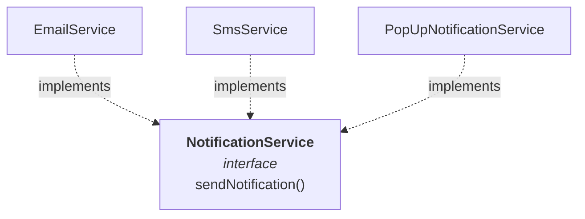
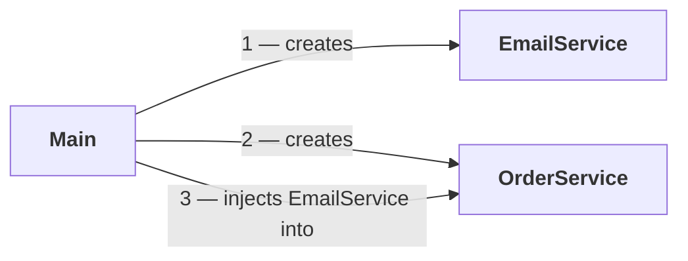
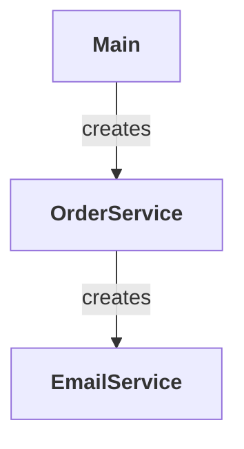
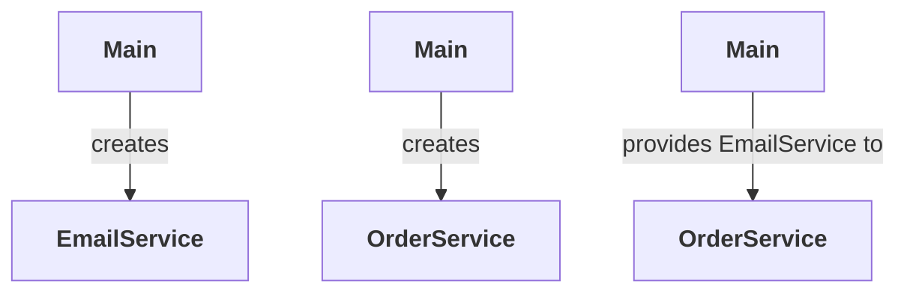
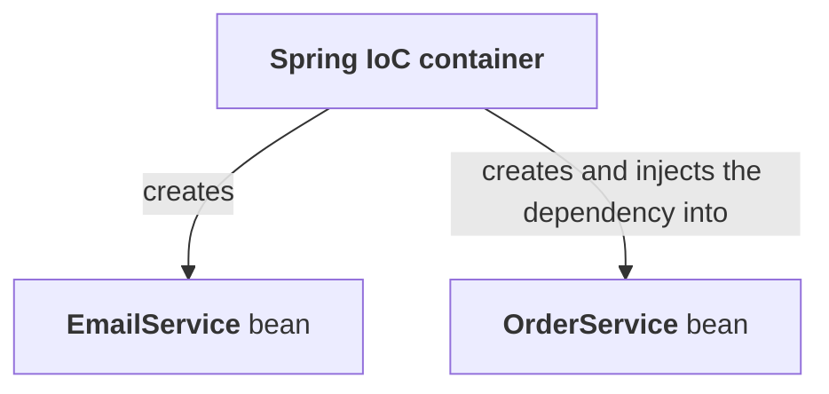

**Java already hands you classes, objects, constructors, interfaces, inheritance and packages.** With those and the OOP principles you were taught, you can write almost clean code without Spring anywhere near the project. **So the honest question to ask before learning Spring is: why is any of this needed?**

> And I am not talking about Spring MVC or Spring Boot Web here, which help us build web applications. I am talking about the absolute core technologies, with which we can build console applications too.

**This part does not use Spring at all.** It writes plain Java, walks into the problem on purpose, and works out what the solution would have to look like. **The next part shows how Spring does it.**

> **Spring's core idea, stripped of everything else: it helps us create objects, manage dependencies, and connect objects together in a clean and scalable way.**

---

# The project

**New Project → `CoreDemo`.** Build system **Maven**, sample code ticked, and under Advanced Settings:

| | |
|---|---|
| **GroupId** | `in.coderarmy` |
| **ArtifactId** | `CoreDemo` |
| **Version** | `1.0-SNAPSHOT` |

**`pom.xml` stays empty of dependencies** — nothing is added to it in this part. Delete the generated sample code, print something to check the project runs, and start.

```
in/coderarmy/
├── Main.java
├── OrderService.java
└── notification/
    ├── NotificationService.java     <- interface
    ├── EmailService.java
    ├── SmsService.java
    ├── PopUpNotificationService.java
    └── FakeEmailService.java
```

**That is the finished layout.** It is built up one step at a time below, starting with only `Main`, `OrderService` and `EmailService`.

---

# The starting code

**What is being mimicked: an order service.** You place an order, and once it is placed a notification goes out. **The logic is deliberately trivial** — the ideas are the point, not the code.

```java
package in.coderarmy;

public class OrderService {

    public void placeOrder() {
        System.out.println("Order placed");
    }
}
```

**And a class to notify the user:**

```java
package in.coderarmy.notification;

public class EmailService {

    public void sendNotification() {
        System.out.println("Email notification sent");
    }
}
```

**`OrderService` needs to call it, so it makes itself an object:**

```java
package in.coderarmy;

import in.coderarmy.notification.EmailService;

public class OrderService {

    EmailService notification = new EmailService();

    public void placeOrder() {
        System.out.println("Order placed");
        notification.sendNotification();
    }
}
```

**And `Main` drives it:**

```java
package in.coderarmy;

public class Main {
    public static void main(String[] args) {
        OrderService order = new OrderService();
        order.placeOrder();
    }
}
```

**Measured:**

```
Order placed
Email notification sent
```

**Three classes, and it works perfectly.** Nothing here is wrong in the sense of being broken — this is the code everyone writes.

---

# What a dependency is

**Look at what `OrderService` just did:** it created an `EmailService` object and called a method on it.

> **Can we say `OrderService` is dependent on `EmailService`?** *"Until `EmailService` exists, we will not be able to call `placeOrder` at all"* — because `placeOrder` has to print, and then call `sendNotification` on an `EmailService` object.

| | |
|---|---|
| **A dependency is** | something a class needs in order to complete its work |
| Here | **`OrderService` is dependent on `EmailService`** — `EmailService` acts as a **dependency** inside it |

> [!info] **This is the same word as part `03`, one level down.** There, a **dependency** was a third-party JAR your project needed, declared in `pom.xml`. **Here it is one of your own classes needing another one.** *"It is exactly the same thing"* — your code cannot do its job without the other thing existing.

**And one line summarises the whole problem to come:**

> **`OrderService` is creating its own dependency.**

---

# Tight coupling

**There are two philosophies in programming**, and this code has picked the wrong one.

| | |
|---|---|
| **Tightly coupled** | hard to change |
| **Loosely coupled** | easier to change |

## The Delhi to Chandigarh analogy

> *"Imagine I have to go from Delhi to Chandigarh. And I tell you — I have to go from Delhi to Chandigarh, at this exact time, in **this** bus, and the driver of the bus should be **this** person, and the bus should belong to **this** company."*

**Specify all that and you are tightly coupled.** If that one bus is unavailable, you are stuck.

> *"I only had to get to Chandigarh. It should not matter to me which bus I am going in. Fine, the time might matter. But which bus? Who the driver is? Which company?"*

**Loosely coupled thinking is one sentence: I need transportation.** Car, bus, train, cab — the person only cares about the service.

## The same thing in the code

**`OrderService` had to send a notification. Instead it did two things:**

| # | What it did | Why that hurts |
|---|---|---|
| **1** | Tied itself to **one concrete class**, `EmailService` | Tomorrow you want an **SMS** or a **pop-up** notification — and you have to go **into `OrderService`** and edit it |
| **2** | **Created the object itself** | It is doing a factory's job on top of its own |

> **A concrete class** is one that is not abstract — every method in it is defined.

**Add the two classes you might want tomorrow:**

```java
package in.coderarmy.notification;

public class SmsService {

    public void sendNotification() {
        System.out.println("SMS notification sent");
    }
}
```

```java
package in.coderarmy.notification;

public class PopUpNotificationService {

    public void sendNotification() {
        System.out.println("Pop-up notification sent");
    }
}
```

**To use either of them, `OrderService` has to be edited.** And that breaks a principle with a name:

> [!important] **The Open–Closed Principle — the `O` in SOLID.** A class should be **open for extension but closed for modification.** You should be able to add new behaviour by extending, **not by going in and modifying the existing class.** Swapping `new EmailService()` for `new SmsService()` inside `OrderService` is modification, every single time.

---

# First fix — code to an interface

> **In Java, we should generally code to interfaces. We should talk to interfaces rather than to concrete classes.**

**This is plain good design and has nothing to do with Spring** — *"but Spring's entire ideology is based on it."*

## Organising the classes first

**There are enough classes now to deserve a package.** Create `in.coderarmy.notification` and move every notification class into it. `OrderService` and `Main` stay where they are.

## The interface

```java
package in.coderarmy.notification;

public interface NotificationService {
    void sendNotification();
}
```

> **Whether it is an email, an SMS or a pop-up — all of them are a notification.**

## The three implementations

```java
package in.coderarmy.notification;

public class EmailService implements NotificationService {

    @Override
    public void sendNotification() {
        // actual notification sent
        System.out.println("Email notification sent");
    }
}
```

```java
package in.coderarmy.notification;

public class SmsService implements NotificationService {

    @Override
    public void sendNotification() {
        System.out.println("SMS notification sent");
    }
}
```

```java
package in.coderarmy.notification;

public class PopUpNotificationService implements NotificationService {

    @Override
    public void sendNotification() {
        System.out.println("Pop-up notification sent");
    }
}
```



## And `OrderService` now declares the interface

```java
public class OrderService {

    NotificationService notification = new EmailService();

    public void placeOrder() {
        System.out.println("Order placed");
        notification.sendNotification();
    }
}
```

**Measured, swapping only the class on the right-hand side:**

```
new EmailService()               →  Order placed
                                    Email notification sent

new SmsService()                 →  Order placed
                                    SMS notification sent

new PopUpNotificationService()   →  Order placed
                                    Pop-up notification sent
```

**Whichever object you create, the method that runs belongs to that object.** Ordinary Java.

## But the coupling did not go away

> *"The tight coupling is still exactly the same. Yes — I changed the variable type to an interface. But the real object is still being created concretely, right here."*

**The line that is still the problem:**

```java
NotificationService notification = new EmailService();
```

**`OrderService` is still the one deciding which implementation to use**, and you still have to open it to change your mind.

---

# The real problem is *where* the object is created

**Clear one doubt first:**

> **Creating an object is not the problem. *Where* you create that object is the problem.**

**Ask what `OrderService`'s job should be: managing orders.** The methods that belong in it are `placeOrder`, `addOrder`, `deleteOrder` and the like.

> *"But why am I creating a notification object here? Why am I creating my own dependency? **Why is this doing a factory's job?** Creating the notification should be somebody else's work, not its. Its work should be to **use** the notification."*

## Two SOLID principles fail

| | |
|---|---|
| **S — Single Responsibility Principle** | A class should have **one reason to change**. This one has several: it handles order logic **and** creates and chooses the notification object |
| **O — Open–Closed Principle** | Every new notification type means **editing `OrderService`** |

## Dependency itself is not the problem

**This has to be said clearly, because the fix is not "remove the dependency".**

> **One service depending on another is normal, and it happens constantly in our code.**

**Right now the project is tiny — one interface, three implementations, `OrderService` and `Main`.** A real project has hundreds of Java files depending heavily on each other. *"Sometimes a hundred thousand Java files in a really major project"* — at which point you break it into microservices, which is a separate topic.

**And dependencies form trees:**


> **Nobody has a problem with dependency. The problem is that you are creating the object of the thing you depend on, yourself.**

**Plus one more:** `OrderService` is **business logic**, and *"creating an object is not business logic."*

---

# Dependency injection

**Think about what `OrderService` is actually asking for.** It does not want to create the object. It just wants to call the method — which means it needs to be **handed** a ready-made object.

**The idea: take the object in through a constructor.**

```java
package in.coderarmy;

import in.coderarmy.notification.NotificationService;

public class OrderService {

    NotificationService notification;

    public OrderService(NotificationService notification) {
        this.notification = notification;
    }

    public void placeOrder() {
        System.out.println("Order placed");
        // actual business logic..
        notification.sendNotification();
    }
}
```

> **`OrderService` no longer creates anything. It says: give me something that can send a notification, and whenever `placeOrder` runs, I will call `sendNotification` on whatever you gave me.**

**`Main` immediately fails to compile** — it was calling `new OrderService()` with no arguments — which is the point: somebody now has to supply the dependency.

## `Main` supplies it

```java
package in.coderarmy;

import in.coderarmy.notification.*;

public class Main {
    public static void main(String[] args) {
        NotificationService notification = new EmailService();
        OrderService order = new OrderService(notification);
        order.placeOrder();
    }
}
```

**Measured:**

```
Order placed
Email notification sent
```

**Now change one word in `Main` — `new SmsService()` — and run again:**

```
Order placed
SMS notification sent
```

> **`OrderService` was not touched. `NotificationService` and its implementations were not touched.** The only edit was in `Main`.

## What just happened, named

> **The dependency is now coming from outside. In programming terminology, this is called **dependency injection**.**

**It was `OrderService`'s responsibility to create its own dependency. That responsibility was taken away from it** — because it never should have had it — **and injected in from somewhere else.**



| | |
|---|---|
| **Dependency injection is** | a class **receives** the objects it depends on from outside, instead of creating them itself |
| The one-liner | **Don't create your dependency — get your dependency** |
| The other one-liner | **A class should ask what it needs, and not build everything itself** |

**"From outside" means from anywhere.** Here it is `Main`, because we want every other class to stay independent and `Main` to act as the driver that manages everything.

> [!important] **Dependency injection is not a Spring concept.** *"Spring automates it. But dependency injection can exist independently"* — everything above is plain Java with no framework in the project.

## `OrderService` no longer knows what it is sending

**A quiet consequence worth noticing.**

> *"`OrderService` does not even need to know which kind of notification is being sent to it. It will call `sendNotification` on whatever you send it."*

**Because what it expects is a `NotificationService`, and an SMS is a notification, an email is a notification, a pop-up is a notification.** It has no interest in which concrete one you picked. Its only interest is its own logic.

---

# Why this is worth doing

## Benefit 1 — swapping the implementation is free

**Covered above: change the object in `Main`, `OrderService` stays untouched.** Both broken principles are now satisfied:

| | |
|---|---|
| **Open–Closed** | you never modify `OrderService` to switch notification types |
| **Single Responsibility** | its only responsibility is handling orders — it **delegates** the notification instead of creating it |

## Benefit 2 — the code becomes testable

**Unit testing means testing one particular class in isolation** — here, just `OrderService`. **Tests live in `src/test/java`, mirroring the same package structure**, so `OrderService` gets an `OrderServiceTest` beside it in the test tree.

**Now think about testing the old, tightly coupled version.** `OrderService` created `EmailService` itself, so to test `placeOrder` you would be forced to work with the real `EmailService`.

> *"To test `placeOrder`, I have to actually send a notification — because the notification is directly tightly coupled to `EmailService`. **A real email goes out during my test.** That is a terrible technique."*

**With the dependency coming from outside, you hand it a fake instead:**

```java
package in.coderarmy.notification;

public class FakeEmailService implements NotificationService {

    @Override
    public void sendNotification() {
        System.out.println("Dummy Email sent");
    }
}
```

> *"We are not actually calling an email here. **Why would we spend our money actually sending an email?**"*

**Measured, injecting the fake and changing nothing else:**

```
Order placed
Dummy Email sent
```

**`OrderService` accepted it without a murmur, because it expects a `NotificationService` and `FakeEmailService` implements one.**

> [!info] **The Java rule underneath is one you already know.** A **parent (or interface) reference variable can hold a child class object**. That is the entire mechanism by which any implementation — real or fake — slots into the same parameter.

## Benefit 3 — the same class is reusable

**One `OrderService` now works with every implementation there is**, and with ones that do not exist yet — `EmailService`, `SmsService`, `PopUpNotificationService`, `FakeEmailService`, a `WhatsAppService` you write next month.

---

# Types of dependency injection

## Constructor injection

**What was written above** — the dependency arrives through the constructor.

```java
public OrderService(NotificationService notification) {
    this.notification = notification;
}
```

> **Usually preferred, because it makes required dependencies clear.** If `OrderService` cannot work at all without a `NotificationService`, the constructor is the honest place to say so.

## Setter injection

**The same field, set through a setter instead** — IntelliJ will generate it for you with **Generate → Setter → `notification`**.

```java
public void setNotification(NotificationService notification) {
    this.notification = notification;
}
```

**To be able to build the object empty first, overload the constructor with a no-arg one:**

```java
public class OrderService {

    NotificationService notification;

    public OrderService(NotificationService notification) {
        this.notification = notification;
    }

    public OrderService() {

    }

    public void placeOrder() {
        System.out.println("Order placed");
        // actual business logic..
        notification.sendNotification();
    }

    public void setNotification(NotificationService notification) {
        this.notification = notification;
    }
}
```

**And `Main` wires it in two steps instead of one:**

```java
package in.coderarmy;

import in.coderarmy.notification.*;

public class Main {
    public static void main(String[] args) {
        NotificationService notification = new EmailService();
        OrderService order = new OrderService();
        order.setNotification(notification);
        order.placeOrder();
    }
}
```

**Measured:**

```
Order placed
Email notification sent
```

> **Setter injection is useful when the dependency is optional, or can be changed later.**

> [!warning] **A setter can be forgotten; a constructor cannot.** The empty constructor makes it legal to build an `OrderService` with no notification at all, and nothing complains until the method runs. **Measured:**
>
> ```
> OrderService order = new OrderService();
> order.placeOrder();
> ```
> ```
> Order placed
> Exception in thread "main" java.lang.NullPointerException: Cannot invoke
> "in.coderarmy.notification.NotificationService.sendNotification()"
> because "this.notification" is null
>         at in.coderarmy.OrderService.placeOrder(OrderService.java:20)
> ```
>
> **Note where it failed** — *after* `Order placed` had already printed. **A half-built object ran half the business logic before falling over.** With constructor injection this code does not compile, let alone run.

> [!example]- **Measured — the compiler-level reason constructor injection is preferred.** Worth opening for the one concrete thing you gain that no discussion of style can give you.
>
> **With constructor injection alone, the field can be `final`:**
>
> ```java
> public class OrderService {
>
>     private final NotificationService notification;
>
>     public OrderService(NotificationService notification) {
>         this.notification = notification;
>     }
>     …
> }
> ```
> ```
> Order placed
> Email notification sent
> ```
>
> **Compiles and runs clean.** The object is impossible to construct in a broken state, and impossible to mutate afterwards.
>
> **Add the no-arg constructor back, keeping `final`:**
>
> ```
> [ERROR] OrderService.java:[15,5] variable notification might not have been initialized
> ```
>
> **Or keep the setter, keeping `final`:**
>
> ```
> [ERROR] OrderService.java:[24,13] cannot assign a value to final variable notification
> ```
>
> **The compiler is stating the trade-off outright.** Setter injection buys you the ability to change the dependency later, and pays for it by making the half-built object legal. **Constructor injection gives that up and gets a guarantee in return.**

## Field injection

**A third kind exists, straight onto the field.**

> **It is not possible here.** *"Doing field injection is not possible if I am not using Spring."* Why that is so becomes clear once Spring is in the project — so it waits for a later part.

---

# Inversion of Control

**Not a separate topic at all.** *"If you have understood dependency injection, then IoC is nothing."* Many people use the two terms interchangeably; they mean different things, but they are related.

**Start by asking what "control" means here.**

## The initial design



**`Main` created `OrderService`, and `OrderService` created `EmailService`.** Control flowed **from `OrderService` down into `EmailService`** — `OrderService` was responsible for making it.

> **The control was inside `OrderService`.**

## After dependency injection



**`Main` creates the `EmailService`. `Main` creates the `OrderService`. `Main` hands the first to the second.**

## Put the two diagrams side by side

| | Who controls creating `EmailService` |
|---|---|
| **Before** | **`OrderService`** — the control was **inside** it |
| **After** | **`Main`** — the control is **outside** it, and arrives from there |

> **The control inverted. That is what Inversion of Control means.**

**Earlier: the class created what it needed. Now: the class receives what it needs.** It is called *inversion* because the normal flow of control has been reversed.

---

# IoC and DI — how they relate

| | |
|---|---|
| **Inversion of Control** | an **idea**, a **principle** — *this is how it should be* |
| **Dependency injection** | an **approach**, a **technique** — *this is how you achieve it* |

> **IoC is the idea. Dependency injection is one way to implement that idea.**

**When you give dependencies from outside instead of creating them inside the class, you are using DI to achieve IoC.**

---

# Where Spring fits in

**Everything above works, and it is genuinely better than what came before.** But look at what `Main` is now doing: creating every object, wiring every dependency, configuring everything.

> *"Although Main configures everything, this design is **still better** than every class going and creating its own dependency. That was the bad way. Main wiring it is better than that. **I know Main gets complicated.** And this is exactly where the Spring Framework comes in."*

**A handful of services is fine. Now imagine `UserService`, `PaymentService`, and dozens more, each with its own dependencies** — `Main` becomes an enormous wiring diagram.

## The IoC container

**Spring provides an external system called the Spring IoC container**, and its job is precisely what `Main` is doing right now.

| The container | |
|---|---|
| **Creates objects** | in place of every `new` in `Main` |
| **Manages objects** | when they are created, when they are destroyed |
| **Connects objects together** | wiring the dependency into whoever needs it |



> **In plain Java, `Main` was acting like a small container.** Replace `Main` with the IoC container in every diagram above, and that is the entire change.

## What the code will look like

> *"When we write Spring code, you will see the `new` keyword very rarely. Almost negligibly."*

**We want most objects to be managed by the Spring IoC container** — created for us, and wired to each other for us, without our writing either step.

> [!info] **And it is not magic.** *"We will see how it works inside, how it creates all the objects, how it maintains the relationships itself."* Everything Spring does here is something `Main` was shown doing by hand in this part.

## Beans

**One vocabulary change comes with the container.**

| | |
|---|---|
| In normal Java code | we say **objects** |
| To the Spring IoC container | they are **beans** |

> **A bean is nothing special — it is an object that the Spring IoC container manages.**

> [!important] **Every bean is an object, but not every object is a bean.** `new EmailService()` written by you is an ordinary Java object. **The same class becomes a bean only when Spring is the one creating and managing it.**

---

# What this part established

| | |
|---|---|
| Why Spring Core exists | to **create objects, manage them, and connect them together** — not about web apps |
| Nothing here uses | **Spring** — it is all plain Java, on purpose |
| A **dependency** is | something a class needs to complete its work |
| The original sin | **`OrderService` was creating its own dependency** |
| Same word as part `03` | there a dependency was a **third-party JAR**; here it is **another of your classes** |
| Two design philosophies | **tightly coupled** (hard to change) · **loosely coupled** (easier to change) |
| The analogy | *"I must go by **this** bus, **this** driver, **this** company"* vs *"I need transportation"* |
| **Tight coupling** means | one class directly depends on a **specific concrete class** |
| A **concrete class** is | one that is not abstract — every method defined |
| First fix | **code to an interface** — `NotificationService`, implemented by Email, SMS and Pop-up |
| Why the interface alone fails | `new EmailService()` is **still inside** `OrderService`; it still chooses |
| The sharpest line in the part | **creating an object is not the problem — creating it in the wrong place is** |
| **S** — Single Responsibility | broken: `OrderService` handles orders **and** acts as a factory |
| **O** — Open–Closed | broken: every new notification type means **editing `OrderService`** |
| Dependency itself | **is normal** — services depend on services, and dependencies form **trees** (A → B → C) |
| Also true | **creating objects is not business logic** |
| **Dependency injection** is | a class **receives** what it depends on from outside |
| The one-liners | **don't create your dependency, get your dependency** · **a class should ask what it needs, not build everything itself** |
| Who injects, here | **`Main`**, acting as the driver |
| Measured | swapping `new EmailService()` → `new SmsService()` **in `Main` alone** changed the output |
| Consequence | **`OrderService` does not know which notification it is using**, and does not care |
| DI is **not** a Spring concept | Spring **automates** it; it works fine in plain Java |
| Benefit 1 | **swapping implementations** without touching the class |
| Benefit 2 | **testable** — inject a `FakeEmailService` instead of sending a real email |
| Why that matters | tightly coupled, testing `placeOrder` would **actually send the email** |
| The Java rule underneath | an **interface reference can hold any implementation's object** |
| Benefit 3 | **reusable** — one `OrderService`, any number of implementations |
| **Constructor injection** | dependency arrives via the constructor — **preferred**, makes required dependencies clear |
| **Setter injection** | dependency arrives via a setter — for **optional** dependencies, or ones that change later |
| ⚠️ Measured | a forgotten setter gives a **`NullPointerException` after `Order placed` already printed** |
| ⚠️ Measured | the field can be **`final`** with constructor injection only — a setter or no-arg constructor makes it **not compile** |
| **Field injection** | exists, but is **not possible without Spring** — covered later |
| **Control**, before | **inside `OrderService`** — it created `EmailService` itself |
| **Control**, after | **outside** — `Main` creates it and hands it over |
| **Inversion of Control** is | that reversal: the class **receives** what it needs instead of **creating** it |
| **IoC vs DI** | **IoC is the principle**; **DI is the technique** that achieves it |
| Why Spring is next | `Main` wiring everything is **better than each class doing it**, but gets unmanageable at scale |
| The **Spring IoC container** | **creates objects · manages objects · connects objects together** |
| What `Main` was | a small container, written by hand |
| In Spring code you will see | the **`new` keyword almost never** |
| A **bean** is | an object that the **Spring IoC container manages** |
| ⚠️ Not interchangeable | **every bean is an object; not every object is a bean** |

**Measured against:** Java **25.0.1**, Maven **3.9.11**, no Spring dependency in the project.
