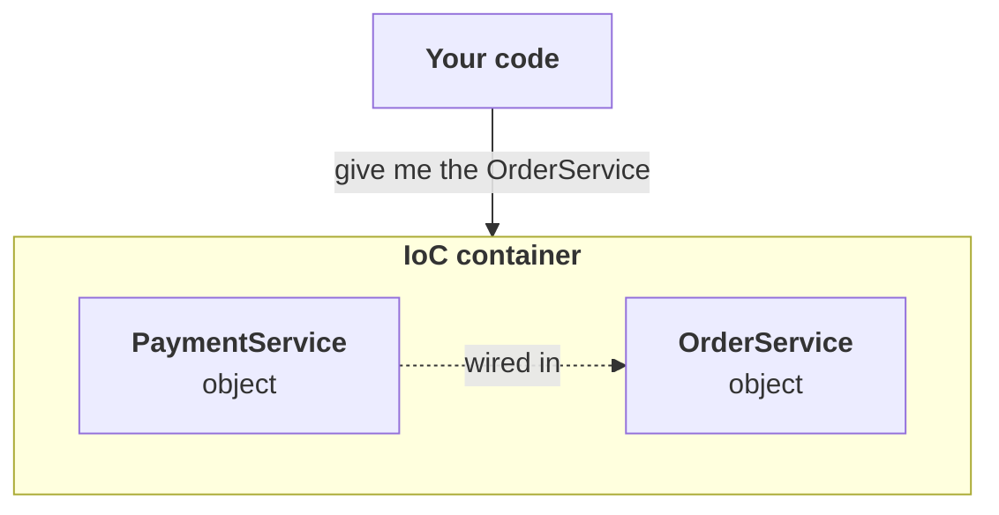
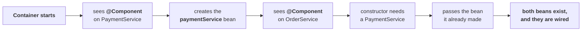

Part `04` built dependency injection and **inversion of control out of plain Java**, with no Spring anywhere near the project. The conclusion it reached was that somebody other than `OrderService` has to create `OrderService`'s dependency and hand it in — and in that part, the somebody was `Main`. This part replaces `Main` with Spring.

Everything the whole Spring Framework is built on is here. Spring MVC, Spring Data, Spring Security, Spring Boot — all of them sit on top of Spring Core, and **Spring Core is the IoC container, beans, and the annotations that drive them**.

| Measured on | |
|---|---|
| **Spring** | `spring-context` **7.0.7** |
| **Java** | **25** |
| **Maven** | **3.9.11** |

---

# The project

**New Project → `SpringCoreDemo`.** Build system **Maven**, sample code ticked, and under Advanced Settings the group `in.coderarmy` and the artifact `SpringCoreDemo`. Delete the generated boilerplate and the project is empty.

**The `pom.xml` starts completely empty of dependencies.** Nothing has been added to it yet — that comes later in this part, and it is exactly one line's worth.

---

# Where part `04` left off

**Two classes, rebuilt from scratch, deliberately trivial.** An e-commerce site where you place an order, and before the order goes through a payment has to happen.

```java
package in.coderarmy;

public class OrderService {

    public void placeOrder() {
        System.out.println("Order placed");
    }
}
```

```java
package in.coderarmy;

public class PaymentService {

    public void pay() {
        System.out.println("Payment done");
    }
}
```

**Called from `Main`, this already works:**

```java
OrderService order = new OrderService();
order.placeOrder();
```

```
Order placed
```

## The dependency, and the wrong way to satisfy it

**Now make the order pay first.** `OrderService` needs a `PaymentService` to finish its job, so it gets a reference to one and calls it:

```java
public class OrderService {

    private PaymentService paymentService = new PaymentService();

    public void placeOrder() {
        paymentService.pay();
        System.out.println("Order placed");
    }
}
```

```
Payment done
Order placed
```

**The output is right and the design is wrong.** `PaymentService`'s object has been hard-coded inside `OrderService`, and that breaks the **Single Responsibility Principle** — `OrderService` should have one job, handling orders. Why is it creating a `PaymentService` object at all?

**This is the dependency:** `OrderService` depends on `PaymentService`. `placeOrder` cannot be fulfilled until `PaymentService`'s `pay` has been called. **So that dependency should be provided from outside.**

## Injecting it from outside

**Take the `new` out of the field and ask for the object in a constructor:**

```java
public class OrderService {

    private PaymentService paymentService;

    public OrderService(PaymentService paymentService) {
        this.paymentService = paymentService;
    }

    public void placeOrder() {
        paymentService.pay();
        System.out.println("Order placed");
    }
}
```

**And `Main` supplies it:**

```java
PaymentService service = new PaymentService();
OrderService order = new OrderService(service);
order.placeOrder();
```

```
Payment done
Order placed
```

**That is dependency injection**, and it is exactly where part `04` finished — the dependency `OrderService` needed was **injected from outside**, which in this case means from the main method, so that a class does not create its own dependency.

---

# What the IoC container is going to do instead

**The point of part `04` was that this injection work should not be done by hand.** The Spring Framework should handle it, and the thing inside Spring that handles it is the **IoC container** — the Inversion of Control container.

**Right now `Main` is doing three separate jobs.** It creates the `PaymentService` object, it creates the `OrderService` object, and it wires the `PaymentService` object into the `OrderService` object. **All three of those move to the container.**



**The container creates the `PaymentService` object itself. It creates the `OrderService` object itself. And it wires the dependency between them itself.** Nothing is left for you to do.

---

# The one dependency you need

**The empty `pom.xml` needs something in it before Spring can manage anything.** The question is which something.

| Do you need          |                                                                                                      |
| -------------------- | ---------------------------------------------------------------------------------------------------- |
| **Spring Boot**      | **No.** Spring Boot is there to do the **configuration easily** — it configures things automatically |
| **Spring MVC**       | **No.** This is not a web application, it is a console application                                   |
| **`spring-context`** | **Yes** — this is Spring Core, and it is the whole requirement                                       |

> I just need one basic dependency, and its name is spring-context. It brings me the basic things — the IoC container, which will manage the objects for me.

**Search `spring context` on `mvnrepository.com`** and the first result is the one. As in part `03`, the page lists every published version.

> Do not take the absolute latest. Keep it slightly older, so that there is no vulnerability.

**The version has to line up with Spring Boot 4, which is what the rest of the series uses, and Spring Boot 4 is compatible with Spring 7.** So any `7.x` release works.

```xml
<dependencies>
    <dependency>
        <groupId>org.springframework</groupId>
        <artifactId>spring-context</artifactId>
        <version>7.0.7</version>
    </dependency>
</dependencies>
```

**Pasting it is not enough — Maven has to reload** before the JAR is downloaded. Before the reload, External Libraries holds nothing but the JDK.

## One dependency, nine JARs

**After the reload, External Libraries is suddenly full.** `commons-logging`, `micrometer`, `jspecify`, `spring-aop`, `spring-beans`, `spring-context`, `spring-core`, `spring-expression` — far more than the one line asked for.

**These are transitive dependencies**, the same mechanism from part `03`: you asked for `spring-context`, and `spring-context` needs further things itself. Maven → Dependencies shows the tree, with one direct dependency at the top and the rest hanging off it.

> [!example]- **Measured — the complete classpath from that one line.** Worth opening once to see how small Spring Core actually is compared to a Boot application.
> ```
> $ mvn dependency:build-classpath -Dmdep.outputFile=cp.txt
> org/springframework/spring-context/7.0.7/spring-context-7.0.7.jar
> org/springframework/spring-aop/7.0.7/spring-aop-7.0.7.jar
> org/springframework/spring-beans/7.0.7/spring-beans-7.0.7.jar
> org/springframework/spring-core/7.0.7/spring-core-7.0.7.jar
> commons-logging/commons-logging/1.3.5/commons-logging-1.3.5.jar
> org/jspecify/jspecify/1.0.0/jspecify-1.0.0.jar
> org/springframework/spring-expression/7.0.7/spring-expression-7.0.7.jar
> io/micrometer/micrometer-observation/1.16.5/micrometer-observation-1.16.5.jar
> io/micrometer/micrometer-commons/1.16.5/micrometer-commons-1.16.5.jar
> ```
> **Nine JARs in total, and one of them is the one you named.** Compare that with the 34 JARs and 19 MB of the Spring Boot fat JAR measured in part `03` — there is no Tomcat here, no web layer, nothing but the container and what it needs.

---

# Beans

**Managing an object means the container creates it, injects its dependencies, and is responsible for its whole lifecycle.** And an object under that management has a different name in Spring.

> **An object that the Spring IoC container manages is called a bean.**

> Every bean is an object. But not every object is a bean.

**Objects you handle yourself are not beans.** The ones your Spring Framework handles are the ones you call beans. `PaymentService`, `OrderService`, and any other service you add later are all going to be handled by Spring, and it is the IoC container that does the handling.

---

# Two ways to hand your objects to Spring

| | |
|---|---|
| **Annotation-based** | what modern projects use, and what this part covers |
| **XML-based** | much older; you will see it in legacy code. Covered in the next part |

**The XML style is more complicated** — there is an XML file to manage, it fills up with tags, and it grows very long. Annotations come first because that is what you will actually write.

---

# The Java Reflection API, and the class called `Class`

**Before any of the annotations make sense, one Java feature has to be on the table**, because the Spring Framework leans on it everywhere.

**Take an ordinary class:**

```java
public class Student {
    private String name;
    private int age;

    public Student() {
    }

    public void getAttendance() {
    }

    public void print() {
    }
}
```

**Creating an object of it is the familiar line:**

```java
Student s1 = new Student();
```

**`s1` is a reference variable pointing at a `Student` object.** Nothing new.

**Now — Java has a special class whose name is literally `Class`.** Java has a class called `Object`; in exactly the same way, Java has a class called `Class`. And it is special because it holds the metadata of any class.

```java
Class<Student> c1 = Student.class;
```

**`c1` is not a `Student` object.** You do not write `c1.name` or `c1.age` on it.

> This is a special reference variable that has the Student **class's metadata** stored in it.

**What counts as metadata:** the name of the class, which fields it has and what their data types are, which constructors it has, which methods it has, which members are private and which are public — and, importantly, **which annotations are on it**.

> [!example]- **Measured — everything `Student.class` hands you at runtime.** Worth opening once, because the last line is the exact hook Spring uses.
> ```java
> Student s1 = new Student();
> Class<Student> c1 = Student.class;
>
> System.out.println("s1 is       -> " + s1);
> System.out.println("c1 is       -> " + c1);
> System.out.println("name        -> " + c1.getSimpleName());
> System.out.println("fields      -> " + Arrays.toString(
>         Arrays.stream(c1.getDeclaredFields()).map(f -> f.getType().getSimpleName() + " " + f.getName()).toArray()));
> System.out.println("constructors-> " + Arrays.toString(c1.getDeclaredConstructors()));
> System.out.println("methods     -> " + Arrays.toString(
>         Arrays.stream(c1.getDeclaredMethods()).map(Method::getName).toArray()));
> System.out.println("annotations -> " + Arrays.toString(c1.getAnnotations()));
> ```
> ```
> s1 is       -> in.coderarmy.Student@1dbd16a6
> c1 is       -> class in.coderarmy.Student
>
> name        -> Student
> fields      -> [String name, int age]
> constructors-> [public in.coderarmy.Student()]
> methods     -> [print, getAttendance]
> annotations -> [@org.springframework.stereotype.Component("")]
> ```
> **Look at the two first lines side by side.** `s1` prints as an instance — `Student@1dbd16a6`. `c1` prints as `class in.coderarmy.Student`, because it is not an instance of anything, it is the description of the class. **And the last line is the whole reason this section exists** — the annotations you wrote in the source are readable at runtime, which is how a framework can act on them.

**This is why reflection matters here.** If Spring is going to create an object itself and manage it, it needs that class's metadata — and the metadata comes from the Reflection API.

---

# `@Component` — marking the classes Spring should manage

**Spring does not manage every class in your project.** You have to say which ones, and the way you say it is an annotation on the class.

```java
package in.coderarmy;

import org.springframework.stereotype.Component;

@Component
public class OrderService {
    // ...
}
```

```java
package in.coderarmy;

import org.springframework.stereotype.Component;

@Component
public class PaymentService {
    // ...
}
```

**`@Component` tells the Spring Framework that you want it to manage this class's objects.** Whatever object gets made from it — the thing Spring calls a bean — Spring creates it and Spring manages it.

**Putting the annotation on is not the end of the job.** Two more pieces are needed: the container itself, and something to tell the container where to look.

---

# `ApplicationContext` — the IoC container itself

**In Spring, the IoC container is called the `ApplicationContext`.** That is the thing that actually stores the objects — the container that holds the beans.

**`ApplicationContext` is an interface.** So this does not compile:

```java
ApplicationContext context = new ApplicationContext();   // will not compile
```

**An interface needs an implementation, and the IoC container has several** — which follows, because if the container is an interface then there is more than one way to implement it in Java. **The annotation-based one is `AnnotationConfigApplicationContext`:**

```java
ApplicationContext context = new AnnotationConfigApplicationContext(AppConfig.class);
```

> Start a Spring container using annotation-based configuration.

**A container cannot start until it has been told all the rules** — how the configuration is done, which classes it has to monitor, how to monitor them. **Those rules live in a separate class, and the reflection of that class is what gets passed into the constructor.**

---

# `AppConfig` — the configuration class

**Create one more class, `AppConfig`.** The name is arbitrary; what makes it a configuration class is the annotation on it.

```java
package in.coderarmy;

import org.springframework.context.annotation.ComponentScan;
import org.springframework.context.annotation.Configuration;

@Configuration
@ComponentScan("in.coderarmy")
public class AppConfig {
}
```

| Annotation                           | What it says                                                                                                         |
| ------------------------------------ | -------------------------------------------------------------------------------------------------------------------- |
| **`@Configuration`**                 | this is not an ordinary class, it is a special one — **a source of configuration instructions and bean definitions** |
| **`@ComponentScan("in.coderarmy")`** | go through this package, **find every class carrying `@Component`, and those are the ones you manage**               |

**`@ComponentScan` is the counterpart to `@Component`.** One marks a class as eligible; the other says where to search for the marks. Whichever classes have the mark are yours — you create their objects, the beans, and you manage them.

**The package to scan is your own project's package.** `OrderService`, `PaymentService`, `Main` and `AppConfig` all sit inside `in.coderarmy`, so that is what gets passed.

**The class body is empty for now, and it will not stay empty** — the second half of this part fills it in.

## Handing the rules to the container

```java
ApplicationContext context = new AnnotationConfigApplicationContext(AppConfig.class);
```

**Read that line as one sentence.** Start an IoC container using annotation-based configuration, and take whatever rules you need from the `AppConfig` class — here is its metadata, go and read it.

**`AppConfig.class` is the reflection from earlier**, doing exactly the job that section described. From that metadata the container learns that `@Configuration` is present, so this is a configuration class; that `@ComponentScan` is present, so a scan has to be performed; and which package the scan covers.

**It may feel like a lot of ceremony for two classes.** It is, and it goes away — by the time the series reaches Spring Boot, none of this has to be written at all.

---

# Running it — `getBean`

**Strip `Main` back to nothing but the container.** By the time that one line has finished executing, the container is up, the rules have been read, the scan has happened, `OrderService` and `PaymentService` have been found, and both of their beans have been created.

**To use one of them, you no longer write `new`.**

```java
package in.coderarmy;

import org.springframework.context.ApplicationContext;
import org.springframework.context.annotation.AnnotationConfigApplicationContext;

public class Main {
    public static void main(String[] args) {
        ApplicationContext context = new AnnotationConfigApplicationContext(AppConfig.class);

        OrderService order = context.getBean(OrderService.class);
        order.placeOrder();
    }
}
```

```
Payment done
Order placed
```

**`context.getBean(OrderService.class)` asks the container for a bean**, and the argument is a `Class` object again — here is the metadata, give me the bean for it. Both lines print, which means the container came up correctly and both objects exist inside it.

> [!example]- **Measured — every bean actually sitting in the container.** Worth opening once, because four of them are not yours and one of them is a surprise.
> ```java
> for (String name : context.getBeanDefinitionNames()) {
>     System.out.println("  " + name);
> }
> ```
> ```
>   org.springframework.context.annotation.internalConfigurationAnnotationProcessor
>   org.springframework.context.annotation.internalAutowiredAnnotationProcessor
>   org.springframework.context.event.internalEventListenerProcessor
>   org.springframework.context.event.internalEventListenerFactory
>   appConfig
>   orderService
>   paymentService
> ```
> **The four `internal...` beans are the container's own machinery** — the processor that reads `@Configuration`, the processor that handles `@Autowired`, and the event plumbing. They are registered before any of your classes are scanned, because they are what does the scanning.
> **`appConfig` is a bean too.** The configuration class is not outside the container looking in; it is registered like everything else, which is what lets the `@Bean` methods later in this part be called on a real instance.
> **`getBean` twice returns the same object:**
> ```java
> OrderService a = context.getBean(OrderService.class);
> OrderService b = context.getBean(OrderService.class);
> System.out.println("same object? -> " + (a == b));   // true
> ```
> **Beans are singletons by default** — one instance per definition, handed out to everyone who asks.

---

# `@ComponentScan`, in depth

**Sub-packages are included.** Naming `in.coderarmy` does not mean only that package — the search runs through `in.coderarmy` and every package nested inside it, however deep. Create `in.coderarmy.random`, then `in.coderarmy.random.random2`, and both are covered by the same scan.

**A class without `@Component` is invisible to it.** Take the annotation off `PaymentService` and the `OrderService` bean can still be fetched, but the payment bean does not exist:

```
Caused by: org.springframework.beans.factory.NoSuchBeanDefinitionException: No qualifying bean of type
'in.coderarmy.PaymentService' available: expected at least 1 bean which qualifies as autowire candidate.
```

**You never allowed Spring to handle that class, so it did not.**

## Writing `@ComponentScan` with no package at all

```java
@Configuration
@ComponentScan
public class AppConfig {
}
```

**This is legal and it works.** 
> With no package named, Spring scans **the package the configuration class itself lives in**, plus its sub-packages. 
> `AppConfig` sits in `in.coderarmy`, and so does everything else in this project, so the scan covers the same ground either way.

**It stops working the moment something moves out of that tree.** A `@Component` class in a sibling package such as `in.other` is not under `in.coderarmy`, so it is never found — and to include it you would have to name a parent package that contains both.

> [!example]- **Measured — bare `@ComponentScan` with a component one package to the side.** Worth opening because the failure is silent at startup and only shows up when you ask for the bean.
> ```java
> @Configuration
> @ComponentScan          // no package named
> public class AppConfig { }
> ```
> ```java
> package in.other;
>
> @Component
> public class Stranger { }
> ```
> ```
>   appConfig
>   orderService
>   cardPayment
> getBean twice, same object? -> true
> stranger not found -> NoSuchBeanDefinitionException
> ```
> **The container started perfectly happily.** Nothing warns you that `in.other` was never looked at — `Stranger` simply is not a bean, and you find out at the `getBean` call.

---

# `@Autowired` — wiring the dependency

**Object creation is only half of what was promised.** The container is making both objects; it is not yet connecting them. That is the second job, and it needs one more annotation.

```java
package in.coderarmy;

import org.springframework.beans.factory.annotation.Autowired;
import org.springframework.stereotype.Component;

@Component
public class OrderService {

    private PaymentService paymentService;

    @Autowired
    public OrderService(PaymentService paymentService) {
        this.paymentService = paymentService;
    }

    public void placeOrder() {
        paymentService.pay();
        System.out.println("Order placed");
    }
}
```

**Put on the constructor, it says: this class has a dependency, inject it through the constructor.** The container already has a `PaymentService` bean; the constructor is asking for one; so hand it over.

**Why the constructor is the right place for that to happen is simple Java.** A constructor is called whenever an object is created, and the thing creating the `OrderService` object is the container. So at the moment it builds that object, the constructor runs, and the `PaymentService` bean it made earlier goes in.



```
Payment done
Order placed
```

**How the container knew to build the payment bean first is the subject of a later section** — for now it is enough that it did.

---

# The three types of dependency injection

**The same three from part `04`**, now with the annotation that makes each one work.

| Type | Where the annotation goes |
|---|---|
| **Constructor injection** | on the constructor |
| **Setter injection** | on the setter method |
| **Field injection** | on the field itself |

## Setter injection

**Remove the constructor and give the class a setter instead:**

```java
@Component
public class OrderService {

    private PaymentService paymentService;

    @Autowired
    public void setPaymentService(PaymentService paymentService) {
        this.paymentService = paymentService;
    }

    public void placeOrder() {
        paymentService.pay();
        System.out.println("Order placed");
    }
}
```

**A setter is not called when the object is built**, so the sequence is different: the `PaymentService` bean is created, the `OrderService` object is created, and only once both objects exist properly does Spring call the setter and link them. **Spring calls it by itself, because `@Autowired` is written on it.**

## Field injection

**Neither constructor nor setter — the annotation goes straight on the field.**

```java
@Component
public class OrderService {

    @Autowired
    private PaymentService paymentService;

    public void placeOrder() {
        paymentService.pay();
        System.out.println("Order placed");
    }
}
```

**This works, and it is possible only because Spring is involved.** Part `04` could not demonstrate field injection at all in plain Java — there is no way to reach a private field from outside without a constructor or a setter. Spring reaches it with **reflection**.

**IntelliJ flags it the moment you write it:** `Field injection is not recommended`. That is the IDE's inspection rather than anything Spring says, and it is right.

## `@Autowired` is optional in exactly one case

**If a class has only one constructor, you do not have to write `@Autowired` on it.**

```java
@Component
public class OrderService {

    private PaymentService paymentService;

    public OrderService(PaymentService paymentService) {   // no @Autowired, and it still works
        this.paymentService = paymentService;
    }
}
```

**Spring takes it by default.** There is one constructor, so that is the constructor it has to call to create the object; that constructor demands a `PaymentService`, so the `PaymentService` bean gets passed in. **With several constructors there would be a genuine question about which one to call**, which is why the shortcut only applies to the single-constructor case.

> [!warning] **For setter injection and field injection, `@Autowired` is mandatory.** Leave it off a setter and the container starts cleanly, the object is created, the setter is never called, and the failure arrives later at the first use:
> ```
> Exception in thread "main" java.lang.NullPointerException: Cannot invoke
> "in.coderarmy.payment.PaymentService.pay()" because "this.paymentService" is null
> ```
> **This is the same half-built-object failure as part `04`'s forgotten setter**, and it is why the next section prefers constructors.

---

# Why constructor injection is the recommended one

**Three reasons, and they build on each other.**

## 1 — The dependency is wired at creation time

**A constructor runs while the object is being created.** So the dependency is linked at the same moment the object comes into existence, rather than both objects being created first and connected afterwards. **An object never exists in a half-wired state.**

## 2 — The field can be `final`

```java
private final PaymentService paymentService;

public OrderService(PaymentService paymentService) {
    this.paymentService = paymentService;
}
```

**Java allows a `final` instance variable to be assigned in the constructor**, so constructor injection and `final` fit together exactly.

> Why not make it final, so that later nobody can change its dependency either.

> [!example]- **Measured — `final` and field injection cannot coexist, and Java says so before Spring gets a chance.** Worth opening because the error is a compiler error, not a framework one.
> ```java
> @Autowired
> private final PaymentService paymentService;
> ```
> ```
> OrderService.java:10: error: variable paymentService not initialized in the default constructor
>     private final PaymentService paymentService;
>                                  ^
> 1 error
> ```
> **`@Autowired` on a field means the dependency is injected later.** A `final` field has to be assigned by the time the constructor finishes. Those two requirements contradict each other, and the contradiction is caught by `javac` — the code never reaches the point where Spring could try.

## 3 — The class is easy to unit test

**Unit testing `OrderService` means testing it on its own, without Spring.** With constructor injection that is trivial: create the object yourself and pass whatever you like into the constructor.

```java
PaymentService fake = new FakePaymentService();
OrderService order = new OrderService(fake);
order.placeOrder();
```

**You do not need the real `PaymentService` to test `OrderService`.**

> I do not want a payment to actually happen.

**With field injection there is no way in at all.** The field is private, there is no constructor to pass it through, and there is no setter — so you cannot assign it. Create the object anyway and call `placeOrder`, and it fails on the first line with a `NullPointerException`, because the payment field is empty. **Setter injection at least gives you a way in, but it is more work than a constructor argument.**

**Handing a fake in requires the dependency to be an interface**, so that a `FakePaymentService` can exist alongside the real ones — which is exactly the refactor a later section of this part performs, and exactly what part `04` did with `FakeEmailService`.

---

# What actually happens when the container starts

**Seven steps, from the single line in `Main` to a usable object.**

| Step  |                                                                                             |
| ----- | ------------------------------------------------------------------------------------------- |
| **1** | `new AnnotationConfigApplicationContext(AppConfig.class)` — **Spring starts the container** |
| **2** | **Spring reads `AppConfig`**, because its metadata was handed in                            |
| **3** | **Spring processes `@ComponentScan`** and learns which packages to search                   |
| **4** | **Spring finds the `@Component` classes** — `OrderService`, `PaymentService`                |
| **5** | **Spring creates bean definitions**                                                         |
| **6** | **Spring starts creating objects**, resolving dependencies as it goes                       |
| **7** | **Your application uses those beans** — `context.getBean(...)`                              |

## Step 5 — bean definitions, and why they exist

**Before Spring creates a single actual object, it stores a description of each one.** For `PaymentService` the description records the bean's name, which class it belongs to, its scope, and what dependencies it has — none, in that case, since `PaymentService` depends on nothing while `OrderService` depends on it.

**That description is called a `BeanDefinition`, and it is not the object.** It is the information about how the object should be created and managed.

> [!question]- **Deep dive — why definitions come first instead of objects, and what one actually looks like.** Worth opening once, because this is the step that separates a container from a factory.
> **Spring is not creating one object, it is managing a whole application.** Beans have to be wired into each other, sometimes in chains, and a bean cannot be wired until Spring knows what its target needs. **So the complete picture is built first, in metadata, and only then does construction start.** By the time step 6 begins, the container knows which beans exist, what their classes are, what their scopes are, what dependencies each one needs, how each is to be created, and which lifecycle methods apply.
> **`BeanDefinition` is a real interface in the framework.** You do not normally call its methods — it is used internally — but it is worth knowing that it exists rather than treating step 5 as an abstraction.
> **The definitions, printed out of a running container:**
> ```java
> for (String n : context.getBeanDefinitionNames()) {
>     if (n.startsWith("org.springframework")) continue;
>     System.out.println("  " + n + "  ->  " + context.getBeanFactory().getBeanDefinition(n));
> }
> ```
> ```
>   appConfig  ->  Generic bean: class=in.coderarmy.AppConfig; scope=singleton; abstract=false;
>       lazyInit=null; autowireMode=0; dependencyCheck=0; autowireCandidate=true; primary=false;
>       fallback=false; factoryBeanName=null; factoryMethodName=null; initMethodNames=null;
>       destroyMethodNames=null
>   orderService  ->  Generic bean: class=in.coderarmy.OrderService; scope=singleton; ...
>       defined in file [.../out/in/coderarmy/OrderService.class]
>   cardPayment  ->  Generic bean: class=in.coderarmy.payment.CardPayment; scope=singleton; ...
>       defined in file [.../out/in/coderarmy/payment/CardPayment.class]
> ```
> **Every field drawn on the whiteboard is there in the output** — the class, the scope, whether it is primary, whether it is an autowire candidate, and the `.class` file the definition was read from.

## Step 6 — the objects, in dependency order

**`PaymentService` first, because it depends on nothing.** Conceptually the container does what you would do:

```java
PaymentService payment = new PaymentService();
```

**Then `OrderService`, which is not as simple**, because its constructor demands a `PaymentService`. Spring reads the constructor, works out that it needs a `PaymentService` before it can build an `OrderService` — this is **dependency resolution** — checks whether such a bean exists, and passes in the one it already made:

```java
OrderService order = new OrderService(payment);
```

**Both objects now sit in the container, and they are linked.**

> [!example]- **Measured — the creation order, and when it happens relative to your code.** Worth opening because the second observation is the one people get wrong.
> ```java
> System.out.println("[main] about to start the container");
> var context = new AnnotationConfigApplicationContext(AppConfig.class);
> System.out.println("[main] container is up");
> ```
> With a print statement in each constructor:
> ```
> [main] about to start the container
> [ctor] CardPayment
> [ctor] OrderService
> [main] container is up
> Paying via card
> Order placed
> ```
> **The dependency is built before the thing that depends on it** — `CardPayment` then `OrderService`, exactly the order step 6 describes.
> **And both constructors run before `new AnnotationConfigApplicationContext(...)` returns.** Nothing was created lazily on the way to `getBean`; the container built every singleton up front, which is why a wiring mistake anywhere in the application fails at startup rather than at the first request.

---

# When no matching bean exists

**Suppose `OrderService` needs `PaymentService` and no `PaymentService` bean was ever made** — the class has no `@Component`, or its package is outside the scan, or nothing registers it.

**Then `OrderService` cannot be created either**, and the container refuses to start.

```
Exception in thread "main" org.springframework.beans.factory.UnsatisfiedDependencyException:
Error creating bean with name 'orderService' defined in file [.../OrderService.class]:

Unsatisfied dependency expressed through constructor parameter 0:

No qualifying bean of type 'in.coderarmy.PaymentService' available:
expected at least 1 bean which qualifies as autowire candidate. Dependency annotations: {}

Caused by: org.springframework.beans.factory.NoSuchBeanDefinitionException:
No qualifying bean of type 'in.coderarmy.PaymentService' available: ...
```

**Read the two halves.** The outer `UnsatisfiedDependencyException` names the bean that could not be built and the constructor parameter that could not be filled. The `Caused by` underneath is the real reason — `NoSuchBeanDefinitionException`, there is no such bean.

**The IDE flags it before you even run**, with `Could not autowire. No beans of 'PaymentService' type found.` The container has enough information to know at startup that the wiring is impossible.

---

# When several matching beans exist

**Right now `OrderService` is bound to one concrete `PaymentService`, which is tight coupling** — the same problem part `04` opened with, and here it bites for a practical reason. A payment can be by card or by UPI. Changing which one should not mean editing `OrderService`.

## Refactoring to an interface

**Move the payment classes into their own package** `in.coderarmy.payment`, and turn `PaymentService` into an interface:

```java
package in.coderarmy.payment;

public interface PaymentService {
    void pay();
}
```

```java
package in.coderarmy.payment;

import org.springframework.stereotype.Component;

@Component
public class CardPayment implements PaymentService {

    @Override
    public void pay() {
        System.out.println("Paying via card");
    }
}
```

```java
package in.coderarmy.payment;

import org.springframework.stereotype.Component;

@Component
public class UpiPayment implements PaymentService {

    @Override
    public void pay() {
        System.out.println("Paying by UPI");
    }
}
```

**`OrderService` keeps depending on the interface** — the field is a `PaymentService`, the constructor asks for a `PaymentService`, and nothing in it knows about cards or UPI.

**`@Component` on the interface does nothing.** You cannot create an object of an interface, so there is nothing for Spring to instantiate; the annotation belongs on the implementations.

> [!example]- **Measured — `@Component` on an interface is ignored in silence.** Worth opening once, because nothing tells you it had no effect.
> ```java
> @Component                       // on the interface
> public interface PaymentService {
>     void pay();
> }
> ```
> With `@Component` on `CardPayment` and nothing on `UpiPayment`, the container holds:
> ```
>   appConfig
>   orderService
>   cardPayment
> ```
> **There is no `paymentService` bean.** Spring's scanner skips interfaces and abstract classes because they cannot be instantiated — no error, no warning, just an annotation that does nothing.

## The ambiguity

**With `@Component` on both implementations, the container has two beans that satisfy `PaymentService`** and no way to choose:

```
Caused by: org.springframework.beans.factory.NoUniqueBeanDefinitionException:
No qualifying bean of type 'in.coderarmy.payment.PaymentService' available:
expected single matching bean but found 2: cardPayment,upiPayment
```

**An interface can have many implementations, but at the moment an object is actually created some one implementation has to be passed.** So the container has to be told which.

---

# `@Primary` and `@Qualifier`

**Two annotations do that, and they answer slightly different questions.**

| | |
|---|---|
| **`@Primary`** | on one implementation — when you are confused between these, prefer this one |
| **`@Qualifier`** | at the injection point — use this specific bean, by name |

## `@Primary`

```java
@Component
@Primary
public class UpiPayment implements PaymentService {
```

```
Paying by UPI
Order placed
```

**One line, no ambiguity, and the choice lives with the implementation.** Move `@Primary` to `CardPayment` and the card implementation gets passed instead.

## `@Qualifier`

**`@Qualifier` goes where the dependency is injected**, which for constructor injection means on the parameter:

```java
@Component
public class OrderService {

    private PaymentService paymentService;

    public OrderService(@Qualifier("cardPayment") PaymentService paymentService) {
        this.paymentService = paymentService;
    }
}
```

```
Paying via card
Order placed
```

**With setter injection the qualifier goes on the setter's parameter, and with field injection above the field** — it follows whichever way the dependency is being injected. Constructor injection remains the preferred one.

**When both are present, `@Qualifier` wins.** `@Primary` states a default; `@Qualifier` states a specific choice; the specific choice beats the default. Measured with `@Primary` on `UpiPayment` and `@Qualifier("cardPayment")` at the injection point, the output is `Paying via card`.

---

# Bean names

**The name `cardPayment` was never written anywhere** — it came from the class name.

**By default a bean's name is its class name in camel case**, with the first letter lowered: `CardPayment` becomes `cardPayment`, `UpiPayment` becomes `upiPayment`. That is what the ambiguity error listed, and that is what `@Qualifier` matches against.

**You can name a bean yourself** by giving `@Component` a value:

```java
@Component("cp")
public class CardPayment implements PaymentService { }
```

```java
@Component("upi")
public class UpiPayment implements PaymentService { }
```

```java
public OrderService(@Qualifier("upi") PaymentService paymentService) {
```

```
Paying by UPI
Order placed
```

**The container now lists `cp` and `upi` instead of `cardPayment` and `upiPayment`** — the custom name replaces the default entirely.

> [!info] **Acronyms are the one place the default name surprises people.** The rule Java uses lowercases the first letter only when the second letter is not also uppercase, so a class named `UPIPayment` keeps the name `UPIPayment`, while `UpiPayment` becomes `upiPayment`. **Naming the bean explicitly sidesteps the question.**

---

# Two places `@Component` cannot help you

**So far every class has been simple enough for Spring to construct on its own.** Two situations break that, and both are common.

## 1 — The constructor takes values Spring cannot invent

```java
package in.coderarmy;

public class User {
    private String name;
    private int age;

    public User(String name, int age) {
        this.name = name;
        this.age = age;
    }

    public String getName() { return name; }
    public int getAge() { return age; }
}
```

**Put `@Component` on that class and the container fails immediately.** Spring is being asked to create the object, but nothing tells it what `name` and `age` should be, and it is not going to invent values.

**The actual error is sharper than that, and worth reading closely:**

```
Error creating bean with name 'user' defined in file [.../User.class]:
Unsatisfied dependency expressed through constructor parameter 0:
No qualifying bean of type 'java.lang.String' available:
expected at least 1 bean which qualifies as autowire candidate.
```

**Spring did not fail for lack of imagination — it treated `String` as one more dependency to look up in the container**, exactly as it treats `PaymentService`, and found no `String` bean. Constructor parameters are all resolved the same way, and a `String` has no more special standing than a service.

## 2 — The class comes from a third-party library

**A dependency arrives as a JAR, and a JAR contains `.class` files — compiled Java.** You cannot type an annotation into a `.class` file; the IDE shows it read-only, decompiled for display.

**This is easy to reproduce with your own code rather than someone else's.** Build a second project, install it into the local repository, and depend on it from the first — the mechanics are exactly part `03`'s.

```java
package in.strikes;

public class CartService {
    public void addToCart() {
        System.out.println("Added to cart");
    }
}
```

**`mvn install` on that project runs the whole lifecycle** — validate, compile, test (skipped, no tests), package into `SpringCoreDemo2-1.0-SNAPSHOT.jar`, verify (skipped, no plugins), and finally install the JAR into `.m2`.

**Then it is just another dependency in the first project's `pom.xml`:**

```xml
<dependency>
    <groupId>in.strikes</groupId>
    <artifactId>SpringCoreDemo2</artifactId>
    <version>1.0-SNAPSHOT</version>
</dependency>
```

**Maven searches the local repository first**, finds it there, and never goes to Maven Central. External Libraries now contains your own project, and `in.strikes.CartService` can be used like any library class:

```java
CartService cs = new CartService();
cs.addToCart();
```

```
Added to cart
```

**But it cannot be given to Spring.** Opening `CartService.class` shows readable Java, because the IDE decompiles it — and shows it read-only, because it is bytecode. There is nowhere to write `@Component`.

---

# `@Bean` — creating the object yourself and handing it over

**Spring's answer to both problems is the same.** The obstacle is only the first step: 

>**it cannot create the object**. **So create the object yourself and hand it over**, and the container takes it from there — storing it, managing it, injecting it wherever it is needed.

**The place to do that is the configuration class, which has been empty until now.**

```java
@Configuration
@ComponentScan("in.coderarmy")
public class AppConfig {

    @Bean
    public User createUser() {
        return new User("Aditya", 28);
    }

    @Bean
    public CartService createCartService() {
        return new CartService();
    }
}
```

**`@Bean` marks a method rather than a class.** When Spring reads the configuration class's rules, it calls every method carrying `@Bean`, takes the returned object, and stores it in the IoC container as a bean.

```java
User user = context.getBean(User.class);
System.out.println(user.getName());

CartService cart = context.getBean(CartService.class);
cart.addToCart();
```

```
Aditya
Added to cart
```

**Both of the impossible cases are now beans** — the one whose constructor needed values, and the one from a JAR you cannot edit.

**A `@Bean` method's name becomes the bean's name.** `createUser` produces a bean called `createUser`, `createCartService` one called `createCartService` — the method name is to `@Bean` what the class name is to `@Component`. And as with `@Component`, an explicit name can be given: `@Bean("myUser")`.

---

# `@Bean` and dependencies

**`@Bean` is not limited to classes that `@Component` cannot reach.** Anything can be registered this way, including your own classes — comment out every `@Component` in the project and rebuild the whole thing from the configuration class:

```java
@Configuration
@ComponentScan("in.coderarmy")
public class AppConfig {

    @Bean
    public User createUser() {
        return new User("Aditya", 28);
    }

    @Bean
    public CartService createCartService() {
        return new CartService();
    }

    @Bean
    @Qualifier("cp")
    public PaymentService createCardPayment() {
        return new CardPayment();
    }

    @Bean
    @Qualifier("upi")
    public PaymentService createUpiPayment() {
        return new UpiPayment();
    }

    @Bean
    public OrderService createOrderService(@Qualifier("cp") PaymentService paymentService) {
        return new OrderService(paymentService);
    }
}
```

**The return type can be the interface.** `createCardPayment` is declared as returning `PaymentService` and returns a `CardPayment`, which is fine — a `CardPayment` is a `PaymentService`.

**The last method is the interesting one.** `OrderService`'s constructor needs a `PaymentService`, and the method takes one as a parameter. **Nobody calls that method in your code — Spring calls it, and Spring fills in the parameter**, resolving it exactly as it resolves a constructor argument. So the dependency is still being injected by the container; the wiring has not moved back into your hands.

```
--- beans ---
  appConfig
  createUser
  createCartService
  createCardPayment
  createUpiPayment
  createOrderService
Aditya
Added to cart
Paying via card
Order placed
```

**Ambiguity is resolved the same way here too.** Two `@Bean` methods both return `PaymentService`, so injecting by type alone fails with the familiar `expected single matching bean but found 2`. `@Primary` on one method fixes it; `@Qualifier` at the parameter fixes it more explicitly. **The name a `@Qualifier` matches is the method name** — `@Qualifier("createCardPayment")` — unless the method carries its own `@Qualifier("cp")`, which is what the code above does.

## When the dependency does not go through a constructor

**Constructor injection is what makes the parameter trick work.** Take the constructor away, leaving `OrderService` with a private field and a setter, and `@Bean` alone cannot wire it:

```java
@Bean
public OrderService createOrderService() {
    PaymentService payment = createCardPayment();
    OrderService order = new OrderService();
    order.setPaymentService(payment);
    return order;
}
```

**That works, and it is a lot of manual labour** — you are creating both objects and wiring them yourself, which is what the container was supposed to spare you.

**Putting `@Autowired` on the setter hands the wiring back:**

```java
@Autowired
public void setPaymentService(PaymentService paymentService) {
    this.paymentService = paymentService;
}
```

```java
@Bean
public OrderService createOrderService() {
    return new OrderService();
}
```

**Spring calls the `@Bean` method to get the object, sees `@Autowired` on the setter, and calls the setter itself** with the `PaymentService` bean it already holds. **You create the object; the container still does the wiring.**

---

# `@Component` vs `@Bean`

**Two ways to create a bean, and they divide cleanly.**

| | `@Component` | `@Bean` |
|---|---|---|
| **Goes on** | a **class** | a **method** |
| **Style** | automatic detection | manual registration |
| **Bean name** | the class name, camel case | the method name |
| **Needs component scanning** | **yes** | no — but the configuration class must be loaded |
| **Best for** | your own straightforward classes | third-party classes, and objects whose creation is complicated |

**`@Component` means Spring finds the class by itself. `@Bean` means you tell Spring how to build the object.**

## Using both on the same class

**When a class carries `@Component` and also has a `@Bean` method, what you get depends entirely on the two names.**

**Different names produce two separate beans.** `@Component` on `CardPayment` registers `cardPayment`; a `@Bean` method called `createCardPayment` registers `createCardPayment`. Both are `PaymentService`, both are live, and they are two different objects.

**The same name produces one bean, and the `@Bean` definition is the one that survives.** Rename the method to `cardPayment()` and the definition from the configuration class overrides the scanned one — priority goes to `@Bean`, because there you are handing Spring a finished object rather than asking it to build one.

> [!warning] **Registering the same class both ways is a trap, and it can look like it is working.** Give the injection point a `@Qualifier` and the code runs correctly while quietly holding two instances — the duplicate only surfaces the day somebody removes the qualifier. **Register a bean with `@Component` or with `@Bean`, not both, unless you deliberately want two.**

> [!example]- **Measured — the same class registered both ways, proved to be two objects.** Worth opening, because the passing output is what hides the problem.
> **`@Component` on `CardPayment`, plus a `@Bean` method named `createCardPayment`, with `@Qualifier("cp")` at the injection point:**
> ```
> --- beans ---
>   appConfig
>   cardPayment          <- from @Component
>   createUser
>   createCartService
>   createCardPayment    <- from the @Bean method
>   createUpiPayment
>   createOrderService
> Paying via card
> Order placed
> ```
> **It runs, and there are two `CardPayment` beans in the container:**
> ```java
> System.out.println(context.getBean("cardPayment"));
> System.out.println(context.getBean("createCardPayment"));
> System.out.println("same object? " + (context.getBean("cardPayment") == context.getBean("createCardPayment")));
> ```
> ```
> in.coderarmy.payment.CardPayment@557caf28
> in.coderarmy.payment.CardPayment@408d971b
> same object? false
> ```
> **Remove the `@Qualifier` and the hidden duplicate becomes the error:**
> ```
> NoUniqueBeanDefinitionException: No qualifying bean of type 'in.coderarmy.payment.PaymentService'
> available: expected single matching bean but found 3: cardPayment,createCardPayment,createUpiPayment
> ```
> **Now rename the method to `cardPayment()` so the names collide**, and the container holds one bean of that name — the `@Bean` definition overrode the scanned one, and `getBean("cardPayment")` returns the object the method built.
> ##### The same collision under Spring Boot's settings
> **Overriding is allowed by default in a plain `AnnotationConfigApplicationContext`. Spring Boot turns it off**, and with it off the identical code refuses to start:
> ```java
> var context = new AnnotationConfigApplicationContext();
> context.setAllowBeanDefinitionOverriding(false);
> context.register(AppConfig.class);
> context.refresh();
> ```
> ```
> Exception in thread "main" org.springframework.beans.factory.support.BeanDefinitionOverrideException:
> Invalid bean definition with name 'cardPayment' defined in in.coderarmy.AppConfig:
> Cannot register bean definition [Root bean: ... factoryBeanName=appConfig; factoryMethodName=cardPayment; ...]
> for bean 'cardPayment' since there is already [Generic bean: class=in.coderarmy.payment.CardPayment;
> scope=singleton; ...] bound.
> ```
> **So the same source file behaves one way here and another way in a Boot application** — which is the strongest argument for not writing it in the first place.

---

# Why `AppConfig` instead of `main`

**Everything in the configuration class could have been written in `main`.** Part `04` did exactly that, using `main` as the driver and injecting the dependencies by hand.

**And that was the problem.** The main method became complicated, and the main method is the program's entry point.

> The main method is our program's entry point. So we want our main method to look simple. Whatever the configurations are, it should get them from a separate class.

**The name of the class does not matter** — `AppConfig` is a convention, not a requirement. **What matters is `@Configuration` on it**, so that Spring knows it is a configuration class.

**What `@Configuration` actually buys you is subtler than it looks.** Take it off and both of the other annotations keep working: `@ComponentScan` still scans, `@Bean` methods are still called, and their objects still land in the container. **What stops is the proxying** — with `@Configuration`, Spring subclasses the configuration class at runtime so that one `@Bean` method calling another is routed back through the container and gets the existing singleton. Without it, that is an ordinary Java method call, and it builds a brand new object every time.

> [!example]- **Measured — the same configuration class with and without `@Configuration`.** Worth opening because the difference is invisible until one `@Bean` method calls another.
> ```java
> @Configuration                 // <- the line being removed in the second run
> @ComponentScan("in.coderarmy")
> public class AppConfig {
>
>     @Bean
>     public PaymentService cardPayment() {
>         return new CardPayment();
>     }
>
>     @Bean
>     public OrderService orderService() {
>         return new OrderService(cardPayment());   // one @Bean method calling another
>     }
> }
> ```
> ```
> ########## @Configuration present
>   AppConfig class -> in.coderarmy.AppConfig$$SpringCGLIB$$0
>   cardPayment() called twice, same object? -> true
>   and same as the container's bean?       -> true
>
> ########## @Configuration removed
>   AppConfig class -> in.coderarmy.AppConfig
>   cardPayment() called twice, same object? -> false
>   and same as the container's bean?       -> false
> ```
> **With the annotation, the bean is not even your class** — it is `AppConfig$$SpringCGLIB$$0`, a generated subclass that intercepts every `@Bean` method call. **Without it, three separate `CardPayment` objects exist**, and the one wired into `OrderService` is not the one the container is handing out. **Passing the dependency in as a method parameter avoids the whole question**, which is the style used earlier in this part.

---

# `BeanFactory` and `ApplicationContext`

**`ApplicationContext` is not the only container interface Spring has.** In Spring's early versions the container was reached through `BeanFactory` — also an interface, not a class.

> BeanFactory was a sub-interface. Now we use ApplicationContext, because it is a super-interface.

**`ApplicationContext` extends `BeanFactory`**, so everything `BeanFactory` offers is available through it, plus a great deal more. Many `BeanFactory` methods are deprecated now, and several have been removed.

| | |
|---|---|
| **`BeanFactory`** | the basic container |
| **`ApplicationContext`** | the full container, used in real applications |

**What `ApplicationContext` adds:** bean creation and dependency injection, lifecycle management, event publishing, internationalisation, and integration with the rest of Spring.

> [!question]- **Deep dive — the actual interface chain, measured in Spring 7.0.7.** Worth opening once so the words super-interface and sub-interface attach to something concrete.
> ```java
> System.out.println(Arrays.toString(Arrays.stream(ApplicationContext.class.getInterfaces())
>         .map(Class::getSimpleName).toArray()));
> System.out.println(Arrays.toString(Arrays.stream(ListableBeanFactory.class.getInterfaces())
>         .map(Class::getSimpleName).toArray()));
> System.out.println(BeanFactory.class.isAssignableFrom(ApplicationContext.class));
> ```
> ```
> ApplicationContext extends -> [EnvironmentCapable, ListableBeanFactory, HierarchicalBeanFactory,
>                                MessageSource, ApplicationEventPublisher, ResourcePatternResolver]
> ListableBeanFactory extends -> [BeanFactory]
> is ApplicationContext a BeanFactory? -> true
> ```
> **`ApplicationContext` reaches `BeanFactory` through `ListableBeanFactory` and `HierarchicalBeanFactory`**, and picks up message sources, event publishing and resource loading along the way. **Those extra interfaces are the features in the table above**, each one a separate contract rather than a vague set of extras.

---

# What this part established

| | |
|---|---|
| The dependency you need for Spring Core | **`spring-context`** — not Spring Boot, not Spring MVC |
| Measured | **`spring-context` 7.0.7** pulls **9 JARs** in total |
| Which Spring goes with Boot 4 | **Spring 7** |
| A **bean** is | an object the Spring IoC container creates, wires and manages |
| Bean vs object | **every bean is an object; not every object is a bean** |
| The IoC container is called | **`ApplicationContext`** — and it is an **interface** |
| The annotation-based implementation | **`AnnotationConfigApplicationContext`** |
| `Student.class` gives you | a **`Class` object** — the class's metadata, including its annotations |
| Which API that is | **Java Reflection**, and Spring runs on it |
| **`@Configuration`** | marks a class as a source of configuration and bean definitions, and gets it proxied so `@Bean` methods return singletons |
| **`@ComponentScan("pkg")`** | search this package **and its sub-packages** |
| `@ComponentScan` with no package | scans the **configuration class's own package**, and below |
| **`@Component`** | this class is eligible to become a bean |
| ⚠️ `@Component` on an **interface** | **silently does nothing** — interfaces cannot be instantiated |
| **`getBean(X.class)`** | ask the container for a bean |
| Beans are | **singletons** by default — `getBean` twice returns the same object |
| Also in the container | **`appConfig`** plus **4 internal** infrastructure beans |
| **`@Autowired`** on a constructor | inject the dependency at construction |
| `@Autowired` is **optional** | only when the class has **exactly one constructor** |
| `@Autowired` is **mandatory** | for **setter** and **field** injection — otherwise the field stays `null` |
| Three types of injection | **constructor**, **setter**, **field** |
| Field injection | works only because Spring uses reflection; **not recommended** |
| ⚠️ `final` + field injection | a **`javac` error**, not a Spring one |
| Constructor injection is preferred because | wired at creation · allows **`final`** · **testable without Spring** |
| Startup, in order | start container → read `AppConfig` → process `@ComponentScan` → find components → **bean definitions** → objects → use |
| A **`BeanDefinition`** is | the metadata about a bean, stored **before** any object is created |
| Why definitions come first | Spring needs the whole picture before it can wire anything |
| Measured | all singletons are built **before the constructor returns**, dependencies first |
| No bean of the required type | `NoSuchBeanDefinitionException` — `No qualifying bean of type ... available` |
| Two beans of the required type | `NoUniqueBeanDefinitionException` — `expected single matching bean but found 2` |
| **`@Primary`** | on one implementation — prefer this by default |
| **`@Qualifier("name")`** | at the injection point — use exactly this bean |
| Both present | **`@Qualifier` wins** — specific beats default |
| Default bean name | the **class name in camel case**, or a custom `@Component("cp")` |
| **`@Bean`** | on a **method** in a configuration class — you build the object, Spring manages it |
| `@Bean` bean name | the **method name**, or a custom `@Bean("myUser")` |
| When you need `@Bean` | constructor needs values Spring cannot invent · class comes from a **JAR you cannot edit** |
| `@Bean` method parameters | resolved by Spring, so **dependency injection still applies** |
| ⚠️ `@Component` **and** `@Bean` on one class | **different names → two beans**; same name → the `@Bean` overrides |
| ⚠️ That same collision under Spring Boot | **fails to start** — Boot disables bean-definition overriding |
| Why `AppConfig` and not `main` | `main` is the entry point and should stay simple |
| ⚠️ Dropping `@Configuration` | scanning and `@Bean` still work — what breaks is the **proxy**, so a `@Bean` method calling another builds a **new object** |
| `ApplicationContext` vs `BeanFactory` | `ApplicationContext` **extends** `BeanFactory` and adds events, messages, resources |
| Next | **circular dependency**, **bean scopes** and **eager vs lazy initialization** — XML configuration comes after |
