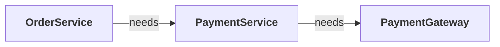
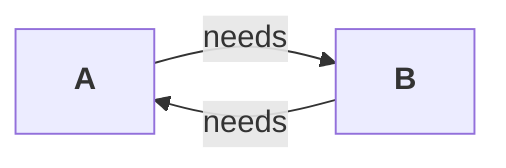
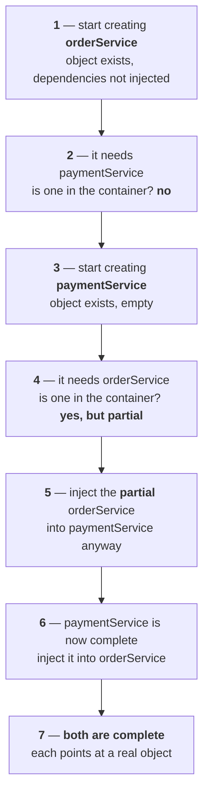

Part `05` handed object creation and wiring to the IoC container, and everything worked because the dependencies pointed one way. This part is about what happens when they point both ways, how many objects the container actually makes for each bean, and when it decides to make them. The three topics link together tightly — the last one turns out to be a way of solving the first.

| Measured on | |
|---|---|
| **Spring** | `spring-context` **7.0.7** |
| **Java** | **25** |
| **Maven** | **3.9.11** |

---

# The project

**New Project → `CircularDependencyDemo`.** Maven, sample code deleted, and one dependency added to the empty `pom.xml` — the same `spring-context` from part `05`, because Spring 7 is what pairs with Spring Boot 4.

```xml
<dependencies>
    <dependency>
        <groupId>org.springframework</groupId>
        <artifactId>spring-context</artifactId>
        <version>7.0.7</version>
    </dependency>
</dependencies>
```

**Reload, and the transitive dependencies arrive** — nine JARs from that one line, as measured in part `05`.

**The boilerplate is the same three pieces every time from here on:** a configuration class, the container, and a `getBean` call.

```java
package in.strikes;

import org.springframework.context.annotation.ComponentScan;
import org.springframework.context.annotation.Configuration;

@Configuration
@ComponentScan
public class AppConfig {
}
```

```java
ApplicationContext context = new AnnotationConfigApplicationContext(AppConfig.class);
```

**`@ComponentScan` carries no package name here**, which as part `05` established means the configuration class's own package and everything below it.

---

# The configuration class is itself a component

**One thing part `05` left unexplained.** A `@Bean` method inside `AppConfig` is an ordinary instance method — not static. So for Spring to call it, Spring must have an `AppConfig` object. Nobody in your code ever creates one.

**The answer is that the configuration class is a bean like any other**, and the proof is inside the annotation. Open `@Configuration` and it is itself annotated with `@Component`.

```
@Configuration
        ↓
@Component
        ↓
Spring can detect and manage this class
```

**So it is picked up by component scanning and registered.** It is a special class, because it declares beans and drives the component scan, but underneath it is a component class and its object is handled by the IoC container.

> [!example]- **Measured — the meta-annotation, and the config class sitting in the container.** Worth opening once, because the last line is a detail part `05` measured from the other direction.
> ```java
> System.out.println("annotations on @Configuration -> " + Arrays.toString(
>         Arrays.stream(Configuration.class.getAnnotations()).map(a -> a.annotationType().getSimpleName()).toArray()));
> System.out.println("is @Configuration meta-annotated with @Component? -> "
>         + Configuration.class.isAnnotationPresent(Component.class));
> ```
> ```
> annotations on @Configuration -> [Target, Retention, Documented, Component]
> is @Configuration meta-annotated with @Component? -> true
> appConfig is a bean? -> true
> its runtime class    -> in.strikes.AppConfig
> ```
> ##### The runtime class depends on whether there is anything to intercept
> **With no `@Bean` methods in the class, the bean is a plain `AppConfig`.** Add one and the same check prints `in.strikes.AppConfig$$SpringCGLIB$$0` — the generated subclass from part `05`. **Spring only builds the proxy when there are `@Bean` methods whose calls it needs to route back through the container.**

---

# Bean creation order

**Spring does not create beans in a random order — it creates them in dependency order.** Take a chain of three:



**`OrderService` cannot be created until `PaymentService` exists, and `PaymentService` cannot be created until `PaymentGateway` exists.** So the container works from the far end backwards:

```
PaymentGateway
      ↓
PaymentService
      ↓
OrderService
```

**The container is smart about this**, and part `05` measured it: the dependency is constructed first, then the thing that depends on it, and the dependency is injected as it goes.

---

# Circular dependency

**Now point the arrows both ways.** Two classes, `A` and `B`. `A` needs `B` to be created, and `B` needs `A` to be created.



**There is no starting point.** To create `A` the container needs `B`; to create `B` it needs `A`; and it cannot decide which to build first because neither can be built first. **This is the circular dependency problem**, and swapping `A` and `B` for `OrderService` and `PaymentService` changes nothing about it.

## Building one on purpose

**Start from the working code.** `OrderService` depends on `PaymentService` through its constructor, both are components, and calling `placeOrder` prints two lines.

```java
package in.strikes;

import org.springframework.stereotype.Component;

@Component
public class OrderService {

    private PaymentService paymentService;

    public OrderService(PaymentService paymentService) {
        this.paymentService = paymentService;
    }

    public void placeOrder() {
        paymentService.pay();
        System.out.println("Order placed");
    }

    public void getOrderDetails() {
        System.out.println("Order Details");
    }
}
```

**Now make the payment side depend on the order side as well.** `PaymentService` takes an `OrderService` in its constructor, and after paying it asks the order for its details.

```java
package in.strikes;

import org.springframework.stereotype.Component;

@Component
public class PaymentService {

    private OrderService orderService;

    public PaymentService(OrderService orderService) {
        this.orderService = orderService;
    }

    public void pay() {
        System.out.println("Payment done");
        orderService.getOrderDetails();
    }
}
```

---

# The same problem in plain Java

**This is not a Spring problem.** It is caused by writing the code badly, and it is not a clean code practice. You can produce it in ordinary Java with no framework anywhere.

```java
package in.strikes.simple;

public class A {
    private B b;

    public A() {
        System.out.println("A created");
        this.b = new B();
    }
}
```

```java
package in.strikes.simple;

public class B {
    private A a;

    public B() {
        System.out.println("B created");
        this.a = new A();
    }
}
```

**Trace one `new A()`.** The `A` constructor runs and calls `new B()`. The `B` constructor runs and calls `new A()`. That constructor calls `new B()` again. **Constructor calls keep stacking, new objects keep being created, and nothing ever returns** — until the stack is full.

```
A created
B created
A created
B created
A created
B created
   ... (lines omitted) ...
Exception in thread "main" java.lang.StackOverflowError
```

> [!example]- **Measured — how far it gets before the stack gives out.** Worth opening for the number alone.
> ```
> total lines printed before the crash: 35146
> ```
> **Roughly 17,500 objects of each class**, built and abandoned, before the JVM stops it. **No Spring was involved** — no container, no annotations, no `pom.xml` entry. The design was already broken; Spring only exposes it earlier and more politely.

---

# What Spring says when it hits the cycle

**Run the two-component version and the container refuses to start.**

```
Exception in thread "main" org.springframework.beans.factory.UnsatisfiedDependencyException:
Error creating bean with name 'orderService' ...: Unsatisfied dependency expressed through
constructor parameter 0: Error creating bean with name 'paymentService' ...: Unsatisfied
dependency expressed through constructor parameter 0: 

Error creating bean with name
'orderService': Requested bean is currently in creation: Is there an unresolvable circular
reference or an asynchronous initialization dependency?

Caused by: org.springframework.beans.factory.BeanCurrentlyInCreationException:
Error creating bean with name 'orderService': Requested bean is currently in creation:
Is there an unresolvable circular reference or an asynchronous initialization dependency?
```

**`BeanCurrentlyInCreationException` is the name to remember**, and the message reads like a trace of what the container tried.

**What happened inside.** The container did not know which of the two to build first, so it picked one — `orderService`. To build it, it needed `paymentService`, so it started building that. To build `paymentService` it needed `orderService`, which was **already in creation** and not finished. **That is the exact situation the exception is named after**, and Spring even asks the question itself: is there an unresolvable circular reference?

---

# Field and setter injection change the picture

**Constructor injection behaves completely differently from the other two**, and that difference is the whole story here.

Comment out both constructors and use **field injection** instead:

```java
@Component
public class OrderService {

    @Autowired
    private PaymentService paymentService;

    public OrderService() {
        System.out.println("OrderService created");
    }
    // ...
}
```

```java
@Component
public class PaymentService {

    @Autowired
    private OrderService orderService;

    public PaymentService() {
        System.out.println("PaymentService created");
    }
    // ...
}
```

```
OrderService created
PaymentService created
Payment done
Order Details
Order placed
```

**The container starts, and the code runs.** Setter injection behaves identically — a setter method with `@Autowired` on it produces the same result.

## Why the two behave differently

**Constructor injection welds object creation and dependency injection into one step.** Whatever the constructor demands must exist before the object can exist at all.

**Field and setter injection separate those two steps.** Nothing is required to create the object — Java calls the no-argument constructor and you have an object. **The dependency is injected afterwards, into an object that already exists.**

**So the container gets room to move:**

```
Step 1: create an empty OrderService object
Step 2: create an empty PaymentService object
Step 3: inject PaymentService into OrderService
Step 4: inject OrderService into PaymentService
```

**Neither object needed the other in order to be created.** They only need each other once both exist, and by then both do.

---

# How field injection reaches a private field

**A question worth asking even without a cycle in sight.** The field is `private`, there is no setter, and the constructor has been commented out. So how does Spring put anything in it?

**Reflection.** The container does not create the object blindly — as part `05` established, it builds a bean definition first, and it has the class's full metadata through the Reflection API. **That API can write to private members**, which is exactly what field injection uses.

---

# The early reference mechanism

**Step through what the container actually does with the field-injected cycle.**



**Step 5 is the trick.** The container hands out a reference to `orderService` even though `orderService` is not finished being built. **This is the early reference**: a bean's reference is exposed before the bean is fully initialised, so another bean can use it while the cycle is being untangled.

**And it works out**, because a reference does not care whether the object behind it is finished. By the time anybody calls a method, both objects are complete and both are pointing at real objects.

---

# Why it is still a problem

**It ran. So why call circular dependency a problem at all?**

**Because working is not the same as being good.** This is not a good coding practice, and it is something to avoid rather than something to resolve.

> [!important] **Spring Boot refuses it outright.** From **Spring Boot 2.6** onward, circular references are disabled by default through `spring.main.allow-circular-references`, whose default value is `false`. **The same field-injected code that works in plain Spring Core will not start a Boot application** — setter injection, field injection, it makes no difference. You can set the property to `true`, but that should not be treated as the solution.

> [!example]- **Measured — the same working code with circular references switched off.** Worth opening, because it shows how much of the work had already succeeded before Spring stopped it.
> ```java
> AnnotationConfigApplicationContext context = new AnnotationConfigApplicationContext();
> ((DefaultListableBeanFactory) context.getBeanFactory()).setAllowCircularReferences(false);
> context.register(AppConfig.class);
> context.refresh();
> ```
> ```
> OrderService created
> PaymentService created
> Exception in thread "main" org.springframework.beans.factory.UnsatisfiedDependencyException:
> Error creating bean with name 'orderService': Unsatisfied dependency expressed through field
> 'paymentService': ... Error creating bean with name 'orderService': Requested bean is currently
> in creation: Is there an unresolvable circular reference or an asynchronous initialization
> dependency?
> ```
> **Both constructors ran.** Both objects were built successfully — it is the injection step that Spring declined to perform, and the exception is the same `BeanCurrentlyInCreationException` as the constructor case. **Turning the flag off does not change what is possible; it changes what is permitted.**

## The real objection is the design

**Ask why the cycle exists in the first place.** `OrderService` depends on `PaymentService`, and `PaymentService` depends back on `OrderService` — why are their responsibilities so entangled?

**Because the responsibilities were never separated properly.** It means the **Single Responsibility Principle**, the first of the SOLID design principles, has been failed. **In an enterprise application that has to scale, a circular dependency should not exist at all** — not be resolved, not exist. It makes the code tightly coupled, and building a good application is mostly a matter of following good practices, design principles, and design patterns.

| Problem | Better design |
|---|---|
| Two services call each other | move the shared logic into a third service |
| One service has too many responsibilities | split the responsibilities |
| Both classes depend on the other's internal behaviour | introduce an interface, or event-based communication |
| One service does orchestration and business logic together | create a separate coordinator class |

---

# Fixing it properly

**Look at where the cycle actually comes from in this code.** `placeOrder` calls `pay` on the payment service, and `pay` turns around and calls a method back on the order service. **Class A calls a method on B, and B calls a method back on A, which is wrong.**

**Decide whose job that method is.** `PaymentService` exists to handle payments — interacting with a payment gateway, reporting whether the payment succeeded. **Fetching order details should never have been its work.**

```java
public void pay() {
    System.out.println("Payment done");

    // Not its responsibility
    //orderService.getOrderDetails();
}
```

**Move the call to the class that owns it.** `OrderService` already knows the payment has been made — it made the call — so it can ask itself for the details next.

```java
public void placeOrder() {
    paymentService.pay();

    // call here
    getOrderDetails();

    System.out.println("Order placed");
}
```

**Now `PaymentService` needs nothing from `OrderService`**, so the field, the constructor parameter and the import all come out of it. **The dependency is linear again** — order depends on payment, payment depends on nothing.

```
Payment done
Order Details
Order placed
```

**The output is identical to what the broken version was supposed to print.** Nothing was given up: the responsibilities were put back where they belonged, and the cycle disappeared as a side effect.

---

# Bean scope

**A new project, `BeanScopeDemo`, because this deserves to be read on its own.** Same boilerplate — the dependency, `AppConfig`, the container.

**Bean scope answers two questions at once: how many objects Spring creates for a bean, and how long those objects live.** The sharper form of the first one is what matters here — **how many objects for one bean definition?**

| Core scopes | |
|---|---|
| **singleton** | the default |
| **prototype** | a new object every time |

---

# Singleton scope

**A class with a constructor that announces itself, and a `main` that asks for it twice:**

```java
package in.strikes;

import org.springframework.context.annotation.Scope;
import org.springframework.stereotype.Component;

@Component
@Scope("singleton")
public class OrderService {

    public OrderService() {
        System.out.println("OrderService created");
    }

    public void placeOrder() {
        System.out.println("Order placed");
    }
}
```

```java
OrderService order = context.getBean(OrderService.class);
OrderService order2 = context.getBean(OrderService.class);

System.out.println(order == order2);
```

```
OrderService created
--- container is up ---
order == order2 -> true
```

**`OrderService created` printed once, and `==` came back `true`.** In Java `==` compares references, so both variables are pointing at the same object. **The container created one object and handed out its reference twice.**

**`@Scope("singleton")` is redundant**, because singleton is the default. Writing it or leaving it off produces identical behaviour.

## It applies to injection too, not just `getBean`

**Add two more component classes that both depend on `OrderService` through their constructors:**

```java
@Component
public class A {
    private OrderService orderService;

    public A(OrderService orderService) {
        this.orderService = orderService;
    }
}
```

```java
@Component
public class B {
    private OrderService orderService;

    public B(OrderService orderService) {
        this.orderService = orderService;
    }
}
```

**`A` and `B` cannot be created before `OrderService` exists**, so the container builds `OrderService` first, drops it into its own store, and then builds `A` and `B`, passing that same object into both constructors.

**So whether a reference is requested by `getBean` or handed over by dependency injection, it is the same single object.** Four requests, one object.

---

# Singleton is per bean definition, not per class

**This is the part that usually gets skipped, and it is where the confusion lives.**

**The singleton design pattern, from low-level design, is strict:** one object of a class, ever. **Spring's singleton is not that.** 

> Spring's singleton says: one object **per bean definition** inside the container.

**Two ways to prove that the class-level reading is wrong.**

1. **You can always build your own.** Nothing stops you writing `new OrderService()` in your own code — that object simply is not managed by Spring.

2. **More interesting, two bean definitions give two objects.** Take `@Component` off `OrderService` so the container does not scan it, and declare it twice in the configuration class instead:

```java
@Configuration
@ComponentScan
public class AppConfig {

    @Bean
    public OrderService getOrder() {
        return new OrderService();
    }

    @Bean
    public OrderService getOrder2() {
        return new OrderService();
    }
}
```

```
OrderService created
OrderService created
OrderService beans -> [getOrder, getOrder2]
getOrder  twice, same? -> true
getOrder vs getOrder2  -> false
```

**Two objects, even though the scope is singleton.** Each definition is singleton in itself — ask for `getOrder` a hundred times and you get the same object every time. **But two definitions mean two objects.**

> [!warning] **With two definitions of one type, injection by type breaks.** Anything that asks for an `OrderService` without saying which now hits the part `05` problem: `NoUniqueBeanDefinitionException: expected single matching bean but found 2: getOrder,getOrder2`. **The fix is the same as before — `@Primary` on one, or `@Qualifier` at the injection point.**

---

# Prototype scope

**Prototype is the exact opposite of singleton.** Every time the bean is requested — by `getBean` or by dependency injection — a new object is created.

```java
@Component
@Scope("prototype")
public class OrderService {
```

**With the same `main` as before, plus `A` and `B` still depending on it:**

```
OrderService created
OrderService created
--- container is up ---
OrderService created
OrderService created
order == order2 -> false
```

**Four objects.** Two were built at startup, to satisfy `A`'s constructor and `B`'s constructor. Two more were built by the two `getBean` calls. **And `==` is now `false`, because the two variables hold different objects.**

**It is very close to writing `new` yourself** — every request gets a fresh object — except that the object is still created by Spring rather than by you.

## Prototype beans are not created at startup

**Strip the demands away** — no `A` or `B` depending on it, nothing calling `getBean` — and start the container:

```
--- container is up, nothing else happened ---
```

**Nothing was created.** The constructor never ran. Compare that with singleton, where the object appears the moment the container starts, whether or not anybody wants it.

**That difference has a name, and the next major topic is about it.**

> Prototype does **lazy initialisation**; singleton does **eager initialisation**.

---

# When to use which

**The rule follows from what the class holds.**

| Scope | Use for |
|---|---|
| **singleton** | **stateless** classes — they provide behaviour |
| **prototype** | **stateful** classes — they hold changing data |

**A class with its own data is stateful:**

```java
public class User {
    private String name;
    private int age;
}
```

**`name` and `age` are the states of a user.** Every user has a different name and a different age, so a single shared `User` object makes no sense — you would call `getBean` and keep getting the same person back, when what you want is many users existing in the application. **A class like this is the best candidate for prototype scope.**

**Service and manager classes are the opposite.** `OrderService` handles many orders but holds none of them; it has methods, not data. `processPayment`, `validateOrder`, `sendEmail`, `calculateDiscount` can all be reused safely by anyone. **A class with no unique state of its own should be singleton.**

---

# A prototype inside a singleton

**A question the scopes do not answer on their own.** If a prototype bean is injected into a singleton bean, does the singleton get a new prototype object each time it uses it?

**No — and this catches people.** The singleton is created **once**. At that one moment, Spring injects **one** prototype object into it. That reference then stays inside the singleton forever.

```java
@Component
public class OrderService {

    private final OrderRequest orderRequest;   // OrderRequest is @Scope("prototype")

    public OrderService(OrderRequest orderRequest) {
        this.orderRequest = orderRequest;
    }
}
```

**Prototype means a new object every time the bean is requested from the container.** It does not mean a new object every time a singleton's method runs — nothing is requesting anything on those later calls.

> [!example]- **Measured — the prototype that never changes, and the way to get a fresh one.** Worth opening, because the fix is a class the lecture never mentions.
> ```
> OrderRequest created
> call 1 -> in.strikes.OrderRequest@5db250b4
> call 2 -> in.strikes.OrderRequest@5db250b4
> same object inside the singleton? -> true
> OrderRequest created
> fresh getBean  -> in.strikes.OrderRequest@38c5cc4c
> ```
> **The two calls inside the singleton return the identical object.** Only the direct `getBean` produces a new one.
> ##### Asking the container each time instead
> **Inject an `ObjectProvider` rather than the bean**, and every `getObject()` is a fresh request to the container:
> ```java
> @Component
> public class OrderService {
>
>     private final ObjectProvider<OrderRequest> orderRequestProvider;
>
>     public OrderService(ObjectProvider<OrderRequest> orderRequestProvider) {
>         this.orderRequestProvider = orderRequestProvider;
>         System.out.println("OrderService created");
>     }
>
>     public void placeOrder() {
>         OrderRequest request = orderRequestProvider.getObject();
>         System.out.println("Using OrderRequest: " + request.getId());
>     }
> }
> ```
> ```
> OrderService created
> Application started
> OrderRequest created: 1
> Using OrderRequest: 1
> OrderRequest created: 2
> Using OrderRequest: 2
> ```
> **A new object per call, which is what the prototype scope was wanted for in the first place.**

---

# Web scopes

**Singleton and prototype are the two that matter without a web layer.** The rest only make sense once requests and sessions exist, and they come back when the series reaches Spring MVC and Spring Boot Web.

| Scope | One object per |
|---|---|
| **request** | one HTTP request |
| **session** | one user session |
| **application** | the whole web application, tied to the `ServletContext` |
| **websocket** | one WebSocket session |

**`application` can look a lot like singleton at first glance**, and the difference between them is a topic for when web applications are actually being built.

---

# Bean initialization

**A third project, `BeanInitializationDemo`, and the same boilerplate again.** The question this time is not how many objects, but **when** they get made.

| | |
|---|---|
| **Eager initialization** | create the bean during application startup |
| **Lazy initialization** | create the bean only when it is actually needed |

**The defaults follow from the scopes:**

- **singleton beans are eagerly initialized**
- **prototype beans are lazily initialized**, created when requested

---

# Eager initialization, and why it is the default

**Two components, each announcing its own construction, and a `main` that does nothing but start the container:**

```java
@Component
public class OrderService {
    public OrderService() {
        System.out.println("OrderService created");
    }
}
```

```java
@Component
public class PaymentService {
    public PaymentService() {
        System.out.println("PaymentService created");
    }
}
```

```
PaymentService created
OrderService created
--- container is up ---
```

**Both objects existed before the container finished starting**, and nothing in `main` asked for either. That is eager initialization, and it is the default because the scope is the default.

## Why creating everything up front is the right default

**It looks wasteful at first.** If the user may never touch a feature, why build every object at startup and make the application heavier to boot?

**The answer is fail fast.** Suppose there is a wiring mistake somewhere — a missing bean, an ambiguous type, a dependency that cannot be resolved. **With eager initialization you find out while the application is starting**, which is when all the part `05` exceptions appeared.

**With lazy initialization those beans are not built at startup.** They are built when something first needs them, and that is when the failure surfaces — **so an application can start cleanly and then blow up in production** when a user hits the feature. Early errors and predictable startup validation are worth more than a faster boot.

---

# Lazy initialization with `@Lazy`

**One annotation flips it.**

```java
@Component
@Lazy
public class OrderService {
```

**With `@Lazy` on both classes and nothing requesting them, the container starts and prints nothing at all.** Spring knows about the beans — it holds their bean definitions, with the class name, scope, dependencies and lifecycle details — but no object exists yet.

**Ask for one and it appears:**

```java
OrderService order = context.getBean(OrderService.class);
```

**The construction message prints at that line**, not at startup.

## Prototype is always lazy, and cannot be made eager

**`@Lazy` only ever moves a singleton.** A prototype bean is lazily initialized by default and there is no way to turn it eager.

**And the reason is that eagerness would be meaningless.** Prototype promises a brand new object to every caller. **So what would an object built at startup be for?** Nobody can ever be given it — the next request has to produce a fresh one regardless. There is nothing to pre-build.

**Singleton has the opposite logic.** Everyone gets the same object, so building it once up front and handing out its reference forever is exactly the right move.

| Scope | Default initialization | Can it be changed |
|---|---|---|
| **singleton** | **eager** | **yes** — `@Lazy` makes it lazy |
| **prototype** | **lazy** | **no** — eager makes no sense |

---

# When a lazy bean gets built anyway

**`@Lazy` is a request, not a guarantee**, and the interesting cases are when two beans disagree.

**Mark only the dependent class lazy.** `OrderService` is `@Lazy` and depends on `PaymentService`; `PaymentService` is eager.

```
PaymentService created
--- container is up ---
```

**As expected — the eager one is built, the lazy one is not.**

**Now swap them.** `PaymentService` is `@Lazy`, and `OrderService` is eager and takes a `PaymentService` in its constructor.

```
PaymentService created
OrderService created
--- container is up ---
```

**The lazy bean was created at startup anyway.** `OrderService` is eager, so the container has to build it, and it cannot be built without a real `PaymentService` in its constructor. **Lazy means do not build it until it is needed — and it was needed.**

| Situation | What happens at startup |
|---|---|
| eager bean → **lazy** dependency | the lazy bean **is** created, to satisfy the eager one |
| **lazy** bean → eager dependency | the eager dependency is created; the lazy bean waits |
| **lazy** bean → **lazy** dependency | neither is created until the first is requested |

---

# `@Lazy` on the injection point

**There is a second place the annotation can go**, and it means something different. Put it on the constructor parameter, the way a `@Qualifier` goes there:

```java
@Component
public class OrderService {

    PaymentService paymentService;

    public OrderService(@Lazy PaymentService paymentService) {
        this.paymentService = paymentService;
        System.out.println("OrderService created");
    }

    public void placeOrder() {
        paymentService.pay();
        System.out.println("Order placed");
    }
}
```

**This says: build `OrderService`, but do not build its dependency yet.** And the container can honour that, because it does not put the real object into the field — **it puts in a proxy.**

**A proxy is a placeholder.** It is an object that behaves like a `PaymentService` and is not a real `PaymentService`. `OrderService` believes it received its dependency and is fully constructed. **The moment a method is actually called on it, Spring resolves the real bean.**

| Where `@Lazy` goes | What it means |
|---|---|
| **on the class** | do not create this bean until it is requested |
| **on the injection point** | inject a proxy, and resolve the real dependency when it is used |

> [!example]- **Measured — the proxy's real class name, and when the object finally appears.** Worth opening, because the field genuinely does not hold what the type says it holds.
> **With `@Lazy` on the class and on the injection point:**
> ```
> OrderService created
>    what got injected -> in.strikes.PaymentService$$SpringCGLIB$$0
> --- container is up ---
> Payment Service not started yet
> PaymentService created
> Payment successful
> Order placed
> ```
> **`PaymentService$$SpringCGLIB$$0` is a generated subclass of `PaymentService`** — the same CGLIB mechanism the `@Configuration` class uses, pointed at a different job. **The real `PaymentService` is constructed between `Payment Service not started yet` and `Payment successful`**, which is to say at the moment `pay()` was called and not one instruction earlier.

---

# Making everything lazy, and opting back out

**Spring Boot can flip the default for the whole application** with one property:

```properties
spring.main.lazy-initialization=true
```

**Every bean becomes lazy**, and the container creates nothing at startup — each bean waits until something uses it. **The default is `false`**, and the trade-off is the one from earlier: faster startup, later errors.

**One bean can be excluded from that** by asking for the opposite explicitly:

```java
@Component
@Lazy(false)
public class ImportantStartupBean {
}
```

**This only makes sense when global lazy initialization is on.** Without it the bean is eager anyway, so writing `@Lazy(false)` says nothing.

---

# Solving the circular dependency with `@Lazy`

**Now the three topics join up.** Go back to the constructor-injected cycle — `OrderService` needs `PaymentService`, `PaymentService` needs `OrderService`, and neither can be built first.

**Put `@Lazy` on the injection point:**

```java
public OrderService(@Lazy PaymentService paymentService) {
    this.paymentService = paymentService;
    System.out.println("OrderService created");
}
```

**The deadlock breaks immediately.** The container no longer needs a real `PaymentService` to finish building `OrderService` — it injects a proxy and moves on. Once `OrderService` is complete, building `PaymentService` is straightforward, because the `OrderService` its constructor demands now genuinely exists.

**Add `@Lazy` on the `PaymentService` class as well** and the real object's construction is deferred too, until `pay()` is first called:

```
OrderService created
--- container is up ---
PaymentService created
Payment successful
Order Details
Order placed
```

> [!info] **The two annotations do different halves of the job.** **The one on the injection point is what breaks the cycle** — measured on its own, the container starts and everything runs, though `PaymentService` is still built during startup because it is an eager singleton that nothing stopped. **The one on the class only postpones its construction.** Use the injection point one to fix the cycle; add the class-level one if you also want the object built late.

> [!warning] **This is a workaround, not a design.** It is worth knowing, and it is worth using on legacy code or when refactoring is not possible right now — but the cycle is still there, and the classes still know too much about each other. **The real fix is the one from earlier in this part: move the misplaced responsibility and the cycle stops existing.**

---

# Practice questions

**The companion repository ships 14 questions with an answer key for this part.** They are worth attempting before reading the answers — the assumptions are Spring Core with annotation configuration, no Spring Boot, no `application.properties`, everything in `in.strikes`, and only `System.out.println` output counted.

> [!question]- **The 14 practice questions, with answers.** Work out each output first; the answer follows immediately under it.
> ##### 1 — Basic eager initialization
> Three components in a chain: `PaymentGateway`, then `PaymentService(PaymentGateway)`, then `OrderService(PaymentService)`, each printing on construction. `main` starts the container and prints `Application started`.
> ```
> PaymentGateway created
> PaymentService created
> OrderService created
> Application started
> ```
> **All three are eager singletons, and Spring builds dependencies first.**
> ##### 2 — Lazy bean not requested
> `ReportService` is `@Component @Lazy`. `main` only starts the container.
> ```
> Application started
> ```
> **Spring stores the bean definition and creates no object.**
> ##### 3 — Lazy bean requested manually
> Same class, but `main` calls `getBean` and then `generateReport()`.
> ```
> Application started
> ReportService created
> Report generated
> ```
> **The object appears at the `getBean` line, not at startup.**
> ##### 4 — Lazy bean needed by an eager singleton
> `ReportService` is `@Lazy`; `DashboardService` is a normal singleton taking it in the constructor.
> ```
> ReportService created
> DashboardService created
> Application started
> ```
> **A lazy bean is still created at startup when an eager singleton directly needs it.**
> ##### 5 — `@Lazy` on the injection point
> `EmailService` is `@Lazy`, and `UserService` takes `@Lazy EmailService` in its constructor.
> ```
> UserService created
> Application started
> Before registerUser()
> User registered
> EmailService created
> Email sent
> ```
> **A proxy is injected; the real object is resolved when `sendEmail()` runs.**
> ##### 6 — `@Lazy` only on the bean, not the injection point
> Same classes, but the constructor parameter is not marked.
> ```
> EmailService created
> UserService created
> Application started
> Before registerUser()
> User registered
> Email sent
> ```
> **The eager `UserService` forces the real `EmailService` at startup.**
> ##### 7 — Prototype bean requested twice
> `OrderRequest` is `@Scope("prototype")`; `main` calls `getBean` twice and compares.
> ```
> Application started
> OrderRequest created
> OrderRequest created
> false
> ```
> ##### 8 — Prototype bean injected into a singleton
> A prototype `OrderRequest` injected into a singleton `OrderService`, used twice.
> ```
> OrderRequest created: 1
> OrderService created
> Application started
> Using OrderRequest: 1
> Using OrderRequest: 1
> ```
> **One prototype object is injected once and reused for the singleton's whole life.**
> ##### 9 — Getting a fresh prototype inside a singleton
> The singleton holds an `ObjectProvider<OrderRequest>` and calls `getObject()` each time.
> ```
> OrderService created
> Application started
> OrderRequest created: 1
> Using OrderRequest: 1
> OrderRequest created: 2
> Using OrderRequest: 2
> ```
> ##### 10 — Constructor-based circular dependency
> `OrderService` and `PaymentService` each take the other in their constructor.
> ```
> The container fails to start with BeanCurrentlyInCreationException.
> Application started is never printed.
> ```
> ##### 11 — Circular dependency solved using `@Lazy`
> The same pair, with `@Lazy` on the constructor parameter and on `PaymentService`.
> ```
> OrderService created
> Application started
> Order placed
> PaymentService created
> Payment done
> ```
> ##### 12 — Setter-based circular dependency
> The same pair, wired through `@Autowired` setters.
> ```
> OrderService constructor
> PaymentService constructor
> OrderService injected into PaymentService
> PaymentService injected into OrderService
> Application started
> ```
> **Object creation and injection are separate steps, so the container can untangle it.**
> ##### 13 — Field-based circular dependency
> The same pair, wired through `@Autowired` fields.
> ```
> OrderService created
> PaymentService created
> Application started
> ```
> **The early reference mechanism completes both beans.**
> ##### 14 — `@Bean` singleton creation
> Two `@Bean` methods, `user1` and `user2`, both returning `new User()`. `u1` and `u2` both come from `user1`; `u3` comes from `user2`.
> ```
> User object created
> User object created
> Application started
> true
> false
> ```
> **Two bean definitions mean two objects — singleton is per definition, not per class.**

---

# What this part established

| | |
|---|---|
| `@Configuration` is | **also a `@Component`** — measured, it is meta-annotated with it |
| So the config class | **is itself a bean**, which is how Spring calls its `@Bean` methods |
| The CGLIB subclass appears | only when the config class **has `@Bean` methods** to intercept |
| Spring creates beans in | **dependency order** — the dependency first, then its dependent |
| **Circular dependency** is | two or more beans that depend on each other, directly or indirectly |
| Why it breaks the container | there is **no starting point** — neither bean can be built first |
| ⚠️ It is **not** a Spring problem | plain Java produces `StackOverflowError` from the same design |
| Measured | **35,146** lines printed before the stack gave out |
| The exception | **`BeanCurrentlyInCreationException`** — `Requested bean is currently in creation` |
| **Constructor** injection | creation and injection are **one step** — the cycle is fatal |
| **Field / setter** injection | creation and injection are **separate steps** — the cycle can be resolved |
| How it resolves | the **early reference** — a partially built bean is handed out anyway |
| How field injection reaches a private field | **reflection**, the same API the bean definition came from |
| ⚠️ Spring Boot **2.6+** | `spring.main.allow-circular-references` defaults to **`false`** — the same code will not start |
| The real objection | it is a **design smell** — the Single Responsibility Principle has been failed |
| The proper fix | **refactor** so the dependency runs one way, not resolve the cycle |
| **Bean scope** decides | how many objects per bean definition, and how long they live |
| **singleton** | one object per bean definition — **the default** |
| ⚠️ Spring singleton is **not** the singleton pattern | it is **per bean definition**, not per class |
| Measured | two `@Bean` methods of one class → **two objects**, each singleton |
| **prototype** | a new object on **every** request, by `getBean` or by injection |
| Which to use | **singleton** for **stateless** services · **prototype** for **stateful** classes |
| ⚠️ A prototype inside a singleton | injected **once** and reused — use **`ObjectProvider`** for a fresh one each call |
| Web scopes | **request** · **session** · **application** · **websocket** |
| **Eager** initialization | built at startup — the default for **singleton** |
| **Lazy** initialization | built when needed — the default for **prototype** |
| Why eager is the default | **fail fast** — wiring errors surface at startup, not in production |
| ⚠️ Prototype cannot be made eager | there is nothing to pre-build when every caller gets a new object |
| `@Lazy` **on a class** | do not create this bean until it is requested |
| `@Lazy` **on an injection point** | inject a **proxy**, resolve the real bean on first use |
| Measured | the proxy is **`PaymentService$$SpringCGLIB$$0`** |
| A lazy bean is built anyway | when an **eager** bean directly needs it |
| Global switch | `spring.main.lazy-initialization=true`, with **`@Lazy(false)`** to opt one bean out |
| `@Lazy` also breaks a cycle | the **injection point** one does the breaking; the class one only defers |
| ⚠️ But that is a workaround | the cycle still exists — fix the design instead |
| Next | the **bean lifecycle**, from definition to destruction |
