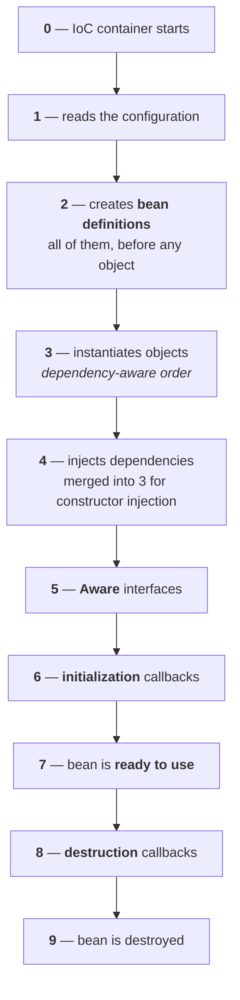
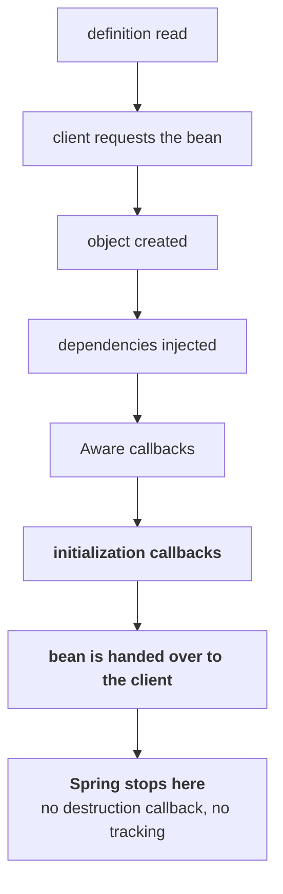

Parts `05` and `06` kept circling the same question from different sides: the container creates beans, wires them, decides how many to make and when. This part follows a single bean all the way through, from the moment the container first hears about it to the moment it is thrown away, and names every phase in between.

**The lifecycle in this part is a singleton bean's**, since singleton is the default scope and singletons are eagerly initialized. Prototype beans and lazy singletons differ in small, specific ways, and both are covered at the end once the full picture is in place.

| Measured on | |
|---|---|
| **Spring** | `spring-context` **7.0.7** |
| **Jakarta annotations** | `jakarta.annotation-api` **3.0.0** |
| **Java** | **25** |

---

# The project

**New Project → `BeanLifeCycleDemo`.** Maven, boilerplate deleted, and `spring-context` added to the empty `pom.xml` exactly as in the last three parts.

```java
package in.strikes;

import org.springframework.context.annotation.ComponentScan;
import org.springframework.context.annotation.Configuration;

@Configuration
@ComponentScan
public class AppConfig {
}
```

```java
ApplicationContext context = new AnnotationConfigApplicationContext(AppConfig.class);
```

**Two service classes to follow through the lifecycle**, with the second depending on the first:

```java
package in.strikes;

import org.springframework.stereotype.Component;

@Component
public class OrderService {

    PaymentService paymentService;

    public OrderService(PaymentService paymentService) {
        this.paymentService = paymentService;
    }

    public void placeOrder() {
        System.out.println("Order placed");
        paymentService.pay();
    }
}
```

```java
package in.strikes;

import org.springframework.stereotype.Component;

@Component
public class PaymentService {

    public void pay() {
        System.out.println("Payment done");
    }
}
```

**No `@Autowired` on the constructor**, because there is only one constructor — part `05`'s rule.

```
Order placed
Payment done
```

---

# What is already known

**The container is responsible for beans, and that responsibility has three parts:** create the bean, manage it, destroy it.

**Compare that with doing it yourself in Java.** You create objects yourself, you manage them yourself, and destroying them is **garbage collection's job** — you never call the collector by hand.

> We just have to stop referring to that object.

**Garbage collection scans for objects nothing refers to any more and clears them from memory.** With Spring in the picture, all three responsibilities move to the container.

**And destroying means something specific here.**

> What does destroy mean here? Removing them from our IoC container.

**Creation has come up repeatedly, management a little, and destruction not at all** — which is where this part fills the gap.

---

# Step 0 — the container starts

**Nothing can happen before this.** Until the IoC container is up, there is nothing to manage anything.

```java
ApplicationContext context = new AnnotationConfigApplicationContext(AppConfig.class);
```

**Whether you call it step zero or step one does not matter** — it is the first thing, and everything below hangs off it.

---

# Step 1 — reading the configuration

**A container that is up still knows nothing.** It needs to be told which beans to manage and which package to scan, and that information comes from the **configuration class** whose metadata was handed to the constructor.

**`AppConfig.class` is reflection again.** Not an object of `AppConfig` — its metadata, from which Spring can read every annotation on the class.

**What the container is looking for:** is `@ComponentScan` present and which package does it name, is `@Configuration` present, and are there any `@Bean` methods whose return values need registering.

## The configuration class is a bean as well

**A `@Bean` method is an ordinary instance method, so calling it requires an `AppConfig` object** — and nobody in your code ever creates one. Part `06` established why that works: `@Configuration` is itself annotated with `@Component`, so the configuration class is scanned, registered, and managed like anything else.

**It can be pulled straight back out of the container, and ordinary methods on it work:**

```java
AppConfig config = context.getBean(AppConfig.class);
config.demo();          // prints: Demo
```

**So everything in this part applies to `AppConfig` too.** It is a special class because it carries configuration, not because it sits outside the lifecycle.

---

# Step 2 — bean definitions

**With the scan done, the container has found `OrderService` and `PaymentService`.** The obvious next move would be to build them. It does not.

**Before any object exists, the container records what it knows about each bean** — the same `BeanDefinition` step measured in part `06`:

| | |
|---|---|
| **Bean name** | `orderService` — the class name in camel case, or whatever `@Component("orderBean")` says |
| **Bean class** | `OrderService` |
| **Scope** | `singleton` |
| **Lazy** | `false` |
| **Dependencies** | the `paymentService` bean |

**And all definitions are built before any object is built** — not one bean carried end to end and then the next.

**The reason is in the definition itself.** It records the scope and the laziness, and those decide whether an object should be created at startup at all. A prototype bean or a lazy singleton must be left alone until something asks for it. **Knowing the whole map first is what lets the container build only what it should.**

> [!example]- **Measured — the split between registering definitions and creating objects.** Worth opening once, because driving the container by hand makes the two phases visible separately.
> ```java
> AnnotationConfigApplicationContext context = new AnnotationConfigApplicationContext();
> context.register(AppConfig.class);
>
> System.out.println("before refresh, definitions -> " + Arrays.toString(context.getBeanDefinitionNames()));
> System.out.println("--- calling refresh() ---");
> context.refresh();
> ```
> ```
> before refresh, definitions -> [org.springframework.context.annotation.internalConfigurationAnnotationProcessor,
>   org.springframework.context.annotation.internalAutowiredAnnotationProcessor,
>   org.springframework.context.annotation.internalCommonAnnotationProcessor,
>   org.springframework.context.event.internalEventListenerProcessor,
>   org.springframework.context.event.internalEventListenerFactory, appConfig]
> --- calling refresh() ---
>    constructed: Alpha
>    constructed: Beta
>    constructed: Gamma
> after refresh, definitions  -> [appConfig, alpha, beta, gamma]
> ```
> **Before `refresh()` only the infrastructure processors and `appConfig` are registered** — the scan has not run. **`refresh()` is where the component scan, the remaining definitions, and every eager object all happen**, and the three constructors run back to back with nothing between them.

---

# Step 3 — the objects are created

**Now the container instantiates.** And it does not pick at random.

**It is dependency aware.** Which class it reaches first depends on the order the scan returned them, but the outcome is fixed either way. Reach `PaymentService` first and it is easy — nothing depends on it, so it is built immediately. Reach `OrderService` first and the constructor demands a `PaymentService`, so the container goes and builds that one first, then comes back.

**Either path ends the same way:** `PaymentService` exists before `OrderService` does.

---

# Step 4 — dependencies are injected

**Whether this is a separate step depends entirely on how the dependency is injected.**

**With constructor injection it is not separate.** `OrderService` cannot be created without a `PaymentService` in hand, so the moment the container calls that constructor it is also performing the injection. **Steps 3 and 4 collapse into one.**

**With setter or field injection they stay apart.** Neither is needed to build the object, so the container creates `OrderService` first, on its own, and resolves the dependency afterwards — which is exactly the separation part `06` used to untangle a circular dependency.

```java
@Component
public class OrderService {

    @Autowired
    private PaymentService paymentService;   // injected after the object exists
}
```

**Private is not an obstacle**, because the container reaches the field with reflection.

**At this point both objects exist inside the container and they are wired together.** `appConfig`, `orderService`, `paymentService`, with `orderService` holding a reference to `paymentService`.

**Which raises the obvious question: can the beans be used now?** Not quite. Two phases sit between here and a usable bean, and they are the interesting ones.

---

# Step 5 — the Aware interfaces

**Sometimes a bean wants to know something about the container it lives in.** What is my bean name? Which `ApplicationContext` am I running inside? **Spring exposes that through a family of interfaces whose names all end in `Aware`.**

```java
package in.strikes;

import org.springframework.beans.BeansException;
import org.springframework.beans.factory.BeanNameAware;
import org.springframework.context.ApplicationContext;
import org.springframework.context.ApplicationContextAware;
import org.springframework.stereotype.Component;

@Component("userBean")
public class UserService implements BeanNameAware, ApplicationContextAware {

    public UserService() {
        System.out.println("UserService constructor called");
    }

    @Override
    public void setBeanName(String name) {
        System.out.println("Bean name is " + name);
    }

    @Override
    public void setApplicationContext(ApplicationContext applicationContext) throws BeansException {
        System.out.println("ApplicationContext name is " + 
        applicationContext.getClass());
    }
}
```

**Both are functional interfaces with a single method to override**, and nothing in the code ever calls either one.

```
UserService constructor called
Bean name is userBean
ApplicationContext name 
is class org.springframework.context.annotation.AnnotationConfigApplicationContext
```

**Change the name to `@Component("userBean2")` and the output follows it**, which proves where the value comes from.

## Callback methods

**Spring called those methods, not you.**

> The **methods that Spring calls by itself** — we call those callback methods. Because the **call is coming to us from Spring**'s side.

**Implement none of these Aware interface and this step simply does not happen.** There is nothing for Spring to call, so it moves on.

## Why `setBeanName` and not `getBeanName`

**Because the direction is container to bean.** Spring is not answering a question you asked; it is pushing information into the bean. A getter would be the other direction — a normal method you call to read a value you already hold.

**Which also means calling it yourself achieves nothing.**

> You cannot use this to change the bean's name. By calling a callback method you cannot change anything inside Spring.

> [!example]- **Measured — calling `setBeanName` by hand, and what the container thinks afterwards.** Worth opening because the console output is genuinely misleading.
> ```java
> UserService u = context.getBean(UserService.class);
> u.setBeanName("userBean2");
> ```
> ```
>    setBeanName called with -> userBean       <- Spring's callback, during startup
>    setBeanName called with -> userBean2      <- your own call
> registered names -> [userBean]
> getBean("userBean")  works? -> true
> getBean("userBean2") -> NoSuchBeanDefinitionException
> ```
> **The second line printed, and nothing changed.** The container's registry still holds exactly one name, and asking for the name you just passed in throws. **You called an ordinary Java method on an ordinary Java object** — the only thing that reaches the container is what the annotation said.

## What they are actually for

**Almost never business logic.** In 99% of real service code you do not need to know your own bean name or which container you came from.

**Logging is the real use case.** An enterprise application sends its logs to a file, at levels like info and error, and a log line is far more useful when it carries the name of the bean that produced it. `setBeanName` is how a logging utility gets that name.

**And `ApplicationContextAware` matters when there is more than one container.** Usually an application has exactly one, but a codebase running both an XML-based and an annotation-based configuration has two — and then knowing which container a bean came from is what lets you debug the right one instead of both.

---

# Step 6 — initialization callbacks

**The object exists and its dependencies are wired. Spring still inserts one more phase before you may use it**, and unlike the Aware interfaces this one earns its place constantly.

## What the phase is for

**Work that has to happen after the object is complete but before anybody calls a method on it.**

```java
@Component
public class CartService {

    Map<Integer, String> mp;

    public CartService() {
        mp = new HashMap<>();
        System.out.println("CartService constructor called");
    }

    public void addToCart() {
        System.out.println("Added to cart");
    }

    public String getValue(int key) {
        return mp.get(key);
    }
}
```

**Typical initialization work:** 
* filling that map with starting values, or clearing it so the bean begins from a known state. 
* **invalidating a cache** so it is empty before anything is written to it.
* loading an expensive resource up front rather than on the first call that needs it.
* validating configuration. 
* logging the startup state.

## Three ways to hook into it

| | |
|---|---|
| **`InitializingBean`** | a Spring interface — implement it and override `afterPropertiesSet` |
| **`@Bean(initMethod = "...")`** | name your own method in the configuration class |
| **`@PostConstruct`** | an annotation on any method — what modern code uses |

### `InitializingBean`

```java
@Component
public class CartService implements InitializingBean {

    @Override
    public void afterPropertiesSet() throws Exception {
        System.out.println("Bean is Ready");
        mp.put(1, "Aditya");
        mp.put(2, "Rohit");
    }
}
```

```
CartService constructor called
Bean is Ready
Aditya
```

**The map was filled before `getValue(1)` ever ran**, and nothing in the code called `afterPropertiesSet`. **This style is old** and largely replaced by the third one, because implementing the interface couples the class to Spring.

### A custom `initMethod`

**This one is for beans that come from a `@Bean` method rather than from `@Component`**, where there is no class of your own to hang an interface on — you are handing the container a finished object.

```java
@Configuration
@ComponentScan
public class AppConfig {

    @Bean(initMethod = "start")
    public CartService getCartBean() {
        return new CartService();
    }
}
```

```java
public void start() {
    System.out.println("Bean is Ready");
    mp.put(1, "Aditya");
    mp.put(2, "Rohit");
}
```

**No interface, no annotation, no override** — an ordinary method that Spring calls because the `@Bean` declaration named it.

### `@PostConstruct`

**The one to reach for.** Any method, one annotation, nothing to implement.

```java
@PostConstruct
public void start2() {
    System.out.println("Bean is Ready");
    mp.put(1, "Aditya");
    mp.put(2, "Rohit");
}
```

> [!important] **`@PostConstruct` needs a dependency that `spring-context` does not bring.** It lives in `jakarta.annotation`, so a plain Spring Core project has to add it:
> ```xml
> <dependency>
>     <groupId>jakarta.annotation</groupId>
>     <artifactId>jakarta.annotation-api</artifactId>
>     <version>3.0.0</version>
> </dependency>
> ```
> **A Spring Boot application already has it**, so this is a Spring Core concern only.

> [!example]- **Measured — what that dependency actually switches on inside the container.** Worth opening, because the missing jar is not only a compile error.
> **Without it, the code does not compile at all:**
> ```
> CartService.java:3: error: package jakarta.annotation does not exist
> import jakarta.annotation.PostConstruct;
> ```
> **And with it, an extra infrastructure bean appears in the container:**
> ```
> with jakarta.annotation-api on the classpath:  internalCommonAnnotationProcessor
> without it:                                    (absent)
> ```
> **That processor is what implements `@PostConstruct` and `@PreDestroy`.** The annotations are inert markers; the thing that finds them and calls your method is a bean the container only registers when the Jakarta API is present. **So the dependency is not just about compiling the import — it is what puts the machinery in the container.**

---

# Why not just use the constructor

**Everything in that `@PostConstruct` method could be written in the constructor**, and the code would appear to work — the map would be filled, `getValue(1)` would return `Aditya`. So why does the phase exist at all?

**Two reasons, and the first is decisive.**

**The constructor runs far too early in the lifecycle.** It fires at step 3, before setter injection and field injection have happened. So a constructor that tries to use a field-injected dependency is reaching for something that is not there yet. **`@PostConstruct` runs at step 6, when every dependency is resolved and the object is genuinely complete.**

**The second reason is about weight.** Initialization work is often heavy — loading a large file, warming a cache. Doing it in the constructor makes object creation itself slow.

> Never make the constructor heavy. Once your constructor has loaded, then **make the post-construct heavy**.

**Let the object be created cleanly and lightly, and put the expensive work in the phase built for it.**

---

# Step 7 — the bean is ready

**Now it can be used.** This is the phase all the earlier ones were preparing for, and it is simply your code calling methods.

```java
CartService cart = context.getBean(CartService.class);
System.out.println(cart.getValue(1));
cart.addToCart();
```

**It stays in this phase for as long as the application needs the bean.**

---

# Step 8 — destruction callbacks

**Before a bean is thrown away, Spring offers one last callback** — the mirror image of initialization.

**And the work is the mirror image too.** Whatever initialization set up, destruction tears down: clear the map that was filled, invalidate the cache that was validated, close the expensive resource that was opened, flush pending data, stop a background thread.

**The same three styles, matched one to one:**

| Initialization | Destruction |
|---|---|
| `InitializingBean` → `afterPropertiesSet` | **`DisposableBean`** → `destroy` |
| `@Bean(initMethod = "start")` | **`@Bean(destroyMethod = "stop")`** |
| `@PostConstruct` | **`@PreDestroy`** |

```java
@Component
public class CartService implements DisposableBean {

    @Override
    public void destroy() throws Exception {
        mp.clear();
        System.out.println("Bean is getting destroyed");
    }
}
```

```java
@Bean(initMethod = "start", destroyMethod = "stop")
public CartService getCartBean() {
    return new CartService();
}
```

```java
@PreDestroy
public void stop() {
    mp.clear();
    System.out.println("Bean is getting destroyed");
}
```

## Making it happen

**Run the program as it stands and no destruction callback fires.** The application simply ends — `Process finished with exit code 0` — and the bean is never destroyed on the way out.

**To see the phase, close the container yourself:**

```java
context.close();
```

**Which does not compile against `ApplicationContext`.** That interface has no `close`. The method belongs to its sub-interface, so the variable's type has to change:

```java
ConfigurableApplicationContext context = new AnnotationConfigApplicationContext(AppConfig.class);
```

**`ConfigurableApplicationContext` extends `ApplicationContext`**, so nothing else about the code changes — measured, it extends `ApplicationContext`, `Lifecycle` and `Closeable`. Earlier parts used the plainer type because closing was never needed.

```
CartService constructor called
Bean is Ready
Aditya
Bean is getting destroyed
```

---

# Step 9 — the bean is destroyed

**Nothing is left.** The callback has run, the container removes the bean, and the lifecycle is over.

---

# The whole lifecycle in one place



> [!example]- **Measured — every callback style at once, in the order Spring runs them.** Worth opening, because no single example in the lecture shows all six together, and the ordering between them is the part that gets asked about.
> **One class implementing everything, declared through a `@Bean` method so `initMethod` and `destroyMethod` apply as well:**
> ```
> 1  constructor
> 2  BeanNameAware.setBeanName -> getCartBean
> 3  ApplicationContextAware.setApplicationContext -> AnnotationConfigApplicationContext
> 4  @PostConstruct
> 5  InitializingBean.afterPropertiesSet
> 6  custom initMethod (start)
> 7  using the bean -> Aditya
> 8  @PreDestroy
> 9  DisposableBean.destroy
> 10 custom destroyMethod (stop)
> ```
> **Both groups run in the same order: annotation first, Spring interface second, custom method last.**
> ##### The bean name gives away where the bean came from
> **`BeanNameAware` reported `getCartBean`, not `cartService`** — because this bean was declared by a `@Bean` method, and a `@Bean` bean is named after its method. **In real code you would pick one initialization style, not three**, but knowing the order is what makes a mixed legacy codebase readable.

> [!question]- **Deep dive — `BeanPostProcessor`, the phase that brackets initialization.** Worth opening once, because it is the mechanism behind `@PostConstruct` itself.
> **Step 6 is not a single point.** Spring runs every registered `BeanPostProcessor` immediately before and immediately after the initialization callbacks, for every bean in the container.
> ```java
> @Component
> public class Watcher implements BeanPostProcessor {
>
>     @Override
>     public Object postProcessBeforeInitialization(Object bean, String beanName) {
>         if (bean instanceof CartService) System.out.println("3  BeanPostProcessor BEFORE initialization");
>         return bean;
>     }
>
>     @Override
>     public Object postProcessAfterInitialization(Object bean, String beanName) {
>         if (bean instanceof CartService) System.out.println("6  BeanPostProcessor AFTER initialization");
>         return bean;
>     }
> }
> ```
> ```
> 1  constructor
> 2  BeanNameAware
> 3  BeanPostProcessor BEFORE initialization
> 4  @PostConstruct
> 5  afterPropertiesSet
> 6  BeanPostProcessor AFTER initialization
> 7  bean is ready
> ```
> **This is how `@PostConstruct` works.** The annotation does nothing by itself — `internalCommonAnnotationProcessor` is a `BeanPostProcessor`, and it is the thing that spots the annotation and calls your method during that window. **It is also where Spring inserts proxies**, which is why the `@Lazy` proxy from part `06` and the `@Configuration` proxy from part `05` both appear at this point rather than at construction.

---

# A lazy singleton

**Everything above described a singleton that is eagerly initialized.** Make it lazy and the sequence is identical, just interrupted.

```java
@Component
@Lazy
public class CartService {
```

**The container starts, the configuration is read, and the bean definition is created** — all as before. **Then nothing.** No object, no dependency injection, no Aware callbacks, no initialization callback.

```
--- container is up ---
--- closing ---
```

**Not one line, and no destruction callback either**, because there was never an object to destroy.

**Ask for it and the rest of the lifecycle runs on the spot**, either through `getBean` or because another bean needs it injected:

```
--- container is up ---
1  constructor
2  BeanNameAware -> cartService
3  @PostConstruct
4  addToCart
--- closing ---
5  @PreDestroy
```

**Note where `@PreDestroy` still appears.** Once a lazy singleton has actually been created, the container is holding it, so shutdown destroys it exactly like any other singleton. **Lazy changes when the lifecycle starts, not whether Spring finishes it.**

---

# A prototype bean

**Prototype differs in two ways, and the second one is the interesting half.**

**First, prototype beans are lazy by default**, and cannot be made eager — part `06`'s rule. So the definition is read at startup and nothing more happens until something asks.

**Second, and this is the real difference: Spring stops managing the object once it hands it over.**



**Up to and including initialization, a prototype bean gets the full treatment.** After that the container lets go.

> The responsibility for handling this is yours.

```
--- container is up ---
1  constructor
2  BeanNameAware -> cartService
3  @PostConstruct
4  addToCart
--- closing ---
```

> **`@PreDestroy` never ran, even though the context was closed.** The container has no record of that object, so it cannot destroy it — and `context.close()` only shuts down the container and the singletons it is tracking.

## Why Spring refuses to track them

**To avoid memory leaks.** A prototype hands out a new object on every request, so tracking them would mean holding a reference to every one forever — and an object the container still references can never be collected. **Ask for a thousand prototype beans and the heap fills up with a thousand objects nothing can clean.**

**So they are destroyed the ordinary Java way.** Garbage collection sees that nothing refers to the object any more and clears it.

> [!warning] **Garbage collection and Spring's destruction callbacks are not the same thing.** The collector reclaims the object's memory; it does not run your `@PreDestroy`. **If a prototype bean holds an expensive resource — a file handle, a connection — you have to release it yourself.** This is where Java's own good practice applies: try-with-resources, or a `finally` block that closes what you opened.

---

# Solving a circular dependency with `@PostConstruct`

**Part `06` broke a constructor cycle with `@Lazy`.** The initialization phase gives a second way, and it works because of exactly where step 6 sits.

**The cycle:** `A` needs `B`, `B` needs `A`, both through constructors — which fails with `BeanCurrentlyInCreationException`.

**The fix is to stop `B` from demanding `A` at construction time**, and to hand it over during initialization instead:

```java
package in.strikes;

import jakarta.annotation.PostConstruct;
import org.springframework.stereotype.Component;

@Component
public class A {

    B b;

    public A(B b) {
        this.b = b;
    }

    @PostConstruct
    public void setB() {
        b.setA(this);
    }
}
```

```java
package in.strikes;

import org.springframework.stereotype.Component;

@Component
public class B {

    A a;

    public void setA(A a) {
        this.a = a;
    }
}
```

**Follow what the container does.** It starts on `A`, sees it needs a `B`, and goes to build `B` — which now has nothing in its constructor and no `@Autowired` anywhere, so it is built immediately. `A`'s constructor then receives that `B`. **The cycle is already broken at this point**, and `A` is a complete object.

**Then step 6 arrives and `A`'s `@PostConstruct` runs**, passing `this` — a reference to itself, now fully constructed — into `B`'s setter. **Both objects end up holding the real other one.**

> [!example]- **Measured — both sides really do point at the container's beans.** Worth opening, because passing `this` out of a half-built object is the kind of thing that deserves checking rather than trusting.
> ```
> A constructed, holding in.strikes.B@4034c28c
> A's @PostConstruct handed itself to B
> a.b == the B bean?  -> true
> b.getA() == the A bean? -> true
> ```
> **Not copies, not proxies** — `getBean(A.class)` and `getBean(B.class)` return exactly the objects the two fields hold.

> [!warning] **This is another workaround, and the verdict has not changed.**
> > We do not want such a dependency at all. We do not have to solve it. We have to refactor the code itself, so that a circular dependency never arises.
>
> **It is worth knowing because it is a common interview question**, and because plain field injection stops being an option the moment you move to Spring Boot, where circular references are disabled by default. **In that situation `@PostConstruct` or `@Lazy` are what remain — but the design is still wrong.**

---

# What this part established

| | |
|---|---|
| **Bean lifecycle** is | the whole journey from the container discovering a definition to destroying the bean |
| Without Spring | you create and manage objects; **garbage collection** destroys them |
| With Spring | the container does all three — and **destroy** means removed from the IoC container |
| **Step 0** | the IoC container starts |
| **Step 1** | it reads the configuration class, through **reflection** |
| The config class | **is a bean too** — `@Configuration` is meta-annotated with `@Component` |
| **Step 2** | **bean definitions** — name, class, scope, lazy, dependencies |
| All definitions come | **before any object**, because scope and laziness decide what to build |
| **Step 3** | objects are instantiated, in **dependency order**, never at random |
| **Step 4** | dependencies are injected |
| ⚠️ Constructor injection | merges steps **3 and 4** — setter and field injection keep them apart |
| **Step 5** | **Aware interfaces** — `BeanNameAware`, `ApplicationContextAware` |
| A **callback method** is | one Spring calls on you, rather than one you call |
| Why `setBeanName`, not `getBeanName` | the direction is **container → bean** |
| ⚠️ Calling `setBeanName` yourself | changes **nothing** — measured, the registry still holds the original name |
| What Aware is really for | **logging** that carries the bean name · telling **two containers** apart |
| **Step 6** | **initialization callbacks** |
| What belongs there | fill or flush a map · invalidate a cache · load an expensive resource · validate config |
| Three ways | **`InitializingBean`** · **`@Bean(initMethod)`** · **`@PostConstruct`** |
| Which to use | **`@PostConstruct`** — `initMethod` when the bean comes from a `@Bean` method |
| ⚠️ `@PostConstruct` in Spring Core | needs **`jakarta.annotation-api`**; Spring Boot already has it |
| Measured | that jar is what registers **`internalCommonAnnotationProcessor`**, the processor that runs the annotation |
| Why not the constructor | it runs at **step 3** — field and setter dependencies are not injected yet |
| Second reason | **never make the constructor heavy** — put expensive work in the later phase |
| **Step 7** | the bean is ready to use |
| **Step 8** | **destruction callbacks** — `@PreDestroy` · `DisposableBean` · `@Bean(destroyMethod)` |
| Measured order | init: **`@PostConstruct` → `afterPropertiesSet` → `initMethod`**; destroy mirrors it |
| To see destruction at all | call **`context.close()`** |
| ⚠️ Which needs | **`ConfigurableApplicationContext`** — `ApplicationContext` has no `close()` |
| **Step 9** | the bean is destroyed |
| **`BeanPostProcessor`** | runs **before and after** the initialization callbacks — how `@PostConstruct` is implemented |
| **Lazy singleton** | definition at startup, nothing else — the rest runs on first request |
| But once created | shutdown **still** destroys it, like any singleton |
| **Prototype** | full lifecycle **up to initialization**, then handed over |
| ⚠️ Prototype destruction | **never happens** — `@PreDestroy` does not run, and `context.close()` does not help |
| Why | **to avoid memory leaks** — tracked objects could never be collected |
| So clean up yourself | garbage collection frees the object, **not** the resources it holds |
| `@PostConstruct` breaks a cycle | build the other side without the dependency, then hand `this` over in step 6 |
| ⚠️ Still a workaround | refactor the design instead |
| Next | **XML-based configuration** — the same container, configured the old way |
