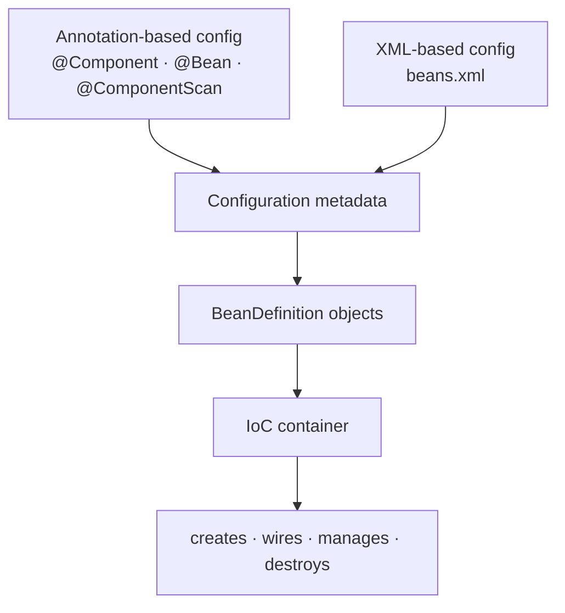
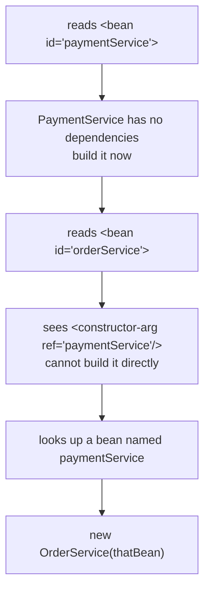

Every part so far has told the container what to manage using annotations — `@Component` on the class, `@Configuration` and `@ComponentScan` on a config class, `@Bean` on a method. That is not the only way. Before annotations existed, the same container was driven entirely from an XML file, and this part takes the annotation project from part `05`, strips every annotation out of it, and rebuilds it in XML until it does exactly the same thing.

**This part is optional.** Nothing after it depends on it — the rest of the series is annotation-based, and Spring Boot is annotation-only. It is here for three reasons: legacy projects still run on it, hybrid projects mix it with annotations mid-migration, and seeing the wiring written out by hand is the clearest way to understand what the annotations were doing all along.

> If we want to understand Spring Framework properly, we have to understand the legacy things too. Only then will we understand how things worked before today and what changed. We will respect Spring Boot more if we understand what we had to do earlier — how many configurations had to be managed just to write a simple REST API, and how Spring Boot auto-configured all of it.

> Look, I am not a big fan of XML myself. I know XML-based configuration can get complicated. But still, let us know it once — that we can manage beans without writing any Java code, just by doing XML-based configuration.

> [!important] **Prerequisite.** This assumes the annotation-based parts are already done — `04` for dependency injection, `05` for the container and beans, `06` for scopes and initialization, `07` for the lifecycle. Every concept below is one of those concepts written in a different syntax; none of them is new.

| Measured on | |
|---|---|
| **Spring** | `spring-context` **7.0.7** |
| **Java** | **25** |
| **Maven** | **3.9.11** |

---

# The container does not care how you configure it

The IoC container's job has not changed since part `05`. It creates objects, injects their dependencies, manages them while they live, and destroys them at shutdown.

To do any of that it needs to be told things: which classes should become beans, what each bean should be called, whether it is a singleton or a prototype, which dependency goes where, which bean wins when two of the same type exist, and which method to run after creation and before destruction.

**All of that together is called configuration metadata.** It is the only thing the container wants from you.

> The IoC container only cares about one thing — configuration metadata. Just tell it where to get the configuration from. That is all it cares about.

And there are two places it can get it from.



**Both routes converge on the same thing — a set of `BeanDefinition` objects.** Part `05` established that a `BeanDefinition` is the recipe the container builds before it builds anything else: class, scope, laziness, dependencies, callback methods. XML and annotations are two notations for writing that recipe down. Past that point the container behaves identically, and everything parts `06` and `07` established about scopes, initialization order and the lifecycle holds without a single change.

| | Annotation-based | XML-based |
|---|---|---|
| Where the config lives | inside the Java classes | in a separate `.xml` file |
| Context class | `AnnotationConfigApplicationContext` | `ClassPathXmlApplicationContext` |
| What you hand it | `AppConfig.class` | `"beans.xml"` |
| How a class is found | component scanning, or a `@Bean` method | one `<bean>` tag per class, written by hand |
| Bean name | derived automatically | usually written by hand |
| Used in | everything modern, all of Spring Boot | legacy projects, and hybrids mid-migration |

> [!info] **A third style exists, and you have already used it.** The notes call `@Configuration` + `@Bean` classes **Java-based configuration** and count it separately from `@Component` scanning. All three — XML, annotations, Java config — are just different ways of handing Spring the same metadata.

---

# The project

**New Project → `XMLBasedConfigDemo`.** Maven, sample code deleted, group and artifact id left as they came. The `pom.xml` needs exactly one dependency, the same one every part since `04` has used — search `spring-context` on `mvnrepository.com`, take the version, paste it in, reload.

```xml
<dependencies>
    <dependency>
        <groupId>org.springframework</groupId>
        <artifactId>spring-context</artifactId>
        <version>7.0.7</version>
    </dependency>
</dependencies>
```

**Nothing else.** XML configuration is not an add-on library — `ClassPathXmlApplicationContext` and the XML parsing that backs it ship inside `spring-context` and `spring-beans`, which are already on the classpath.

---

# The annotation version, one last time

Start from where part `05` finished, so the two versions can be compared line by line. One ordinary service class:

```java
package in.strikes;

import org.springframework.stereotype.Component;

@Component
public class OrderService {

    public OrderService() {
        System.out.println("OrderService created");
    }

    public void placeOrder() {
        System.out.println("Order Placed");
    }
}
```

One configuration class that says where to scan:

```java
package in.strikes;

import org.springframework.context.annotation.ComponentScan;
import org.springframework.context.annotation.Configuration;

@Configuration
@ComponentScan
public class AppConfig {
}
```

And a `main` that starts the container and asks for the bean:

```java
ApplicationContext context = new AnnotationConfigApplicationContext(AppConfig.class);

OrderService orderService = context.getBean(OrderService.class);
orderService.placeOrder();
```

```
OrderService created
Order Placed
```

**Three things happened there.** `AppConfig.class` handed the container the metadata through reflection. `@ComponentScan` with no package argument told it to scan `in.strikes` — the package `AppConfig` itself sits in. It found `@Component` on `OrderService`, built a bean definition, and because beans are eager singletons by default, built the object immediately.

Now take all of it away.

**`@Component` comes off `OrderService`**, along with its import. It is now a plain Java class with a constructor and one method — nothing in it knows Spring exists.

**`AppConfig` is deleted outright.** There is no configuration class any more.

What is left is a `main` that wants to start a container and has nothing to feed it.

---

# `ClassPathXmlApplicationContext`

The old line named the style in the class name:

```java
ApplicationContext context = new AnnotationConfigApplicationContext(AppConfig.class);
```

> I myself told Spring Framework that whatever configuration I am going to give you is annotation-based — that this is a class which provides annotation-based configuration.

The XML style has its own class, and its name says where it looks:

```java
ApplicationContext context = new ClassPathXmlApplicationContext("beans.xml");
```

**Different reader, same container.** `AnnotationConfigApplicationContext` understands annotations; `ClassPathXmlApplicationContext` understands XML. Both produce bean definitions and hand them to the identical machinery underneath.

## Where the file goes, and why

The class name says **classpath**, so the file has to be somewhere on the classpath. In a Maven project that place already exists:

```
src
 └── main
     ├── java
     │   └── in
     │       └── strikes
     │           ├── Main.java
     │           └── OrderService.java
     └── resources
         └── beans.xml
```

**Anything under `src/main/resources` is copied into the classpath at build time.** Put `beans.xml` there and `ClassPathXmlApplicationContext("beans.xml")` finds it. The name is free — `beans.xml`, `applicationContext.xml` and `spring-context.xml` are all common in real projects, and the constructor argument just has to match.

Get the name wrong and the failure is immediate and specific:

```
BeanDefinitionStoreException: IOException parsing XML document from class path resource [bean.xml]
  caused by java.io.FileNotFoundException: class path resource [bean.xml] cannot be opened because it does not exist
```

## The header

An XML file needs a schema before it can hold any tags, and Spring's is four lines that nobody writes from memory.

```xml
<?xml version="1.0" encoding="UTF-8"?>
<beans xmlns="http://www.springframework.org/schema/beans"
       xmlns:xsi="http://www.w3.org/2001/XMLSchema-instance"
       xsi:schemaLocation="
           http://www.springframework.org/schema/beans
           http://www.springframework.org/schema/beans/spring-beans.xsd">

    <!-- bean definitions go here -->

</beans>
```

> We do not need to memorise this. Nobody writes this header themselves — everybody copies the schema. After that we know the basic `<bean>` tag, it has an id and a name, and that much is enough.

**Search `XML metadata for Spring 7` and the first result is the official Spring documentation**, which carries the block above with a `<!-- bean definitions here -->` placeholder in the middle. Copy it, paste it, and start writing beans where the placeholder was.

**The schema is what makes the file checkable.** It declares which tags are legal inside `<beans>` and which attributes each one takes, which is why an invented tag is caught before a single bean is built:

```
XmlBeanDefinitionStoreException: Line 6 in XML document from class path resource [bad.xml] is invalid
  caused by SAXParseException: cvc-complex-type.2.4.a: Invalid content was found starting with element
  '{"http://www.springframework.org/schema/beans":beanz}'. One of '{...:description, ...:import,
  ...:alias, ...:bean, ...:beans}' is expected.
```

> [!question]- **Deep dive — those `springframework.org` URLs are never fetched.** Worth opening if the header looks like it needs the internet to work.
> The `schemaLocation` value looks like a live URL, and it is a fair worry that a build would break on a plane. It does not, because Spring never resolves it over the network.
>
> Inside `spring-beans-7.0.7.jar` there is a file called `META-INF/spring.schemas`, and it is a plain mapping table:
>
> ```
> http\://www.springframework.org/schema/beans/spring-beans-2.0.xsd=org/springframework/beans/factory/xml/spring-beans.xsd
> http\://www.springframework.org/schema/beans/spring-beans-3.0.xsd=org/springframework/beans/factory/xml/spring-beans.xsd
> ...
> http\://www.springframework.org/schema/beans/spring-beans.xsd=org/springframework/beans/factory/xml/spring-beans.xsd
> https\://www.springframework.org/schema/beans/spring-beans.xsd=org/springframework/beans/factory/xml/spring-beans.xsd
> ```
>
> **Every version of the URL, and the unversioned one, all point at the same XSD file inside the jar.** Spring's `PluggableSchemaResolver` reads this table before the parser is allowed to go looking, so the URL is used purely as an identifier. `spring-context.jar` carries its own table for the `context` namespace, and every other Spring module does the same for its own.
>
> This is also why an unversioned `spring-beans.xsd` is the right thing to write: it resolves to whatever XSD ships in the jar you actually have, so the file cannot drift out of step with the library.

---

# The `<bean>` tag

One tag, two attributes, and the class is under management.

```xml
<bean id="orderService" class="in.strikes.OrderService"/>
```

| Attribute | Meaning |
|---|---|
| `id` | the name of the bean inside the container |
| `class` | the **fully qualified** class name whose object Spring should create |

**`class` needs the whole package path**, not just `OrderService` — Spring loads the class by name through reflection, exactly the way it did with `AppConfig.class`, and a bare class name is not enough to find it.

**`id` is any unique string you choose.** The convention is the class name in camel case, so `OrderService` becomes `orderService`, but `orderDemo` or `theOrderThing` would work just as well.

The tag has no content, so it closes itself. Written the long way with an opening and closing tag it means exactly the same thing, and the long form only becomes necessary later, when there are child tags to put inside it.

## This is the same thing `@Bean` was doing

Side by side, with the Java config version on the left of the mind and the XML on the right:

```java
@Configuration
public class AppConfig {

    @Bean
    public OrderService getOrderServiceBean() {
        return new OrderService();
    }
}
```

```xml
<bean id="orderService" class="in.strikes.OrderService"/>
```

| | `@Bean` method | `<bean>` tag |
|---|---|---|
| What marks it | the `@Bean` annotation | the `<bean>` tag |
| Bean name | the **method name** — `getOrderServiceBean` | the **`id`** — `orderService` |
| Class | inferred from the return type | written out in `class` |
| Who calls the constructor | your own `new` inside the method | Spring, by reflection |

**The one real difference is who writes the `new`.** In a `@Bean` method you construct the object yourself and Spring takes what you return. In XML you never touch the object — you name the class and Spring instantiates it.

## The bean is built before you ask for it

Add a constructor that announces itself:

```java
public OrderService() {
    System.out.println("OrderService created");
}
```

and then start the container without asking for anything:

```java
System.out.println("---- before container");
ClassPathXmlApplicationContext context = new ClassPathXmlApplicationContext("beans.xml");
System.out.println("---- container up");
```

```
---- before container
OrderService created
---- container up
```

**Eager singleton, unchanged.** Part `06` established that beans are singleton and eagerly initialized by default; the container builds them as it comes up, not when they are first requested. Configuring in XML changes nothing about that — the constructor ran between the two markers, before any `getBean` call existed.

Everything else from `06` and `07` holds the same way. The container reads the configuration, builds bean definitions, instantiates, wires dependencies, calls the Aware interfaces, runs the initialization callbacks, hands the bean over, and destroys it at shutdown.

> Every step of the bean lifecycle stays the same. There is no difference whether you build it from annotations or from XML.

---

# Three ways to get a bean out

With the container up and one `OrderService` bean inside it, there are three shapes of `getBean`, and they are not interchangeable.

## By id

```java
OrderService orderService = (OrderService) context.getBean("orderService");
```

**`getBean(String)` is declared to return `Object`**, so the cast is on you. It works, and it is the shape most legacy code uses.

Ask for an id that is not there and the failure is the same one part `05` produced from the annotation side:

```
NoSuchBeanDefinitionException: No bean named 'orderServiceX' available
```

## By type

```java
OrderService orderService = context.getBean(OrderService.class);
```

**No cast, because the type is the argument.** This is the shape every part before this one used. It carries one condition: there must be exactly one bean of that type in the container.

## By id and type

```java
OrderService orderService = context.getBean("orderService", OrderService.class);
```

**This is the one to use.** It names the bean, so ambiguity cannot arise, and it carries the type, so there is no cast.

> This is the best way to get our beans. Here I do not have to do type casting, which I had to do with the plain id, and there is no risk that if I only pass the type and multiple beans of the same kind exist then an error comes.

All three return the same object when only one bean exists — measured, `a == b && b == c` is `true`.

| Form | Cast needed | Breaks when |
|---|---|---|
| `getBean("orderService")` | **yes** | the id does not exist |
| `getBean(OrderService.class)` | no | **two or more** beans share the type |
| `getBean("orderService", OrderService.class)` | no | the id does not exist |

## Two beans of one class

Nothing stops the same class appearing twice under different ids:

```xml
<bean id="orderService"  class="in.strikes.OrderService"/>
<bean id="orderService2" class="in.strikes.OrderService"/>
```

**This is legal, and it is the same thing two `@Bean` methods returning the same type did in part `05`.** The container builds two separate `OrderService` objects and manages both — which does not break the singleton rule, because singleton means one object per bean **definition**, not one per class.

Both constructors run at startup, even though only one of the beans will ever be used:

```
OrderService created
OrderService created
```

And now the by-type lookup has nothing to go on:

```
NoUniqueBeanDefinitionException: No qualifying bean of type 'in.strikes.OrderService' available:
expected single matching bean but found 2: orderService,orderService2
```

**Naming the bean fixes it**, which is precisely why the id-and-type form is the one to reach for:

```java
OrderService orderService = context.getBean("orderService", OrderService.class);
```

---

# `id`, `name`, and aliases

## Is `id` mandatory?

No. This parses and runs:

```xml
<bean class="in.strikes.OrderService"/>
```

but the bean cannot be found by the name you would expect:

```
getBean("orderService") -> NoSuchBeanDefinitionException
```

**This is the practical difference from `@Component`**, and it is worth being precise about. With `@Component` on `OrderService`, Spring derives the name `orderService` from the class name. With `@Bean`, the name comes from the method name. In XML there is no convention to derive from — Spring will not invent `orderService` for you.

What it does instead is generate a name of its own:

```
definition names -> [in.strikes.OrderService#0]
aliases of that bean -> [in.strikes.OrderService]
```

**The generated name is the fully qualified class name with a `#0` counter**, and the first anonymous bean of a class also gets the plain class name as an alias. Both are real and both work — `getBean("in.strikes.OrderService")` returns the object. A second anonymous bean of the same class becomes `in.strikes.OrderService#1` and gets no alias, since the plain name is taken.

So the honest statement is: **an id-less bean has a name, just not one you would ever want to type.** Give beans an id.

> `id` is not mandatory, but putting it in is always beneficial. We never get an error that way.

By type it still works, of course, as long as there is only one of them:

```java
OrderService orderService = context.getBean(OrderService.class);
```

## Can two beans share an id?

No, and the container refuses to start rather than guess:

```xml
<bean id="orderService" class="in.strikes.OrderService"/>
<bean id="orderService" class="in.strikes.OrderService"/>
```

```
BeanDefinitionParsingException: Configuration problem: Bean name 'orderService' is already used in this <beans> element
Offending resource: class path resource [beans.xml]
```

**The IDE flags it before you run**, with a `Duplicate bean name` warning, and the runtime failure comes from `FailFastProblemReporter` — Spring's parser reports configuration problems by throwing on the first one rather than collecting them.

## The `name` attribute

There is a second attribute that also names a bean:

```xml
<bean name="orderServiceBean" class="in.strikes.OrderService"/>
```

and it is fetched exactly the same way:

```java
OrderService orderService = context.getBean("orderServiceBean", OrderService.class);
```

So what separates them? **`id` gives one name. `name` can give several.**

```xml
<bean id="orderService"
      name="orderServiceBean, orderServiceBean2; orderServiceBean3"
      class="in.strikes.OrderService"/>
```

All four names now reach the same object — measured by identity hash, every one of them returns `1059063940`:

```
aliases -> [orderServiceBean, orderServiceBean3, orderServiceBean2]
orderService      -> 1059063940
orderServiceBean  -> 1059063940
orderServiceBean2 -> 1059063940
orderServiceBean3 -> 1059063940
```

**The separator is loose** — comma, semicolon and plain space all work, and can be mixed in one attribute as they are above.

The extra names are called **aliases**: one bean, several handles.

> If you want to call one bean by multiple names, if you want to keep different aliases for it, we can do that.

**Uniqueness is enforced across both attributes, not within each.** Two beans both declaring `name="orderService"` fail with the identical `Bean name 'orderService' is already used in this <beans> element` — a name collides with a name, an id, or an alias, whichever it meets first.

## The `<alias>` tag

There is a third way, useful when the bean is already defined and you do not want to touch its definition:

```xml
<bean id="orderService" class="in.strikes.OrderService"/>

<alias name="orderService" alias="theOrderService"/>
```

**`<alias>` sits outside the bean it renames**, which is what makes it useful in a file you did not write or do not want to edit — a module ships `beans.xml` with its own names, and your own file adds the names your code prefers.

| | `id` | `name` | `<alias>` |
|---|---|---|---|
| How many names | exactly one | one or more, separated by `,` `;` or space | one per tag |
| Where written | on the `<bean>` tag | on the `<bean>` tag | its own tag, outside the bean |
| Must be unique | yes, across all names in the container | yes, across all names in the container | yes |
| Typical use | the bean's real name | extra handles for the same bean | renaming a bean defined elsewhere |

---

# Dependency injection

This is the part everything so far was building towards. Take the two classes from part `04`:

```java
package in.strikes;

public class PaymentService {

    public void pay() {
        System.out.println("Payment Done");
    }
}
```

```java
package in.strikes;

public class OrderService {

    private PaymentService paymentService;

    public OrderService(PaymentService paymentService) {
        System.out.println("OrderService created");
        this.paymentService = paymentService;
    }

    public void placeOrder() {
        paymentService.pay();
        System.out.println("Order Placed");
    }
}
```

**`OrderService` depends on `PaymentService` and does not construct it** — it expects to be handed one. In the annotation world both classes carry `@Component`, and with a single constructor `@Autowired` is not even needed. Here neither class carries anything, so the XML has to say it.

## Only two of the three injection styles survive

Part `04` established three: constructor, setter, and field. **XML can do the first two and not the third.**

> The reason is simple — the field is private. We cannot access it through `beans.xml`.

The rule falls straight out of how XML injection works. Spring is either calling a constructor or calling a public setter; it has no third mechanism from XML. Field injection needs reflection to reach into a private field, and that is driven by the `@Autowired` annotation on the field itself — which is exactly what an XML-configured class does not have.

---

# Constructor injection

## Injecting another bean — `ref`

```xml
<bean id="paymentService" class="in.strikes.PaymentService"/>

<bean id="orderService" class="in.strikes.OrderService">
    <constructor-arg ref="paymentService"/>
</bean>
```

```
Payment Done
Order Placed
```

**`<constructor-arg>` goes inside the bean it is configuring**, which is why the self-closing form had to become an opening and closing pair. And `ref` holds the **id of another bean**, not a class name.

| Tag / attribute | Meaning |
|---|---|
| `<constructor-arg>` | one argument to pass to the constructor |
| `ref="..."` | the argument is **another bean**, named by its id |
| `value="..."` | the argument is a **plain value** — a string, a number, a boolean |

## What the container actually does with that



`PaymentService` is easy — it depends on nothing, so it is built as soon as its definition is read. `OrderService` cannot be built until something exists to hand its constructor, so the container resolves the `ref` first, finds the already-built `paymentService` bean, and passes it in.

**That is the whole of autowiring, written out by hand.** In the annotation version Spring worked out the reference from the parameter's type; here you name it.

## Injecting a plain value — `value`

Give `PaymentService` a constructor that wants data rather than a collaborator:

```java
package in.strikes;

public class PaymentService {

    private String type;
    private int retryCount;

    public PaymentService(String type, int retryCount) {
        this.type = type;
        this.retryCount = retryCount;
    }

    public void pay() {
        System.out.println("Payment Done, type of payment is " + type
                + " with " + retryCount + " counts");
    }
}
```

Two arguments, two tags, matched in the order they appear:

```xml
<bean id="paymentService" class="in.strikes.PaymentService">
    <constructor-arg value="UPI"/>
    <constructor-arg value="3"/>
</bean>
```

```
Payment Done, type of payment is UPI with 3 counts
Order Placed
```

**`value="3"` is the string `3` in the file** and arrives as an `int` in the constructor — Spring converts it to the declared parameter type on the way in. That conversion is also where the ordering mistake surfaces:

```xml
<constructor-arg value="3"/>
<constructor-arg value="UPI"/>
```

```
UnsatisfiedDependencyException: Error creating bean with name 'paymentService':
Unsatisfied dependency expressed through constructor parameter 1:
Could not convert argument value of type [java.lang.String] to required type [int]:
Failed to convert value of type 'java.lang.String' to required type 'int'; For input string: "UPI"
```

> [!info] **The IDE will warn about the `String` and it is wrong.** With a `String` parameter in the constructor, IntelliJ shows `Could not autowire. No beans of 'String' type found` on the class. It is an inspection, not a compiler or Spring error — the IDE is not reading `beans.xml` closely enough to see the value being supplied. The code runs.

## Naming the arguments instead of counting them

Positional matching stops being readable the moment a constructor has more than two parameters. There are three ways out.

**By index**, which makes the order explicit and lets the tags be written in any order:

```xml
<bean id="paymentService" class="in.strikes.PaymentService">
    <constructor-arg index="1" value="3"/>
    <constructor-arg index="0" value="UPI"/>
</bean>
```

**By type**, which is enough when the parameter types differ:

```xml
<bean id="paymentService" class="in.strikes.PaymentService">
    <constructor-arg type="int" value="3"/>
    <constructor-arg type="java.lang.String" value="UPI"/>
</bean>
```

**By name**, which reads best of all:

```xml
<bean id="paymentService" class="in.strikes.PaymentService">
    <constructor-arg name="retryCount" value="3"/>
    <constructor-arg name="type" value="UPI"/>
</bean>
```

| Form | Written as | Reorderable | Needs |
|---|---|---|---|
| by order | `<constructor-arg value="UPI"/>` | **no** | nothing |
| by index | `<constructor-arg index="0" value="UPI"/>` | yes | nothing |
| by type | `<constructor-arg type="java.lang.String" value="UPI"/>` | yes | the parameter types to differ |
| by name | `<constructor-arg name="type" value="UPI"/>` | yes | **`-parameters` at compile time** |

> [!warning] **`name` is silently ignored unless the class was compiled with `-parameters`.** Java does not put parameter names into a `.class` file by default, and Spring 6.1 removed the old fallback that dug them out of debug information. With `spring-context` 7.0.7 there is exactly one source of parameter names — the `MethodParameters` attribute that `javac -parameters` writes.
>
> **A plain Maven build does not pass that flag.** Measured on the lecture's own `pom.xml` with Maven 3.9.11: `javap -v` shows no `MethodParameters` attribute, and the by-name example above fails with `Failed to convert value of type 'java.lang.String' to required type 'int'` — because the `name` attributes were dropped and the two arguments went in by position.
>
> **Silently is the dangerous word.** With the flag missing, Spring does not complain about the names, it just stops using them. A file with completely fictional names —
>
> ```xml
> <constructor-arg name="thisNameDoesNotExist" value="UPI"/>
> <constructor-arg name="alsoNonsense" value="3"/>
> ```
>
> — runs perfectly, prints `Payment Done, type of payment is UPI with 3 counts`, and looks like proof the names are working. They are not; the order is doing all the work, and reordering the two lines breaks it.
>
> **The fix is one property:**
>
> ```xml
> <properties>
>     <maven.compiler.parameters>true</maven.compiler.parameters>
> </properties>
> ```
>
> With that in place the names are real: the reordered example works, and the fictional names now fail loudly with `Ambiguous argument values for parameter of type [java.lang.String] - did you specify the correct bean references as arguments?`. Spring Boot's parent pom sets this property for you, which is why the problem is invisible in a Boot project and appears in a bare `spring-context` one.
>
> **`index` needs nothing and never lies.** In a project you do not control the compiler flags for, prefer it.

---

# Setter injection

Swap the constructor for a setter:

```java
package in.strikes;

public class OrderService {

    private PaymentService paymentService;

    public OrderService() {
        System.out.println("OrderService created");
    }

    public void setPaymentService(PaymentService paymentService) {
        System.out.println("setPaymentService called");
        this.paymentService = paymentService;
    }

    public void placeOrder() {
        paymentService.pay();
        System.out.println("Order Placed");
    }
}
```

**No `@Autowired` on the setter** — the annotation is what tells Spring to call a setter in the annotation world, and this class has no annotations. Calling it is the container's job, and the XML has to ask for it.

The tag is `<property>`:

```xml
<bean id="paymentService" class="in.strikes.PaymentService"/>

<bean id="orderService" class="in.strikes.OrderService">
    <property name="paymentService" ref="paymentService"/>
</bean>
```

```
PaymentService created
OrderService created
setPaymentService called
Payment Done
Order Placed
```

**The output shows the shape of setter injection**, exactly as part `04` described it: the object is constructed first with nothing in it, and the dependency arrives afterwards through the setter.

## The two attributes are not the same thing

The `ref` is familiar — it names another bean. The `name` is the one worth understanding, because **it is not the setter's name and it is not the field's name; it is the property name**, and Spring turns it into a setter name by convention.

| Attribute | Points at | Value here |
|---|---|---|
| `name` | the **property** on this class | `paymentService` → Spring calls `setPaymentService(...)` |
| `ref` | another **bean** in the container | the bean with id `paymentService` |

Rename the setter and the proof is immediate:

```java
public void setPaymentServiceBean(PaymentService paymentService) {
    System.out.println("setPaymentServiceBean called");
    this.paymentService = paymentService;
}
```

```xml
<property name="paymentServiceBean" ref="paymentService"/>
```

```
setPaymentServiceBean called
Payment Done
Order Placed
```

**Spring prefixes `set` and capitalises the first letter.** The property `paymentServiceBean` means the method `setPaymentServiceBean`, and nothing about the private field's name enters into it.

Leave the old property name behind after the rename and it fails at startup:

```
BeanCreationException: Invalid property 'paymentService' of bean class [in.strikes.OrderService]:
Bean property 'paymentService' is not writable or has an invalid setter method.
```

Misspell it and Spring guesses what you meant:

```
Bean property 'paymentServiceX' is not writable or has an invalid setter method.
Did you mean 'paymentService'?
```

> [!info] **The first letter's case does not matter.** `name="PaymentServiceBean"` with a capital `P` resolves to the same `setPaymentServiceBean` and works — Spring follows the JavaBeans decapitalisation rules rather than matching the string literally. Lower case is the convention; both parse.

## `value` and `ref` mean different things everywhere

The distinction is the same in `<property>` as it was in `<constructor-arg>`, and it is the single most common thing to get wrong in an XML file.

| | Used for | Example |
|---|---|---|
| `value` | a **plain value** — String, int, boolean | `<property name="type" value="UPI"/>` |
| `ref` | **another bean** in the container, named by id | `<property name="paymentService" ref="paymentService"/>` |

---

# Two implementations of one interface

This is the problem `@Primary` and `@Qualifier` existed to solve in part `05`. Turn `PaymentService` into an interface and give it two implementations:

```java
package in.strikes.payment;

public interface PaymentService {
    void pay();
}
```

```java
package in.strikes.payment;

public class UPIPaymentService implements PaymentService {

    @Override
    public void pay() {
        System.out.println("Paying via UPI");
    }
}
```

```java
package in.strikes.payment;

public class CardPaymentService implements PaymentService {

    @Override
    public void pay() {
        System.out.println("Paying via Card");
    }
}
```

`OrderService` depends on the interface and takes it through the constructor, which is the style to prefer:

```java
package in.strikes;

import in.strikes.payment.PaymentService;

public class OrderService {

    private final PaymentService paymentService;

    public OrderService(PaymentService paymentService) {
        this.paymentService = paymentService;
    }

    public void placeOrder() {
        paymentService.pay();
        System.out.println("Order Placed");
    }
}
```

**In the annotation version this is where the container gets stuck.** Both implementations carry `@Component`, `OrderService` asks for a `PaymentService`, and two candidates match — so you reach for `@Primary` on one of them, or `@Qualifier` on both plus a matching `@Qualifier` at the injection point.

## In XML the ambiguity never arises

```xml
<bean id="upiPaymentService"  class="in.strikes.payment.UPIPaymentService"/>
<bean id="cardPaymentService" class="in.strikes.payment.CardPaymentService"/>

<bean id="orderService" class="in.strikes.OrderService">
    <constructor-arg ref="cardPaymentService"/>
</bean>
```

```
Paying via Card
Order Placed
```

Change the `ref` to `upiPaymentService` and the output changes with it:

```
Paying via UPI
Order Placed
```

**Because `ref` names a bean rather than a type, there is nothing to be ambiguous about.** This is the genuine advantage XML has over annotations: the wiring is written down, so the container is never choosing.

> Here there is no question of confusion arising. That confusion comes in annotation configuration.

## `primary="true"`

The XML equivalent of `@Primary` exists, as an attribute rather than a tag:

```xml
<bean id="upiPaymentService" class="in.strikes.payment.UPIPaymentService" primary="true"/>
<bean id="cardPaymentService" class="in.strikes.payment.CardPaymentService"/>
```

It only matters when something is choosing **by type** — with an explicit `ref` in place, `primary` is dead weight.

> But I do not need it at all, because here I have used a ref.

## `autowire-candidate="false"`

The other side of the same coin — instead of promoting one bean, remove the other from consideration:

```xml
<bean id="upiPaymentService"  class="in.strikes.payment.UPIPaymentService"/>
<bean id="cardPaymentService" class="in.strikes.payment.CardPaymentService"
      autowire-candidate="false"/>
```

**`cardPaymentService` is still a bean** — it is built, it is managed, and `getBean("cardPaymentService")` returns it. It is simply invisible to by-type autowiring, so a `PaymentService` request now resolves to the UPI one without ambiguity.

| Approach | What it does | When it earns its place |
|---|---|---|
| **`ref="..."`** | names the exact bean | almost always — the clearest thing in XML |
| **`primary="true"`** | one bean wins by-type ties | when something is resolving by type and one default is obviously right |
| **`autowire-candidate="false"`** | one bean opts out of by-type resolution | when a bean must exist but must never be picked automatically |

---

# XML autowiring

XML can also stop naming dependencies and let Spring find them — the same idea `@Autowired` implements, expressed as an attribute on the bean.

Without it, every dependency is spelled out:

```xml
<bean id="paymentService" class="in.strikes.PaymentService"/>

<bean id="orderService" class="in.strikes.OrderService">
    <property name="paymentService" ref="paymentService"/>
</bean>
```

With it, the `<property>` disappears:

```xml
<bean id="paymentService" class="in.strikes.PaymentService"/>

<bean id="orderService" class="in.strikes.OrderService" autowire="byName"/>
```

There are three modes, and they differ in what Spring matches on.

| Mode | Matches | Works when |
|---|---|---|
| `byName` | the **property name** against a **bean name** | bean names line up with property names |
| `byType` | the **property type** against a **bean type** | exactly one bean of that type exists |
| `constructor` | **constructor parameter types** against bean types | the constructor's dependencies resolve unambiguously |

**`byName`** takes the setter `setPaymentService`, derives the property name `paymentService`, and looks for a bean with that exact name.

**`byType`** ignores names entirely — the bean can be called `abc` and it will still be found, as long as it is the only `PaymentService`. Two candidates and it fails the way every by-type lookup fails:

```
NoUniqueBeanDefinitionException: No qualifying bean of type 'in.strikes.payment.PaymentService' available:
expected single matching bean but found 2: upiPaymentService,cardPaymentService
```

**`constructor`** is `byType` applied to constructor parameters instead of setters. Marking one candidate `primary="true"` resolves it, exactly as it would for `byType`.

> [!warning] **`byName` fails silently when nothing matches.** Measured: with `autowire="byName"` and no bean named `paymentService` in the file, the container starts cleanly, reports no problem, and leaves the field `null`. The failure arrives later, somewhere else entirely:
>
> ```
> NullPointerException: Cannot invoke "in.strikes.payment.PaymentService.pay()"
> because "this.paymentService" is null
> ```
>
> This is the opposite of how `@Autowired` behaves — a required `@Autowired` dependency that cannot be satisfied stops the container at startup. XML autowiring by name treats a miss as nothing to do. **Explicit `ref` cannot fail this way**, which is one more reason to prefer it.

---

# Bean scopes

Everything so far has been singleton, because that is the default. A new class to demonstrate the other one:

```java
package in.strikes;

public class UserService {

    public UserService() {
        System.out.println("UserService created");
    }
}
```

```xml
<bean id="userService" class="in.strikes.UserService"/>
```

Start the container and the constructor runs immediately — eager singleton, as always. **One attribute changes that:**

```xml
<bean id="userService" class="in.strikes.UserService" scope="prototype"/>
```

```
-- container up (nothing built yet)
UserService created
UserService created
same object -> false
```

**Nothing is built at startup, and every `getBean` call builds a new one.** This is `@Scope("prototype")` written as an attribute, with the same behaviour part `06` established: prototype beans are created on request, not at container startup, and never reused.

## A singleton holding a prototype

```xml
<bean id="paymentService" class="in.strikes.PaymentService" scope="prototype"/>

<bean id="orderService" class="in.strikes.OrderService" scope="singleton">
    <constructor-arg ref="paymentService"/>
</bean>
```

```
PaymentService created
OrderService created
-- container up
Payment Done by 1935972447
Order Placed
Payment Done by 1935972447
Order Placed
```

**The prototype was created once, at the moment the singleton was created, and that one instance is what the singleton holds forever.** The identity hash is the same on both calls.

This is the trap part `06` covered in detail: a prototype injected into a singleton stops behaving like a prototype, because the injection happens once. It is also why one prototype bean **is** built during startup here even though prototypes are supposed to be lazy — an eager singleton needed one to be constructed.

---

# Lifecycle callbacks

Part `07` walked the full lifecycle and named three ways to hook the initialization phase and three ways to hook destruction. **XML has its own pair, and they need no annotations and no interfaces at all** — just two ordinary methods with names of your choosing:

```java
package in.strikes;

public class UserService {

    public UserService() {
        System.out.println("UserService created");
    }

    public void init() {
        System.out.println("Post construct phase");
    }

    public void cleanup() {
        System.out.println("Pre Destroy phase");
    }
}
```

```xml
<bean id="userService" class="in.strikes.UserService"
      init-method="init"
      destroy-method="cleanup"/>
```

| Attribute | Runs |
|---|---|
| `init-method` | after the object is created and its dependencies are injected |
| `destroy-method` | just before the bean is destroyed |

**These are the XML form of `@Bean(initMethod = ..., destroyMethod = ...)` from part `07`** — the same hook, declared outside the class instead of on the method that produces it. The method names carry no meaning to Spring; `init` and `cleanup` are conventions, nothing more.

## Getting the destroy method to run at all

```
UserService created
Post construct phase
-- container up
same object -> true
-- closing
Pre Destroy phase
```

**The last line only appears because the container was closed.** Without a `close()`, the JVM exits and the destruction phase never happens — exactly as part `07` established.

And closing runs into the same wall part `07` hit:

```java
ApplicationContext context = new ClassPathXmlApplicationContext("beans.xml");
context.close();
```

```
error: cannot find symbol
        context.close();
               ^
  symbol:   method close()
  location: variable context of type ApplicationContext
```

**`ApplicationContext` has no `close()`.** Declare the variable as the concrete class, or as `ConfigurableApplicationContext`, and the method is there:

```java
ClassPathXmlApplicationContext context = new ClassPathXmlApplicationContext("beans.xml");
...
context.close();
```

**Better still, let try-with-resources do it**, since the context is `AutoCloseable`:

```java
try (ClassPathXmlApplicationContext context = new ClassPathXmlApplicationContext("beans.xml")) {
    UserService user = context.getBean("userService", UserService.class);
}
```

## Prototype beans still do not get destroyed

```xml
<bean id="userService" class="in.strikes.UserService"
      init-method="init" destroy-method="cleanup" scope="prototype"/>
```

```
-- container up (nothing built yet)
UserService created
Post construct phase
UserService created
Post construct phase
-- closing
-- closed; no cleanup ran for the prototypes
```

**`init-method` runs for every prototype instance. `destroy-method` never runs for any of them.** The rule from part `07` is untouched by the change of syntax: the container builds a prototype, initializes it, hands it over, and forgets it. Nothing is tracked, so nothing can be destroyed, and cleaning up a prototype's resources is the caller's problem.

## Where `init-method` sits among the others

Nothing stops a class from using several hooks at once, and the ordering is worth pinning down. Measured on one bean carrying every mechanism, with `<context:annotation-config/>` in the file so the annotations are processed:

```
1  constructor
2  BeanNameAware.setBeanName -> cartService
3  @PostConstruct
4  InitializingBean.afterPropertiesSet
5  XML init-method (start)
6  using the bean
7  @PreDestroy
8  DisposableBean.destroy
9  XML destroy-method (stop)
```

**This is exactly the order part `07` measured**, with `init-method` and `destroy-method` landing in the slots `@Bean(initMethod)` and `@Bean(destroyMethod)` occupied there — last on the way in, last on the way out. Configuring in XML did not move anything.

---

# Collections

Start with the simplest case — a bean that needs one plain value at construction time.

```java
package in.strikes;

public class UserService {

    private String username;

    public UserService(String username) {
        this.username = username;
    }

    public String getUsername() {
        return username;
    }
}
```

```xml
<bean id="userService" class="in.strikes.UserService">
    <constructor-arg value="Aditya"/>
</bean>
```

```java
UserService user = context.getBean("userService", UserService.class);
System.out.println(user.getUsername());
```

```
Aditya
```

**Nothing new — `value` puts a literal into a constructor parameter**, which is the same mechanism the `type` and `retryCount` example used. The interesting question is what happens when the parameter stops being a single value.

```java
private List<String> usernames;

public UserService(List<String> usernames) {
    this.usernames = usernames;
}

public List<String> getUsernames() {
    return usernames;
}
```

**`value="Aditya"` cannot carry a whole list**, so the attribute is replaced by a child tag:

```xml
<bean id="userService" class="in.strikes.UserService">
    <constructor-arg name="usernames">
        <list>
            <value>Aditya</value>
            <value>Rohit</value>
            <value>Rohan</value>
        </list>
    </constructor-arg>
</bean>
```

```
[Aditya, Rohit, Rohan]
```

**The list prints as a list because `List` implements `toString`** — nothing in the XML did that.

> [!info] **Widen the getter's return type too.** Changing the field from `String` to `List<String>` and leaving `public String getUsernames()` behind is a compile error, not a Spring problem — the getter has to become `public List<String> getUsernames()`.

A constructor or setter that wants a `Set` or a `Map` is fed the same way — Java has collections, so there has to be a notation for each of them.

```java
package in.strikes;

import java.util.*;

public class UserService {

    private List<String> usernames;
    private Set<String> roles;
    private Map<String, Integer> scores;
    private Properties settings;

    public UserService(List<String> usernames) {
        this.usernames = usernames;
    }

    public void setRoles(Set<String> roles)              { this.roles = roles; }
    public void setScores(Map<String, Integer> scores)   { this.scores = scores; }
    public void setSettings(Properties settings)         { this.settings = settings; }
}
```

```xml
<bean id="userService" class="in.strikes.UserService">

    <constructor-arg>
        <list>
            <value>Aditya</value>
            <value>Rohit</value>
            <value>Rohan</value>
        </list>
    </constructor-arg>

    <property name="roles">
        <set>
            <value>admin</value>
            <value>user</value>
            <value>admin</value>
        </set>
    </property>

    <property name="scores">
        <map>
            <entry key="Aditya" value="10"/>
            <entry key="Rohit"  value="20"/>
        </map>
    </property>

    <property name="settings">
        <props>
            <prop key="retry">3</prop>
            <prop key="timeout">5000</prop>
        </props>
    </property>

</bean>
```

```
usernames -> [Aditya, Rohit, Rohan]  (java.util.ArrayList)
roles     -> [admin, user]  (java.util.LinkedHashSet)
scores    -> {Aditya=10, Rohit=20}  (java.util.LinkedHashMap)
settings  -> {retry=3, timeout=5000}
```

**The `value` attribute is gone at the top level and the collection tag takes its place**, because a whole list cannot be written as one attribute string. The child tag is what carries the values.

| Tag | Java type built | Notes |
|---|---|---|
| `<list>` | `ArrayList` | order preserved |
| `<set>` | `LinkedHashSet` | duplicates dropped — three `<value>` entries, two survive |
| `<map>` | `LinkedHashMap` | `<entry key="..." value="..."/>`, one per pair |
| `<props>` | `Properties` | `<prop key="...">value</prop>`, value as text content |

**The map's `10` and `20` arrive as `Integer`**, not `String` — Spring reads the declared generic type `Map<String, Integer>` and converts each value on the way in, the same conversion that turned `value="3"` into an `int` earlier.

> [!example]- **A list does not have to be all one thing.** Open for the mixed-content form — bean references, literals and nulls in a single list.
> `<value>` is not the only child a collection tag accepts. `<ref>` puts a bean in, and `<null/>` puts a genuine `null` in:
>
> ```xml
> <bean id="razorpay" class="in.strikes.Gateway">
>     <constructor-arg value="Razorpay"/>
> </bean>
> <bean id="stripe" class="in.strikes.Gateway">
>     <constructor-arg value="Stripe"/>
> </bean>
>
> <bean id="paymentService" class="in.strikes.PaymentService">
>     <constructor-arg>
>         <list>
>             <ref bean="razorpay"/>
>             <ref bean="stripe"/>
>             <value>a plain string in the same list</value>
>             <null/>
>         </list>
>     </constructor-arg>
> </bean>
> ```
>
> ```
> gateways -> [Gateway(Razorpay), Gateway(Stripe), a plain string in the same list, null]
> ```
>
> **A list of `<ref>` entries is the useful case in practice** — collecting every implementation of an interface into one list, which the annotation world does by injecting a `List<PaymentService>` and letting Spring fill it. The mixed list above only works because the parameter was declared `List<Object>`; with `List<Gateway>` the string would fail conversion.

---

# Splitting the file across several XML files

An XML file that configures a real application gets long. The way out is to split it by concern and have one file pull the others in.

```
src/main/resources
 ├── appConfig.xml     the entry point, imports the rest
 ├── beans.xml         payment and order beans
 └── beans2.xml        user beans
```

**Every file needs the full header** — the schema declaration is per-file, not inherited.

```xml
<!-- beans.xml -->
<bean id="upiPaymentService" class="in.strikes.payment.UPIPaymentService"/>
```

```xml
<!-- beans2.xml -->
<bean id="userService" class="in.strikes.UserService"
      init-method="init" destroy-method="cleanup"/>
```

```xml
<!-- appConfig.xml -->
<import resource="beans.xml"/>
<import resource="beans2.xml"/>
```

and `main` loads only the entry point:

```java
ClassPathXmlApplicationContext context = new ClassPathXmlApplicationContext("appConfig.xml");
```

**One container, all the beans, split across three files.** `<import>` is a parse-time include — the imported definitions land in the same container as if they had been typed into one file, so a bean in `beans2.xml` can `ref` a bean in `beans.xml` without ceremony.

> [!info] **You can skip the importing file entirely.** `ClassPathXmlApplicationContext` takes a varargs list of locations, so `new ClassPathXmlApplicationContext("beans.xml", "beans2.xml")` builds the identical container. `<import>` is better when the file list belongs to the configuration rather than to the code that loads it.

---

# XML and annotations in the same container

The realistic case in a legacy codebase is not pure XML. It is a project part-way through a migration, with some beans still in XML and some already annotated.

> When you migrate a project, you do not convert all the XML configuration to annotations at once. You migrate slowly. So sometimes you will see a hybrid approach where there is XML-based configuration and annotation-based configuration together.

**It does not mean two containers.** There is one container, and it reads both kinds of metadata.

The XML side gains a second namespace and one tag:

```xml
<?xml version="1.0" encoding="UTF-8"?>
<beans xmlns="http://www.springframework.org/schema/beans"
       xmlns:context="http://www.springframework.org/schema/context"
       xmlns:xsi="http://www.w3.org/2001/XMLSchema-instance"
       xsi:schemaLocation="
           http://www.springframework.org/schema/beans
           http://www.springframework.org/schema/beans/spring-beans.xsd
           http://www.springframework.org/schema/context
           http://www.springframework.org/schema/context/spring-context.xsd">

    <context:component-scan base-package="in.strikes"/>

</beans>
```

**`<context:component-scan>` is `@ComponentScan` as a tag.** From here on the container scans `in.strikes`, finds every `@Component`, `@Service` and `@Repository`, and builds those beans alongside the ones written out in XML.

Measured with a `PaymentService` defined in XML and an `OrderService` carrying `@Component` and a constructor that needs one:

```
PaymentService created (from XML)
OrderService created (from @Component), given in.strikes.PaymentService@799f10e1
Payment Done
Order Placed
```

**The scanned bean was constructor-injected with the XML bean, and neither side knew the difference.** The container had one registry, both bean definitions were in it, and by-type resolution worked across the boundary.

> The IoC container does not care whether the configuration you used is XML-based or annotation-based. For it, everything is the same, because what it cares about is the bean definition and managing the object.

> [!question]- **Deep dive — what `<context:component-scan>` quietly registers besides your beans.** Worth opening if `@Autowired` in a hybrid file works and you want to know what turned it on.
> Printing the bean definition names after a hybrid context starts shows more than the two beans that were configured:
>
> ```
> definition names -> [paymentService, orderService,
>   org.springframework.context.annotation.internalConfigurationAnnotationProcessor,
>   org.springframework.context.annotation.internalAutowiredAnnotationProcessor,
>   org.springframework.context.annotation.internalCommonAnnotationProcessor,
>   org.springframework.context.event.internalEventListenerProcessor,
>   org.springframework.context.event.internalEventListenerFactory]
> ```
>
> **Those `internal*` beans are the `BeanPostProcessor`s part `07` described**, and they are what make annotations mean anything:
>
> - `internalAutowiredAnnotationProcessor` implements `@Autowired` and `@Value`
> - `internalCommonAnnotationProcessor` implements `@PostConstruct` and `@PreDestroy`
> - `internalConfigurationAnnotationProcessor` handles `@Configuration` classes and their `@Bean` methods
>
> A pure XML container has none of them, which is the real reason annotations do nothing in a plain XML file — not that Spring refuses to look, but that nothing is registered to act on them.
>
> **`<context:annotation-config/>` registers the same processors without scanning anything.** Use it when the beans are all declared in XML but you still want `@Autowired` and `@PostConstruct` honoured on those classes — which is exactly how the lifecycle ordering above was measured.

---

# Where XML actually stands

**The one advantage is that the Java stays clean.** Open a class in a fully XML-configured project and it is Java — no `@Component`, no `@Autowired`, no annotation you have to know the meaning of. All the wiring lives in one place and can be read as a whole.

**The disadvantages are the reasons it lost.** That one place becomes enormous, so it gets split, so the wiring is now spread across files that must be kept in step. Nothing is checked by the compiler — a renamed class or a renamed setter is a runtime failure, not a build failure. And every dependency has to be written out by hand, which is the work `@Autowired` exists to delete.

| | XML | Annotations |
|---|---|---|
| Where wiring lives | one file, readable as a whole | next to the code it wires |
| Java classes | plain, no framework imports | carry Spring annotations |
| Renaming safety | **runtime failure** | compiler catches most of it |
| Ambiguous types | impossible — `ref` names the bean | needs `@Primary` or `@Qualifier` |
| Verbosity | a tag per bean, a tag per dependency | one annotation, often none |
| Used by Spring Boot | no | **exclusively** |

**Everything after this part is annotation-based.** XML is worth having seen so that a legacy file does not look like a foreign language, and so that the annotations read as shorthand for something concrete rather than as magic.

> Do not think you have to memorise every single tag. Keep it simple — we just have to understand the concept, that the IoC container can work both ways.

---

# What this part established

| | |
|---|---|
| **The container's input** | **configuration metadata** — nothing else |
| Two notations | **annotation-based** and **XML-based** |
| Where they converge | both become **`BeanDefinition`** objects; past that point nothing differs |
| Context class | **`ClassPathXmlApplicationContext("beans.xml")`** |
| Where the file goes | **`src/main/resources`** — that is what lands on the classpath |
| Wrong file name | `class path resource [bean.xml] cannot be opened because it does not exist` |
| The header | copied, never written — the schema is what validates the file |
| Measured | the schema URLs resolve to an **XSD inside the jar** via `META-INF/spring.schemas`; no network |
| **`<bean>`** | `id` names it, `class` takes the **fully qualified** class name |
| Equivalent to | a **`@Bean` method**, with `id` playing the part of the method name |
| Default behaviour | **eager singleton**, exactly as with annotations |
| **Getting a bean** | by id → needs a cast · by type → needs uniqueness · **by id and type → neither** |
| Two beans, one class | legal; singleton means one object per **definition** |
| Then by type fails | `NoUniqueBeanDefinitionException ... found 2: orderService,orderService2` |
| **`id` omitted** | Spring generates **`in.strikes.OrderService#0`**, plus the plain class name as an alias for the first |
| So what breaks | `getBean("orderService")` — no convention derives that name in XML |
| Duplicate `id` or `name` | `Bean name 'orderService' is already used in this <beans> element` |
| **`name`** | one or more **aliases**, separated by `,` `;` or space |
| **`<alias>`** | renames a bean from **outside** its definition |
| **Injection styles** | constructor and setter only — **field injection is impossible** from XML |
| Why | XML can call a constructor or a public setter; a private field needs the annotation |
| **`<constructor-arg>`** | `ref` for another bean · `value` for a literal |
| Matching | by order · **`index`** · `type` · `name` |
| ⚠️ `name` | **silently ignored** without `javac -parameters`; args fall back to position |
| Fix | `<maven.compiler.parameters>true</maven.compiler.parameters>` — Spring Boot's parent sets it already |
| Safe alternative | **`index`** needs nothing and cannot lie |
| **`<property>`** | `name` is the **property**, not the field or the method |
| Convention | `paymentService` → **`setPaymentService`**; case of the first letter does not matter |
| Wrong name | `not writable or has an invalid setter method. Did you mean 'paymentService'?` |
| **Two implementations** | `ref` names the bean, so **ambiguity never arises** |
| Also available | **`primary="true"`** · **`autowire-candidate="false"`** |
| **`autowire=`** | `byName` · `byType` · `constructor` |
| ⚠️ `byName` with no match | starts clean, leaves the field **null**, throws `NullPointerException` at first use |
| **`scope="prototype"`** | nothing at startup, a new object per `getBean` |
| Singleton holding a prototype | **one instance, injected once** — same identity hash forever |
| **`init-method` / `destroy-method`** | plain methods, any names, no annotations and no interfaces |
| Measured order | slots in **after `@PostConstruct` and `afterPropertiesSet`**, exactly where `@Bean(initMethod)` did |
| To see destruction | **`context.close()`** — `ApplicationContext` still has no `close()` |
| Better | **try-with-resources**; the context is `AutoCloseable` |
| ⚠️ Prototype | `init-method` runs every time, **`destroy-method` never** |
| **Collections** | `<list>`→`ArrayList` · `<set>`→`LinkedHashSet` · `<map>`→`LinkedHashMap` · `<props>`→`Properties` |
| Inside them | `<value>`, `<ref bean="..."/>` and `<null/>` can be mixed |
| **Splitting files** | **`<import resource="..."/>`** in an entry-point file — one container, several files |
| Or | pass every location to the constructor as varargs |
| **Hybrid** | **`<context:component-scan base-package="..."/>`** — one container reads both |
| What it registers | the `internal*` **`BeanPostProcessor`s** that make `@Autowired` and `@PostConstruct` work |
| Without scanning | **`<context:annotation-config/>`** does the same for XML-declared beans |
| XML's one advantage | the Java stays free of framework annotations |
| Its cost | huge files, no compile-time checking, every dependency written by hand |
| Where it is used today | **legacy projects and migrations** — Spring Boot is annotation-only |
