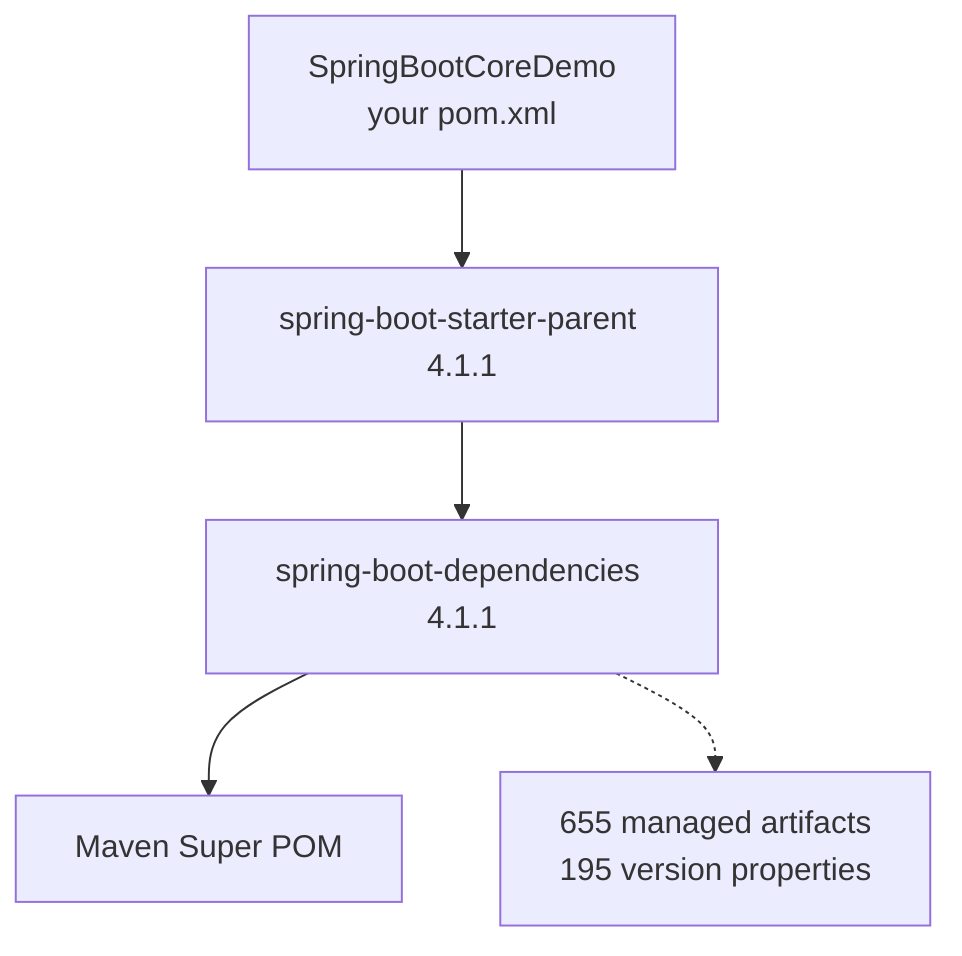
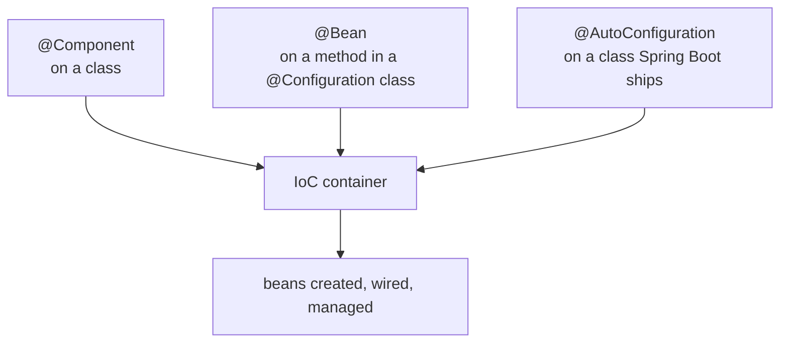
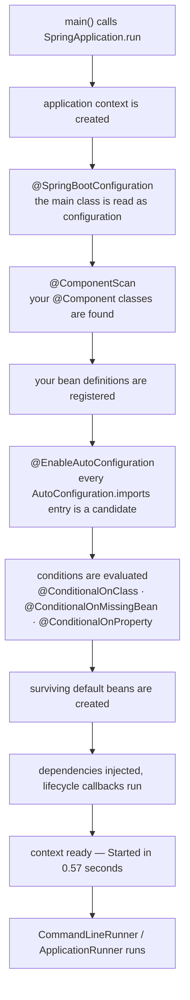

Parts `04` through `08` were all Spring Core: the IoC container, beans, injection, scopes, the lifecycle, and two ways of configuring it. Everything in them still applies. What changes now is how much of it you have to write yourself, because Spring Boot takes the startup work that every single project repeats and does it for you — and this part is about exactly how, right down to the file that makes it happen.

**Nothing underneath changes.** The container is the same container, `@Component` and `@Autowired` and `@Qualifier` and `@Primary` all mean what they meant, and the bean lifecycle from part `07` runs step for step. Spring Boot does not replace Spring Core; it uses it.

> If you understood Spring Core properly — the configuration, the bean lifecycle — then nothing different is going to happen in Spring Boot. Everything works the same way in the background. It is just the manual work we were doing in Spring Core that we will not have to do in Spring Boot.

| Measured on | |
|---|---|
| **Spring Boot** | **4.1.1** |
| **Spring Framework** | **7.0.9**, pulled in by the starter |
| **Tomcat** | **11.0.24**, embedded |
| **Java** | **25** |
| **Maven** | **3.9.11** |

---

# What Spring Core made us write every time

Start from the project that every part since `04` has used. Two classes, one depending on the other:

```java
package in.strikes;

import org.springframework.stereotype.Component;

@Component
public class PaymentService {

    public void pay() {
        System.out.println("Payment Done");
    }
}
```

```java
package in.strikes;

import org.springframework.stereotype.Component;

@Component
public class OrderService {

    private final PaymentService paymentService;

    public OrderService(PaymentService paymentService) {
        this.paymentService = paymentService;
    }

    public void placeOrder() {
        paymentService.pay();
        System.out.println("Order Placed");
    }
}
```

**No `@Autowired` on the constructor**, because there is only one constructor and Spring works it out — established in part `04`.

Then a configuration class whose only job is to exist:

```java
package in.strikes;

import org.springframework.context.annotation.ComponentScan;
import org.springframework.context.annotation.Configuration;

@Configuration
@ComponentScan(basePackages = "in.strikes")
public class AppConfig {
}
```

And a `main` that starts the container, hands it the configuration, pulls a bean out and calls a method:

```java
ApplicationContext context = new AnnotationConfigApplicationContext(AppConfig.class);

OrderService orderService = context.getBean(OrderService.class);
orderService.placeOrder();
```

```
Payment Done
Order Placed
```

**Look at what was actually application logic there.** One line: `orderService.placeOrder()`. Everything else was setup, and every Spring project on earth writes the same setup.

| Step | Written by hand in Spring Core |
|---|---|
| Start the container | `new AnnotationConfigApplicationContext(...)` |
| Give it a configuration class | `AppConfig` with `@Configuration` |
| Tell it where to scan | `@ComponentScan(basePackages = "in.strikes")` |
| Get the first bean out | `context.getBean(OrderService.class)` |
| Trigger the logic | `orderService.placeOrder()` |

And this is the easy case. A web application on Spring MVC adds a servlet container, a dispatcher servlet, view resolvers, message converters and a pile of XML or Java configuration on top — which is the comparison this series comes back to later, and the one that makes the point properly.

> Remember how much work we did in Spring Core. And if we leave Spring Core aside and build a web application using Spring MVC tomorrow, the manual work increases much more. But Spring Boot automates all those configurations too.

---

# Spring Boot is not a web framework

**The single most common misunderstanding**, and it is worth killing before anything else.

> Many people get confused that we can only build web applications with Spring Boot. Absolutely not. Spring Boot does not mean web application.

Spring Boot is a startup and configuration layer over Spring Framework. Web behaviour appears only when you add a web dependency, and this entire part is a terminal application with no server in it at all.

| Spring Boot can build | |
|---|---|
| console applications | this part |
| web applications and REST APIs | when a web starter is added |
| database applications | when a data starter is added |
| batch jobs, microservices | same idea, different starters |

---

# Creating the project

There are two routes, and they end in the same place.

## Route 1 — a plain Maven project plus one dependency

Create an ordinary Maven project and put one dependency in the empty `pom.xml`:

```xml
<dependency>
    <groupId>org.springframework.boot</groupId>
    <artifactId>spring-boot-starter</artifactId>
    <version>4.1.1</version>
</dependency>
```

**Not `spring-context`.** That was the Spring Core dependency; this is the Spring Boot one, and `spring-context` arrives inside it.

## Route 2 — Spring Initializr

`start.spring.io`, the site part `02` used. Java, Maven, Spring Boot **4.1.1**, group `in.strikes`, artifact `SpringBootCoreDemo`, Jar, Java 25, and **no dependencies selected at all** — nothing web, nothing database. Generate, unzip, open.

**Even with nothing selected you get `spring-boot-starter`**, because it is the floor every Spring Boot project stands on. You also get `spring-boot-starter-test`, which matters only if you write tests.

> [!info] **The IDE may flag the version you pick.** Choosing an older release on `mvnrepository.com` can produce a `Vulnerability found in dependency` warning in IntelliJ, offering to move you to a newer one. It is a security advisory against that specific version, not a build error — on a learning project it can be dismissed, and on anything you deploy it should be taken seriously.

**Route 2 is the one to use**, and the rest of this part works in the generated project. It produces the correct structure, the parent, the plugin and a main class already written — and the parent is the piece worth understanding.

## What a starter actually is

> A starter is basically a group of many dependencies.

`spring-boot-starter` is not one library. It is a pom that pulls in others, which pull in others again — transitive dependencies, from part `03`:

```
spring-boot-starter
 ├── spring-boot-starter-logging
 │    ├── logback-classic  →  logback-core
 │    ├── log4j-to-slf4j   →  log4j-api
 │    └── jul-to-slf4j
 ├── spring-boot-autoconfigure
 │    └── spring-boot  →  spring-context, spring-aop, spring-beans, spring-expression
 ├── jakarta.annotation-api
 └── snakeyaml
```

**Measured on the classpath**, one declared dependency resolves to `spring-boot-4.1.1`, `spring-context-7.0.9`, `spring-aop`, `spring-beans`, `spring-expression`, `logback-classic-1.5.38`, `micrometer-observation`, `jakarta.annotation-api-3.0.0` and more. Adding those by hand — at mutually compatible versions — is exactly the work a starter deletes.

> [!info] **`jakarta.annotation-api` comes free here.** Part `07` had to add it by hand to make `@PostConstruct` work in a plain `spring-context` project. `spring-boot-starter` lists it as a direct dependency, which is why the annotation just works in every Spring Boot project.

---

# `spring-boot-starter-parent`

Look at the generated `pom.xml` and two things stand out. There is a `<parent>`, and the dependencies have **no `<version>`**:

```xml
<parent>
    <groupId>org.springframework.boot</groupId>
    <artifactId>spring-boot-starter-parent</artifactId>
    <version>4.1.1</version>
    <relativePath/>
</parent>

<dependencies>
    <dependency>
        <groupId>org.springframework.boot</groupId>
        <artifactId>spring-boot-starter</artifactId>
    </dependency>
</dependencies>
```

A hand-built Maven project has no parent, so every dependency there needs its own version. Here the version is missing on purpose.

## The problem it solves

Part `03` established that poms exist in a hierarchy and that anything not stated in a pom is inherited from its parent. The reason Spring Boot gives you a parent is version compatibility.

Imagine a real project: a web starter, a JDBC starter, Hibernate, Jackson, validation, security. Each has its own version, and **not every combination works**. Pick versions independently and you get to discover, at runtime, that one library needs a version of another that you did not install.

> If a single version mismatches, you have to go and search again which version works with which, download them at that version, and reload. This is very hectic work.

## What the parent does about it



**`spring-boot-dependencies` is a giant table of versions that are known to work together.** Measured on 4.1.1: **655 artifacts** under `<dependencyManagement>` and 195 version properties, and it declares no parent of its own, so the chain ends there at Maven's Super POM.

So when you write a dependency with no version, Maven asks the parent, and the parent already knows. Add `spring-boot-starter-webmvc` tomorrow and it resolves to the 4.1.1-compatible version without you looking anything up. The version you choose once — on the parent — decides every Spring Boot version in the project.

**`spring-boot-starter-parent` adds project defaults on top of that table:**

| It sets | To |
|---|---|
| `java.version` | `17`, overridden by the `<properties>` in your own pom |
| `maven.compiler.release` | `${java.version}` |
| `project.build.sourceEncoding` | `UTF-8` |
| resource filtering | `@...@` placeholders in `application.properties` |
| **compiler `<parameters>`** | **`true`** |

> [!info] **That last row is the flag part `08` warned about.** `<constructor-arg name="...">` in XML is silently ignored unless the class was compiled with `-parameters`, and a bare Maven project does not pass it. `spring-boot-starter-parent` turns it on for you, which is exactly why the problem never shows up in a Spring Boot project.

**You can get all of this in a hand-built Maven project too** — paste the `<parent>` block into it and drop the `<version>` tags. There is nothing magic about the generated project; it just already has this.

---

# The generated main class

The whole application, as Initializr writes it:

```java
package in.strikes.springbootcoredemo;

import org.springframework.boot.SpringApplication;
import org.springframework.boot.autoconfigure.SpringBootApplication;

@SpringBootApplication
public class SpringBootCoreDemoApplication {

	public static void main(String[] args) {
		SpringApplication.run(SpringBootCoreDemoApplication.class, args);
	}
}
```

One annotation and one line. Drop the two service classes into the same package, unchanged, `@Component` and all — and there is **no `AppConfig`, no `@ComponentScan`, no `new AnnotationConfigApplicationContext`**.

```
  .   ____          _            __ _ _
 /\\ / ___'_ __ _ _(_)_ __  __ _ \ \ \ \
( ( )\___ | '_ | '_| | '_ \/ _` | \ \ \ \
 \\/  ___)| |_)| | | | | || (_| |  ) ) ) )
  '  |____| .__|_| |_|_| |_\__, | / / / /
 =========|_|==============|___/=/_/_/_/

 :: Spring Boot ::                (v4.1.1)

2026-08-21T11:48:13.547+05:30  INFO 42942 --- [SpringBootCoreDemo] [main] i.s.s.SpringBootCoreDemoApplication : Starting SpringBootCoreDemoApplication v0.0.1-SNAPSHOT using Java 25.0.1 with PID 42942
2026-08-21T11:48:13.549+05:30  INFO 42942 --- [SpringBootCoreDemo] [main] i.s.s.SpringBootCoreDemoApplication : No active profile set, falling back to 1 default profile: "default"
2026-08-21T11:48:13.873+05:30  INFO 42942 --- [SpringBootCoreDemo] [main] i.s.s.SpringBootCoreDemoApplication : Started SpringBootCoreDemoApplication in 0.568 seconds (process running for 0.853)
---- bean definitions: 52
Payment Done
Order Placed
```

**The container came up, found both classes, wired the dependency, and the code ran.** Note also that this is a terminal application: it starts, does its work, and exits. No server, no port.

## `SpringApplication.run` hands the container back

The generated line throws the return value away, but there is one:

```java
ApplicationContext context = SpringApplication.run(SpringBootCoreDemoApplication.class, args);
```

`run` is declared to return **`ConfigurableApplicationContext`**, which part `07` met as the interface that extends `ApplicationContext` and adds `close()`. So the IoC container was up all along — Spring Boot simply started it for you instead of making you name a context class and point it at a configuration.

**52 bean definitions** in a project that declared two.

> [!warning] **Do not fetch beans out of the context in real code.** `context.getBean(...)` is the Spring Core way, and it is used here only because there is no other trigger in a terminal application yet. Pulling beans out by hand puts your code back in charge of the container, which is the exact inversion Spring exists to undo. The right way is at the end of this part.

---

# `@SpringBootApplication` is three annotations

Click into it and the annotation turns out to be composed of others. Printed at runtime on 4.1.1:

```
@SpringBootApplication   (org.springframework.boot.autoconfigure)
  -> @SpringBootConfiguration   (org.springframework.boot)
  -> @EnableAutoConfiguration   (org.springframework.boot.autoconfigure)
  -> @ComponentScan   (org.springframework.context.annotation)
```

So these two are the same thing:

```java
@SpringBootApplication
public class SpringBootCoreDemoApplication { }
```

```java
@SpringBootConfiguration
@EnableAutoConfiguration
@ComponentScan
public class SpringBootCoreDemoApplication { }
```

| Annotation | What it does |
|---|---|
| **`@SpringBootConfiguration`** | marks this class as the application's main configuration class |
| **`@EnableAutoConfiguration`** | switches on Spring Boot's ready-made configuration |
| **`@ComponentScan`** | scans this package and everything under it |

**Two of the three are already familiar** from Spring Core. The new one is `@EnableAutoConfiguration`, and it is the whole point of this part.

> [!info] **Four more annotations sit on it, and none of them matter here.** `@Target`, `@Retention`, `@Documented` and `@Inherited` are plain Java annotation plumbing that says where the annotation may be used and that it survives to runtime. `@ComponentScan` also carries two `excludeFilters` that keep test-only and auto-configuration classes out of the ordinary scan.

---

# `@SpringBootConfiguration`

This is Spring Boot's version of `@Configuration` — and it literally is one:

```
@SpringBootConfiguration   (org.springframework.boot)
  -> @Configuration   (org.springframework.context.annotation)
  -> @Indexed   (org.springframework.stereotype)
```

Everything part `05` established about `@Configuration` applies: the class holds bean definitions, `@Bean` methods inside it are registered, and the CGLIB proxy makes repeated calls to a `@Bean` method return the same singleton.

**The separate name exists so Spring Boot can find the one main configuration class**, which is how the test framework locates your application without being told.

## Which means the main class can define beans

If `@SpringBootApplication` implies `@SpringBootConfiguration`, and that implies `@Configuration`, then the main class is a configuration class:

```java
@SpringBootApplication
public class SpringBootCoreDemoApplication {

	public static void main(String[] args) {
		SpringApplication.run(SpringBootCoreDemoApplication.class, args);
	}

	@Bean
	public PaymentGateway paymentGateway() {
		return new PaymentGateway("written by us");
	}
}
```

**This is legal and it works.** No `AppConfig.java` is needed at all.

> [!important] **Legal is not the same as advisable.** In real projects the main class stays as Initializr wrote it, and beans go in separate `@Configuration` classes grouped by concern. The point here is only that the main class already is one, so a small project does not need a second file.

---

# `@ComponentScan` and the package convention

`@ComponentScan` is inherited from `@SpringBootApplication` with **no `basePackages` argument**, which raises the obvious question of where it looks.

> Spring Boot uses its own convention: whatever package my main file is in, I will search that package to create beans.

The main class here is in `in.strikes.springbootcoredemo`, so that package and everything beneath it is scanned. `OrderService` and `PaymentService` sit in it, which is why they were found.

```
in.strikes.springbootcoredemo          ← main class lives here
 ├── SpringBootCoreDemoApplication.java
 ├── OrderService.java                 ← scanned
 ├── PaymentService.java               ← scanned
 ├── controller/                       ← scanned
 ├── service/                          ← scanned
 └── repository/                       ← scanned
```

**This is why Spring Boot projects put the main class in the root package.** It is not decoration; it is what makes the default work.

## Step outside that package and the bean vanishes

Put a perfectly ordinary `@Component` in a sibling package:

```java
package in.strikes.outside;

import org.springframework.stereotype.Component;

@Component
public class ReportService {
    public ReportService() { System.out.println("ReportService created"); }
}
```

```
---- ReportService -> NoSuchBeanDefinitionException: No qualifying bean of type 'in.strikes.outside.ReportService' available
```

**The constructor never ran.** `in.strikes.outside` is not under `in.strikes.springbootcoredemo`, so the scan never saw the class, annotation or no annotation.

## Overriding the convention

> Spring Boot is an opinionated framework. It has its own opinions, and it says if you go along with these opinions, you will get your code ready-made.

Disagree with an opinion and there is always a key to override it. For the scan it is `scanBasePackages`:

```java
@SpringBootApplication(scanBasePackages = "in.strikes")
public class SpringBootCoreDemoApplication { }
```

```
ReportService created
---- ReportService bean -> in.strikes.outside.ReportService@512d6e60
```

**Scanning now starts one package higher**, so both `in.strikes.springbootcoredemo` and `in.strikes.outside` are covered.

> [!question]- **Deep dive — `scanBasePackages` moves less than it looks like it does.** Worth opening before you rely on it in a project with JPA or repositories.
> `@EnableAutoConfiguration` carries a second annotation you can easily miss:
>
> ```
> @EnableAutoConfiguration   (org.springframework.boot.autoconfigure)
>   -> @AutoConfigurationPackage
>   -> @Import
> ```
>
> **`@AutoConfigurationPackage` records the package of the class it is written on**, and auto-configurations use that recorded package for their own scanning — JPA entity scanning and Spring Data repository scanning are the two you will meet first.
>
> It is **not** the same setting as `scanBasePackages`. Measured with `scanBasePackages = "in.strikes"` in place:
>
> ```
> ---- auto-configuration package(s): [in.strikes.springbootcoredemo]
> ---- ReportService bean -> in.strikes.outside.ReportService@512d6e60
> ```
>
> **Component scanning widened. The auto-configuration package did not.** So a project that moves its components out with `scanBasePackages` and later adds JPA will find its `@Entity` classes ignored, with a confusing message, because entity scanning is still anchored to the main class's package.
>
> The clean fix is not another override — it is to put the main class in the root package and let both defaults point at the same place.

---

# `@EnableAutoConfiguration`

The third annotation, and the one that makes Spring Boot feel like magic.

> Look at my project and create any beans that seem important to you.

To see why that is needed, go back to how beans get created at all. Part `05` established two ways, and only two:



**`@Component` and `@Bean` are yours. `@AutoConfiguration` is Spring Boot's**, and you almost never write it — it is how the framework registers beans on your behalf.

## The problem it exists to solve

A class only becomes a bean if you say so. That is fine for your own code, and impossible for code you did not write.

Open any class that arrived from a dependency and you get a decompiled, **read-only** view — the `.class` bytecode rendered as source by the IDE. Take `org.springframework.boot.json.JsonParser`, an interface that came in with the starter and has four implementations. You cannot put `@Component` on any of them. What you can do is write a `@Bean` method in a configuration class — which, in a Spring Boot project, can be the main class itself:

```java
@Bean
public JsonParser jsonParser() {
    return new BasicJsonParser();
}
```

```
---- JsonParser bean -> org.springframework.boot.json.BasicJsonParser
```

**That works, and it is the escape hatch part `05` described.** The same move is what you do with your own libraries: build one project into a jar, add it as a dependency of another, and write `@Bean` methods for the classes you want the container to manage. But think about what it would mean at scale. A web application needs a dispatcher servlet, a servlet container, message converters, an error handler, a multipart resolver — dozens of beans from library classes, all of which would have to be declared by hand, in the right order, with the right settings.

That is what Spring MVC configuration used to be. Spring Boot's answer is to write those `@Bean` methods once, ship them inside the framework, and turn them on only when they apply.

## What an auto-configuration class looks like

The shape is always the same, and you can write one yourself to see it work:

```java
package in.strikes.gateway;

import org.springframework.boot.autoconfigure.AutoConfiguration;
import org.springframework.boot.autoconfigure.condition.ConditionalOnClass;
import org.springframework.boot.autoconfigure.condition.ConditionalOnMissingBean;
import org.springframework.context.annotation.Bean;

@AutoConfiguration
@ConditionalOnClass(PaymentGateway.class)
public class PaymentGatewayAutoConfiguration {

    @Bean
    @ConditionalOnMissingBean
    public PaymentGateway paymentGateway() {
        return new PaymentGateway("auto-configured default");
    }
}
```

Read it as one sentence: **if `PaymentGateway` is on the classpath, and the developer has not already made a `PaymentGateway` bean, then make this one.**

| Annotation | Meaning |
|---|---|
| **`@AutoConfiguration`** | a configuration class Spring Boot applies on its own — it is `@Configuration` plus ordering hints |
| **`@ConditionalOnClass`** | only if the named class is present on the classpath |
| **`@ConditionalOnMissingBean`** | only if no bean of this type already exists |
| **`@Bean`** | the bean itself, exactly as in any configuration class |

> [!warning] **`@AutoConfiguration` on its own does nothing.** Spring Boot does not go looking for the annotation — it reads a list. The class must be named in a plain text file on the classpath:
>
> ```
> src/main/resources/META-INF/spring/org.springframework.boot.autoconfigure.AutoConfiguration.imports
> ```
>
> ```
> in.strikes.gateway.PaymentGatewayAutoConfiguration
> ```
>
> **Measured both ways** with the class above, in a package outside the component scan:
>
> ```
> ########## WITHOUT the imports file
> ---- PaymentGateway -> NoSuchBeanDefinitionException
> ########## WITH the imports file
> ---- PaymentGateway bean -> PaymentGateway(auto-configured default)
> ```
>
> One line in one file is the entire difference. This also explains why an auto-configuration class does not need to sit inside your scanned packages — and why it must not, since being scanned as an ordinary `@Configuration` would apply it unconditionally.

## Where those classes actually live

**Every Spring Boot starter ships its own list.** That is what makes a starter more than a bag of jars: it brings the library and the configuration for the library in one dependency.

> [!question]- **Deep dive — Spring Boot 4 broke the auto-configurations out of one jar into many.** Open if you are following an older tutorial that says they are all in `spring-boot-autoconfigure`.
> Older material treats `spring-boot-autoconfigure` as the jar that holds every auto-configuration — around 150 of them, `WebMvcAutoConfiguration` and `JacksonAutoConfiguration` among them. **That is no longer where they are.**
>
> Measured on 4.1.1, `spring-boot-autoconfigure` carries **twelve**, and they are the framework-level ones with no library behind them:
>
> ```
> org.springframework.boot.autoconfigure.aop.AopAutoConfiguration
> org.springframework.boot.autoconfigure.context.LifecycleAutoConfiguration
> org.springframework.boot.autoconfigure.context.MessageSourceAutoConfiguration
> org.springframework.boot.autoconfigure.context.PropertyPlaceholderAutoConfiguration
> org.springframework.boot.autoconfigure.task.TaskExecutionAutoConfiguration
> ...
> ```
>
> The rest moved into per-module jars, each with its own imports file. Counting across the whole classpath before and after adding a web starter:
>
> ```
> ########## spring-boot-starter only
>   12  spring-boot-autoconfigure-4.1.1.jar
>   --  total: 12
>
> ########## after adding spring-boot-starter-webmvc
>   12  spring-boot-autoconfigure-4.1.1.jar
>    6  spring-boot-webmvc-4.1.1.jar
>    5  spring-boot-tomcat-4.1.1.jar
>    5  spring-boot-servlet-4.1.1.jar
>    1  spring-boot-jackson-4.1.1.jar
>    1  spring-boot-http-converter-4.1.1.jar
>   --  total: 30
> ```
>
> **The mechanism is unchanged; only the packaging moved.** The practical effect is that the set of candidate auto-configurations grows with your dependencies rather than being one fixed list that is mostly switched off.

## Third-party libraries can ship auto-configuration too

This is not a framework-only mechanism. Write a library, put an `@AutoConfiguration` class in it, list it in the imports file, and any Spring Boot application that adds your jar gets your beans configured with no work at all.

> If tomorrow I am building my own library and I want Spring to manage the objects of some of its classes without the user being bothered, so that the user can start using them directly, then that is where I write `@AutoConfiguration` with some beans.

**Which is exactly what every Spring Boot starter is** — a library plus the auto-configuration for it.

---

# The classpath is the signal

Adding a dependency is not just about getting classes to compile against. **It tells Spring Boot what kind of application you are building**, because `@ConditionalOnClass` is looking at exactly that.

```
dependency added to pom.xml
        ↓
Maven downloads the jars
        ↓
their classes are on the classpath
        ↓
@ConditionalOnClass conditions start matching
        ↓
auto-configuration beans get created
```

## With no web dependency

The project so far declares `spring-boot-starter` and nothing else. Run it:

```
2026-08-21T11:48:13.873+05:30  INFO ... : Started SpringBootCoreDemoApplication in 0.568 seconds (process running for 0.853)
---- bean definitions: 52
Payment Done
Order Placed
```

**No Tomcat, no port, and the process exits.** Spring Boot checked for web classes, did not find them, and concluded this is a plain application.

## Add one dependency and change nothing else

```xml
<dependency>
    <groupId>org.springframework.boot</groupId>
    <artifactId>spring-boot-starter-webmvc</artifactId>
</dependency>
```

**No version, because the parent knows it. No code changes at all.**

```
2026-08-21T11:50:08.321+05:30  INFO ... o.s.boot.tomcat.TomcatWebServer          : Tomcat initialized with port 8080 (http)
2026-08-21T11:50:08.330+05:30  INFO ... o.apache.catalina.core.StandardEngine    : Starting Servlet engine: [Apache Tomcat/11.0.24]
2026-08-21T11:50:08.344+05:30  INFO ... b.w.c.s.WebApplicationContextInitializer : Root WebApplicationContext: initialization completed in 470 ms
2026-08-21T11:50:08.550+05:30  INFO ... o.s.boot.tomcat.TomcatWebServer          : Tomcat started on port 8080 (http) with context path '/'
2026-08-21T11:50:08.558+05:30  INFO ... i.s.s.SpringBootCoreDemoApplication      : Started SpringBootCoreDemoApplication in 0.971 seconds (process running for 1.24)
---- bean definitions: 147
```

**A web server started and the application now stays running.** Nothing was configured, nothing was declared, and the only input was one line in the pom.

| | `spring-boot-starter` only | plus `spring-boot-starter-webmvc` |
|---|---|---|
| candidate auto-configurations | **12** | **30** |
| bean definitions in the container | **52** | **147** |
| embedded server | none | **Tomcat 11.0.24 on 8080** |
| process | runs and exits | stays up |

> [!important] **Older material says `spring-boot-starter-web`.** That artifact still resolves in Spring Boot 4 and still works — its own pom now describes it as `Starter for building web, including RESTful, applications using Spring MVC. Uses Tomcat as the default embedded container (deprecated in favor of spring-boot-starter-webmvc)`. Every tutorial written before Spring Boot 4 uses the old name. Write `spring-boot-starter-webmvc` in new projects.

---

# Your bean always wins

`@ConditionalOnMissingBean` is what stops auto-configuration from steamrolling your own code, and it is worth seeing happen rather than taking on trust.

With the web starter in place, Spring Boot auto-configures a JSON mapper. Ask it why, and it says:

```
JacksonAutoConfiguration matched:
   - @ConditionalOnClass found required class 'tools.jackson.databind.json.JsonMapper' (OnClassCondition)

JacksonAutoConfiguration#jacksonJsonMapper matched:
   - @ConditionalOnMissingBean (types: tools.jackson.databind.json.JsonMapper; SearchStrategy: all) did not find any beans (OnBeanCondition)
```

Now declare one yourself, in the main class:

```java
@Bean
public JsonMapper jsonMapper() {
    return JsonMapper.builder().build();
}
```

and the same entry flips:

```
JacksonAutoConfiguration#jacksonJsonMapper:
   Did not match:
      - @ConditionalOnMissingBean (types: tools.jackson.databind.json.JsonMapper; SearchStrategy: all) found beans of type 'tools.jackson.databind.json.JsonMapper' jsonMapper (OnBeanCondition)
```

**Spring Boot stepped aside and named the bean that displaced it.** The application got exactly one `JsonMapper` — ours.

> So auto-configuration does not mean random configuration. It means pre-written configuration plus condition-based activation.

> [!info] **Spring Boot 4 defaults to Jackson 3.** The class it looks for is `tools.jackson.databind.json.JsonMapper`, not `com.fasterxml.jackson.databind.ObjectMapper` — the report shows the old one explicitly not found, and the Jackson 2 converters sitting in the negative list as a result. Older code and tutorials are full of `ObjectMapper` beans; in a Boot 4 project that is a different library.

## Three questions auto-configuration asks

| Condition | Question |
|---|---|
| **`@ConditionalOnClass`** | is the class on the classpath? |
| **`@ConditionalOnMissingBean`** | has the developer already made this bean? |
| **`@ConditionalOnProperty`** | is the setting switched on? |

There are more — `@ConditionalOnMissingClass`, `@ConditionalOnBean`, `@ConditionalOnWebApplication` — and all of them are ordinary Spring `@Conditional` implementations underneath.

> [!example]- **Run the application with `--debug` and Spring Boot prints the whole decision.** Open for the report that turns all of this from a story into output.
> Every condition Spring Boot evaluated is recorded, and one flag prints it:
>
> ```bash
> java -jar target/SpringBootCoreDemo-0.0.1-SNAPSHOT.jar --debug
> ```
>
> ```
> ============================
> CONDITIONS EVALUATION REPORT
> ============================
>
> Positive matches:
> -----------------
>
>    AopAutoConfiguration matched:
>       - @ConditionalOnBooleanProperty (spring.aop.auto=true) matched (OnPropertyCondition)
>
>    TomcatServletWebServerAutoConfiguration matched:
>       - @ConditionalOnClass found required classes 'jakarta.servlet.ServletRequest',
>         'org.apache.catalina.startup.Tomcat', 'org.apache.coyote.UpgradeProtocol',
>         'org.springframework.boot.tomcat.servlet.TomcatServletWebServerFactory' (OnClassCondition)
>       - found 'session' scope (OnWebApplicationCondition)
>
> Negative matches:
> -----------------
>
>    GsonHttpMessageConvertersConfiguration:
>       Did not match:
>          - @ConditionalOnClass did not find required class 'com.google.gson.Gson' (OnClassCondition)
>
>    Jackson2HttpMessageConvertersConfiguration.MappingJackson2HttpMessageConverterConfiguration:
>       Did not match:
>          - @ConditionalOnClass did not find required class 'com.fasterxml.jackson.databind.ObjectMapper' (OnClassCondition)
> ```
>
> **52 positive matches on the web project**, each naming the condition that passed, and a much longer negative list naming the class that was missing. The report also has an `Exclusions` section and an `Unconditional classes` section.
>
> **This is the tool for the question why is this bean here** — or, more often, why is this bean not here. Rather than reading Spring Boot's source, run with `--debug` and search the negative matches for the configuration you expected.

---

# Running your code without touching the container

The `context.getBean(...)` at the top of this part was a placeholder. In a web application the trigger is an HTTP request arriving at a mapped endpoint, and nothing pulls beans out by hand. In a terminal application Spring Boot gives you a proper hook.

**Implement `CommandLineRunner` on an ordinary component:**

```java
package in.strikes.springbootcoredemo;

import org.springframework.boot.CommandLineRunner;
import org.springframework.stereotype.Component;

@Component
public class AppRunner implements CommandLineRunner {

    private final OrderService orderService;

    public AppRunner(OrderService orderService) {
        this.orderService = orderService;
    }

    @Override
    public void run(String... args) {
        orderService.placeOrder();
    }
}
```

and the main class goes back to one line:

```java
@SpringBootApplication
public class SpringBootCoreDemoApplication {

	public static void main(String[] args) {
		SpringApplication.run(SpringBootCoreDemoApplication.class, args);
	}
}
```

```
2026-08-21T11:54:51.524+05:30  INFO ... : Started SpringBootCoreDemoApplication in 0.57 seconds (process running for 0.818)
---- CommandLineRunner.run
Payment Done
Order Placed
---- main() finished
```

**Read the order carefully.** `Started ...` prints first, then the runner, then `main()` continues — so `CommandLineRunner.run` executes **inside** `SpringApplication.run`, after the context is fully built and every bean is ready. Its dependencies arrive by ordinary constructor injection, so the container is never addressed directly.

**This is the shape to use for console applications**, for startup checks, and for anything that must happen once when the application comes up. Part `10` goes further into it, along with `application.properties`.

---

# The startup flow, end to end



**Your beans are registered before the auto-configurations are considered**, which is not an accident — it is what makes `@ConditionalOnMissingBean` able to see them and back off.

---

# `@ComponentScan` and `@EnableAutoConfiguration` are not the same job

They are easy to blur together and they solve opposite halves of the problem.

| | `@ComponentScan` | `@EnableAutoConfiguration` |
|---|---|---|
| Finds | **your** classes | **Spring Boot's** pre-written configuration |
| Looks at | packages under the main class | the `AutoConfiguration.imports` files on the classpath |
| Decides by | is `@Component` present? | do the conditions match? |
| You control it with | `scanBasePackages` | the dependencies you add, and your own beans |

> `@ComponentScan` finds our code. `@EnableAutoConfiguration` applies Boot's default setup.

---

# What Spring Boot did and did not change

**Did not change:** the IoC container, `BeanDefinition`, `@Component`, `@Bean`, `@Autowired`, `@Qualifier`, `@Primary`, singleton and prototype scope, eager and lazy initialization, and every step of the bean lifecycle. All of parts `04` to `08` still holds.

**Did change:** you no longer start the container, no longer write a configuration class, no longer say where to scan, no longer declare versions, and no longer configure library beans by hand.

> Spring Boot is not magic. It is Spring Core plus a smart startup and configuration system that uses dependencies, properties, and conditions to prepare the application automatically.

**This is also good interview material**, and the question is almost always the same one: how does Spring Boot auto-configure everything internally? The answer is the chain in this part — `@SpringBootApplication` implies `@EnableAutoConfiguration`, which imports every class listed in the `AutoConfiguration.imports` files, each of which is a `@Configuration` class guarded by conditions on the classpath and on the beans you have already defined.

---

# What this part established

| | |
|---|---|
| **Spring Boot vs Spring Core** | Boot **uses** Core; it does not replace it |
| What it removes | starting the container · a config class · `@ComponentScan` · versions · library bean wiring |
| What it keeps | **everything** from parts `04`–`08`, unchanged |
| ⚠️ Common misconception | **Spring Boot ≠ web** — web behaviour arrives only with a web dependency |
| **The one dependency** | **`spring-boot-starter`**, not `spring-context` |
| What a starter is | a **group** of dependencies pulled in transitively, plus their auto-configuration |
| Free with it | `jakarta.annotation-api` — the jar part `07` had to add by hand |
| **`spring-boot-starter-parent`** | the `<parent>` that lets dependencies omit `<version>` |
| The chain | project → `spring-boot-starter-parent` → **`spring-boot-dependencies`** → Super POM |
| Measured | **655** managed artifacts, **195** version properties |
| Also sets | `maven.compiler.release` · UTF-8 · **compiler `<parameters>` = true** (the flag part `08` needed) |
| **`SpringApplication.run`** | starts the container and returns **`ConfigurableApplicationContext`** |
| ⚠️ `context.getBean` | the **Spring Core** way — do not do it in Boot code |
| **`@SpringBootApplication`** | = `@SpringBootConfiguration` + `@EnableAutoConfiguration` + `@ComponentScan` |
| **`@SpringBootConfiguration`** | is `@Configuration` — so the **main class can hold `@Bean` methods** |
| Why the separate name | it marks the **one main** configuration class, which the test framework looks for |
| **`@ComponentScan` default** | the **main class's package** and everything under it |
| Measured | a `@Component` in a sibling package → `NoSuchBeanDefinitionException` |
| Override | **`scanBasePackages`** |
| ⚠️ But | it does **not** move the **auto-configuration package**, which JPA entity scanning uses |
| Right answer | put the main class in the **root package** |
| **`@EnableAutoConfiguration`** | a **third** source of beans, next to `@Component` and `@Bean` |
| Why it exists | you cannot put `@Component` on a class from a jar |
| **Auto-configuration shape** | `@AutoConfiguration` + `@ConditionalOnClass` + `@Bean` + `@ConditionalOnMissingBean` |
| ⚠️ Not discovered by scanning | the class must be listed in **`META-INF/spring/org.springframework.boot.autoconfigure.AutoConfiguration.imports`** |
| Measured | same class, no imports file → no bean; one line added → bean appears |
| Where they live | **per-module jars** in Boot 4 — `spring-boot-autoconfigure` holds only **12** |
| Third-party libraries | can ship their own — that is what a starter is |
| **The classpath is the signal** | `@ConditionalOnClass` reads it, so a dependency **is** the configuration |
| No web starter | no Tomcat, **52** beans, process exits |
| Plus `spring-boot-starter-webmvc` | **Tomcat 11.0.24 on 8080**, **147** beans, **30** candidate auto-configurations |
| ⚠️ Older material | says `spring-boot-starter-web` — still resolves, now **deprecated** in favour of `-webmvc` |
| **`@ConditionalOnMissingBean`** | your bean wins; Boot backs off and the report names yours |
| Jackson in Boot 4 | **Jackson 3** — `tools.jackson...JsonMapper`, not `com.fasterxml...ObjectMapper` |
| **`--debug`** | prints `CONDITIONS EVALUATION REPORT` — positive and negative matches with reasons |
| Use it for | why is this bean here, and why is this bean **not** here |
| **Running your code** | **`CommandLineRunner`** on a `@Component` |
| Measured order | `Started ...` → **runner** → `main()` continues — it runs **inside** `SpringApplication.run` |
| Next | **`application.properties`**, and more on running code at startup |
