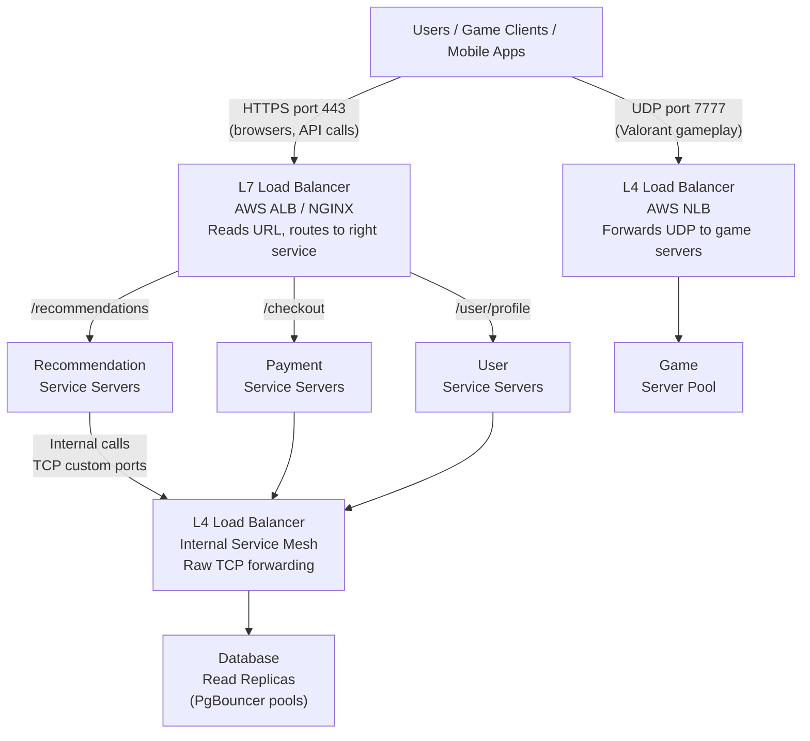

# Layer 4 — Real World Usage and Limitations

> [!question] Where does L4 actually get used in production, and where does it break down?
> L4 wins when protocol doesn't matter and speed does. It breaks when you need to route by what's inside the request.

---

## Real World Examples

### Riot Games / Valorant — Game Traffic

Valorant uses L4 for all real-time gameplay traffic.

- **Protocol:** UDP on port 7777
- **Why L4:** UDP is not HTTP. L7 load balancers only understand HTTP — they can't handle raw UDP. L4 doesn't care what's inside the packet, it just forwards bytes.
- **Scale:** Millions of concurrent players each sending 128 UDP packets per second
- **Algorithm used:** IP Hashing — ensures all packets from the same player always reach the same game server (since game state is stored on that server)

Login, store purchases, match history — those use HTTPS (TCP port 443) through an L7 load balancer. Real-time gameplay uses UDP through L4.

---

### PgBouncer — PostgreSQL Connection Pooling

PostgreSQL has a hard limit on concurrent connections — typically a few hundred. Large applications with many app servers can exhaust this instantly.

**Problem without PgBouncer:**
```
50 app servers × 10 connections each = 500 connections → PostgreSQL crashes
```

**Solution — PgBouncer (L4 load balancer for Postgres):**
```
50 App Servers → PgBouncer (L4) → 20 real connections → PostgreSQL
```

PgBouncer maintains a small pool of real connections to PostgreSQL. Hundreds of app server connections come in, get multiplexed through 20 real ones.

- **Why L4:** PostgreSQL speaks its own binary wire protocol — not HTTP. L7 can't read it. L4 just forwards TCP bytes, protocol-agnostic.
- **Used by:** Instagram, Shopify, GitLab — any high-traffic PostgreSQL deployment.

---

### Cloudflare — DNS Resolution

DNS runs on UDP port 53. When your browser resolves `valorant.com`:

```
Browser → UDP packet → Cloudflare DNS (1.1.1.1:53)
                       L4 LB distributes across thousands of DNS resolvers
                       → DNS resolver answers: "valorant.com is at 104.16.x.x"
```

Cloudflare handles over **1 trillion DNS queries per day**. They use L4 load balancers to distribute UDP queries across their resolver fleet. L7 is useless here — DNS is not HTTP.

---

### Netflix — Internal Microservice Traffic

Netflix has hundreds of microservices calling each other internally. The Recommendation Service calling User Profile Service, Streaming Service calling Metadata Service — millions of internal calls per second.

For internal traffic, Netflix uses **Envoy** (which can operate at L4) for raw throughput. When Service A calls Service B internally:
- It knows exactly which service it's calling — no URL-based routing needed
- It just needs fast forwarding
- L4 handles this at wire speed with microsecond latency

Using L7 for every internal call would add HTTP parsing overhead across millions of requests per second — completely unnecessary.

---

### Goldman Sachs / Trading Platforms — Ultra-Low Latency

Stock trading systems where every microsecond matters use AWS Network Load Balancer (NLB) — which operates at L4.

- **AWS NLB latency:** under 100 microseconds
- **AWS ALB latency (L7):** adds milliseconds for HTTP parsing + SSL handling
- For trading systems that millisecond difference means money

---

## The Fundamental Limitation

If all user-facing traffic arrives on port 443, every connection looks identical to the L4 LB:

```
GET /recommendations  →  TCP on port 443  ↘
POST /checkout        →  TCP on port 443  → all look the same to L4
GET /user/profile     →  TCP on port 443  ↗
```

L4 cannot tell them apart. It has no choice but to route them all to the same pool of servers.

**L4 works cleanly when there is one service behind it.** The moment you need to split traffic by URL path across multiple services — L4 is stuck. That's exactly what Layer 7 solves.

---

## How L4 and L7 Work Together in Production

Large systems don't choose one or the other — they use both at different layers:



- **L7 at the edge** — user-facing HTTPS traffic, URL-based routing to the right microservice, SSL termination
- **L4 for UDP** — game traffic, DNS, anything non-HTTP
- **L4 internally** — service-to-service at wire speed, database connection pooling

---

## When to Use L4

| Situation | Why L4 |
|---|---|
| Non-HTTP protocols (UDP games, DNS, SMTP) | L4 is protocol-agnostic |
| Database connection pooling (PgBouncer) | DBs speak their own protocol |
| Internal service-to-service at scale | No content routing needed, just speed |
| Ultra-low latency requirements (trading) | No parsing overhead, microsecond forwarding |
| Single service behind the load balancer | No need for content-based routing |

> [!warning] Do not use L4 when you need to route HTTP traffic to multiple services
> All HTTP looks the same to L4 on port 443. You cannot split `/checkout` from `/recommendations`. Use L7 for that.
