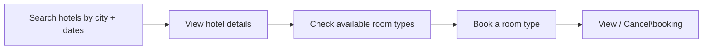

See also: [[13-HTTP-Methods]] for HTTP method definitions

## The User Journey (Booking.com flow)

Before writing APIs, always map the user's journey. Every API should serve a step in this flow:



> [!note] Why room TYPE and not a specific room?
> On Booking.com you pick **"Deluxe King — $180/night"**, not **"Room 423"**.
> The hotel has 50 Deluxe King rooms. Any one of them can fulfil your booking.
> The hotel assigns you a specific physical room only at check-in.
>
> This matters for availability — we track inventory per room type ("50 Deluxe Kings left"),
> not per individual room. Booking against a type is simpler and scales better.

---

## 1. Search & Browse APIs

### Search Hotels

The first thing a user does on Booking.com — enter a city and dates.

```http
GET /api/v1/hotels?city=New+York&checkIn=2026-02-10&checkOut=2026-02-13&guests=2&page=1&limit=20
```

| Query Param | Required | Description |
|---|---|---|
| `city` | Yes | Destination city |
| `checkIn` | Yes | Check-in date (YYYY-MM-DD) |
| `checkOut` | Yes | Check-out date (YYYY-MM-DD) |
| `guests` | Yes | Number of guests |
| `page` | No | Page number (default: 1) |
| `limit` | No | Results per page (default: 20, max: 50) |

**Response `200 OK`**
```json
{
  "page": 1,
  "totalResults": 142,
  "hotels": [
    {
      "hotelId": "H1001",
      "name": "Marriott Times Square",
      "city": "New York",
      "rating": 4.5,
      "startingFromPrice": 180,
      "thumbnailUrl": "https://..."
    },
    {
      "hotelId": "H1002",
      "name": "Hilton Midtown",
      "city": "New York",
      "rating": 4.2,
      "startingFromPrice": 150,
      "thumbnailUrl": "https://..."
    }
  ]
}
```

> [!tip] Why is this response lightweight?
> The search result shows only what you need to pick a hotel — name, rating, price preview.
> Full details (amenities, room list, policies) are fetched separately when the user clicks in.
> Sending everything upfront would be slow and wasteful.

>[!Note] What is a thumbnail.
>A thumbnail is a small, low-resolution preview image of something.On Booking.com, when you search for hotels and see the list of results — each hotel card shows a small photo of the hotel on the left side. That small photo is the thumbnail.                                                            
> It is not the full high-quality image. It is a compressed, small version specifically sized for the listing card — loads fast, takes very little data.When you actually click into the hotel page, you see the full-size photos.

> [!Flow] Flow
> The API returns the thumbnailUrl as a string in the JSON response. The client (browser or mobile app) then uses that URL to separately fetch and display the image.So the flow is:                                                               
  Client calls GET /hotels?city=New York...                     
              ↓      
  Server returns JSON with thumbnailUrl     
  "https://images.booking.com/hotels/H1001/thumb.jpg"       
              ↓                                                     
  Client uses that URL to fetch and render the image on the hotel card The image itself is never inside the JSON — that would be massive. The JSON just carries the address of where the image lives, and the client goes and gets it separately.
  
---

### Get Hotel Details

User clicks on a hotel to see full information.

```http
GET /api/v1/hotels/{hotelId}
```

**Response `200 OK`**
```json
{
  "hotelId": "H1001",
  "name": "Marriott Times Square",
  "city": "New York",
  "address": "1535 Broadway, Manhattan, NY",
  "rating": 4.5,
  "amenities": ["wifi", "pool", "gym", "spa"],
  "checkInTime": "15:00",
  "checkOutTime": "11:00",
  "cancellationPolicy": "Free cancellation up to 24 hours before check-in"
}
```

---

### Check Room Availability

User is on the hotel page — they want to see which room types are available for their dates.

```http
GET /api/v1/hotels/{hotelId}/rooms/availability?checkIn=2026-02-10&checkOut=2026-02-13&guests=2
```

**Response `200 OK`**
```json
{
  "hotelId": "H1001",
  "checkIn": "2026-02-10",
  "checkOut": "2026-02-13",
  "nights": 3,
  "availableRoomTypes": [
    {
      "roomTypeId": "RT007",
      "name": "Deluxe King",
      "pricePerNight": 180,
      "totalPrice": 540,
      "capacity": 2,
      "amenities": ["king bed", "city view", "bathtub"],
      "remainingRooms": 8
    },
    {
      "roomTypeId": "RT008",
      "name": "Suite",
      "pricePerNight": 350,
      "totalPrice": 1050,
      "capacity": 4,
      "amenities": ["living room", "jacuzzi", "butler service"],
      "remainingRooms": 2
    }
  ]
}
```

> [!note] `remainingRooms` is approximate
> This number can go stale within seconds — multiple users are viewing the same page.It is shown as a nudge ("Only 2 left!"), not a guarantee.The guarantee comes only when a booking is actually confirmed.

---

## 2. Reservation APIs

### Create Reservation

User selects a room type and confirms payment.

```http
POST /api/v1/reservations
```

**Headers**
```http
Authorization: Bearer <user_token>
Idempotency-Key: 7f3k92md-a12b-4c9d-b831-9f2e1d3a8c74
```

> [!important] What is the Idempotency Key and why does it exist?
> Imagine this: the user clicks "Confirm Booking", the request reaches our server, the booking is created and the card is charged — but then the network drops before the response reaches the user's phone.
>
> The user sees an error screen. They click "Confirm" again. Without an idempotency key, we would charge their card a second time and create a duplicate booking.
>
> With an idempotency key, the client sends the **same unique key** on retry. The server recognises it has already processed this exact request and returns the original response — no second charge, no duplicate booking.

**Request Body**
```json
{
  "hotelId": "H1001",
  "roomTypeId": "RT007",
  "checkIn": "2026-02-10",
  "checkOut": "2026-02-13",
  "guests": 2
}
```

**Response `201 Created`**
```json
{
  "reservationId": "RES900123",
  "hotelId": "H1001",
  "hotelName": "Marriott Times Square",
  "roomType": "Deluxe King",
  "checkIn": "2026-02-10",
  "checkOut": "2026-02-13",
  "nights": 3,
  "totalPrice": 540,
  "status": "CONFIRMED"
}
```

**Error — Room no longer available `409 Conflict`**
```json
{
  "error": "ROOM_UNAVAILABLE",
  "message": "No Deluxe King rooms are available for the selected dates."
}
```

> [!note] Why 409 and not 400?
> `400 Bad Request` means the client sent invalid data (e.g. missing field, wrong date format).
> `409 Conflict` means the request was valid but it conflicts with the current state of the system — in this case, the room just got booked by someone else.These are different problems and should be communicated differently.

---

### Get Reservation

```http
GET /api/v1/reservations/{reservationId}
Authorization: Bearer <user_token>
```

**Response `200 OK`**
```json
{
  "reservationId": "RES900123",
  "hotelId": "H1001",
  "hotelName": "Marriott Times Square",
  "roomType": "Deluxe King",
  "checkIn": "2026-02-10",
  "checkOut": "2026-02-13",
  "totalPrice": 540,
  "status": "CONFIRMED"
}
```

---

### List User's Reservations

```http
GET /api/v1/reservations?page=1&limit=10
Authorization: Bearer <user_token>
```

> [!note] No `userId` in the query param
> The user's identity comes from the `Authorization` token, not a query param.
> Putting `userId` in the URL would allow any user to view another user's bookings just by changing the ID — a security hole.

**Response `200 OK`**
```json
{
  "page": 1,
  "totalResults": 5,
  "reservations": [
    {
      "reservationId": "RES900123",
      "hotelName": "Marriott Times Square",
      "checkIn": "2026-02-10",
      "checkOut": "2026-02-13",
      "status": "CONFIRMED"
    },
    {
      "reservationId": "RES900456",
      "hotelName": "Hilton Midtown",
      "checkIn": "2025-12-24",
      "checkOut": "2025-12-27",
      "status": "CANCELLED"
    }
  ]
}
```

---

### Cancel Reservation

```http
PATCH /api/v1/reservations/{reservationId}/cancel
Authorization: Bearer <user_token>
```

**Response `200 OK`**
```json
{
  "reservationId": "RES900123",
  "status": "CANCELLED",
  "refundAmount": 540,
  "refundNote": "Full refund — cancelled more than 24 hours before check-in."
}
```

> [!important] Why `PATCH /cancel` and not `DELETE`?
> `DELETE` means remove the record from the system entirely.
> Cancelling a booking is a **state change** — `CONFIRMED → CANCELLED`.
> The record must stay in the database for refund processing, audit trails, and the user's booking history.
> We are not deleting anything — we are updating the status.

---

## 3. Admin APIs

Admin endpoints are under a separate `/admin/` path — not a different version number. This makes it easy to apply different auth middleware to everything under `/admin/` in one place.

### Create Hotel

```http
POST /api/v1/admin/hotels
Authorization: Bearer <admin_token>
```

**Request Body**
```json
{
  "name": "Marriott Downtown",
  "city": "San Francisco",
  "address": "Market Street, SF",
  "amenities": ["wifi", "spa"],
  "checkInTime": "15:00",
  "checkOutTime": "11:00"
}
```

**Response `201 Created`**
```json
{ "hotelId": "H2002" }
```

---

### Update Hotel

```http
PATCH /api/v1/admin/hotels/{hotelId}
Authorization: Bearer <admin_token>
```

**Request Body** *(only send the fields you want to change)*
```json
{
  "amenities": ["wifi", "spa", "gym"]
}
```

**Response `200 OK`**
```json
{ "hotelId": "H2002", "status": "UPDATED" }
```

---

### Delete Hotel

```http
DELETE /api/v1/admin/hotels/{hotelId}
Authorization: Bearer <admin_token>
```

**Response `200 OK`**
```json
{ "hotelId": "H2002", "status": "DELETED" }
```

---

### Add Room Type to Hotel

```http
POST /api/v1/admin/hotels/{hotelId}/room-types
Authorization: Bearer <admin_token>
```

**Request Body**
```json
{
  "name": "Suite",
  "pricePerNight": 350,
  "capacity": 4,
  "totalRooms": 10,
  "amenities": ["living room", "jacuzzi"]
}
```

**Response `201 Created`**
```json
{ "roomTypeId": "RT009" }
```

---

### Update Room Type Pricing

```http
PATCH /api/v1/admin/hotels/{hotelId}/room-types/{roomTypeId}
Authorization: Bearer <admin_token>
```

**Request Body**
```json
{ "pricePerNight": 375 }
```

**Response `200 OK`**
```json
{ "roomTypeId": "RT009", "status": "UPDATED" }
```


  ---                                                                                  

  POST — create something new

  POST /hotels    

  { "name": "Marriott Downtown", "city": "San Francisco" }                             

  Server creates a brand new hotel and assigns it an ID. Every time you call this, a   

  new hotel gets created. The ID does not exist yet — the server generates it.

  ---             

  PUT — replace an existing thing completely

  

  PUT /hotels/H1001

  { "name": "Marriott Downtown", "city": "San Francisco", "rating": 4.5, "amenities":  

  ["wifi"] }

  You are saying "take hotel H1001 and make it exactly this". The server overwrites the

   entire object with what you sent. You must send every field.

  ---             

  PATCH — update specific fields of an existing thing

  

  PATCH /hotels/H1001

  { "rating": 4.8 }

  You are saying "only change the rating, leave everything else alone". The server     

  touches only what you sent.                                                          

  ---             

  The key difference in one line:

  ┌────────┬─────────────────────────┬──────────────────────────┐

  │ Method │         Action          │   ID known beforehand?   │                      

  ├────────┼─────────────────────────┼──────────────────────────┤

  │ POST   │ Create new              │ No — server generates it │                      

  ├────────┼─────────────────────────┼──────────────────────────┤

  │ PUT    │ Replace entire existing │ Yes                      │                      

  ├────────┼─────────────────────────┼──────────────────────────┤

  │ PATCH  │ Update part of existing │ Yes                      │                      

  └────────┴─────────────────────────┴──────────────────────────┘

  

  ---