# Cache Invalidation

## The Problem

> [!info] DB has the truth. Cache has a copy. DB gets updated. Cache still has the old value. How do you keep them in sync?

> [!danger] "There are only two hard things in computer science: cache invalidation and naming things."
> The reason it's hard: cache doesn't automatically know when the DB changes. You have to tell it — or wait for time to expire it.

---

## TTL-Based Invalidation

> [!info] Set a timer. When it expires, the key is deleted. Next request fetches fresh from DB.

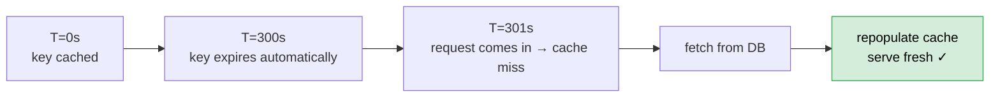

**What's good:**
- Simple — no extra infrastructure
- Works for most cases — slight staleness is acceptable for most data

**The blind spot:**

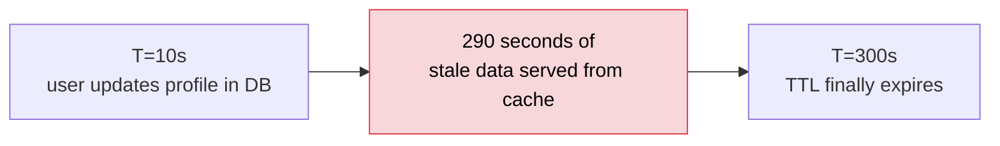

**Choosing TTL:**

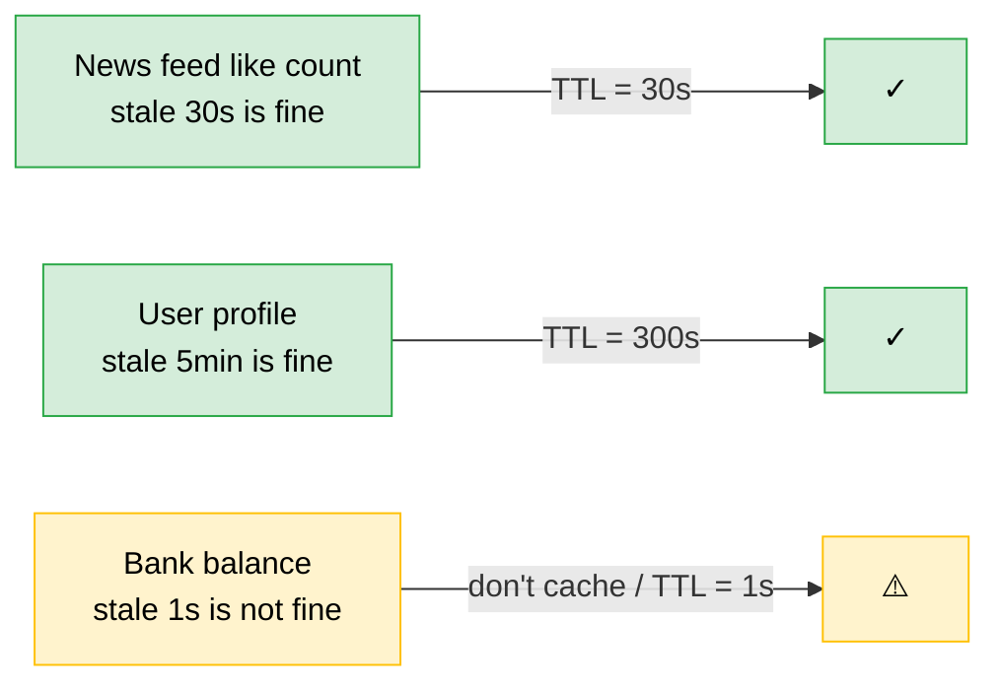

> [!tip] Always set a TTL as a safety net — even if you use other invalidation strategies. Prevents stale data from living forever if something goes wrong.

---

## Event-Driven Invalidation

> [!info] Invalidate the cache key the moment the DB is updated. No stale window.

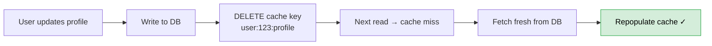

**What's good:**
- Cache invalidated instantly — no stale window
- Reacts to DB changes, not just time

**What's bad:**
- Needs infrastructure — who triggers the invalidation?
- Delete → miss → repopulate — one slow request after every write

**How to trigger:**

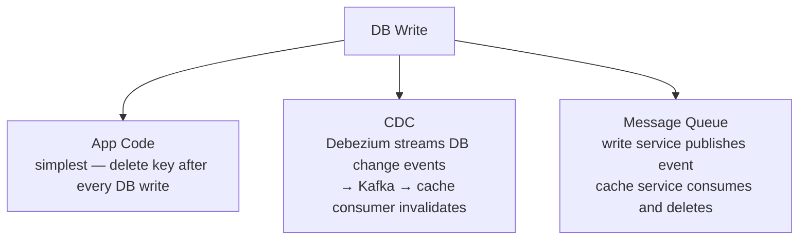

---

## Write-Through as Invalidation

> [!info] Instead of deleting the key on write, update it. No miss after the write.

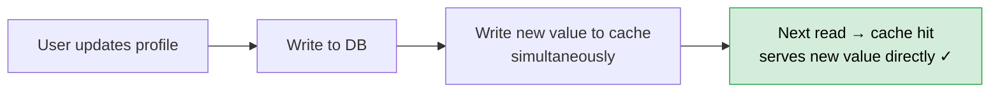

**Difference from event-driven:**

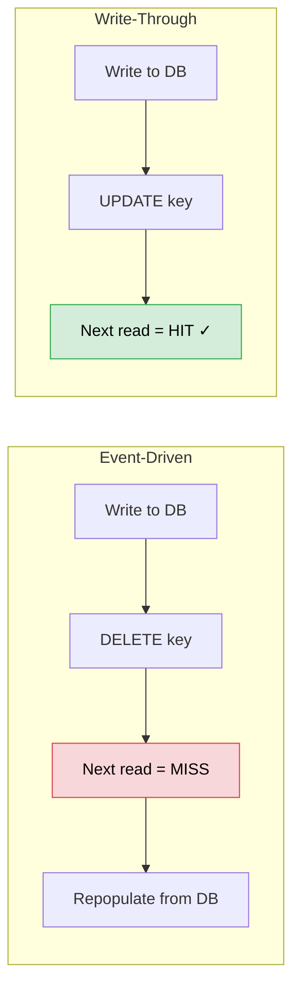

**What's good:**
- No cache miss after write — better for read-heavy systems
- Cache always consistent

**What's bad:**
- Write latency increases — must update both DB and cache synchronously

---

## Cache Versioning

> [!info] Instead of invalidating a key, change the key itself. Old keys expire naturally.

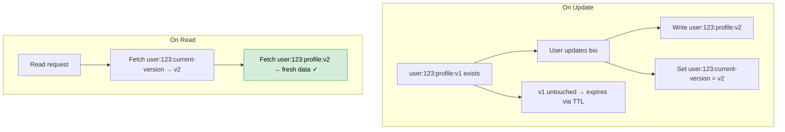

**Where it really shines — CDNs:**

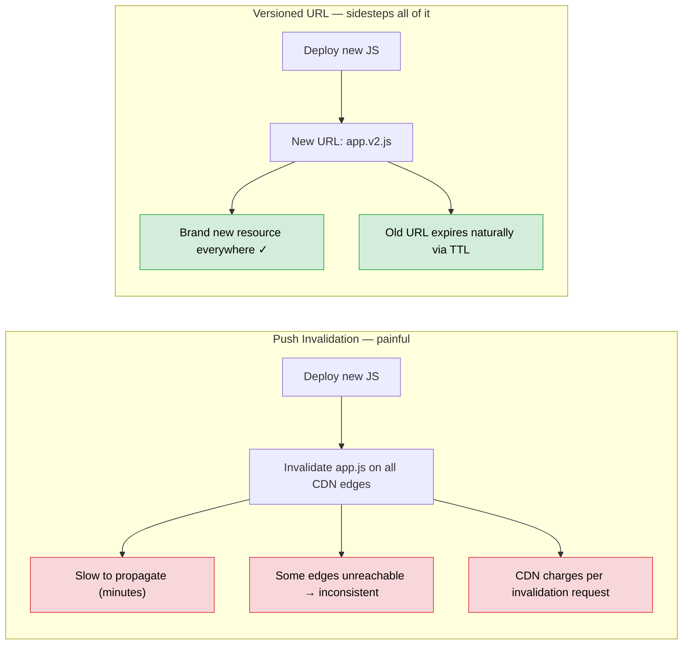

This is why production JS bundles look like `app.a3f9c2.js` — the hash IS the version.

**The hidden cost for DB-backed data — two cache lookups per read:**

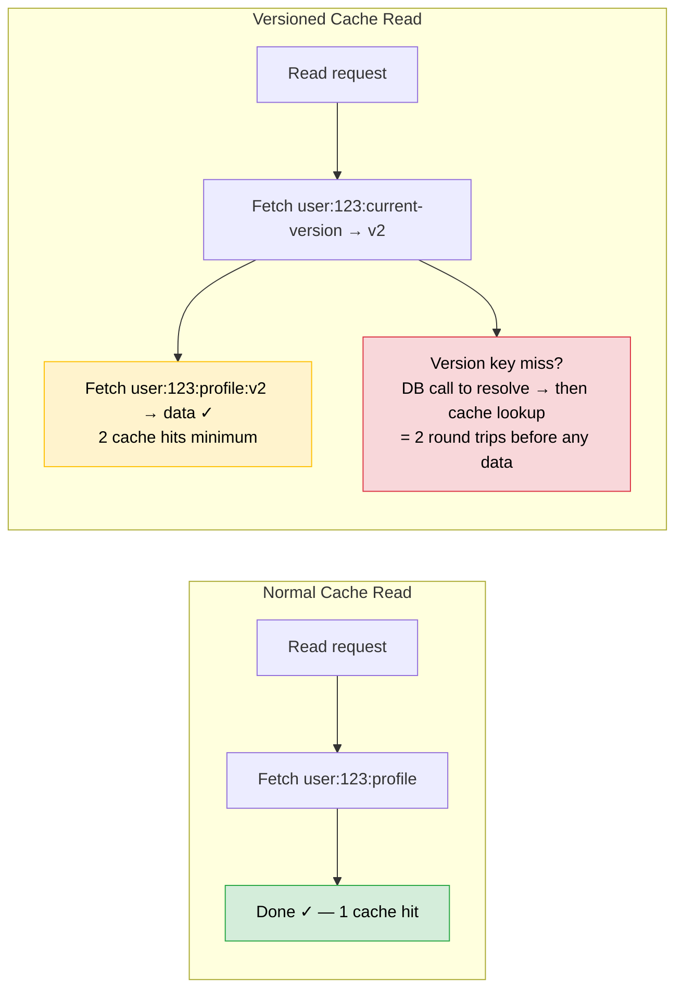

> [!danger] At scale this doubles cache round trips for every read. 10M reads/day becomes 20M cache calls. Latency adds up.

> [!tip] Cache versioning is best for CDN static assets. For DB-backed data, event-driven or write-through is simpler — the two-step version lookup adds unnecessary complexity.

---

## Stale-While-Revalidate

> [!info] TTL expires, request comes in — serve stale immediately, refresh in background. User never waits.

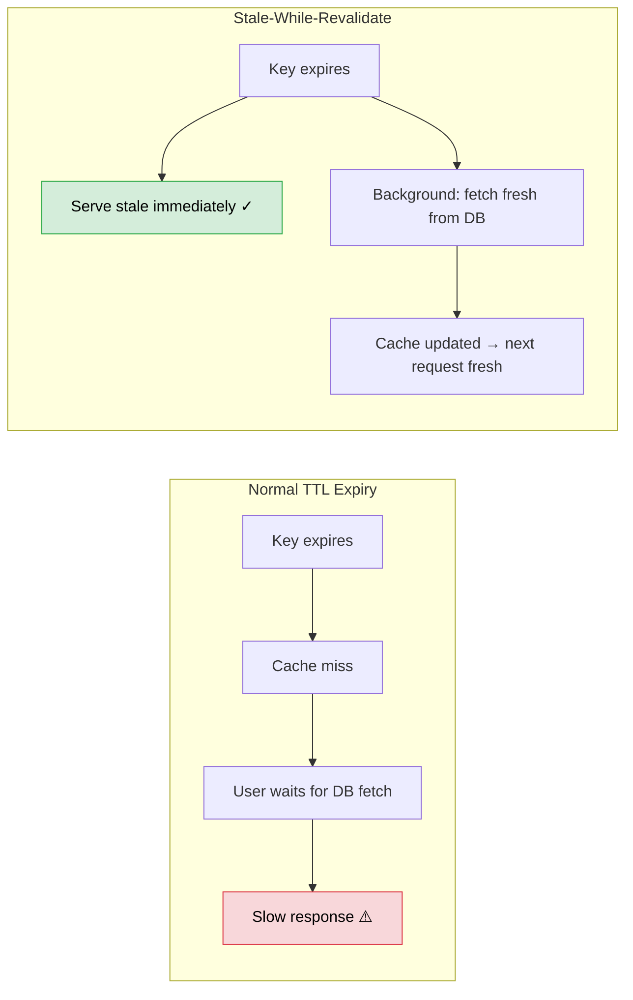

**Difference from refresh-ahead:**

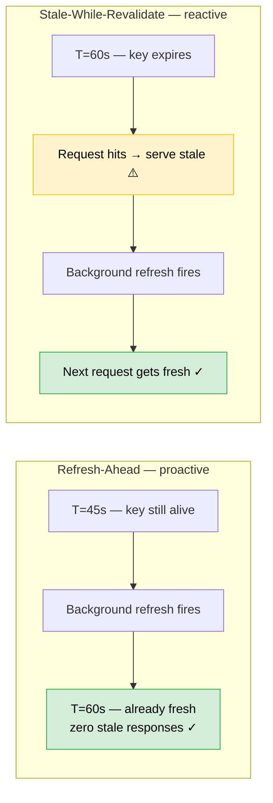

**Use when / Don't use when:**

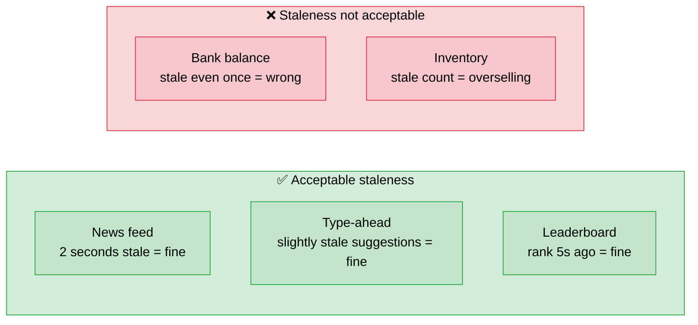

---

## The Full Picture

| Strategy | How it works | Stale window | Trade-off |
|---|---|---|---|
| TTL-based | Key auto-deletes after timer | Up to TTL duration | Simple — always use as safety net |
| Event-driven | Delete key on every DB write | None | Instant — needs infrastructure |
| Write-through | Update key on every DB write | None | No miss after write — slower writes |
| Cache versioning | Change the key, old expires naturally | None | Best for CDN — two lookups for DB-backed data |
| Stale-while-revalidate | Serve stale, refresh in background | One request | Great for feeds and type-ahead |

> [!important] Most production systems combine strategies:
> TTL as the safety net + event-driven for critical data + stale-while-revalidate for feeds.
> No single strategy fits everything — choose per data type.
