# Distributed Caching

## Why Single Node Doesn't Scale

> [!info] Single cache node has two fundamental problems at scale.

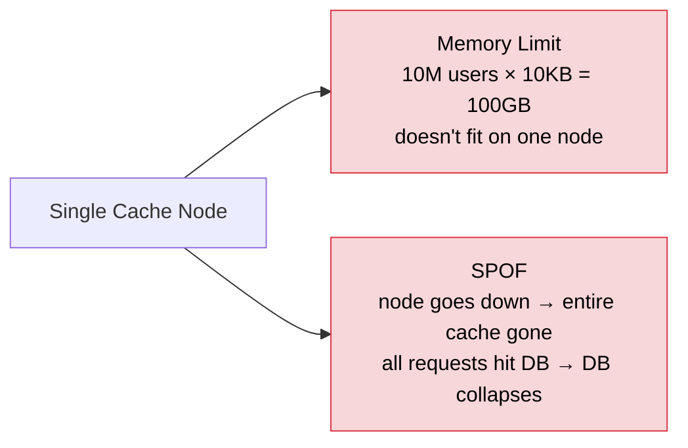

Solution: distribute the cache across multiple nodes.

New problem: a request comes in for `user:123:profile` — which node do you go to?

---

## Consistent Hashing

> [!info] Hash keys to nodes on a ring. Adding/removing nodes only affects neighbouring keys — not the entire keyspace.

**Why not simple modulo hashing:**

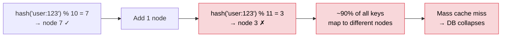

**Consistent hashing — before adding a node:**

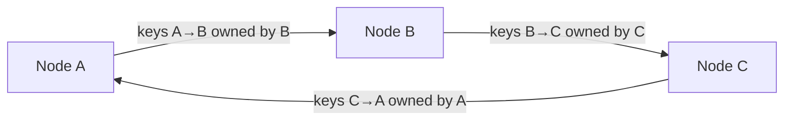

**After adding Node D between B and C:**

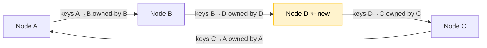

Only the slice D takes over from C is remapped. Everything else untouched.

**Virtual nodes:** each physical node gets multiple positions on the ring for even distribution. Prevents hot spots when nodes have different capacities.

> [!tip] Interview answer: "I'd use consistent hashing so adding or removing cache nodes only remaps a minimal fraction of keys — roughly 1/N of the keyspace — instead of causing a mass cache miss."

---

## Cache Coherence

> [!info] Multiple nodes or replicas can hold different values for the same key. This is cache coherence — keeping them in sync.

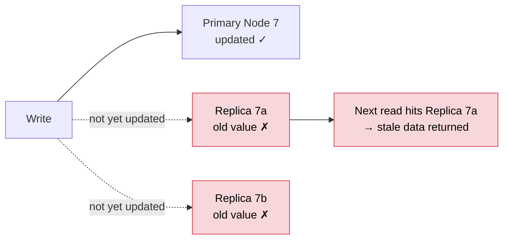

**Solutions:**

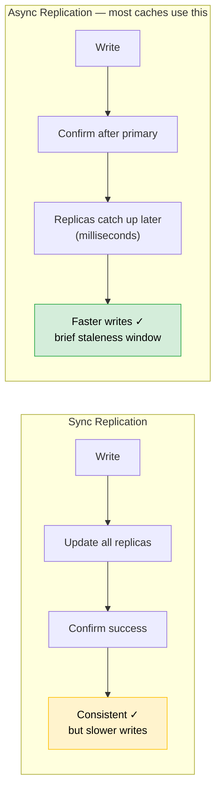

**Simpler approach — primary reads:**

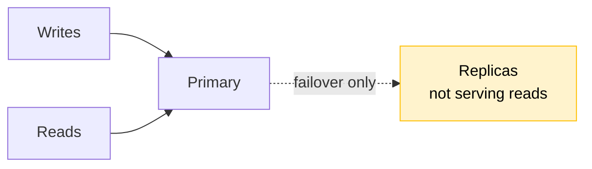

Clean, no coherence issue. Works until scale gets huge.

**At massive scale:**

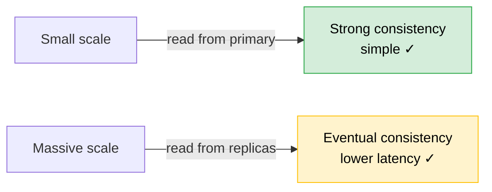

> [!important] Same trade-off as databases — CAP/PACELC applies to the cache layer too. No free lunch.

---

## Replication

> [!info] Read replicas serve two purposes — availability and read throughput.

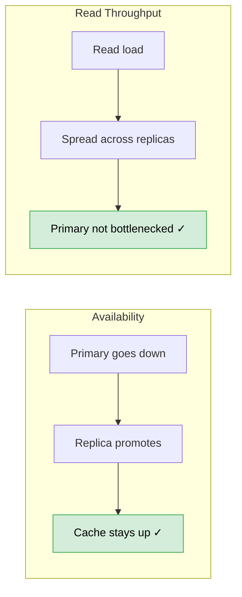

**Replication lag:** async replication means replicas are slightly behind primary. Acceptable for most cache data — a few milliseconds of staleness.

---

## Two-Level Caching (L1 + L2)

> [!info] Local in-process cache (L1) + distributed Redis cache (L2). Best of both worlds.

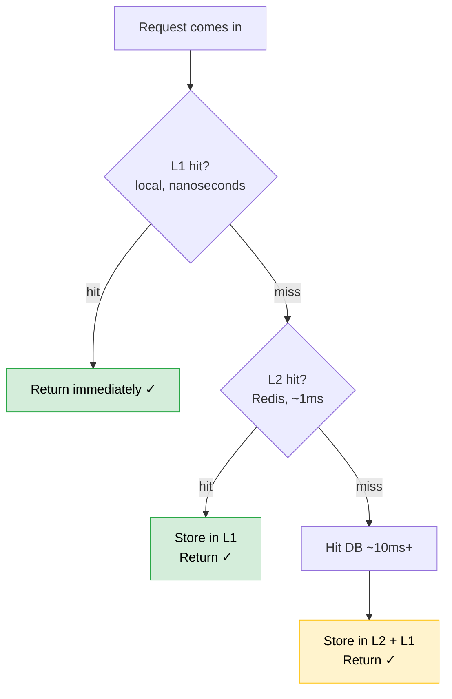

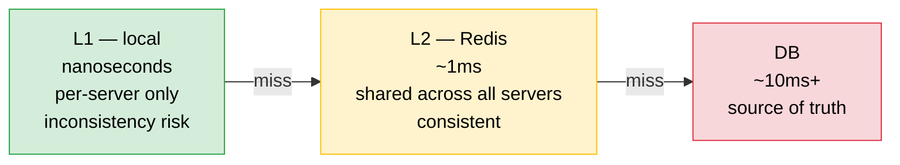

Used by Instagram, Twitter, and most large-scale systems in production.

**L1 invalidation problem:** when data changes in Redis, local caches on each server still have the old value.

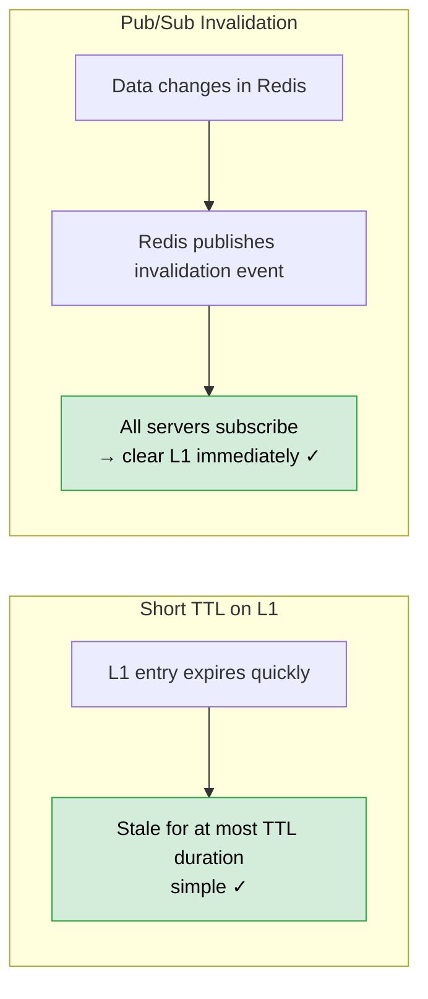

---

## Handling Node Failure

> [!info] Consistent hashing minimises the blast radius when a node fails.

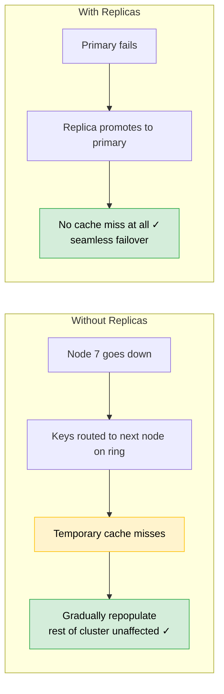

---

## Summary

| Concept | What it does | When to use |
|---|---|---|
| Consistent hashing | Minimal key remapping on node add/remove | Always |
| Cache coherence | Keep replicas in sync — async for speed, primary reads for simplicity | Whenever you have replicas |
| Replication | Availability + read throughput | Any production cache |
| Two-level caching | L1 local (nanoseconds) + L2 Redis (~1ms) | High-traffic systems |
| Node failure handling | Consistent hashing limits blast radius, replicas give seamless failover | Always |
