# Cache Problems

## Cache Stampede

> [!info] A hot key's TTL expires. Thousands of requests arrive at the same moment — all get a cache miss simultaneously. All of them go to the DB at once.

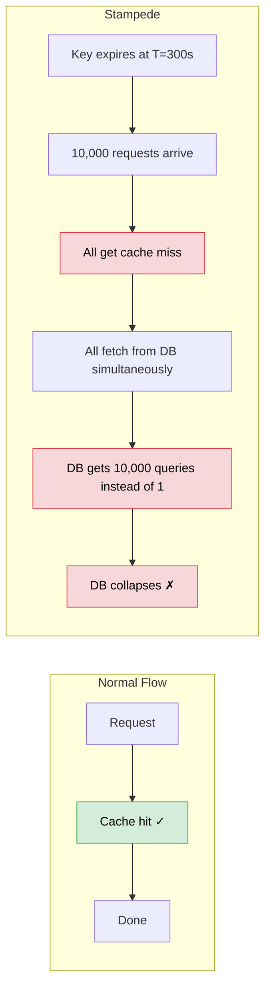

The problem isn't the cache miss itself. It's the **thundering herd** — thousands of identical DB queries happening in parallel because nobody coordinated.

---

**Fix 1 — Refresh-Ahead**

Don't wait for the key to expire. Refresh it proactively before it dies.

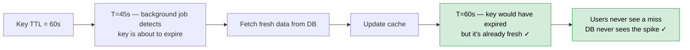

How do you know which keys to refresh ahead? You track which keys are being hit frequently. If a key is getting thousands of hits per second, it's worth refreshing before it expires. Low-traffic keys — let them expire naturally.

> [!tip] Refresh-ahead is proactive. You need to know in advance which keys are hot. Works great for predictable traffic — trending posts, homepage content, leaderboard top 10. Doesn't help for unpredictable spikes.

---

**Fix 2 — Mutex with Double-Checked Locking**

When a key expires, only let one request fetch from DB. The rest wait.

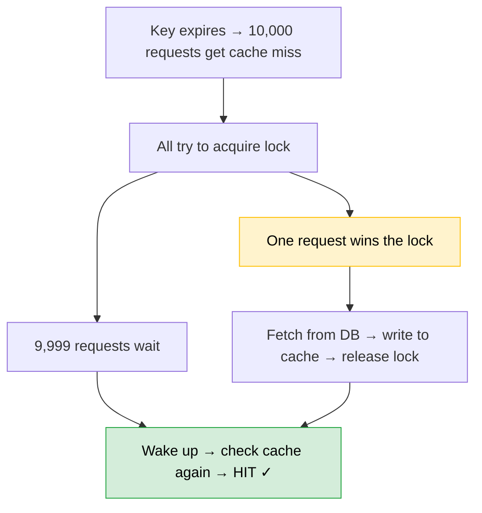

The critical detail: waiters must **check the cache again** after acquiring the lock. This is double-checked locking.

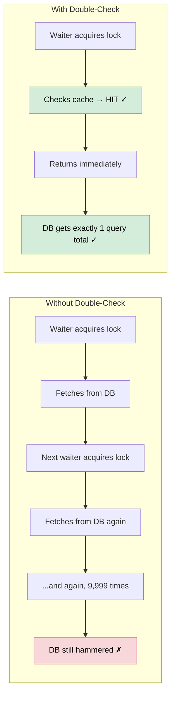

```python
function get(key):
  value = cache.get(key)
  if value: return value          # first check (no lock)

  lock.acquire(key)
    value = cache.get(key)        # second check (inside lock)
    if value:
      lock.release()
      return value                # someone else already fetched it

    value = db.fetch(key)
    cache.set(key, value)
    lock.release()
    return value
```

> [!important] The second cache check inside the lock is what makes this work. Without it, you've serialised the DB queries instead of eliminating them. With it, DB gets exactly one query no matter how many concurrent waiters.

---

**Fix 3 — Probabilistic Early Expiry**

Instead of refreshing at a fixed threshold, each request near the end of TTL flips a coin. If it wins, it refreshes early.

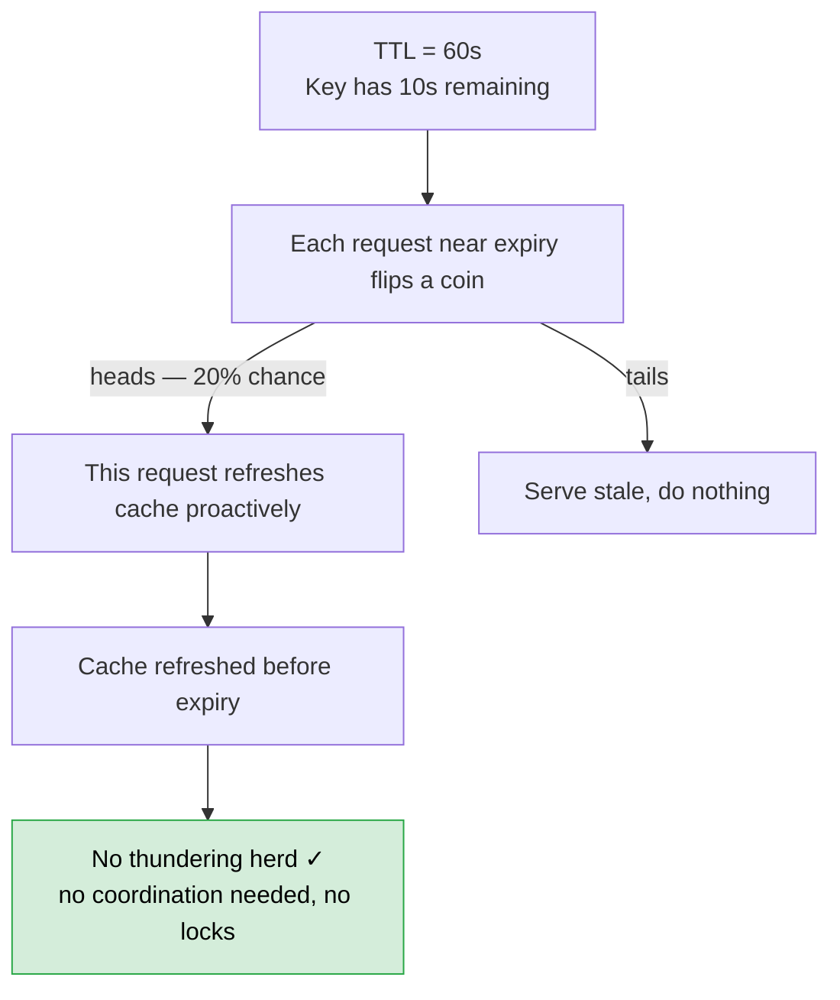

As TTL approaches zero, more requests win the coin flip — cache gets refreshed before it ever expires. The randomness spreads the refresh load naturally.

---

## Cold Start

> [!info] Cache is completely empty. Fresh deployment, Redis restart, new region. Every request is a cache miss. DB sees 100% of traffic.

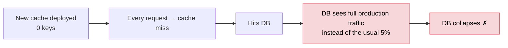

Same symptom as stampede — DB getting hammered. Different cause. Stampede is one key dying. Cold start is nothing ever existed to begin with.

**Fix — Cache Warming**

Before opening traffic to the new cache, pre-populate it.

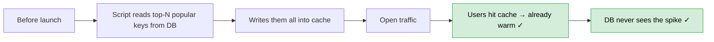

How do you know which keys to warm? Replay yesterday's access logs. If those keys were hot yesterday, they'll be hot today. Start with homepage content, top products, trending posts.

---

## Cache Penetration

> [!info] Requests for keys that don't exist in the DB. Every request is a cache miss. Every request hits DB. DB returns null. Nothing gets cached. Cycle repeats forever.

Normal cache miss resolves itself — fetch from DB, store in cache, next request is a hit. Penetration never resolves:

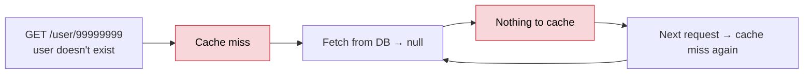

1,000 requests/sec for non-existent keys → 1,000 DB queries/sec, all returning null → DB dies.

**Fix 1 — Cache the Null**

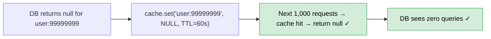

Short TTL on null entries. If the user gets created later, the null expires and real data gets cached on the next request.

**Fix 2 — Bloom Filter**

A bloom filter answers: *"has this key ever existed in the DB?"*

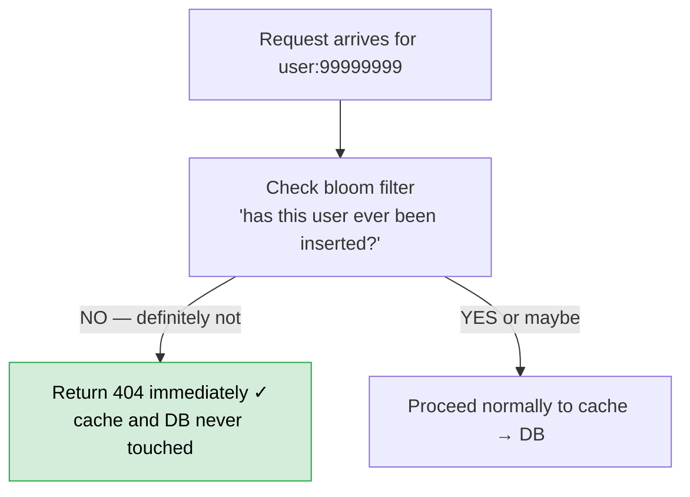

Bloom filters have no false negatives. If it says no, it's definitely no. They can have false positives (says yes when actually no) but the rate is very low and controllable.

> [!tip] Bloom filters are used in production everywhere — Cassandra, HBase, Postgres all use them to avoid disk lookups for non-existent keys. Put the bloom filter in front of the cache layer — non-existent keys never reach cache or DB.

---

## Cache Avalanche

> [!info] Thousands of keys expire at the same time. Mass cache miss. DB gets hammered across the entire keyspace simultaneously.

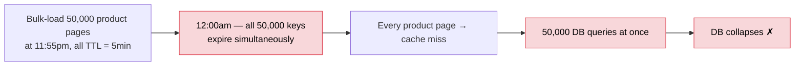

Stampede is one key. Avalanche is the entire cache. Happens whenever you bulk-load with identical TTLs — all keys born together, all die together.

**Fix — TTL Jitter**

Add randomness to the TTL so expirations are spread out:

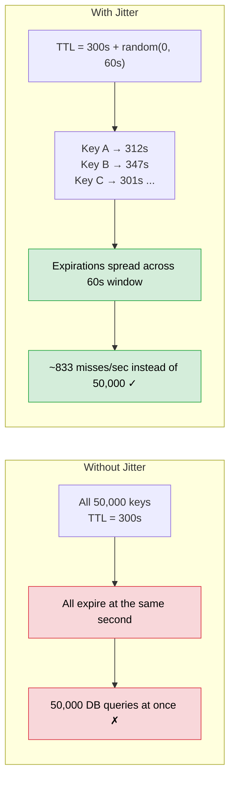

One line change. Completely solves it. Always add jitter when bulk-loading the cache.

---

## Summary

| Problem | Cause | Fix |
|---|---|---|
| Stampede | One hot key expires, thousands hit DB simultaneously | Refresh-ahead, mutex + double-checked locking, probabilistic expiry |
| Cold Start | Cache empty — fresh deploy, restart, new region | Warm cache before opening traffic (replay access logs) |
| Penetration | Non-existent keys bypass cache forever, DB returns null forever | Cache null values (short TTL), bloom filter at entry point |
| Avalanche | Thousands of keys expire at the same time — bulk-loaded with identical TTL | TTL jitter — add randomness to expiry on bulk loads |

> [!important] These four problems have the same root symptom — DB getting hammered — but completely different causes. Diagnosing which one you have tells you which fix to reach for.
